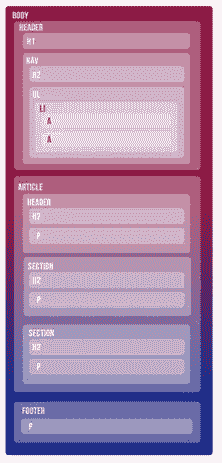
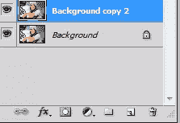
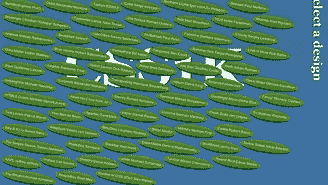
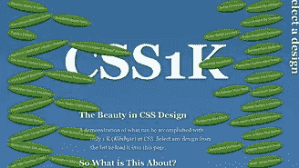
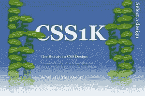

# 带着 CSS1k 去 CSS-3den 的花园

> 原文：<https://www.sitepoint.com/taking-css1k-to-the-garden-of-css-3den/>

[](https://www.sitepoint.com/wp-content/uploads/2012/03/gary.jpg) 谁看过电影《阿波罗 13 号》？

多棒的故事啊。三名宇航员被困在一个损坏的登月舱中，在太空中飞驰。他们的空气正在迅速减少，他们几乎没有水，热量或电力。

为了从月球轨道返回，宇航员必须通过关闭指令舱上几乎所有的电气系统来保存能量。问题是，如果他们不能重启飞船的导航系统，他们会在重返大气层时烧毁——鉴于他们受损的电力供应，这几乎是不可能的任务。我们说的是类似于用手表电池启动一辆被扣押的雪佛兰。形势看起来很严峻。

回到地球上，肯·马丁利上尉(由加里·西尼斯扮演)被锁在一个狭窄的美国宇航局的宇宙飞船复制品中，试图找到一种重启电脑而不永久烧毁它的方法。他们只有一次机会。

这是那种几乎难以置信的真实故事。

这也是对“限制孕育创造力”这一理念的完美展示。

马丁利上尉不能出去拿额外的工具或备件。他不能溜达到储藏室去拿另一块电池。就像上面那些束手无策的同事一样，他有他能拿到的任何东西和他的大脑。

这是事实:拿走资源 ***会迫使*** 你更深入地思考你所拥有的资源。

这是一件非常有用的事情。

## CSS1K 是什么？

雅各布·拉斯克的 CSS1k 是一个接受了这种想法并用来挑战前端开发人员的项目。在这个时候，即使是谷歌著名的简洁主页 CSS 也接近 40，000 个 CSS 字符，CSS1k 要求你只用 1024 个字符做一些有趣的事情。

局限性很多。

*   没有图像(JPG，GIF，PNG 等)
*   无媒体(视频、音频等)
*   No web fonts
*   没有其他外部文件(SVG，JavaScript，SWF)
*   HTML 被锁定了

你只有 CSS 而且不多。

还有*一个*保存宽限——CSS1k 使用 [Lea Verou 的-prefix-free](http://leaverou.github.com/prefixfree/ "-Prefix-free") 。这意味着您可以编写简单的、无前缀的 CSS3，并且您的代码将在正确的浏览器中自动获得正确的前缀。

听起来是个挑战。我进去了！

### 那么，*到底*1k 是多少？

乍一看，1024 个字符*听起来*像是一个相当合理的数量——但真的是这样吗？

这里有一个快速指南。如果你选择了这篇文章中的文字倒到'*..带上额外的工具或备用零件*‘你将拥有整整 1000 个字符。这没什么用。

实际上，你可能会有 12 到 16 行 CSS 代码。

鉴于这些明显的限制，我给自己设定了一个挑战:

***有没有可能不用图像就做出丰富、有机、葱郁的设计？***

如果你感兴趣，我将在下面向你展示我的设计。很全面，可以随意略读。

**警告**:在将这个设计中的每一个字符榨干的过程中，我承认我用 CSS 做了一些……好吧，让我们说“*非常规*”的事情。有些有点鬼鬼祟祟。有些是可疑的。有些违反了关于人道对待 CSS 的日内瓦公约。

我会在代码中用“欺骗性评级”指出这一点。

## [](https://www.sitepoint.com/wp-content/uploads/2012/03/html.png)HTML

就像戴夫·谢伊之前的 [CSSZenGarden](http://www.csszengarden.com/) 一样，你无法改变[雅各布的加价](http://stuff:8888/examples/css1k/step12.html)。

HTML 本身相当不起眼，通篇使用 HTML5 元素(

、、等)。主要由一长串无序的条目和信用链接组成。部分包含 CSS1k 解释文本，页脚关闭页面。

没有什么特别复杂的。

## CSS

很多 CSS 是不言自明的，所以我不会浪费你的时间解释每一行。

### 1).设置主体(163 个字符)

**躲闪等级:低**

```
body{
color:#fff;text-align:center;
padding:9%;
font:20px/160% Georgia;
background:#369;/* fallback */
background:linear-gradient(#369,#69c 66%,#582 66%,#460 86%,#630 88%,#000);  }
```

我们从一些可靠的文档默认值开始:白色，居中对齐的 20px 文本，160%行高，边上有一些填充。

我们还在背景上应用了垂直线性渐变，从顶部的天蓝色开始，到中间的葱绿，到底部的土褐色。

通过仔细选择颜色，我们将它们都保持在 4 个十六进制字符。我也可以省去渐变方向(顶部)和开始和结束百分比(0%和 100%)，因为它们是浏览器的默认设置。

在这里，我们还遇到了第一个浏览器兼容性问题。

对于 IE9 的发布，微软鼓励开发者使用 SVG 来完成这种分级颜色。从技术上来说，我们可以通过将渐变作为数据 URI 直接嵌入到 CSS 中，使其在 IE9 中工作。

它看起来会像这样:

```
background: url(data:image/svg+xml;base64,PD94bWwgdmVyc2lvbj0iMS4wIiA/
Pgo8c3ZnIHhtbG5zPSJodHRwOi8vd3d3LnczLm9yZy8yMDAwL3N2ZyIgd2
lkdGg9IjEwMCUiIGhlaWdodD0iMTAwJSIgdmlld0JveD0iM... etc, etc..
```

不幸的是，仅仅这一行代码就要吃掉超过 1000 个字符。那个*可能*对于一个真实世界的项目来说是可以的，但是我们将不得不在这个游戏中搁置 IE9。

令人高兴的是，IE10 *支持 MS 风格的经典 CSS 渐变。*

### 2)地毯式轰炸违约

**躲闪等级:极端**

```
* *{padding:0;
position:relative;
border-radius:50%;
text-shadow:1px 1px 7px #000
}
a,:visited{
color:#fff;
text-decoration:none
}
```

好吧，我知道了。第一条规则针对的是任何东西里面的任何东西，这当然不是一个推荐的日常 CSS 实践。

我实际上是从'`body *`'开始的，但是意外地发现'【T1]'给了我相同的渲染结果——节省了 3 个字符。

[](https://www.sitepoint.com/examples/css1k/step2)

第二步

当然，我知道这不太好，但是该死的，这是战争，伙计们！！

出于布局的原因，我需要每个页面项目都是“`position:relative`”。我还将每一个的边框都涂成圆型，并给每一个元素一个柔和的暗色调作为对比。

是的，这些规则中的任何一个都可能引发其他问题，当然在日常工作中也不鼓励这样做，但是我对 CSS1k 很满意。

我还重写了浏览器的默认链接样式，发现':visited '和更标准的' a:visited '一样可以被现代浏览器接受。

### 3)设置主要内容区

**躲闪等级:中等**

```
article,footer{
margin:14% 26%;text-align:left
}
h1{font:700 9em/45%""}
```

第一行相当简单。我们将文章和页脚区域左对齐，并给它们一些有用的边距。

下一行不太传统。

就我个人而言，我喜欢 CSS 中速记字体声明的效率，并且总是对相对冗长的行高或字体粗细要求感到有点恼火。

为什么我就不能写得像'`font:12px/16px`'一样？

不幸的是，这失败了，因为速记字体属性**需要最小的字体大小和字体系列才能工作**。理论上‘inherit’*应该*是`font-family`的有效值。唉，对大多数浏览器来说并不是这样。

然而，我发现绝大多数浏览器和 ***甚至 CSS 验证器*** 都非常乐意让你提供空引号(即“”)作为字体系列值，同时简单地继承先前设置的值。

所以与其写:

```
font-family:13px;
line-height:16px;
```

..我们可以写:

```
font:13px/16px "";
```

..或者甚至:

```
font:bold 12px/120% "";
```

事实上，在大多数情况下，您甚至可以省略引号前的空格。新浏览器喜欢。即使是老 IE 也没问题。

不幸的是——令我深感失望的是——我们的朋友 IE9 支持“inherit ”,但是当你使用空引号时就失败了。对此我很失望。

因此，简而言之，这种字体技巧还没有准备好用于黄金时段的前端工作，但它将用于 CSS1k。如果你找到解决办法，我洗耳恭听。我喜欢一直用这个。

### 4).准备:before 和:after 伪元素。

**躲闪等级:中等**

```
:before,:after,nav h2{
position:absolute;
font:13em'';
top:-12%
}
```

我将在设计的后面大量使用:before 和:after 伪元素，所以从一开始我就将它们中的每一个都设为'`position:absolute`'。这并不像看起来那么危险，因为这些元素只有在我们用生成的内容专门调用它们时才存在。我们也再次使用了字体大小的技巧。

你还会注意到我们的`nav`里的`h2`在这里搭顺风车。这使我不必在文档的后面再次声明'`position:absolute`'。

### 5).重新定位导航

**躲闪等级:低**

```
nav{top:-22em}

nav h2{
transform:rotate(90deg);
right:-5em;
font-size:2em;
top:3em
}
```

最终，我希望列表环绕标题，所以现在我将把导航向上推到标题上。我还想运行右侧垂直向下的“选择设计”标题。

### 6).发芽的叶子

**躲闪等级:** **低**

是时候拿着那份名单动手了。在 CSS3den 的花园中，我希望每个列表项看起来像一片叶子。

```
nav li{
margin:5px -3px;
border-bottom:4px solid #030;
float:left;
list-style:none;
font:60% arial;
background:linear-gradient(#690,#470 38%,#690 42%,#470);
padding:1em;
transform:rotate(9deg)
}
```

[](https://www.sitepoint.com/wp-content/uploads/2012/03/step5.png)

发芽的叶子

为此，我可以制作另一个 CSS 渐变，给每个列表项一个绿叶表面。我们之前应用的`border-radius`提供了我们的圆形叶子形状。现在，我们将列表项浮动到左边，让它们堆叠起来。

请注意，由于每个条目的长度不同，我们的树叶可以免费获得一些有机随机性。

我在底部加了一些边框，给每一片叶子一些深度和 9 度的旋转来打破方形。

你会问，为什么是 9 度？简单地说，这是我们不需要两位数就能得到的最大角度。

哦是的。这都很重要..

### 6).分开丛林

**躲闪等级:** **低**

接下来，我想把我们的叶子分成两个独立的藤蔓，并开始将它们缠绕在页眉和文章部分的两侧。

```
nav li:nth-child(odd){
float:right;
transform:rotate(-9deg)
}

nav :nth-child(3n){
clear:both;
transform:rotate(-15deg)
}
```

[](https://www.sitepoint.com/examples/css1k/step6.html)

分开丛林

首先，我们使用“第 n 个子”选择器来浮动所有奇数编号的叶子(即 1，3，5，7..)向右，并向相反方向扭转。

然后，第二个规则重新选择每第三片叶子，并强制清除它。

这在内容的每一侧生成了“一片叶子、两片叶子、一片叶子、两片叶子等”的模式。

### 7).分开丛林

**躲闪等级:** **低**

事情正在成形，但是现在右边的叶子看起来有点僵硬和机械。让我们通过反方向旋转每五片叶子来摇动它们。

您可以看到这种相对简单的规则组合开始产生一点混乱。这正是我们要找的。

```
nav li:nth-child(5n){transform:rotate(9deg)}
```

### 8).擦亮树叶

每一页包含两个链接——一个链接指向 CSS 设计，一个链接指向作者的网站。将它们分成单独的行可能更好。

```
nav a:first-child{
display:block;
font-weight:700
}
```

我们可以通过选择每片叶子上的第一个链接(即`a:first-child`)，并将其设为“`display:block`”和粗体来实现。这也使得每片叶子变得更短更圆，无论如何这对我们的布局不是一件坏事。

### 9).让那里有藤蔓

好的。所以我们的叶子长得很好，但它们现在正令人不安地悬在半空中。我们需要以某种方式生成葡萄藤，但是如果不使用图形，我们去哪里得到无精打采的、看起来有机的形状呢？

我的解决方案是简单的 unicode 字符。

[Unicode](http://en.wikipedia.org/wiki/Unicode) 是浏览器自带的内置字符、标点、符号、插图和图形库，无需下载。虽然我们通常只使用 100 个左右的字符，但你的浏览器包含了成千上万的宝藏——尽管在浏览器、浏览器版本和操作系统之间存在一些差异。

所有的 unicode 字符都是基于矢量的，所以它们的加载和缩放速度都非常快。只要我们有耐心去搜索它们——给我们许多伟大的藤蔓般的选择。

在不同的时候，我使用了[希腊文小写字母‘Xi’](http://en.wikipedia.org/wiki/Xi_(letter)):

ξ

还有[天之数 3](http://en.wiktionary.org/wiki/%E0%A5%A9) :

३

但最终选择了阿拉伯符号 misra，我相信它指的是一行诗:

؏

[](https://www.sitepoint.com/examples/css1k/step9) 这些都可以。

使用生成的内容属性，我们现在可以将我们的 *unicode 藤蔓*嵌入到列表项的那些`:before`伪元素中，并将它们涂成深绿色(#063)。

```
nav li:before{content:'؏';color:#063}
```

现在我们有了令人惊讶的缠绕在树叶间的有效藤蔓。事情真的开始成形了。

### 10).使葡萄藤随机化

葡萄藤很好，但是有点“千篇一律”。

我的第一反应是简单地将每三根藤蔓翻转 180 度来制造混乱。有趣的是，翻转一个现有的元素实际上比引入一个全新的元素需要更多的字符。

*例#1* :每三个字符旋转 180 度。

```
nav :nth-child(3n):before{transform:rotate(180deg)}
```

*例#2* :每隔三个字符写入一个新字符

```
nav :nth-child(3n):before{content:'३'}
```

所以，现在我们将用在最后一段代码中演示的“3”(३)的梵文数字覆盖第一个 vine 的每三个实例。

### 11).让它绽放

我们的葡萄藤很茂盛，但我认为我们缺少一点色彩。让我们增加一点花香。

我怀疑适当大小的星号(*)在这里会成为完全可以接受的花，但是，嘿，unicode 为我们提供了许多类似花的选项——为什么不使用它们呢？

我选了这个:

￥1009; 10020;ᥭ10009; 10000ᥭ10000ᥭ

到目前为止，我们还不需要调用我们的`:after`伪元素。现在是时候让他们出来了。

```
nav :nth-child(5n):after{
content:'❁';
color:red;
top:9px;
left:-40%
}
```

这里我们在每第五片叶子的`:after`伪元素上附加了一朵大红花，这给了我们一点可爱的树叶颜色。很好。

这是整个 CSS 代码块。

```
body{padding:9%;font:20px/160% Georgia;background:#369;background:linear-gradient(#369,#69c 66%,#582 66%,#460 86%,#630 88%,#000);color:#fff;text-align:center}
* *{padding:0;position:relative;border-radius:50%;text-shadow:1px 1px 7px #000}
a,:visited{color:#fff;text-decoration:none}h1{font:700 9em/45%''}
article,footer{margin:14% 26%;text-align:left}
:before,:after,nav h2{position:absolute;font:13em'';top:-6%}
nav{top:-22em}
nav h2{transform:rotate(90deg);right:-5em;font-size:2em;top:3em}
nav li{margin:5px -3px;border-bottom:4px solid #030;float:left;list-style:none;font:60% arial;background:linear-gradient(#690,#470 38%,#690 42%,#470);padding:1em;transform:rotate(9deg)}
nav li:nth-child(odd){float:right;transform:rotate(-9deg)}
nav :nth-child(3n){clear:both;transform:rotate(-15deg)}
nav li:nth-child(5n){transform:rotate(9deg)}
nav a:first-child{display:block;font-weight:700}
nav li:before{content:'؏';color:#063}
nav :nth-child(3n):before{content:'३'}
nav :nth-child(5n):after{content:'❁';color:red;top:9px;left:-40%}
```

现在，如果你足够勤奋地在积木上进行字符计数，你实际上会得到 1030。

但是，不要慌。每个回车使用一个字符，所以通过简单地将上面的代码压缩成一行，我们得到 1016 个字符。

[这是最终的渲染图](https://www.sitepoint.com/examples/css1k/step12):

[](https://www.sitepoint.com/examples/css1k/step12)

百花盛开的花园

### 随机笔记

这很艰难。我最初的概念有多个花卉品种，一个生成的副标题，以及地下的 unicode 蠕虫。我甚至想过制作一只动画蜜蜂。

然而，像一个真正的花园，它需要一些严厉的爱，使其繁荣，所以这些因素最终都落到了修枝剪。

我还在修改，所以这个设计可能与 CSS1k.com 的版本略有不同。

同样，这段代码中有一些我在现实项目中不会做的事情——但是知道你可以做是很有用的。很明显，我还使用了很多 CSS3 选择器，所以你必须忘记非当前浏览器。

*   你觉得怎么样？
*   有没有多保存几个角色的建议？
*   你对自己在那里冒泡有什么想法吗？

PS:如果你一直想完善你的 CSS3， [Rachel](http://www.rachelandrew.co.uk/) 刚刚更新了她的 [CSS 选集，涵盖了很多 CSS3 的东西](https://www.sitepoint.com/books/cssant4/)，所以这是一个很好的开始。

## 分享这篇文章