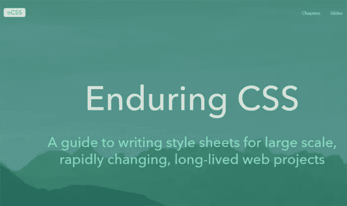

# 用这三种 CSS 方法驯服难以驾驭的样式表

> 原文：<https://www.sitepoint.com/tame-unruly-style-sheets-three-css-architecture-methodologies/>


*本文是与 [SiteGround](https://www.siteground.com/sitepoint-recommended?afcode=97a975da3502771c04e59cbae092b1dd&campaign=css-methodologies) 合作创作的系列文章的一部分。感谢您对使 SitePoint 成为可能的合作伙伴的支持。*

在这篇文章中，我将讨论 CSS 架构的三种成功方法，它们的原则、目标和优势。

## 为什么 CSS 代码会失控？

保持 CSS 代码精简、可重用和可维护是众所周知的困难。如果您忽略了以一致的方式执行任何编码和组织规则，这对于小型和中型到大型项目都是如此，其中不止一个开发人员在工作。

如果代码库很大，随着时间的推移经历了许多变化，并且缺乏组织，那么经常发生的情况是，团队更喜欢在样式表文档的末尾添加新的样式规则，而不是删除它的大部分或修改已经存在的规则。主要原因通常是编辑或删除 CSS 声明的效果是不可预测的，并且有破坏项目某处设计的风险。这是一个失败的策略，它会导致代码重复、特殊性问题(覆盖样式规则会变成一场战斗)和整体膨胀。

大多数情况下，选择最适合您需求的方法是一个迭代的过程，从熟悉已经存在的东西开始。

这里有三种方法可以帮助你应对混乱样式表的挑战。

## 不列颠帝国勋章


[BEM](https://en.bem.info) 代表**块-元素-修改器**。这是一个由 [Yandex](https://www.yandex.com) 创造的 CSS 架构方法论。

边界元方法的目标是

> 开发应该快速启动和长期支持的网站。它有助于创建可扩展和可重用的接口组件。
> 
> [BEM 网站](https://en.bem.info/methodology/)

这里的关键概念是**容易的项目维护**，以及**组件可重用性**。

BEM 的核心策略是在智能命名约定的帮助下将 CSS 代码组织成可重用的模块。让我们仔细看看。

### 什么是街区？

识别块体是应用边界元法的关键步骤。一个块是一个

> 可以重用的功能独立的页面组件。在 HTML 中，块由 class 属性表示。
> 
> [好文件](https://en.bem.info/methodology/quick-start/)。

当决定考虑什么样的块时，问问自己是否可以轻松地删除那部分代码，并在其他地方使用它。例如，你可以认为一个网站的页眉或页脚是一个块。

您可以安全地嵌套块，例如，您可以将菜单块放在标题块中。

```
<header>
<ul class="menu">
<!-- menu items here -->
</ul>
</header>
```

因为原则上你应该能够在页面的任何地方重用块，所以你的 CSS 不应该为块设置任何边距或定位规则。

最后，在选择名称时，确保名称描述了块的用途，而不是它的外观或状态。换句话说，它的名字应该回答了这个问题:*它是什么？*(例如，标题、菜单等。)，而不是*长什么样子？*(如固定表头、小菜单等。).

### 什么是元素？

根据边界元法，一个元素是

> 块的一部分，没有独立的意义，在语义上与其块联系在一起。
> 
> [好好享受](http://getbem.com/introduction/)

以下是一些适用于元素的原则:

*   元素只存在于块中
*   元素不能属于其他元素，它们只能是块的一部分
*   您可以构建嵌套元素
*   元素名称描述了它们的用途，而不是它们的外观
*   命名元素时，需要遵循以下约定:`block__element`

### 什么是修饰语？

修饰符是

> 定义块或元素的外观、状态或行为的实体。
> 
> [好文件](https://en.bem.info/methodology/quick-start/#modifier)

例如，标题块可以*固定在页面顶部*，折叠块可以*打开*或*关闭*，按钮块可以*禁用*等等。

修改器的 BEM 命名约定如下:`block__element_modifier`。

这是边界元方法的核心。此外，BEM 提供了[文件结构组织](https://en.bem.info/methodology/filestructure/)的原则，一套[工具](https://en.bem.info/toolbox/)，以及一个[生动的社区](https://en.bem.info/community/)作为支持。

### 使用边界元法的优点

这些是在项目中使用边界元法的一些优点

*   新开发人员可以快速理解标记中的组件和 CSS 规则之间的关系
*   它促进了团队的生产力。在处理大型项目时，这种优势尤其明显
*   命名约定降低了类名冲突和样式泄漏的风险
*   CSS 与页面中特定位置的标记没有紧密的联系
*   CSS 是高度可重用的

## SMACSS


CSS 的可伸缩和模块化架构，或 SMACSS，是一种用于组织和编写 CSS 代码的 web 开发方法。它的创造者乔纳森·斯努克这样描述它:

> SMACSS 是一种检查你的设计过程的方法，也是一种将那些僵化的框架融入灵活的思维过程的方法。这是一个在使用 CSS 时记录站点开发的一致方法的尝试。
> 
> [SMACSS 网站](https://smacss.com/)

其核心是对 CSS 规则进行分类的方法。分类带来了模式，也就是你在设计中不止一次看到的东西，围绕它你可以制定出编码可维护和可重用 CSS 的指导方针。

SMACSS 的核心类别包括:

*   **Base** —在这一类别中，CSS 规则管理元素的默认外观。选择器包括单元素选择器、属性选择器、伪类选择器、兄弟选择器等。比如`html`、`body`、`a, a:hover`等。
*   **布局** —此类别用于将页面分成多个部分的样式。
*   **模块** —模块是设计中可重复使用的类似乐高积木的部分，如菜单、对话框、搜索框等。
*   **状态** —此类别包括描述布局或模块在特定状态下的外观的样式(例如，可见或隐藏、展开或关闭等)。)或在特定视图中(例如，主页或内页)
*   主题(Theme)——这个类别与 State 相似，因为它包含了 CSS 规则来处理布局和模块的外观。不是所有的项目都需要这个额外的类别，但是知道它的存在是很好的。

### SMACSS 命名约定

与上面概述的类别相关，SMACSS 提出了一个命名约定来帮助代码组织和开发团队的生产力。

布局、状态和模块规则以有意义的名称或缩写为前缀。

对于布局规则，类似于`layout-`、`grid-`，甚至简单的`l-`都是可接受的前缀。

对于状态规则，惯例是在状态前加上前缀`is-`，如`is-hidden`、`is-visible`等。

至于模块，只需使用您正在构建的组件的名称，例如`.menu`、`.dialog`等。

例如，要设计一个打开的对话框，你可以在 CSS 中使用类似于`.dialog.is-open`的选择器。模块内部的相关元素以及同一模块的变体应该使用模块的基本名称作为前缀。此外，尽量不要使用 id、元素选择器或嵌套选择器。例如，要在一个名为*菜单*的模块中选择一个菜单项，不要像这样编写选择器:`.menu li a`，而是像这样使用:`.menu-link`或`.menu-item`。

与 BEM 不同，SMACSS 没有规定过于严格的命名约定。乔纳森·史努克清楚地表明了这一点，他声称:

> …不要觉得你必须严格遵守这些准则。有一个约定，记录下来，并坚持下去。
> 
> [SMACSS 网站](https://smacss.com/book/categorizing)

### 使用 SMACSS 的优势

CSS 编码的 SMACSS 方法的一些优点是:

*   它为模块化、可维护的 CSS 提供了有效的指导方针，同时避免了过于规范
*   你可以很快学会(和教)SMACSS
*   SMACSS 的命名约定没有 BEM 的那么冗长，并且在某些方面更容易掌握
*   它足够灵活，适用于大型和小型项目

## ECSS



持久的 CSS 或 eCSS 是

> 为大规模、快速变化、长期存在的 web 项目编写样式表的指南。
> 
> [eCSS 网站](http://ecss.io/)

这种 CSS 方法激起了我对其作者本·弗雷恩关于大规模处理 CSS 的挑战的原始观点的兴趣。

eCSS 的核心概念是**隔离**。隔离意味着每个组件都是一个独立的代码单元，没有依赖性，没有上下文包袱，可重用和可移除，没有导致样式泄漏的风险。

这主要通过以下方式实现

*   将所有的代码，不仅仅是 CSS，而是构建每个组件所需的所有技术，封装在各自的共享文件夹中。
*   每当你需要一个与已经存在的组件相似的组件时，创建一个全新的组件，但是有一些变化，即使变化很小。
*   使用严格的 CSS 命名约定

基于上面的第二点，很明显**重复的属性和值**对于 eCSS 来说不是问题。在这方面，eCSS 代表了与 BEM 和 SMACSS 等方法的彻底背离，这些方法从现有组件扩展或抽象，从而避免或尽最大努力避免代码重复。

这是否意味着 eCSS 会产生大量的样式表文件？不一定。在使用文件压缩进行了一些测试后，Ben Frain 得出结论，由于“gzip 在压缩重复字符串方面非常有效”，使用 eCSS 和其他更喜欢抽象而不是重复的方法之间的文件大小差异非常小。

### 使用 eCSS 的好处

以下是应用 eCSS 方法并接受其重复观点的收获:

*   通过保持每个视觉模式的隔离，CSS 代码变得更容易维护
*   尽管您会发现重复的属性和值，但从长远来看，文件大小的增加仍然很小。这是因为模块是独立的、孤立的单元，当你不再需要它们的时候，你可以快速地移除它们，而不用担心破坏设计
*   创建模块所需的所有语言/技术文件共享同一个文件夹，使得编辑和物理删除不再需要的内容变得极其容易。

你可以在 Frain 的书[持久的 CSS](http://ecss.io/) 中读到这种创新方法的所有细节。

## 结论

编写可维护且组织良好的 CSS 代码有其挑战性。在本文中，我介绍了三种有助于完成这项任务的方法。这绝不是一个详尽的列表，这些方法中没有一个能解决您在项目中可能遇到的所有问题。

尝试一下，看看什么适合你。你也可以尝试将 BEM 和 SMACSS 结合起来使用，或者甚至在你自己设定要解决的特定问题的基础上制定出你自己的方法。

你写有组织的、可管理的 CSS 代码的黄金法则是什么？你认为使用 CSS 架构的方法论可以减轻痛苦吗？点击评论框让我知道。

## 分享这篇文章