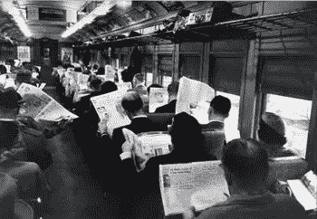

# 塔伦蒂诺，报纸和反社会行为

> 原文：<https://www.sitepoint.com/tarantino-newspapers-antisocial-behavior/>

*回到**我的**日..*'

这是老生常谈，但我们有充分的理由浪漫化过去——几乎是在我们足够大的时候。

像计算机一样，我们人类的记忆是有限的资源，我们不可能记住我们看到的一切。久而久之我们的记忆倾向于锁定极端的经历——非常好的和糟糕的时刻——而中间的则逐渐消逝。

你记得你的初吻，但你的第一个三明治？除非它是一个惊人的三明治，可能不是。

文化也有点类似。例如，在 1965 年录制的成千上万首歌曲中，今天我们大多数人可能只知道那一年最流行的 10 或 20 首歌曲。你大概知道'*昨天*'，还有'*满足*'，'*帮我朗达*，'*以爱的名义停止*。

成千上万张不太引人注目的 1965 年唱片被遗忘在某个地方的金库里——等待塔伦蒂诺先生——但从我们站的地方看，1965 年看起来完全是空前的经典！我们的集体记忆慢慢被扭曲。

我要带着这个去哪里？

这张 1960 年通勤列车的照片最近在推特上流传。每个座位都被沉浸在报纸中的乘客占据着，一个劲儿地无视他们的邻座。

这让我笑了。今天，我们经常痛打自己(或彼此)一顿，因为我们的技术让我们变得多么反社会。当真正的心在我们周围跳动时，永远在我们黑暗的小镜子上啄来啄去。

它暗示了一个更简单的时代，那时人们更好，花时间互相交谈。

上面的照片暗示了我们可能已经知道的事情:没有黄金时代——至少在城市里没有。

你可能很了解小村庄里的每个人，但城市让我们不断与完全陌生的人密切接触——我们不是天生的群居动物。我们天生对陌生人感觉怪异。

但是我们也是适应性很强的生物，我们总是有应对策略。在手机和平板电脑出现之前，我们摸索着烟斗或卷香烟。我们拉下帽沿，或者在一只手腕上翘起一本小说。我们听随身听，或者只是心不在焉地盯着窗外。

那不一定会让我们反社会，不是吗？

当然，这并不能成为人们在餐桌上浏览脸书的借口。

向他们扔勺子。我允许你这么做。

##### 从 [SitePoint 设计简讯](https://www.sitepoint.com/newsletter/)重新发布

## 分享这篇文章