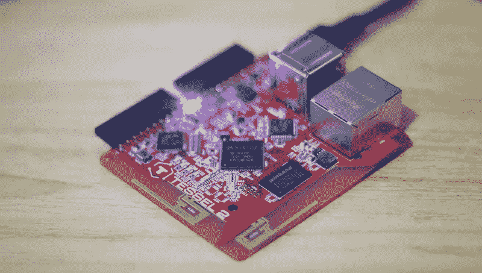
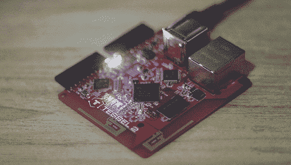

# Tessel 2:轻松配对 JavaScript 和物联网

> 原文：<https://www.sitepoint.com/tessel-2-pairing-javascript-and-the-internet-of-things-with-ease/>

[Tessel 2](http://tessel.io) 是一个微控制器，允许您构建运行 JavaScript 和 Node.js 的连接设备。它在其核心运行 Linux，在其上运行 node . js——提供对大量 npm 模块及其所有潜力的访问。在接下来的几周里，我将介绍开发人员使用 Tessel 2 的一些可能性。本周，我们将通过一个简单的测试应用程序来启动和运行您的 Tessel 2。



我的 Tessel 2 微控制器，我将使用这个演示！

## 正在准备 Node.js

确保您的计算机上安装了 Node.js v4.2.0 或更高版本。您可以使用以下命令进行检查:

```
node -v
```

如果您还没有安装 Node.js，请访问 Node.js 网站并[下载 Node.js v4.4.3](https://nodejs.org/en/download/releases/) 。

如果你是第一次安装 Node.js 或者想把它升级到一个新的版本，我会推荐你安装 4.4.3 版本，因为后面的版本看起来在 Tessel 2 上有一点小问题(特别是在 Mac OS X 上)。请随意尝试最新版本*(很可能只是我的电脑)*但是如果你有问题，请尝试 v4.4.3！

如果你像我一样需要升级 Node.js，我最初是按照大卫·沃什的指南来做的。然而，如果你的计算机上运行着大量的节点依赖，那么使用 NVM 方法可能会更简洁(也更安全)。我还从 Node.js 网站用`.pkg`下载文件[重新安装了不同的版本，它降级和升级都没有问题。无论您使用什么方法，都要安装 4.4.3 版。](https://nodejs.org/en/)

当试图运行`t2 list`时，您可能会在 4.4.3 之后的 Node 的更高版本中看到这个错误。如果在本指南后面运行此命令时看到以下错误消息，原因可能是您的节点版本:

```
node(12328,0x7fff7830b000) malloc: *** error for object 0xffffffff: pointer being freed was not allocated
*** set a breakpoint in malloc_error_break to debug
Abort trap: 6
```

或者:

```
ERR! WARNING: No usb controller found on this system.
INFO Crash Reported: http://crash-reporter.tessel.io/
```

## 安装 Tessel CLI

一旦您的计算机上运行了 Node 的兼容版本，运行以下命令通过 npm 将 Tessel 的 CLI(命令行界面)安装到您的计算机上:

```
npm install -g t2-cli
```

## 找到你的 Tessel

成功安装 Tessel CLI 后，将 Tessel 插入其中一个 USB 端口并启动。大约 30 秒后，运行以下命令来查找您的 tessel:

```
t2 list
```

它将运行并显示它能找到的镶嵌列表，如下所示:

```
INFO Searching for nearby Tessels...
        USB	Tessel-6465762064696E6572
```

虽然像“Tessel-6465762064696E6572”这样的名称非常吸引人，但您可以对其进行重命名，使名称更好！为此，运行以下命令，将“Castiel”替换为您自己选择的名称:

```
t2 rename Castiel
```

您将在 Tessel CLI 上看到以下内容，并以一条成功消息结束:

```
INFO Looking for your Tessel...
INFO Connected to Tessel-6465762064696E6572.
INFO Changed name of device Tessel-6465762064696E6572 to Castiel
```

如果您再次运行`t2 list`，您应该会看到您的 Tessel 现在有了一个非常吸引人的名字:

```
INFO Searching for nearby Tessels...
        USB	Castiel
```

## 将您的 Tessel 连接到 Wi-Fi

Tessel 2 配有内置 Wi-Fi，允许它相对容易地连接到 Wi-Fi 网络。为此，请运行以下命令:

```
t2 wifi -n "Your Witty WiFi Name" -p yourwifipassword
```

这将在 Tessel CLI 中显示以下内容，希望以成功连接结束:

```
INFO Looking for your Tessel...
INFO Connected to Castiel.
INFO Wifi Enabled.
INFO Wifi Connected. SSID: Your Witty WiFi Name, password: yourwifipassword, security: psk2
```

Tessel 有一个琥珀色的 LED，代表 Wi-Fi 连接，如果你看到闪烁，那么一切都很好！

## 通过 Wi-Fi 推送代码

Tessel 的一个非常方便的功能是能够通过 Wi-Fi 将代码从您的计算机推送到 Tessel，这样您就不需要一直通过 USB 连接它。这对于那些有很多设备的人，或者那些有计划把它放在家里难以够到的地方的人来说尤其方便。

要让您的计算机能够通过 Wi-Fi 运行代码并将代码推送到 Tessel，请运行以下命令:

```
t2 provision
```

这将设置公钥和私钥，以允许您的计算机通过 Wi-Fi 使用 Tessel。如果一切顺利，您应该会看到如下消息:

```
INFO Looking for your Tessel...
INFO Connected to Castiel.
INFO Creating public and private keys for Tessel authentication...
INFO SSH Keys written.
INFO Authenticating Tessel with public key...
INFO Tessel authenticated with public key.
```

然后，确保你和你的 Tessel 在同一个 Wi-Fi 网络上，再次运行`t2 list`命令。现在，您应该会看到您的 Tessel 同时被列为 USB 设备和 Wi-Fi 设备:

```
INFO Searching for nearby Tessels...
        USB	Castiel	
        LAN	Castiel
```

## 更新您的 Tessel

很有可能你刚刚收到你的 Tessel，它上面的固件稍微老一点，可以追溯到它的生产和运输时间。就像许多物联网设备一样，事物发展迅速，您的 Tessel 可能需要更新。运行以下代码来更新您的 Tessel:

```
t2 update
```

它应该会运行，如果您的 Tessel 确实需要更新，您应该会看到类似这样的内容:

```
INFO Looking for your Tessel...
INFO Connected to Castiel.
INFO New firmware version found...0.0.12
INFO Updating Castiel to latest version (0.0.12)...
INFO Beginning update download. This could take a couple minutes..
  Downloading [====================] 100% 0.0s remaining
INFO Download complete!
INFO Updating OpenWRT (1/2)
INFO Transferring image of size 19.14 MB. This will take 2-4 minutes...
INFO Transfer complete.
INFO Starting OpenWRT update.
INFO Please do not remove power from Tessel.
INFO This process will take at least two minutes...
INFO Updating firmware (2/2)
INFO Firmware update complete!
INFO Updated Castiel from  0.0.11  to  0.0.12
```

你可能需要点击 Ctrl + C，在这之后回到命令行…对我来说，它完成了，但没有结束程序。如果你遇到这种情况，Ctrl + C 将修复它！

我们的 Tessel 应该完全准备好测试应用程序了。让我们疯狂地让我们的 Tessel 闪彩。

## 我们的第一款彩色 Tessel 应用

为你的 Tessel 应用程序创建一个名为“rainbows”或任何你喜欢的名称的文件夹。转到终端/命令行中的文件夹。当您在文件夹中时，键入以下命令为您的 Tessel 应用程序设置初始准系统:

```
t2 init
```

一旦运行完成，这将组装一个基本的“Hello World”应用程序:

```
Created package.json.
Created .tesselinclude.
Wrote "Hello World" to index.js
```

我们在这个示例应用中的功能可以在`index.js`中找到。如果打开它，它放在示例应用程序中的初始代码应该是这样的:

```
// Import the interface to Tessel hardware
var tessel = require('tessel');

// Turn one of the LEDs on to start.
tessel.led[2].on();

// Blink!
setInterval(function () {
  tessel.led[2].toggle();
  tessel.led[3].toggle();
}, 100);

console.log("I'm blinking! (Press CTRL + C to stop)");
```

使用以下命令运行代码:

```
t2 run index.js
```

如果你运行它，你会看到 Tessel 上的两个 led 来回闪烁。这是令人兴奋的第一步，但我更希望事情能有所进展。让我们让所有四个指示灯闪烁，并让它们更快地闪烁。

Tessel 2 有四个板载 led 灯— `ERR`(红色)、`WLAN`(琥珀色)、`LED0`(绿色)和`LED1`(蓝色)。你会看到所有四个并排排列在棋盘上的“Tessel 2”标志和文字上方。对于真实世界的应用程序，你想要接管`ERR`和`WLAN`led 的可能性很低。对于一个有趣的小测试应用程序，我说为什么不呢！

每个 LED 都可以在 JavaScript 的`tessel.led`数组中寻址。它们在该数组中的存储顺序如下所示:

*   错误(红色)–`tessel.led[0]`
*   无线局域网(琥珀色)–`tessel.led[1]`
*   LED0(绿色)–`tessel.led[2]`
*   LED1(蓝色)–`tessel.led[3]`

这个顺序与它们出现在棋盘上的顺序一致。

如果我们调整上面的`index.js`文件，我们可以访问所有这些 led，而不仅仅是两个:

```
var tessel = require("tessel");

tessel.led[0].on();
tessel.led[2].on();

setInterval(function() {
  tessel.led[0].toggle();
  tessel.led[1].toggle();
  tessel.led[2].toggle();
  tessel.led[3].toggle();
}, 80);

console.log("Rainbow madness! (Press CTRL + C to stop)");
```

在上面的代码中，我们首先打开了`ERR`和`LED0`两个 led。然后，每隔 80 毫秒，我们切换所有四个 LED 状态，使它们以交替模式闪烁——首先是`ERR`和`LED0`闪烁，然后是`WLAN`和`LED1`LED 闪烁。他们会一直这样做，直到你按下 CTRL + C！

以下是它辉煌时期的 GIF 样本:



## 结论

这就完成了开始使用 Tessel 2 微控制器的基本步骤。在本系列关于 Tessel 的下一篇文章中，我们将研究如何设置 Tessel GPS 模块以及如何从中检索位置数据！

如果你有一个 Tessel 2，并用它做了一些有趣的东西，我很想听听你做了什么！请在下面的评论中告诉我，或者在 Twitter 上通过 [@thatpatrickguy](https://www.twitter.com/thatpatrickguy) 与我联系。

## 分享这篇文章