# 测试 3 个托管购物车:操作

> 原文：<https://www.sitepoint.com/testing-3-hosted-shopping-carts-operations/>

在我的[上一篇文章](https://www.sitepoint.com/testing-3-hosted-shopping-carts/)中，我描述了托管购物车解决方案的三个领先提供商的可用功能:Shopify、Yahoo Small Business 和 Magento Go。发现每一种都有明显的利弊。

## 安装

现在，让我们看看建立一个真正的商店有多容易。

### Shopify

使用 Shopify 设置您的商店只需不到一分钟的时间，输入您的个人信息后，您会被带到仪表盘。

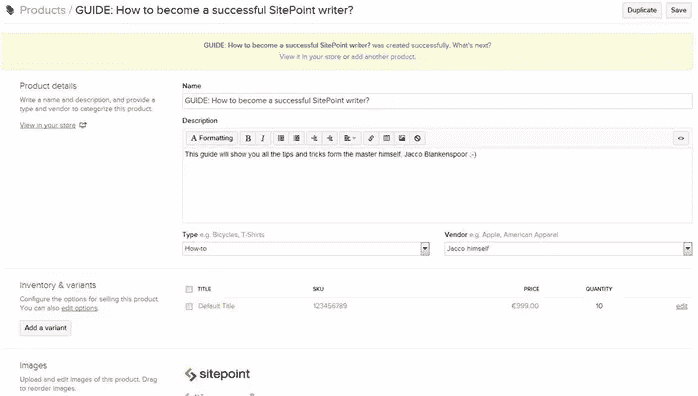

您可以在集合中对产品进行分组，这就像一个分类系统。

每个产品，你可以设置适当的搜索引擎优化设置和管理你的库存。

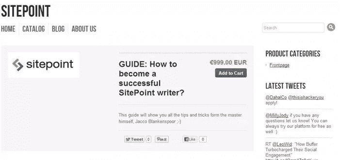

于是，几分钟后，我的第一件产品就展示出来了。

一切都非常清楚，直截了当。

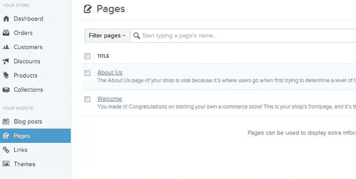

有一个内置的 CMS，你可以用它来管理你的非产品页面，博客和页脚。同样，非常清楚，它只是做它需要做的。

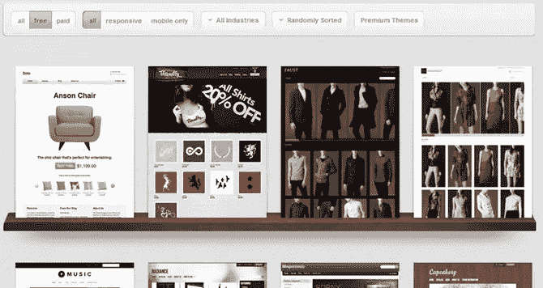

切换主题非常容易，只需从他们的主题商店中选择一个，并直接安装在您的商店中。

您可以下载文件来离线更改 HTML/CSS。

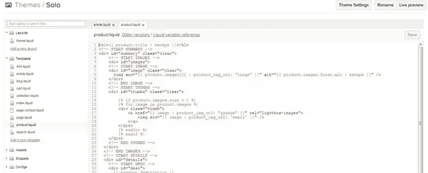

Shopify 使用自己的模板语言 Liquid。它们提供了关于如何使用它的大量文档，作为一名开发人员，你应该能够很快掌握它(对于一点点帮助， [Sitepoint 已经为你提供了](https://www.sitepoint.com/an-introduction-to-building-shopify-themes/))。

安装应用程序就像安装主题一样简单，在他们的应用商店里有相当数量的应用程序是免费提供的。

### 雅虎小企业

与 Shopify 和 Magento Go 不同，雅虎小企业不提供免费试用。所以你必须马上开始付款。当你不满意的时候，你可以随时要求退款，但是这有点过时了。

无论如何，当你注册后，你会看到一个方便的向导来设置你的商店。

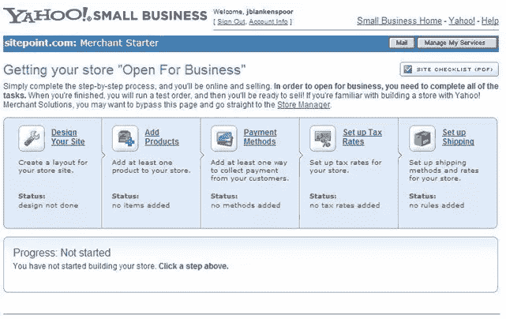

首先从他们的内置存储库中选择一个模板。这可以是通用的模板，或预制的模板。不同的是在图像的使用上，但它们看起来都像是在 90 年代制作的。

接下来的屏幕都显示了您需要输入信息的步骤，这非常方便。

看起来我对 90 年代的评论并不离谱，因为这是版权声明的默认文本…

下一步:添加产品。

同样，您可以通过执行一系列步骤来做到这一点。

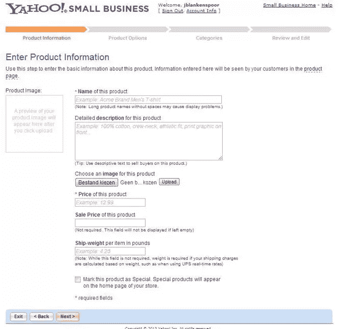

每次你做出改变或添加产品时，你都必须发布你的站点，这让你等了半分钟。

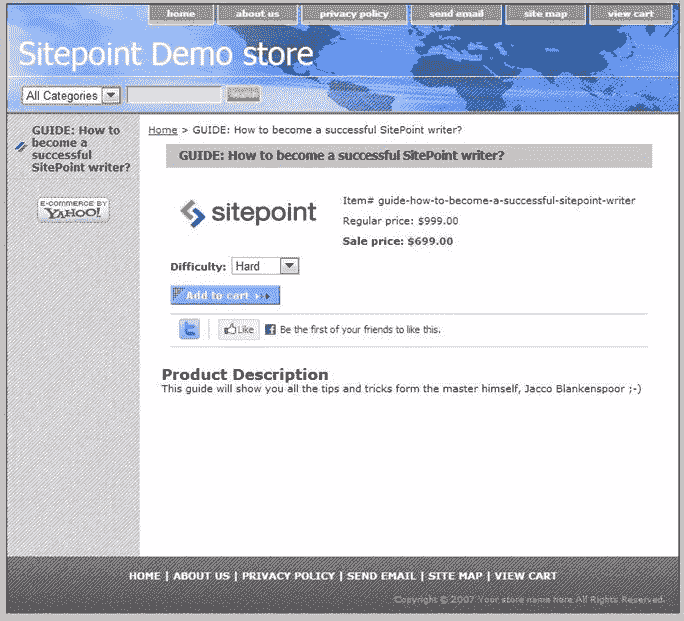

几分钟之内，我添加了我的第一个产品。你可以为你的产品选择“选项”，就像这个例子中的困难。您可以使用此字段来销售产品的多个变体。

在完成所有额外的支付、纳税和运输步骤(这些步骤都非常简单，并且描述得很好)后，您将看到真正的仪表板。

尤其是“Promote”部分值得注意，因为这是非常强大的选项。像促销和优惠券这样的东西很容易设置和管理。

你真的应该看看雅虎！营销仪表板，这是一个伟大的工具来跟踪您的营销工作。

正如我之前提到的，雅虎小企业不做花哨的主题，或应用程序。你所看到的就是你所得到的，尽管你可以雇佣一个专家来为你的网站设计合适的主题。

或者，如果你自己是一名开发人员，有一个广泛的商店编辑器，你可以在着色，HTML 和直接编辑 CSS 方面发挥作用，使其看起来专业。

这一切都在那里，你应该很熟悉，这是一个极好的商机。

### Magento Go

设置 Magento Go 商店所需的时间比 Shopify 长一些，但你仍然可以在五分钟内启动并运行。

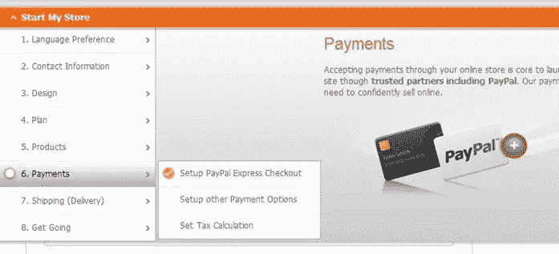

Magento 提供了一个方便的设置向导，它会带你完成启动你的商店所需的所有步骤。在安装过程中，您可以选择加载示例数据，这样您就可以立即看到商店的工作版本。

我选择将其设置在他们的英国数据中心(离我最近)，我惊讶地发现他们已经在底部添加了所需的 Cookie 法律通知栏。

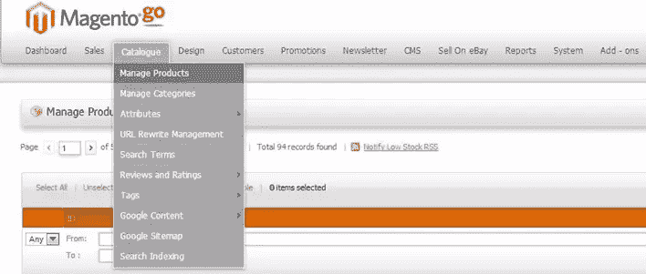

当你开始在商店工作时，你很快就会发现为什么会显示设置向导:Magento 有很多很多选项供你配置，添加产品不像 Shopify 那么简单。

他们的导航栏相当广泛，配置屏幕一开始可能会令人生畏。

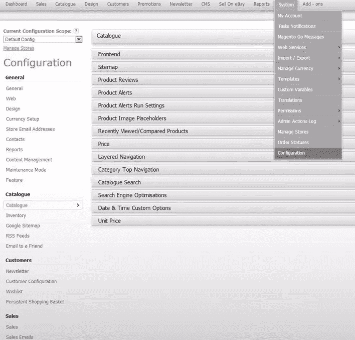

这是你作为一个开发者可以展示你的咨询能力的地方，当然，如果你知道你的方法的话。

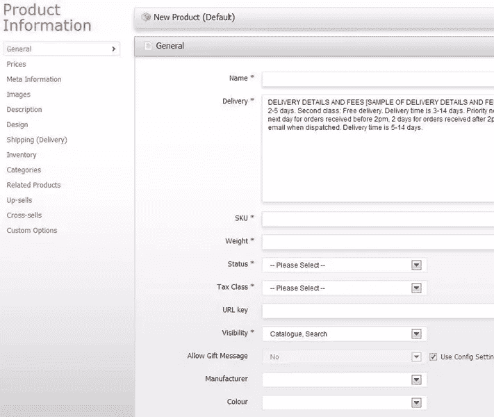

而且不止于此。添加产品为您提供了一系列全新的配置选项。这种情况一直持续下去，你打开的每一个屏幕都会给你比你想象中更多的选择。

我没有无缘无故用“压倒性”这个词…

## 移动的

随着移动变得越来越热，拥有一个移动优化的网站几乎是必须的。并不是每个产品系列都适合手机，但是如果你决定建立手机网站，应该会很容易。

所以，让我们看看购物车提供者是如何处理这个问题的。

### Shopify

作为一个特定的专业人士，Shopify 提供了一个移动网站以及一个适用于 iOs 和 Android 的移动应用程序。您可以为桌面和移动访问者指定不同的主题。

他们的销售页面声称你可以马上用移动网站开始销售，但是他们的默认模板并不是真正的移动。你必须首先寻找一个可移动的或可响应的主题。目前没有免费的手机主题。但是免费响应主题的选择是有限的，这应该给你足够的开始。

移动和响应主题的区别在于导航:移动主题看起来更像一个应用，而响应主题看起来更像是桌面版本，去掉了一些重元素。因此，人们对他们的移动支付申请持保留态度，至少如果你不想为另一个主题付费的话。

| 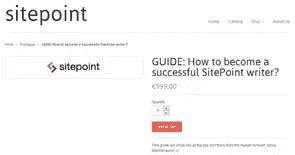 | 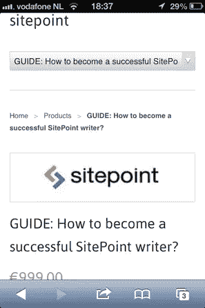 |
| *桌面版* | *手机版(响应式)* |

所以移动前端并没有真正达到预期，但这同样适用于应用程序吗？

我下载了免费的 iOs 应用程序，我可以看到他们肯定在其中做了一些工作。这是真正的移动管理。您可以查看您的客户和订单，甚至可以添加新产品或修改现有产品。有一个方便的仪表板，上面有重要的指标，如收入、访客(最多 90 天)、未结订单和低库存警告。

你将无法编辑网站的主题、应用或页面，但这是因为桌面更方便。但是所有的必需品都包括在内，所以这个绝对是加分项。

| 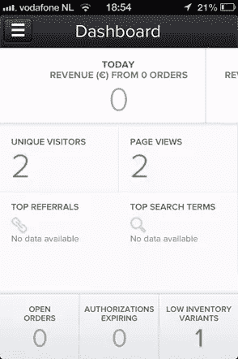 | 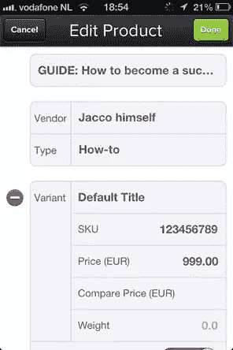 |
| *手机仪表盘* | *产品的移动编辑* |

### 雅虎小企业

这里没有太多内容，雅虎小企业似乎根本没有意识到正在发生的移动业务革命。

当你用手机浏览器打开商店，你就明白我的意思了。它甚至没有利用全面屏，这使得它更小。

| 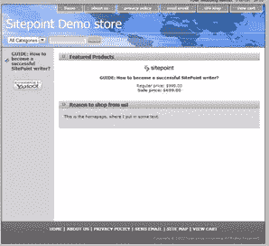 | 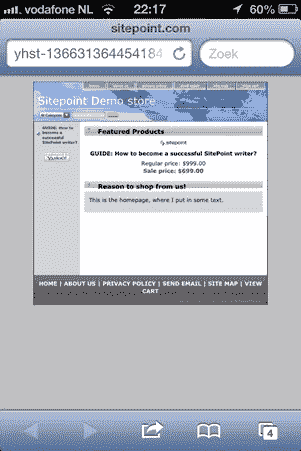 |
| *桌面版* | *手机版* |

你可能猜到没有手机应用。

### Magento Go

好吧，尽管 Magento Go 拥有所有的功能，但它在移动领域仍然落后。经过一番努力寻找，我终于找到了一个(1！)[主题](http://wizardthemes.com/go-themes/free-magento-go-theme.html)它甚至不是仅限于移动设备，而是响应迅速。

甚至在完成注册程序并“订购”了免费主题后，我也无法使用它。但是你可以试一试。安装后，它会是这样的。

|  |  |
| *桌面版* | *手机版(响应式)* |

不幸的是，Magento Go 没有移动应用程序，所以你只能用手机访问桌面版本。

这需要一些耐心，因为加载很慢，而且有太多的选项，很容易点击较小的屏幕。

## 定价

谈到定价，有多个变量需要考虑:

1.  每月定价与产品和功能数量的对比
2.  托管费用
3.  交易费用，不包括支付处理费用。

### 1)每月定价

*   Shopify 的定价从每月 14 美元的 25 种产品和有限功能的入门计划，到每月 179 美元的无限一切和全部功能。
*   Yahoo Small Business 的初始计划每月 29.96 美元，包含 50.000 个产品和有限的功能，所有功能(和 50.000 个产品)每月 224.96 美元。
*   Magento Go 的入门计划每月收费 15 美元，拥有 100 种产品和完整的功能。他们最贵的计划是每月 125 美元购买 10000 件产品。

### 2)托管成本

*   与产品数量相比，Shopify 在所有计划中都提供了足够的存储空间，以及无限的带宽(启用了 CDN)。
*   雅虎小企业提供无限的存储和带宽(公平使用)的所有计划。
*   Magento Go 在所有计划中都有有限的存储量和带宽。即使你每月支付 125 美元，你仍然只能得到 5 GB 的存储空间和 32 GB 的带宽。提供 10，000 种产品，这是不够的。而且他们的超额收费太贵了(每超额使用 1 GB 带宽 10 美元)。CDN 包含在内。

### 3)交易费用

*   Shopify 的初始计划收取 2%的交易费，最高计划不收取交易费。
*   雅虎小企业对他们的启动计划收取 1.5%的交易费，对他们最昂贵的计划收取 0.75%的费用。
*   Magento Go 对他们的任何计划都不收取交易费。

## 结论

说到功能，没有什么能打败 Magento Go。但这是有代价的:他们的主机定价非常昂贵(但让你免去了正确运行 Magento 的麻烦)，而且有一个陡峭的学习曲线。如果你是一名开发人员，Magento 为你提供了大量的商业机会:设置、SEO、自定义主题、应用程序开发、咨询——所有你可以展示专业知识的领域。对于最终用户，他们有方便的设置向导。但是，正确地建立你的商店需要时间和耐心，当你兴奋地开始你的电子商务冒险时，这两者都可能是你所缺乏的。

Shopify 是另一款对开发者友好的软件，我们公开邀请你加入他们的专家网络。或者开发主题和应用程序，并在他们的市场上销售。从最终用户的角度来看，Shopify 可能会变得非常昂贵。标准功能有点有限，他们非常依赖应用程序来扩展它。但并非所有这些应用都是免费的。主题也是一样，有一些不错的免费主题，但要脱颖而出，你需要购买一个主题。它非常容易使用，可以完美地作为你未来电子商务的开端。当你想移动的时候，他们肯定是在正确的轨道上。

雅虎有点难以定位。他们有专门的开发者网络，这很好。它们提供了一些工具，使得开发人员可以轻松地构建/定制主题，或者扩展功能。他们的后端实际上非常好，内置了许多指南，而且一切都非常流畅。他们的营销工具也很棒。虽然价格相对较高，但它们提供了一系列不错的功能。

但我无法摆脱他们忘记在前端工作的感觉。他们的主题是你用 HTML 建立第一个网站时所做的设计。大约 15 年前。雅虎似乎不存在移动业务。我承认这对开发人员来说是极好的商业机会，但对最终用户来说，这并不完美。但是，如果你能克服这一点，雅虎小企业是非常新手友好的，可以是一个良好的开端。你可以提供比你可能拥有的更多的产品。

最终这取决于你，但是无论你是开发者还是最终用户，你都应该在购买之前尝试一下(在雅虎，你实际上不得不购买来尝试，但仍然如此)。尽管以后有可能转换，但这并不容易，而且这个过程可能会吓跑你的客户。做功课的机会就在那里，值得探索每一个如何与你的需求相匹配。

如果你还有关于这三个供应商的问题，请在评论中留下，我会尽力回答。

## 分享这篇文章