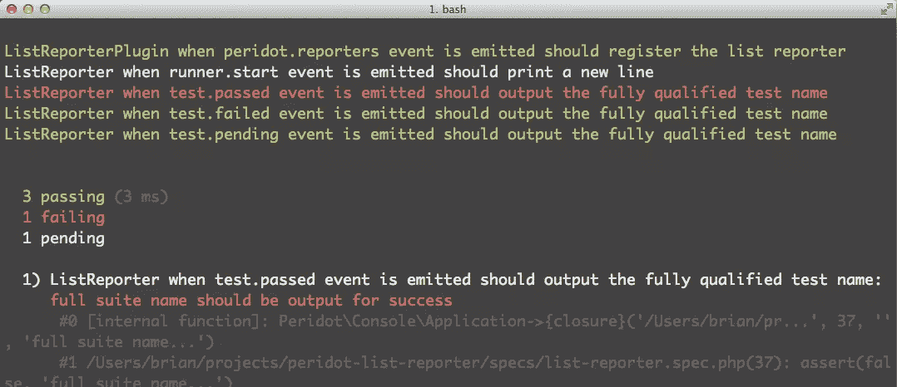

# 测试狂潮——我们能 BDD 测试单元吗？

> 原文：<https://www.sitepoint.com/testing-frenzy-can-we-bdd-test-the-units/>

老实说，我不怎么做测试。当真的有必要的时候，我在做大型企业项目，[我做](https://www.sitepoint.com/bdd-in-laravel-getting-started-with-behat-and-phpspec/)，但是一般来说，我的个人项目通常是一个人的概念证明，或者是对已经测试过的应用程序的修复。

我们已经在 SitePoint 上完成了对帖子的[测试，不久将会有更多的测试，但是我想向你们展示一个我发现的相对较新的测试工具，它引起了我的注意，因为它看起来非常不寻常。](https://www.sitepoint.com/re-introducing-phpunit-getting-started-tdd-php/)


## 橄榄石

[Peridot](http://peridot-php.github.io/) 是一个 BDD 测试框架(所以*行为驱动测试*)，但是针对你的代码单元——而不是你的业务逻辑。

等等，什么？

是的。

如果你熟悉 [Behat](https://www.sitepoint.com/bdd-in-laravel-getting-started-with-behat-and-phpspec/) ，你会认出这个语法(即使你不熟悉它，它也应该是相当可读的):

```
Feature: adding a todo

As a user
I want my todos to be persisted
So I don't have to retype them

Scenario: adding a todo
  Given I am on "/"
  When I fill in "todo" with "Get groceries"
  And I press "add"
  And I reload the page
  Then I should see "Get groceries"

Scenario: adding a duplicate todo
  Given I have a done todo "Pick up dinner"
  And I am on "/"
  When I fill in "todo" with "Pick up dinner"
  And I press "add"
  Then I should see "Todo already exists" after waiting
  And I should see 1 "#todos li" elements 
```

各个短语在 FeatureContext 类中定义，如下所示:

```
 /**
     * @Then I should see :arg1 after waiting
     */
    public function iShouldSeeAfterWaiting($text)
    {
        $this->getSession()->wait(10000, "document.documentElement.innerHTML.indexOf('$text') > -1");
        $this->assertPageContainsText($text);
    }
    /**
     * @Given I have a todo :arg1
     */
    public function iHaveATodo($todoText)
    {
        $collection = self::getTodoCollection();
        $collection->insert(['label' => $todoText, 'done' => false]);
    } 
```

框架识别它们，用参数替换它们的值，并测试条件。

但是这些被称为“用户故事”——它们是用户所做的，或者被期望去做的。Behat 会在需要的时候打开一个浏览器，进行测试，然后反馈回来。我们怎么可能将它应用于代码单元呢？

像这样:

```
describe('ArrayObject', function() {
    beforeEach(function() {
        $this->arrayObject = new ArrayObject(['one', 'two', 'three']);
    });

    describe('->count()', function() {
        it('should return the number of items', function() {
            $count = $this->arrayObject->count();
            assert($count === 3, 'expected 3');
        });
    });
}); 
```

在类似的基于故事的风格和级联嵌套上下文中，Peridot 将“描述”和`ArrayObject`的`count()`方法(注意它如何首先描述 ArrayObject，然后描述方法)，并添加一个`it`来解释所描述的实体应该做什么。

嵌套上下文方法还允许您在创建每个实体之前，或者在创建每个子实体之前，执行一些引导逻辑，这使得测试框架非常灵活。这就是`beforeEach`函数所做的——它用三个元素启动一个新的`ArrayObject`,因此计数总是在正确的实例上执行。

好吧，那么…什么？只是 PHPUnit 的替代语法？嗯，是也不是。虽然 it **关注的是单元，并能够以基于故事的方式测试它们，但你也可以将它视为客户和开发人员之间的中介语言。这也是 Behat 如此吸引人的原因——如果你给客户一个 Behat 特性，他们会**立即**能够说出它的意思和它应该测试什么。通过一点点培训，他们甚至可以为你写更多的故事——客户为他们自己的应用程序编写测试是每个开发人员项目的圣杯，我肯定你同意这一点。**

Peridot 的相似之处在于它提供了一种人类可读的测试单元的方法——它仍然是 PHP 语法，但是它的语法和嵌套使得它足够用户友好，可以被客户理解。这种措辞也非常适合一些真正冗长的报告:



### 并发

Peridot 还通过[并发插件](https://github.com/peridot-php/peridot-concurrency)提供“正常工作”的并发。

当您测试数据库连接、远程调用或浏览器动作时，这非常方便——所有这些都非常慢，并且在任何系统上一个接一个地执行它们都要花费很长时间。相反，并发插件确保测试在单独的工作进程中执行，根据需要生成。一旦完成，每个工作人员就将结果反馈给父进程，大大加快了测试速度。除了在启动测试时激活一个插件并传递一个标志(`--concurrent`和`--processes`)之外，没有任何必要的配置。

重要的是要注意，在这种情况下，人们应该小心那些可能相互依赖的测试——例如，如果您正在执行在数据库中做某些事情的测试，让它们都在同一个数据库中做某些事情是没有意义的，因为它们可能会以冲突而告终。相反，并发插件使当前执行规范的进程的 ID 可用，这使得在测试期间创建特定于进程的数据库变得容易，从而保持所有规范的独立性和安全性:

```
$id = getenv('PERIDOT_TEST_TOKEN');
$dbname = "mydb_$id"; 
```

### 聚焦并跳过

为了与 PHPUnit 竞争，Peridot 还提供了一种完全跳过某些测试，只运行其他测试的方法。如果你给一个函数加上前缀`f`，被测试的规范将变成*聚焦的*。这是说**只有**那个测试会被执行，而那个套件中所有没有`f`执行的东西**都不会运行**。微调测试时很有帮助。

```
<?php
describe('A suite with nested suites', function() {
    fcontext('A focused suite', function() {
        it('should execute this spec', function() {
            // ...
        });

        it('should also execute this spec', function() {
            // ...
        });
    });

    describe('An unfocused suite', function() {
        it('should not execute this spec', function() {
            // ...
        });
    });
}); 
```

在其他情况下，您会想要跳过一个测试，并将其标记为暂时不重要或正在进行中。你什么时候会这么做？例如，当一个[特别糟糕的](https://github.com/Swader/diffbot-php-client/issues/12)实现*“如果我们是诚实的，就不要真的去做”*PHP 的 JSON 扩展破坏了我的 Diffbot PHP 客户端测试时，我除了[把它标记为跳过](https://github.com/Swader/diffbot-php-client/blob/master/tests/Api/SearchCustomMocksTest.php#L111)之外别无他法，只能等待一个实际工作的扩展。在 Peridot 中以`x`作为前缀与在 PHPUnit 中标记跳过的测试是一样的。

```
xdescribe('A pending suite', function() {
    xcontext('when using a pending context', function() {
        xit('should have a pending spec', function() {
            // ...
        });
    });
}); 
```

这两个特性结合起来能够与其他测试框架的类似特性相媲美。

### 事件和插件

通过在测试过程的特定阶段触发的插件和事件，Peridot 是高度可扩展的。

这些事件可以在主`peridot.php`文件中收听，它们的完整列表可以在[这里](http://peridot-php.github.io/events.html)找到。有了这样一个开放的架构，各种插件都可以很容易地开发出来。例如 [Yo 插件](https://github.com/peridot-php/peridot-yo-plugin)，会发一个 Yo！测试通过或失败时通过 Yo 服务发出通知(取决于 *yo* [sic]配置)。 [Watcher 插件](https://github.com/peridot-php/peridot-watcher-plugin)将监控您的测试文件，并在检测到更改时重新运行套件(兼容性取决于操作系统–请使用非 Windows 系统。[宅基地改良](https://www.sitepoint.com/quick-tip-get-homestead-vagrant-vm-running/)最好)。

### 代码覆盖率

凭借强大的事件架构、简单的语法和有效的结构，Peridot 还可以完美地与传统的代码覆盖报告工具集成。

[下面是](https://github.com/peridot-php/peridot-code-coverage-reporters)如何将其与 PHPUnit 的代码覆盖报告集成。

### 自定义 DSL

如果你不喜欢`describe-it`语法，并且想要复制一些更熟悉的东西，或者更适合你的商业案例的东西，定制的 DSL(领域特定语言)可以被开发作为替代或者增强。借助定制 DSL，这在橄榄石中成为可能:

```
Feature("chdir","
    As a PHP user
    I need to be able to change the current working directory",
    function () {

        Scenario(function () {

            Given('I am in this directory', function () {
                chdir(__DIR__);
            });

            When('I run getcwd()', function () {
                $this->cwd = getcwd();
            });

            Then('I should get this directory', function () {
                if ($this->cwd != __DIR__) {
                    throw new \Exception("Should be current directory");
                }
            });

        });

    }); 
```

如何做到这一点的完整示例可在[这里](https://github.com/peridot-php/peridot-dsl-example)找到。

### 自定义范围

也有可能本地扩展测试的范围。例如，如果我们希望能够在测试中使用 webdriver(用于测试 URL 的 web 浏览器)，我们可以通过安装 WebDriver 来激活它，如下所示:

```
composer require facebook/webdriver peridot-php/webdriver-manager 
```

然后，创建一个扩展 Peridot 范围的类，这样它就可以被绑定到测试中:

```
<?php // src/Example/WebDriverScope
namespace Peridot\Example;

use Evenement\EventEmitter;
use Peridot\Core\Scope;

class WebDriverScope extends Scope
{
    /**
     * @var \RemoteWebDriver
     */
    protected $driver;

    /**
     * @var \Evenement\EventEmitter
     */
    protected $emitter;

    /**
     * @param \RemoteWebDriver $driver
     */
    public function __construct(\RemoteWebDriver $driver, EventEmitter $emitter)
    {
        $this->driver = $driver;
        $this->emitter = $emitter;

        //when the runner has finished lets quit the driver
        $this->emitter->on('runner.end', function() {
            $this->driver->quit();
        });
    }

    /**
     * Add a getPage method to our tests
     *
     * @param $url
     */
    public function getPage($url)
    {
        $this->driver->get($url);
    }

    /**
     * Adds a findElementById method to our tests
     *
     * @param $id
     * @return \WebDriverElement
     */
    public function findElementById($id)
    {
        return $this->driver->findElement(\WebDriverBy::id($id));
    }
} 
```

然后在主`peridot.php`文件中激活:

```
<?php // peridot.php
use Peridot\Core\Suite;
use Peridot\Example\WebDriverScope;

require_once __DIR__ . '/vendor/autoload.php';

return function($emitter) {

    //create a single WebDriverScope to port around
    $driver = RemoteWebDriver::create('http://localhost:4444/wd/hub', array(
        WebDriverCapabilityType::BROWSER_NAME => WebDriverBrowserType::FIREFOX
    ));
    $webDriverScope = new WebDriverScope($driver, $emitter);

    /**
     * We want all suites and their children to have the functionality provided
     * by WebDriverScope, so we hook into the suite.start event. Suites will pass their child
     * scopes to all child tests and suites.
     */
    $emitter->on('suite.start', function(Suite $suite) use ($webDriverScope) {
        $scope = $suite->getScope();
        $scope->peridotAddChildScope($webDriverScope);
    });
}; 
```

…突然可以在测试中使用！

```
<?php
describe('The home page', function() {
    it('should have a greeting', function() {
        $this->getPage('http://localhost:4000');
        $greeting = $this->findElementById('greeting');
        assert($greeting->getText() === "Hello", "should be Hello");
    });
}); 
```

注意，我们甚至可以用这个完全复制 Behat 的行为！

关于范围[的更多信息请点击](http://peridot-php.github.io/scopes.html)。

## 结论

Peridot 是一种让你的代码单元栩栩如生的方法，在 BDD 测试时遵循应用程序本身的步骤。就其本身而言，它是一个很好的单元测试工具，但是与 Behat 这样的东西一起，它可以很好地覆盖整个应用程序。

对于不熟悉使用它的其他工具的我们来说,`describe-it`语法有点奇怪，但是它与执行它的上下文(描述单元)相匹配，所以在意义上，它工作得相当好。此外，如果`describe-it`感觉不好，你可以自己制作 DSL。

包括 Peridot 在内，我们现在在测试市场上有四个主要参与者:PHPUnit、Behat、PHPSpec 和 Peridot。

你用这些中的哪一个？为什么？你用组合吗？如果是，为什么是这种特定的组合？你能给我们举几个例子吗？我们很想看看你的设置和代码。在下面的评论里告诉我们吧！

*以上代码示例摘自 Peridot 的 [todo 应用示例](https://github.com/brianium/behavior-driven-todos)*

## 分享这篇文章