# 2015 年十大网页设计趋势

> 原文：<https://www.sitepoint.com/the-10-big-web-design-trends-of-2015/>

还记得 2015 年吗？Apple Watch，新款 iPhone 6S，再次爱上侏罗纪公园。仿佛就在昨天。

2015 年在所有事情上都留下了独特的风格，包括网页设计，今年继续适应移动浏览取代桌面。根据我自己在 [UXPin](http://uxpin.com) 与设计团队的讨论，让我们来探索十大趋势，以及如何在 2016 年继续收获它们的好处。

## 1.最低纲领

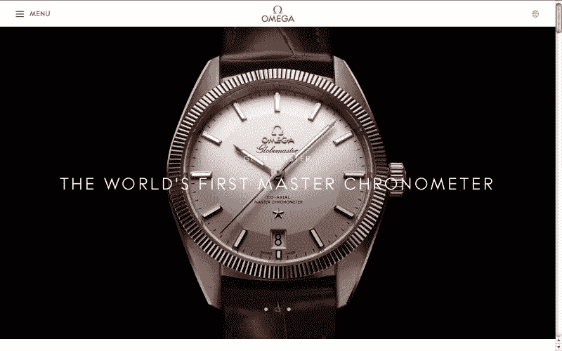

<small>来源:[欧米茄手表](http://www.omegawatches.com/)</small>

极简网站体现了 2015 年网页设计的核心理念之一:简单。除了必要的元素之外，去掉所有的元素不仅给你的网站增添了优雅的气息，还减少了加载时间，这对于移动浏览来说是一个很好的优势。加上更少的元素意味着更容易的响应设计。

正如免费指南【2015 年& 2016 年网页设计趋势中解释的那样，极简美学也与视觉功能的进步一起工作，这鼓励了高清背景等其他趋势。

在上面的例子中， [OMEGA](http://www.omegawatches.com/) 只包括必要的东西:语言设置、可扩展菜单和返回主页的标志。这几乎将注意力完全吸引到奢侈品的英雄形象上，因为没有太多其他 UI 元素与之竞争。

### 技巧

*   使用幻灯片或下拉菜单节省空间。
*   应用不同的对称度可以防止网站看起来沉闷，尤其是不对称。

### 免费资源

*   [极简单页网站图库](https://onepagelove.com/tag/minimal)-一个致力于展示最佳单页网站的网站。
*   最佳极简主义 WordPress 主题——极简主义模板的一个不错的启动平台，尽管不是所有的都是免费的。
*   [设计趋势:极简主义的优雅](http://studio.uxpin.com/ebooks/web-ui-design-trends-minimalism/)——基于 28 个年度最佳设计范例的免费指南，教授有用的网络极简主义技术。

## 2.长滚动

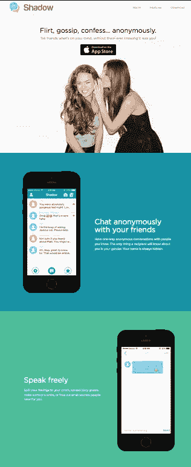

<small>来源:[影子](http://shadow.is/)</small>

更小的屏幕意味着更长的卷轴。

[随着“折叠之下”的神话被证明是错误的](http://uxmyths.com/post/654047943/myth-people-dont-scroll)，今天的设计师和用户都认识到了长滚动的价值:更多的创作自由、改进的故事讲述、更强的交互和简化的导航(如果网站足够小的话)。

长滚动最适用于移动流量大或内容更新频繁的网站，对于视频等媒体量大的网站则不太有效，因为这会延长加载时间。

### 技巧

*   粘性导航菜单或跳转到章节选项可以防止用户迷失方向，这是滚动时常见的问题。
*   用视差和滚动触发的动画等效果描绘出长滚动的有趣方面。
*   遵循这篇 [Moz 文章](https://moz.com/blog/parallax-scrolling-websites-and-seo-a-collection-of-solutions-and-examples)和这篇[quick prout 文章](http://www.quicksprout.com/2014/05/21/how-to-create-an-seo-friendly-infinite-scrolling-page/)中的建议，避免负面的 SEO 效应。

### 免费资源

*   [一页爱](https://onepagelove.com)——最好的单页网站图库，定期更新。
*   “[苹果复活滚轮](http://techcrunch.com/2014/09/09/apple-resurrects-the-scroll-wheel/)”——TechCrunch 的一篇文章分析了 Apple Watch 如何为滚动网站注入新的活力。
*   如何创建一个视差网站——这是一个两部分的教程，教授视差设计的基础知识，包括编码。

## 3.新的公寓设计

今天的平面设计已经从它的根源演变为 skeuomorphism 的替代物。更细致入微的平板设计新版本——瑞安·艾伦称之为“[平板设计 2.0](http://articles.dappergentlemen.com/2014/12/03/flat-design-2/)”——为细节和华丽创造了更多机会:

*   照明眩光和亮点
*   渐变和/或投影
*   更大的细节价值

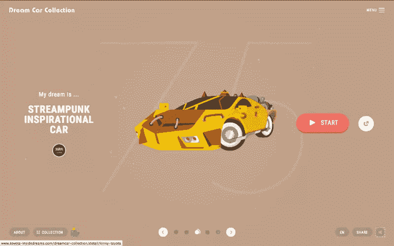

<small>来源:[丰田:梦想汽车集锦](http://www.toyota-insidedreams.com/dreamcar-collection/)</small>

像极简主义一样，扁平化的简洁仍然是它的优势。几乎卡通化的图形、易读性优先的排版和有趣的颜色使这种风格易于理解。

### 技巧

*   [幽灵按钮](http://studio.uxpin.com/blog/mobile-ui-design-trend-build-the-perfect-ghost-button/)可以在平面设计之外使用。它们的透明性保持了背景图像的焦点，使它们成为英雄图像的一个受欢迎的补充。
*   Flat 的简单图形使加载变得轻而易举。这非常适合响应式设计。

### 免费资源

*   [设计趋势:平面设计的演变](http://studio.uxpin.com/ebooks/web-ui-design-trends-flat-design/)——基于 18 个年度最佳设计范例的教授平面技术的免费指南。
*   25 个平板设备模型:用于在各种设备上创建平板设计模型的模板。
*   [50 个平面图标集](http://digitalsynopsis.com/tools/free-flat-design-icons/) : Digital Synopsis 的 50 个平面图标集的摘要，可以免费使用或阅读。

## 4.强大的动画

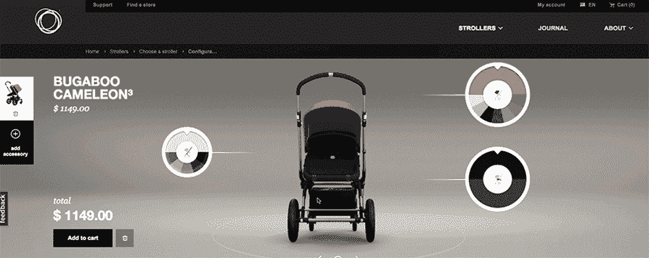

来源: [Bugaboo](https://www.bugaboo.com/US/en_US/home)

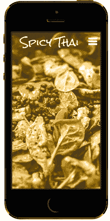

因为运动吸引注意力，动画可以影响先看到的视觉层次。此外，动画还显示关系:想象一个窗口缩小并飞入菜单的动画——这个动画证实了动作的成功，也向用户显示了他们稍后可以在菜单上的什么位置查看该窗口。

飞入菜单，如下面的 [UXPin](http://uxpin.com) 中使用无代码动画编辑器的原型，完美地展示了这一原理。

至少，动画赋予了枯燥的动作以生命。悬停动画显示链接可点击，而不仅仅是简单的颜色变化。

### 技巧

*   网页和应用程序动画仍然可以利用迪士尼经典的 [12 条动画规则](http://www.smashingmagazine.com/2012/10/motion-and-animation-a-new-mobile-ux-design-material/)。
*   长滚动格式严重依赖动画来创建平滑滚动的外观。最重要的是，滚动触发的动画创建了一个更具沉浸感和娱乐性的网站。
*   加载屏幕动画给用户一个时间估计，并在等待时娱乐他们。
*   背景中微妙的动画，只要不过度或分散注意力，可以给原本陈旧的视觉效果增加一点活力。

### 免费资源

*   [CSS3 动画备忘单](http://www.justinaguilar.com/animations/)–这是一个有用的现成即插即用的动画集合，可以让你将预制的 CSS 类应用到任何你想要的元素上。
*   [网页动画](http://w3c.github.io/web-animations/)–网页和 API 中动画同步和定时的频繁更新指南。
*   [交互设计&动画](http://studio.uxpin.com/ebooks/curated-interaction-design-animations/)–基于 47 个年度最佳设计范例的 80 页免费指南，教授交互设计技巧。

## 5.鲜艳的颜色

过去，设计师们只能使用 216 种网页安全色，但现在已经有了数百万种，这一进步与高清屏幕的兴起恰逢其时。

正如 2015 年[网页设计趋势& 2016 年](http://studio.uxpin.com/ebooks/web-ui-design-trends-2015-2016/)中解释的那样，今年明亮、活泼的颜色增多，以符合平面设计的基调，但这些“快乐”的颜色也很适合其他趋势。

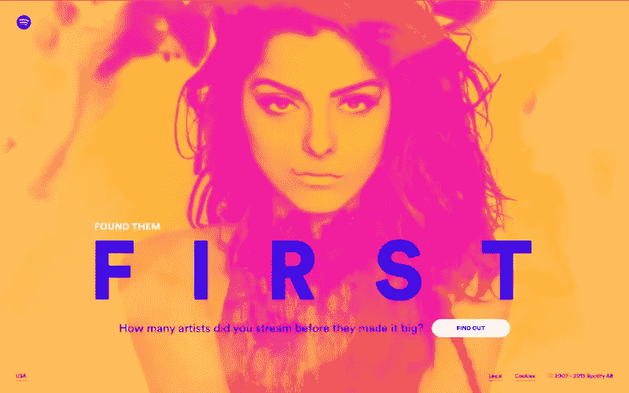

<small>来源: [Spotify:先找到他们](https://spotify-foundthemfirst.com/en-US)</small>

引人注目的颜色减少了网站显得沉闷的可能性——极简主义的天然弱点。当积极使用印刷字体时，颜色可以吸引人们对某些单词或短语的注意。此外，颜色在暗示可用性方面有重要作用:想想悬停在卡片上时会改变颜色，这是交互性的一个明显标志。

### 技巧

*   每种颜色都会引发不同的情感，所以选择合适的颜色来搭配你的产品个性。
*   在选择你的方案之前，了解色彩理论如何应用于设计。

### 免费资源

*   colour lovers–一个全球社区，展示他们自己聪明的调色板，讨论所有媒介的色彩理论。
*   [Tint UI](http://tintui.com/flat.html)–用于复制十六进制代码的颜色选择器。允许按平台(材料设计、iOS 等)浏览。)、品牌(Twitter、Firefox 等。)，或者说现在的趋势。
*   [设计趋势:色彩的活力](http://studio.uxpin.com/ebooks/web-ui-design-trends-vibrancy-color/)——基于 22 个年度最佳设计范例的免费色彩技术教学指南。

## 6.高清背景

随着越来越多的人拥有高清设备，这种趋势的流行只是时间问题。

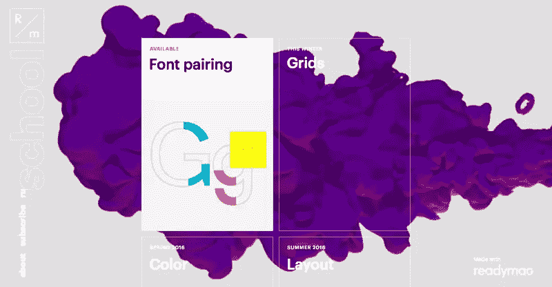

<small>[R/m 设计学院](http://school.readymag.com/)</small>

高清是任何高于 200 ppi (dpi)的分辨率，而标准清晰度是 72 ppi。这使得以标准清晰度设计的图像在高清设备上看起来模糊不清，但高清图像在标清设备上看起来很好。这意味着使用标清显示器的用户不会注意到这种差异，但使用高清显示器的用户肯定会注意到。

### 技巧

*   设备背景通常不符合相机 1:1.5 的宽高比，所以在裁剪时要积极参与。否则你就控制不了什么剪什么看。
*   标量矢量图形(SVG)使用线和点来转换图像；光栅格式(。jpg，。png，。gif)逐像素工作。对新图形使用 SVG，并为现实生活中的图像和视频保存光栅格式，因为它们从一开始就有固定的像素数量-这就是为什么从一开始就以高清格式捕捉媒体很重要。

### 免费资源

*   [提高 Retina 显示屏的图像质量](http://webdesign.tutsplus.com/articles/improving-image-quality-on-the-retina-display--webdesign-6749)–Tuts+关于处理高清显示屏的提示，包括 CSS 媒体查询的使用。
*   [浏览器截图](http://browsershots.org/)–一个测试你网站的屏幕分辨率和浏览器功能的在线工具。
*   [20 个高清模糊背景集](http://www.webdesigndev.com/freebies/hd-free-blurred-backgrounds-sets)–一组免费的模糊高清背景。

## 7.表现摄影

部分由于高清屏幕的增加，网页设计继续使用更高质量(有时更艺术)的照片。

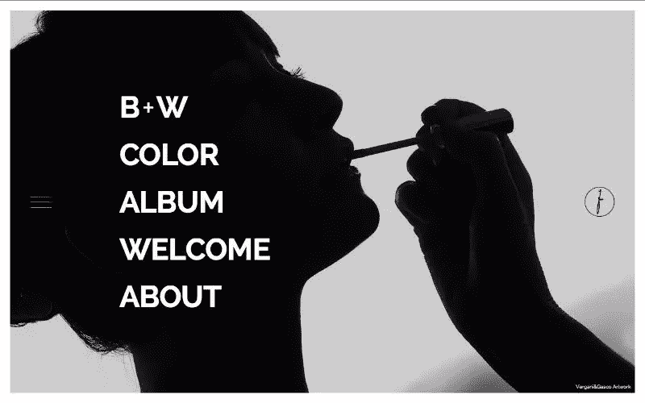

<small>来源:[马里奥·弗里格里奥:婚礼摄影师](http://www.fotofrigerio.it/en)</small>

这一点在英雄图像的流行中表现得最为明显——充满整个背景的单张照片。英雄图片可以更快地吸引用户，使其成为登陆和登录页面的完美选择。

### 技巧

*   将定制照片和库存照片结合起来，使库存照片看起来也是定制的，例如，主题和主题一致。
*   免费库存照片，试试 [Unsplash](https://unsplash.com/) 、 [Pixabay](https://pixabay.com/) 和 [Pexels](https://www.pexels.com/) 。
*   用颜色叠加影响图像的感知。例如，在一张单调的照片上覆盖一层黄色会让它看起来更乐观。
*   自然环境中的产品照片[比传统的产品照片](http://conversionxl.com/how-images-can-boost-your-conversion-rate/)更能增加销售额，因为它创造了拥有产品的真实感受。

### 免费资源

*   [“使用库存摄影时要避免的 10 个陷阱”](http://designshack.net/articles/layouts/10-pitfalls-to-avoid-when-using-stock-photography/)-来自 Design Shack 的一篇文章，警告库存摄影的十个常见错误。
*   TinEye 反向图片搜索-一个伟大的摄影工具，可以显示照片在互联网上的所有位置。
*   [“美丽 DIY 摄影终极指南](http://www.shopify.com/blog/12206313-the-ultimate-diy-guide-to-beautiful-product-photography)——拍摄自己网络摄影的初学者指南。

## 8.动态排版

随着字体渲染不再是一个问题，以及新的免费字体的出现，排版已经开始在网页设计中扮演更多的角色。

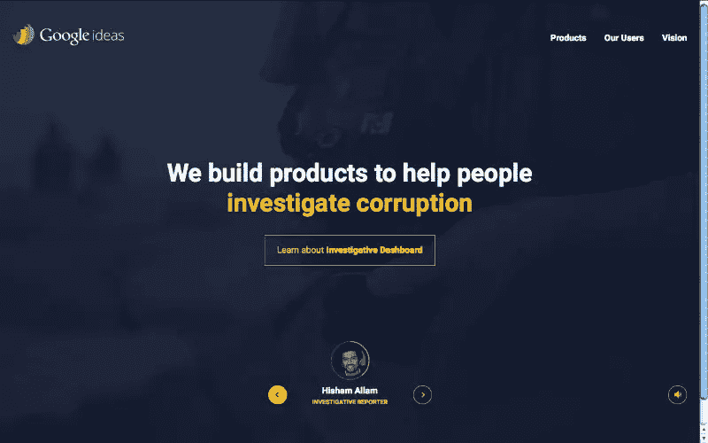

<small>来源:[谷歌创意](https://www.google.com/ideas/)</small>

动态排版并不总是意味着狂野或精致的字体——事实上，最常见的是简单的排版，符合平面设计和极简主义等趋势。动态排版的趋势是指任何吸引注意力的文本，无论是简单的还是复杂的。这包括非常大或非常小的字体。

### 技巧

*   大多数时候，每个站点两种字体就足够了。为了多样化，尝试更多的字体，但是要坚持使用同一个字体系列。
*   记住排版的首要目标是[易读性和可读性](http://webdesign.tutsplus.com/articles/typographic-readability-and-legibility--webdesign-12211)。如果没人理解，你的字体再好也没用。
*   动态排版可以让文字变得赏心悦目，并且经常可以看到页面的中心“图像”是漂亮的文字

### 免费资源

*   [设计趋势:戏剧性的排版](http://studio.uxpin.com/ebooks/web-ui-design-trends-dramatic-typography/)–基于 21 个年度最佳设计范例的免费排版技术教学指南。
*   [网页设计图库中的 Awwwards 版式](http://www.awwwards.com/websites/typography/)–因其版式而获奖的网站–定期更新。
*   [“2015 年 41 种最好的免费网络字体”](http://www.elegantthemes.com/blog/resources/the-41-best-free-web-fonts-for-2015)——优雅主题的列表不是浏览成千上万的选项，而是手工挑选今年最好的字体。

## 9.更全面的互动

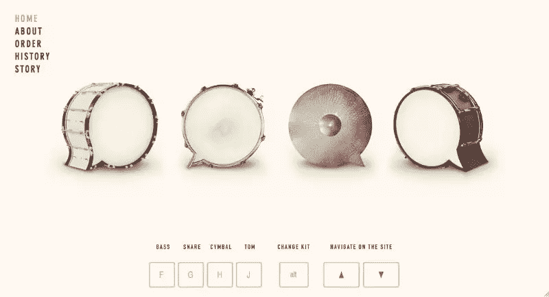

<small>来源: [Beatbox 学院](http://www.beatboxacademy.ca/)</small>

HTML5、CSS、Javascript 和 jQuery 的进步现在允许更全面的交互，[这实际上促进了业务](http://news.psu.edu/story/352874/2015/04/14/research/interactivity-tools-can-boost-persuasiveness-websites)。这一趋势源于以下方面的增长:

*   -可以点击(或滑动)的元素
*   -推送通知
*   -个性化工具的使用(如地理定位)
*   -对披露内容的控制
*   -滚动导航
*   -转换和循环功能

这一年还出现了更多的微互动，例如，当你发送电子邮件时会发出叮的声音，或者是一个动画来吸引人们对新通知的注意。

### 技巧

*   意符绕过解释事物如何工作，使互动更容易。想想一个标有“菜单”的汉堡图标如何传达一个拉出菜单，或者一个播放按钮如何传达一个可点击的视频。
*   为了更好地理解用户如何交互以及他们期望什么，尝试在用户和界面之间进行[角色扮演，其中一个人实际上代表了未来的网站。](http://uxmas.com/2012/ux-design-role-playing-and-micromoments)

### 免费资源

*   交互设计最佳实践第 1 卷–基于 33 个案例研究的 109 页免费指南，教授永恒的 IxD 技术。
*   [2016 IxD Awards](http://awards.ixda.org/entries/)——互动奖评选出的 IxD 最佳奖项，这是一个激发灵感和新想法的好资源。
*   [创造和打破 UX 最佳实践](http://www.uxbooth.com/articles/making-and-breaking-ux-best-practices/)–UX·布斯关于 UX 设计的根源和实践背后的理念的指导方针。

## 10.卡片布局

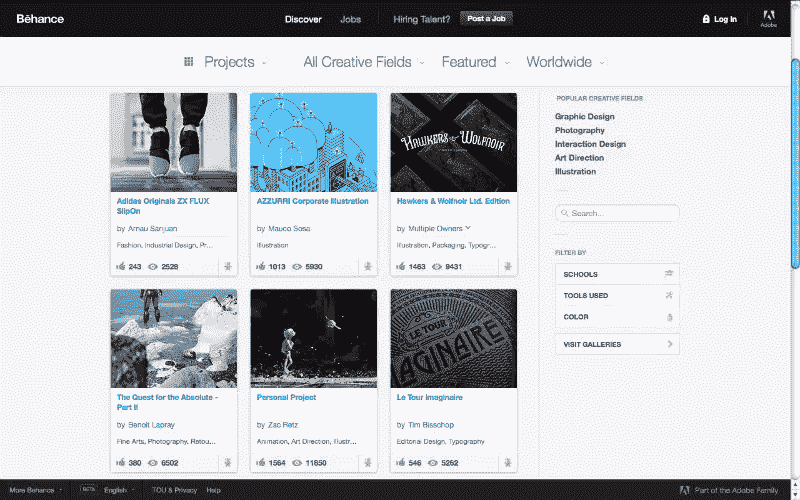

<small>来源:[行为](https://www.behance.net/)</small>

排在前十位的是另一个适应移动设备的趋势。

卡片布局允许网站和应用程序以整洁有序的方式显示丰富的内容，这使得它们非常适合浏览，尤其是在链接到外部网站时。由于行和列可以自动重新排列以适应不同的屏幕尺寸，这种布局非常适合响应式设计。

### 技巧

*   整个卡片应该是可点击的，而不仅仅是图片或文本链接。费茨定律指出，这使得互动更容易。
*   卡片之间的负空间，称为“空白”，应该明确定义。不要让用户去猜测边界。

### 免费资源

*   [如何用 Sketch App 建立卡片界面 3](http://designmodo.com/card-interface-sketch-3/)——如何用 Sketch(一款后起之秀的设计 App)制作简单卡片的教程。
*   [10 张 CSS 和 HTML 格式的网页材料设计卡片](http://materialdesignblog.com/10-material-design-cards-for-web-in-css-html/)——谷歌材料设计卡片设计资源。
*   [设计手法:卡片&极简主义](http://studio.uxpin.com/ebooks/web-ui-design-techniques-cards-minimalism/)——免费指导教学卡片 UI &基于 43 个案例研究的极简主义手法。

## 外卖食品

更重要的是，你要根据用户的需求来应用潮流，而不是追求时髦。并非所有这些趋势都适用于每个网站，所以总是从用户开始。

如果你想了解更多，免费的 185 页指南【2015 年& 2016 年网页设计趋势详细阐述了这 10 种技术，有更多的最佳实践和 100 个免费资源的精选链接。

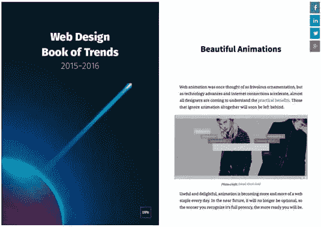

阅读如何应用这些趋势，然后查看来自谷歌、苹果、Dropbox、Spotify、宝马、范思哲、锐步、阿迪达斯等家居网站的 160 多个例子。

## 分享这篇文章