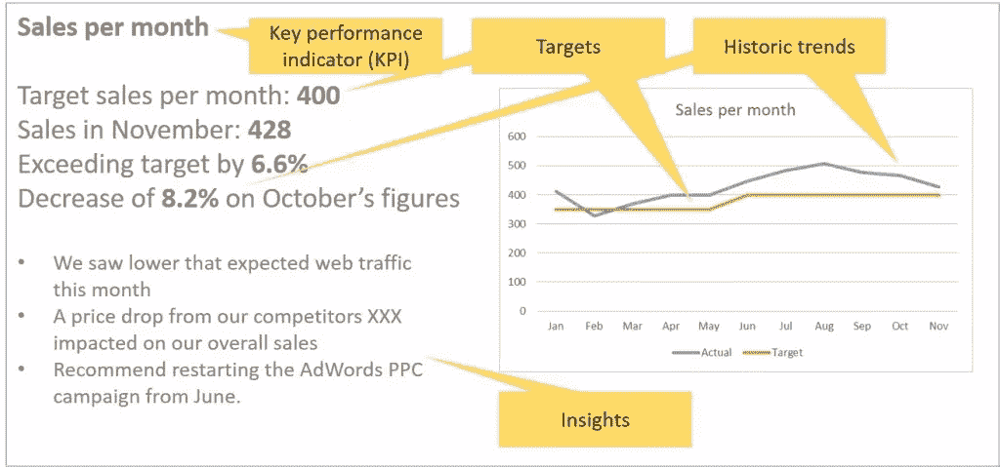

# 创建有效商业报告的初学者指南

> 原文：<https://www.sitepoint.com/the-beginners-guide-to-creating-effective-business-reports/>

作为自由职业者、小企业主或企业家，你每周都要做出重要的商业决策。你需要决定什么时候招聘新员工，是否要改变服务的价格，如何改进你的网站，以及下一步在哪里投资。

为了做出好的决策，你需要在正确的时间以正确的方式提供正确的信息。简而言之，你需要好的报道。

> “测量是控制并最终改进的第一步。如果你不能衡量一件事，你就不能理解它。如果你不能理解它，你就不能控制它。如果你不能控制它，你就不能改善它。”—[h·詹姆斯·哈林顿](http://www.harrington-institute.com/)

## 报告到底是什么？

报告收集了重要的信息，使其易于理解，并让你根据这些信息做出明智的商业决策。

不要关机或换页。我在这里让你知道为什么报告是重要的，如何创建有用的报告，以及你应该用它们做什么。等我完成后，你将成为一名报告专家，能够获得你需要的信息，了解你的业务进展情况，并做出直接有助于你的业务成功的决策。真的。

我知道，因为我看到了优秀的报告是如何帮助企业转型的。作为一名(前)报告经理，现在是一名自由撰稿人和小企业主，我分析了数据并撰写了报告，用它们来获得高管的决策，并改变了我自己的业务方向。这并不总是一帆风顺的，更困难的领域之一是说服他人为什么报告是重要的。

这就是为什么我们要处理一些关于报告的常见误解。

## “我认为报告很无聊”

我听到了。的确，报告经常会变成壁纸——一页又一页的图表、趋势线、饼状图等等——装饰经理的墙壁。人们花了几个小时来创造这些庞然大物，只是为了看一眼就把它们扔进“咩”的废纸篓。

不一定要这样。我不是说一份报告会让你肾上腺素激增，但是当你专注于真正重要的事情(成功)时，这份报告会帮助你做出正确的决定，发展你的业务，服务你的客户，并把钱存入银行。

换句话说，虽然许多报告是背景噪音，但是您将要创建的报告将使您能够做正确的事情。

## “我喜欢根据直觉做出决定”

我们都是。这是真的，有时直觉是正确的，但有时却不是。有很多纯粹凭直觉做出的决定导致了企业的失败。错误时间的想法，对不存在的市场的信念，开发错误的产品和服务。

直觉确实在决策中有一席之地，但要在正确的背景下。事实上，直觉往往来自我们的经历，基于我们每天看到的信息。我们的大脑获取这些信息，对其进行处理，并创建一条“基线”，我们下意识地根据这条基线来判断事物。当你凭直觉行事时，你实际上是在综合运用经验、信息和观点来做出决定。

报告是在这个过程中加入一些规则的一种方式。一份好的报告给你最新的信息，不被其他任何东西过滤，让你做出明智的选择。最好的决定是由信息和直觉引导的，而报告影响这两个领域。

## “我没有时间创建报告”

所以你没有时间来帮助你的生意更成功？如果你真的认为你没有时间，考虑一下这个——报告让你:

*   看看你的生意每天是怎么做的。
*   在出现问题时获得早期警告。
*   看看你把钱花在哪里了。
*   了解你的业务是如何增长的(或者不是)。
*   还有更多。

所有这些领域对于成功都是必不可少的，随着报告变得更快更容易，现在的一些努力将在未来带来回报。

为什么报告很重要？总而言之，你需要报告，这样你才能做出更好的商业决策。

## 为什么报告会变成壁纸

我们不要自欺欺人了。报告不是万能的灵丹妙药，可以解决所有的商业问题。在我们开始研究什么是好的报告之前，让我们来探究一下人们不喜欢报告的原因。不良报告的特征包括:

*   “按原样”呈现原始数据，不给出上下文。
*   提供了太多的数据。
*   过长。
*   不允许你一眼就看到你需要做什么。
*   使用图表和图形时，很少考虑它们所显示的内容。
*   提供错误时期的历史趋势。

糟糕的报告实际上模糊了你需要的数据，使你更难做出正确的决定。这也是它们经常成为壁纸的原因。

这里有一个例子——当我管理我们的报告区域时，我们一个月产生大约 20 份不同的报告，并分发给不同的高管和经理。我们没有得到太多关于这些报告的反馈，甚至在我们反复要求之后。所以，我尝试了一个实验。

每个月，我们都会制作报告，但是我们每个月减少了五份，而且没有告诉任何人。没有人注意到，直到上个月，当我们开始得到查询。结果呢？我们将每月报告从 20 份减少到 4 份，然后我们让这些报告变得令人惊叹。

## 你需要遵守这些基本规则

得体的报道需要正确的方法。这意味着改变你对报告能做什么、如何做以及为什么你首先需要这些信息的想法。这些常识性的最佳实践将为您打下坚实的基础。它们是:

*   围绕您的决策设计报告，而不是相反。
*   确保你能根据报告中的信息采取行动。
*   将报告中的信息保持在现实的最低限度。
*   使用高质量的数据。
*   以正确的方式呈现信息。
*   不要试图让一个报告做所有的事情。
*   决定你报告的频率。

### 根据您需要做出的决策设计报告

“仅仅因为”在报告中包含一些东西是一种诱惑。事实上，人们经常创建完整的报告“只是因为”不出所料，这些报告会被直接扔进垃圾桶。这就是为什么创建一份像样的报告的最佳方式是问这样一个问题:

我在工作中需要做出的最重要的常规决策是什么？

一旦你回答了这个问题，设计报告给你信息来帮助你做决定。换句话说，根据您的业务需求进行报告。仅仅这一条，简单的规则本身就能让世界摆脱如此多的不良报道！一份报告应该被设计成能让你洞察你业务的特定领域。

> “如果衡量指标真的很重要，那是因为它肯定对决策和行为产生了一些可以想象的影响。如果我们不能确定一个决策会受到提议的度量的影响，以及它会如何改变这些决策，那么这个度量就是没有价值的”“[道格拉斯·w·哈伯德](http://www.hubbardresearch.com/about/)

### 确保你能根据报告中的信息采取行动

有什么更翔实的？

*   3 月事件数:28 起，4 月:33 起
*   4 月份，客户事件增加了 18%

第二颗子弹实际上是吸引你眼球的东西，让你想到“我需要做些什么。”这被称为拥有可操作的信息，而不仅仅是原始数据。换句话说，让你注意的不仅仅是数字，还有这些数字是如何呈现的。

任何阅读数字列表的人都知道数字盲和无聊是如何迅速产生的。通过报道真正重要的东西，并以有意义的方式呈现来避免这种情况。这通常包括比较和展示事物是如何变化的。

### 将报告中的信息保持在可行的最低限度

人们在报告中犯的一个主要错误是包含了太多的数据，而你只需要看到重要的东西。这就是为什么我是“例外报道”的忠实粉丝换句话说，当我设定的目标或上个月的数据发生重大变化时，告诉我。否则，不要表现出来。

好的报告确实是关于“少即是多”——如果你有更少的分散你注意力的其他事实和数字，就更容易采取行动。当你写报告时，一定要冷酷无情。如果它不能帮你做决定，或者没有分享任何有用的东西，那就删掉它。

### 为您的报告使用高质量的数据源

一份报告的好坏取决于它所分享的信息。你需要确保你使用的数据是准确的。有几种方法可以做到这一点:

*   随着时间的推移跟踪数据，看看数据中的趋势是否反映了您自己的见解
*   通过多个来源核实数据
*   与你信任的人分享这些报告，并问“这有意义吗？”

最终，要做出自信的商业决策，你需要相信影响这些决策的数据。一点点验证就能帮上大忙。

### 以正确的方式呈现信息

有成千上万种不同的方式来呈现信息——文本、数字、颜色、笑脸、条形图、饼图、三维图表、气泡。如果你能以某种方式呈现信息，我保证有人曾试图以这种方式报道信息。这并不意味着这是个好主意！

保持事情简单。吸引注意力的应该是信息本身，而不是围绕它的所有漂亮的设计。当你在看一份报告时，想一想:“我可以通过浏览五秒钟来了解我需要从报告的这一部分学到什么吗？”如果答案是否定的，你需要简化设计。

无论如何，使用设计元素来突出和强调数据。例如，如果某样东西低于目标值，你可以把它涂成红色，如果高于目标值，就涂成绿色。你的陈述应该增强报告中的信息，而不是妨碍它。

### 不要试图让一个报告做所有的事情

我经常看到的一个错误是，在一个地方呈现来自各种不相关领域的信息。他们可能会将盈亏与员工流动和产品开发结合起来。不幸的是，这造成了冗长的报告，也降低了报告的价值。

原因很简单——我们喜欢一次专注于一个特定的信息领域。这意味着，如果我们关注财务数据，我们会接受其他财务数据，并以正确的心态做出财务决策。如果我们看到的信息类型发生了变化，我们必须重新校准。

因此，让你的报告专注于特定类型的信息。在您展示的信息和要使用的正确报告之间找到适当的平衡。

### 决定你阅读或创建报告的频率

您应该多久生成一次报告？答案是足够经常地产生有用信息，但不要经常让它们变得令人不知所措。您还需要考虑需要多快做出决策，以及如何适应报告频率。一个好的经验法则是每月做一份报告，看看这对你有什么作用，并相应地调整你报告的频率。

现在我们已经看了基本规则，让我们来探索每份报告的基本要素。

## 每份好报告的五个基本部分

好的报告有五个基本要素——请耐心听我说，我们开始讨论“关键绩效指标”(KPI)、来源、目标、趋势和见解。我保证，这是值得的。

### 关键绩效指标(KPI)

**它们是什么:**它们是你追踪的数据点，告诉你你的企业正在发生什么:

*   **关键** —对理解正在发生的事情至关重要。
*   **性能**——给你讲一个随时间推移的故事。
*   指标(Indicator)—衡量正在发生的事情的影响的一种方式。

如何使用它们:它们是你展示的真实事实和数字，是帮助你做出决策的统计数据和信息。

以下是几个 KPI 示例:

*   上个月注册的客户数量。
*   上个月的总销售额。
*   客户流失率。
*   银行里的钱数。
*   上个月的利润和损失。

### 数据源

**它们是什么:**您用来为报告提供信息和 KPI 的数据源。

**如何使用它们:**您从数据源中获取信息，并使用这些信息得出您的 KPI。

数据源的示例:

*   谷歌分析和网站管理员工具(网站使用和搜索结果)
*   银行余额、收入和支出(损益、支出、跑道)
*   营销数据(营销投资回报率和绩效)

### 目标

**它们是什么:**你为自己的企业设定的目标，用数字表示。它们是你希望你的 KPI 成为的样子，你的 KPI 越接近它们越好。

**如何使用:**你的报告根据你的目标对你的 KPI 表现进行评分，并显示它们超出或低于目标多少(这通常被称为“差异”)。

目标示例:

*   上个月注册的客户数量超过 100。
*   上个月的总销售额> 25，000 美元。
*   客户流失率< 8%。
*   银行存款超过 100，000 美元。
*   上个月的损益> 10，000 美元。

### 趋势

**它们是什么:**趋势显示 KPI 在一段时间内的表现，并将现在发生的情况与过去发生的情况进行比较。

如何使用它们:趋势是某一时刻的快照。它让你知道事情是保持不变，还是变得更好或更坏。

趋势示例:

*   每个月都有客户注册。
*   2016 年 6 月与 2015 年 6 月的总销售额。
*   第二季度与第一季度相比的客户流失率。
*   去年银行里的存款。

### 洞察力

**它们是什么:**洞察力是你通过查看报告中的信息而收集到的有用信息的关键部分。

**如何使用它们:**洞察力提供背景和理解。它们通常是从你看到的信息中推断出来的，帮助你做出商业决策。

见解示例:

*   由于我们的 AdWords 营销活动，7 月份我们多了 12%的客户注册。
*   由于来自 xxx 的竞争加剧，二月份的总销售额比一月份下降了 6%。
*   由于购买了额外的服务器基础设施，9 月份银行存款额又减少了 3，000 美元。

### 概述

**KPI**是你实际测量的。

数据源是你获取信息的地方。

**目标**是你想要达到的数字。

趋势向你展示随着时间的推移会发生什么。

洞察力给你可以采取行动的信息。

为了更好地理解这一点，下面是它在实际报告中的样子。

## 构建您的报告

既然我们已经介绍了报告的基本规则和关键组成部分，让我们一起来看看。这是为您的企业创建报告时需要遵循的流程。

1.  思考你希望得到答案的问题和你需要做出的决定。您需要深入了解企业的哪些方面？这是报告的中心主题，决定了你要包含的其他内容。
2.  决定你将在报告中使用的关键绩效指标。确立你想要展示的信息，这将有助于你做出决策。
3.  **寻找高质量的数据源。**您获取的数据就是您将在每个 KPI 中显示的内容。
4.  使用正确的趋势时间框架。确定显示每个 KPI 历史数据的最佳时间段。
5.  **为每个关键绩效指标设定切实可行的目标。**思考你需要企业达到的目标，并确保这些目标在你的目标数字中得到体现。
6.  **思考见解。**你的每个 KPI、趋势和目标都将为你创造洞察力。一定要在报告中捕捉到它们。
7.  **创建一个原型报告。**您已经获得了所需的所有信息，现在是时候创建一个将所有信息整合在一起的原型报告了。
8.  查看并修改你的原型报告。确保你有足够的信息来做决定(不要更多)，检查你是否以最好的方式呈现信息。
9.  决定你多久写一次报告。
10.  利用你的报告做决定。这是当初举报的点。

仅此而已。这就是你如何建立一个报告，以帮助你对你的业务作出决定。遵循这些步骤，您将创建重点突出、易于阅读、有用的报告，为您提供所需的洞察力。

## 商业报告的类型

现在我们知道了报告的原则和如何创建重复，让我们来研究一下在典型业务中使用的几种不同类型的报告。对于每一项，我们都将关注:

*   **用途:**快速描述报告及其用途。
*   **KPI:**这种类型的报告通常跟踪 KPI。
*   **数据源:**为报告获取数据的好地方。
*   **目标:**您想要设置的目标类型。
*   **决策:**报告如何推动你的业务决策。

请注意，所有这些报告和区域都是建议——接受并调整它们，使它们适合您的业务。

### 损益报告

用途:显示你在一段时间内有多少资金进出你的企业。

**KPI:**进入你企业的资金总额、收入类别、流出你企业的资金、支出类别。

**数据来源:**会计、开票、费用软件；银行账户。

**目标:**出去的钱少于进来的钱。

决策:了解你从哪里得到钱，你把钱花在哪里；加强费用控制；拓展收入类型；检查你有足够的钱进来。

### 资产负债表报告

**用途:**显示企业在特定时间点拥有和欠下的资产。

**KPIs:** 资产——企业拥有的东西，包括实物资产和现金；负债——你的企业欠别人的任何东西；留存利润——企业中的钱。

**数据来源:**会计、开票、费用软件；银行账户。

**目标:**手头有足够的现金满足当前和未来的负债。

**决策:**了解你的现金流，寻找增加现金流的选择，再融资。

### 跑道和燃烧率报告

**用途:**显示一个企业还剩下多少时间(跑道)来产生利润，取决于企业花钱的速度(烧钱率)。

**KPI:**企业可用的资金总额；钱花在哪里；花费了多少；它花得有多快；盈利的剩余时间。

**数据来源:**银行账户、损益报表、资产负债表报表、费用报表。

**目标:**在公司资金耗尽之前，还有一段合理的时间。

**决策:**哪些盈利活动需要优先考虑；控制可自由支配的费用；向投资者报告。

### 详细的费用报告

用途:深入了解你花钱的地方。

**关键绩效指标:**费用类别和类型。

**数据来源:**会计、开票、费用软件；人力资源报告(员工成本)；资本/项目成本。

目标:将开支控制在预定的限度内。

决策:了解在哪里以及如何控制可自由支配的支出。

### 销售渠道报告

**目的:**了解你的销售收入、销售渠道和周期。

**KPI:**销售数量；销售额；在销售周期中的位置。

**数据来源:**客户关系管理(CRM)系统。

**目标:**整个销售渠道的健康平衡。

**决策:**关注销售渠道中的“退出”率；为营销策略和活动提供信息。

### 营销投资回报(ROI)报告

**目的:**了解你的营销效果。

关键绩效指标:你在营销活动上花了多少钱；结果是你获得的客户数量和价值；转化率。

**数据来源:**营销活动、销售渠道报告。

**目标:**期望的投资回报(在营销上每花一美元，你在销售/利润上看到了什么？).

**决策:**尝试和提炼不同类型的营销，以实现利润最大化。

### 关键词报告

**目的:**了解关键词在搜索中的表现。

**关键绩效指标:**某些关键词收到的频率、位置、印象和点击。

**数据来源:**站长工具/搜索控制台，其他关键词分析工具。

**目标:**改善搜索定位、印象和点击。

**决策:**专注于搜索引擎优化和其他网站推广。

### 网站使用报告

**目的:**了解你的受众如何找到并使用你的商业网站。

**KPI:**Google Analytics 或其他分析工具的关键部分。

**数据来源:** Google Analytics 或其他分析工具。

**目标:**提高网站参与度，增加网站停留时间，降低跳出率。

**决策:**改变你的网站，以提高保留率和销售额。

### 客户服务报告

**目的:**了解你的现有客户是如何被对待的。

**KPI:**问题数量；响应时间；固定汇率；顾客投诉。

**数据来源:**客服举报软件。

**目标:**减少响应时间和投诉；总体问题更少。

**决策:**改进客户服务流程。

这只是您可以创建的报告类型的一小部分。这就是为什么基于决策和洞察力的报告是至关重要的，而不是仅仅因为你可以而产生它们。

## 高级技术、提示和技巧

现在您知道了为什么需要报告，如何创建它们，以及它们应该显示什么。这里有一些提示、技巧和建议，可以让你的报告更加完美。

### 报告自动化

将报告放在一起可能需要大量的手工工作。幸运的是，有很多工具和技术可以让报告变得更容易。有了这些工具，你只需告诉软件你需要什么，给它各种输入，告诉它你希望信息如何显示，设置一些其他配置，让它做自己的事情。

像 [Datorama](http://datorama.com/) 、 [E-Tabs](http://www.e-tabs.com/) 、[适应性规划](http://www.adaptiveinsights.com/)、[数据准确性](http://www.dataccuity.com/)、 [Zoho Reports](https://www.zoho.com/reports/) 等服务让你收集和报告来自许多不同来源的数据。

### 报告仪表板

报告仪表板正成为显示重要信息的流行方式。它们设计在一个显示屏上，可以收集整个企业的数据，并在一个地方报告所有数据。如果您需要即时信息，这可能会很有用。

[Geckoboard](https://www.geckoboard.com/) 、 [LogiAnalytics](http://www.logianalytics.com/) 和 [iDashboards](http://www.idashboards.com/) 是这个领域的热门提供商。

### 例外报告

有时候，你只需要知道什么时候出了问题(例如，违反了你的一个目标。)把这当成一个“没有消息就是好消息”的报道学派。我称之为“异常报告”，或者换句话说，告诉我什么时候需要注意什么。当您知道您想要达到的目标，并且有足够的历史数据来查看您达到这些目标的频率时，例外报告最有效。

诸如 if TTT T1 和 T2 Zapier T3 等服务与其他应用程序进行了许多集成，它们可以让你知道某个事件是否发生。

### 优化您的数据和目标

报告不应该是静态的。随着业务的发展，你的决策也会改变。这意味着你应该定期检查你的报告。他们仍然显示正确的 KPI 吗？你的目标变了吗？你需要不同类型的洞察力吗？所有的数据还有用吗？请记住，你正试图最有效地利用你的时间，所以确保你的报告让你做到这一点。

## 报告的结果

在这篇报道指南的最后，我想谈谈你会从中获得什么。除了让您做出明智的决策，报告还能做另一件重要的事情:

它向你展示了你的决定的结果。

比如你想开始一个新的营销活动，因为你的销售额在下降。你对你的营销做了一些分析，做了一些广告，结果看到你的销售渠道增加了。你会在你的报告中看到所有这些。这是一种理解你所采取的行动如何推动商业成功的方式。

这是思考报告的一种重要方式。虽然它们展示了过去的信息，但是你现在所做的决定将会改善明天的事情。你可以直接将你的选择与你事业的成功联系起来。随着业务的持续增长，这将让您更有信心做出明智的决策。

我希望你已经发现这个报道指南是有用的，并且我已经让你相信报道不一定是“你必须做的事情”相反，它是一个非常有用的工具，可以帮助您获取所需的信息，做出正确的决策，并最终让您的业务蒸蒸日上。

## 分享这篇文章