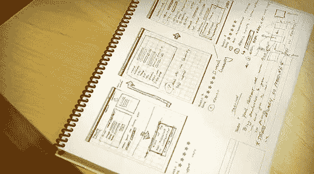

# 设计过程

> 原文：<https://www.sitepoint.com/the-design-process/>

如果你要我设计一座桥，我会有很多问题。它会跨越你前院的沟渠还是庞恰特雷恩湖？我可以使用混凝土和钢材吗，或者整个创作需要用牙签来构建吗？在进一步了解你是谁以及为什么你认为你需要它之前，我当然不会在酒吧里拿着你的名片并向你许诺金门大桥。另一方面，如果你委托我为你的花园创作一个雕塑，我可能会觉得创作一个独特的艺术作品更舒服。

设计网站的过程介于造桥和雕塑之间。是的，我们想创建一个美观的个人网站，但我们的首要任务应该是满足客户的需求。这些需求可能是崇高的和复杂的，或者它们可能仅仅是关于提供信息。但是，如果我们没有认真倾听，整个项目就会连同我们的声誉一起垮掉。开发、托管和维护网站或应用程序的技术细节可以是技术性的。然而，创建一个*设计公司*的过程可以归结为三个关键任务:**发现**、**探索**和**实施**。

什么是比较？——comp 这个词是短语“综合假人”的缩写，这个术语来自印刷设计领域。这是在版面付印之前创建的印刷版面的完整模拟。在把这个术语翻译成网页设计时，排版是在我们开始用 <acronym title="HyperText Markup Language">HTML</acronym> 制作设计原型之前创建的布局图像。把它当成一个模型。

## 发现

设计过程的发现部分是关于会见客户和了解他们做什么。这可能感觉有点*不像*的设计，但是收集关于你的客户是谁以及他们如何经营他们的业务的信息对于提出一个适当和有效的设计是至关重要的。

在你安排与客户的第一次会面之前，花些时间研究他们的业务。如果他们让你设计一个网站，他们可能目前还没有，但还是要谷歌一下。如果你找不到任何关于他们业务的具体信息，在第一次见面之前，尽可能多地了解他们的行业。只要有可能，与客户的第一次会面应该亲自进行。有时，距离会决定会议必须通过电话进行；但是，如果客户在城里，安排一个时间见面。

请记住，这个会议更多的是关于沟通，建立客户想要的东西，而不是给客户留下深刻印象，推销你自己，或者推销一个网站。试着多听少说，带一个可以做笔记的便笺簿。如果你带了一台笔记本电脑或平板电脑来谈论网站实例，限制使用它的时间。电脑有屏幕，人往往会盯着屏幕看；因此，如果客户没有一直盯着屏幕，你也会一直盯着屏幕写笔记。如果你必须在会议中引入一些技术，使用类似 iPhone 的 iTalk Recorder 或 Android 设备的 Voice Recorder 这样的应用程序来记录你的对话——当然，要征得客户的同意。然而，以我的经验来看，对于通常不太懂技术的客户来说，一沓纸不那么具有威胁性，也不那么容易分散他们的注意力。

哦，记住:客户会议不一定要在办公室举行。甚至当我在一个大办公室里为一家公司工作时，我的一些最有成效的客户会议都是在咖啡馆或午餐时进行的。这种方法的可行性取决于客户。如果你的联系人似乎更正式的业务类型，不建议这样做；然而，在很多情况下，这是一个让商务会议更加私人化的好方法。

以下是我在初次与客户会面时喜欢问的几个问题，即使我已经通过搜索引擎找到了答案:

*   公司是做什么的？
*   你在公司的角色是什么？
*   公司有现有的标志或品牌吗？你开发网站的目标是什么？
*   你希望在网上提供什么信息？
*   谁是你的目标受众？它的成员有共同的人口统计学特征吗，比如年龄，性别，或者地理位置？
*   你的竞争对手是谁，他们有网站吗？
*   你有喜欢或不喜欢的网站的例子吗？
*   你对这个项目有什么样的时间表，预算是多少？

如果项目是重新设计一个现有的网站，我还想问:

*   当你的访问者来到你的网站时，他们通常在寻找什么？
*   你现在的设计有什么问题？
*   你希望通过重新设计达到什么目的？
*   当前网站中有你想保留的元素吗？
*   你认为你的访问者对新的网站设计会有什么反应？

有时候，我会从比这里列出的更多的问题开始。发挥你的想象力，尝试想出一些有创意的问题，这些问题将真正让你更深入地了解客户的组织。如果你是程序员，避免使用技术术语。如果你是一名设计师，避免专门谈论设计。当然，这可能是你所想的全部，但是语义标记、流动的和固定的布局以及配色方案对客户来说可能意义不大。更糟糕的是，在你有机会开始思考设计之前，这种类型的对话可能会给你带来错误的设计意见。

## 探测

设计过程的下一个阶段是把你从客户那里学到的信息带回你的实验室进行分析、剖析和实验。你想掌握他们所提供的所有信息、产品和服务，并考虑如何安排它们。设身处地为网站访问者着想，问问自己这些人在寻找什么。如果你正在考虑购买一件产品，在购买之前你需要知道什么？如果您注册了一项服务，您将从哪里了解不同的产品和您需要的服务级别？页面 *x* 最清晰的标题是什么，到达页面 *y* 需要多少步？

在网页设计的世界里，这是一个被称为*信息架构*，或者简称为 <acronym title="Information Architecture">IA</acronym> 的过程的开始。对于庞大的网站和复杂的 web 应用程序，信息架构本身就是一个职业，但是这个领域的指导原则甚至可以为最小的网站提供一个坚实的基础。对于我们过程的探索阶段，我们希望专注于将网站的内容和流程组织成一个我们可以围绕其进行设计的结构。

完成这项任务的两个最重要的工具是碎纸(或者白板，如果你有的话)和一大叠便利贴。列出网站的所有零碎内容，并开始将它们分成小组和子小组。这些很可能会经常移动，这就是便签纸派上用场的地方。如果您为站点的每个部分、子部分和页面做了笔记，您可以按照它们在站点导航中出现的顺序将它们排列在墙上。你会希望避免过多的选项让访问者不知所措，但是你也不想把信息埋得太深；也就是离主页点击次数太多。这项活动没有严格的规则；只要让信息尽可能的显而易见和易于获取。

## 履行

既然我们已经想好了如何组织我们正在处理的信息，那么设计流程的实施步骤就从创建布局开始。不管是什么项目，至少在开始的时候，尽量避免陷入与网站建设相关的技术中。在这一点上，网站是包含直接的 <acronym title="HyperText Markup Language">HTML</acronym> ，内容管理系统的模板，还是 Ruby on Rails 应用程序并不重要；底线是，我们有一个界面设计和一张白纸。“纸？”没错，纸。你真的认为我会让你回到你的宝贝电脑前吗？不会吧。原因如下:如果你开始在电脑前思考布局，很容易失去对设计的关注。如果你从纸上开始，你可以忽略浏览器和 <acronym title="Cascading Style Sheets">CSS</acronym> 的技术限制，专注于你想要的最终产品。现在你可能会认为，所有优秀的设计师都带着精美的精装速写本，用昂贵的马克笔和画笔来设计达芬奇式的潜在网页布局。对我来说，我用一个 79 美分的螺旋装订的笔记本和任何我能在桌子上找到的还能用的书写工具。

*图 1，众多可供版面速写的速写本之一(此本出自[webdesign-sketchbook.com](http://webdesign-sketchbook.com/))。普通纸也很好用。*

我先画出一些可能的布局。在我制作了一些之后，我决定选一个我喜欢的，跳进 Photoshop，用矩形工具把我在纸上标出的区域画出来。一旦我定义了我的布局，我会尝试前景色和背景色，直到我有了一个纯色方案。我继续旋转 Photoshop 的旋钮，推动像素，直到最后，神奇地，我有一个样本给客户看。

简单吧？好吧，也许我在简短的描述中跳过了一些步骤。老实说，当人们问我如何做我的工作时，他们通常会得到类似的解释。事实是，从我过去的经历和那些旧的大学设计和艺术课程中，有很多现在是潜意识的信息帮助我定义自己的设计过程。

学习如何设计就像学习如何编程。有些人有一点诀窍，但任何人都可以学习。正如有好的代码和难看的代码一样，也有好的设计和难看的设计。学习一些与设计相关的原则和惯例将有助于你理解好、坏、丑之间的区别，推动你建立自己的设计流程。

## 美丽网页设计的原则

这篇文章来自杰森·比厄德的 [*美丽网页设计的原则*一书](https://www.sitepoint.com/books/design2/ "SitePoint.com: The Principles of Beautiful Web Design, 2nd Edition")(第二版现已出版)。这实际上是第一章的开始，我们将很快继续，因为它检查布局和组成。

如果你喜欢色彩，请务必查看设计节上[色彩章节的现有数字化版本。](https://www.sitepoint.com/design-ux/color/ "DesignFestival.com: Everything on Color")

## 分享这篇文章