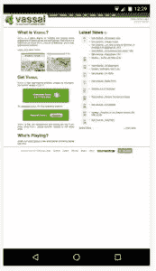
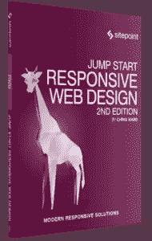

# 响应式网页设计的意义和目的

> 原文：<https://www.sitepoint.com/the-meaning-and-purpose-of-responsive-web-design/>

以下是我们新书的独家摘录，[快速响应网页设计，第二版](https://www.sitepoint.com/premium/books/responsive2/)，作者克里斯·沃德。世界各地的商店都有出售，或者你可以在这里买到电子书。

过去这很简单:你可以为 15 英寸的显示器设计一个网站或应用程序，并且——抛开浏览器之间的不兼容性——你就完成了。

然后带网络浏览器的手机出现了，毁了我们轻松的生活。最糟糕的是，人们喜欢在上面浏览网页！2016 年，在移动设备上浏览网页[首次超过了桌面浏览](https://www.sitepoint.com/browser-trends-december-2016-mobile-overtakes-desktop/)。

就在开发人员和设计师习惯于为手机建立网站的时候，平板电脑、手表、电视、汽车、眼镜、更大的桌面屏幕、高分辨率屏幕，甚至内置于墙壁的网络浏览器也出现了。(好吧，最后一个是我编的。)支持这种似乎永无止境的新设备正变得越来越具有挑战性。

那么，我们如何支持这些不断增长的设备呢？答案是*响应式网页设计*，它利用技术让网站适应各种尺寸的屏幕。

很多旧网站，或者由没有空闲时间的人维护的项目，都没有响应。例如，附庸游戏引擎的网站:

许多其他网站，如 SitePoint.com，完全响应:

响应式网页设计(Responsive web design)(RWD)信奉流行的开发格言“不要重复自己”(通常缩写为“干”)。RWD 并没有为你想要支持的每个设备维护多个代码库，而是致力于使用一个适合每个设备的单一代码库。使用 RWD 技术，您可以编写一组 HTML、CSS 和 JavaScript，并显示适合每个平台的元素。其中许多样式和元素甚至可以重用或构建，以获得最大的代码效率。

你觉得怎么样？首先，让我们回到几年前。

## 历史

“响应式”设计并不一定是新的，这个术语对不同的人有不同的含义，这使得它的确切历史很难追溯。

理论上，自从有了不止一个浏览器，开发人员就一直在创造响应式设计。浏览器之间总是存在微妙(也不那么微妙)的渲染差异，几十年来，开发人员一直在学习如何应对这些怪癖。如果你是 web 开发的新手，你应该感谢 Internet Explorer 早期版本的统治地位已经基本结束。处理他们怪癖的日子是黑暗的。

自 2004 年以来，响应式设计已经采用了更具体的含义，即调整您的设计以适应用户选择的设备——通常基于屏幕尺寸，但也包括其他功能。响应式设计的概念固化于 2008 年，但该术语也被称为“柔性”、“液体”、“流体”和“弹性”设计。

CSS3 规范中包含了媒体查询，这充分赋予了响应式设计成为真正的、更有用的概念所需要的潜力。我们将在第 2 章中详细介绍媒体查询，但总的来说，它们允许你根据预定义的屏幕大小或类型来改变你在网页中显示的内容。Ethan Marcotte 在 2010 年的一篇文章中正式创造了术语“响应式网页设计”[。](http://alistapart.com/article/responsive-web-design)

这导致了其他技术和媒体查询技术的发展和整合，例如灵活的图像和网格，所有这些我们都将在本书中讨论。

对我来说，“响应式设计”是所有这些想法和原则的结合。这不仅仅是让设计适应屏幕尺寸，还包括其他因素，如颜色深度、媒体类型(比如笔记本电脑屏幕或电子书阅读器)或位置。

## 响应式设计中的思想流派

有多少种解释，就有多少种关于如何使用响应式设计的思想流派。有些来了又走，有些停滞不前。我们不会在本书中详细介绍，但我们会涉及它们的实际应用。现在让我们快速介绍其中的几个。

### 渐进增强

当遵循更加传统的**渐进增强**原则时，您的主要关注点是让所有用户都可以使用网站内容，无论他们的设备多么简单或连接速度有多慢。然后，为可以利用它们的设备添加额外的功能，例如更复杂的设计和功能。

### 功能退化

手机浏览的普及已经颠覆了传统的设计方式。在过去，你在你工作的平台(通常是一台电脑)上开始一个设计，然后剥离风格和功能，以支持屏幕较小或对某些功能支持较少的设备。

虽然**优雅降级**通常适用于缺乏对特定功能的浏览器支持，但你也可以更普遍地考虑它。它的原则是，你从一个功能齐全的网站版本开始，在你理想的设备和浏览器上运行，同时也确保基本功能可以在任何(受支持的)设备上为任何用户工作，即使他们错过了一些不错的功能。

### 移动优先

**Mobile first** 类似于渐进式增强，但更针对响应式设计。它建议您从支持的最小或功能最差的设备(通常是一部电话，当原则被创建时)开始，然后随着设备规模的增加添加功能和风格。

作为一个术语，“移动优先”可能会令人困惑，特别是对于非设计师/开发人员来说，这给人一种项目中优先考虑移动的扭曲印象。

从理论上讲，这种做法确保了较小的设备不会屈居第二——所有设备都受到同等重视。

## 需要支持什么？

在开始或加强任何基于网络的项目之前，重要的是要知道它是否值得，并评估你所有努力工作的(潜在)用户群。

如果你有一个现有的网站，它可能值得分析网站流量，看看你的访问者使用什么类型的设备来访问你的网站。如果 90%的访问者一直在台式机上访问，这表明要么你的移动体验很差，要么你的访问者不是移动设备的大用户。你可以着手进行广泛的研究来找出确切的答案，或者简单地使用响应式设计技术来建立一个移动友好的网站，吸引新的访问者。

如果你在做一个新项目，分析潜在用户的需求同样重要。这可以通过使用传统的市场研究技术，创建简单的测试网站，或者观察你的竞争对手来构建你的客户群。

### 计算机

尽管销量缓慢下降，但仍有大量台式电脑和笔记本电脑，以及大量运行于其上的网络浏览器。这些计算机包括从低质量(和低分辨率)的 11 英寸上网本到配有各种比例和方向的 28 英寸高分辨率显示器的高性能台式机，所有这些都会极大地影响您必须使用的屏幕区域。

### 移动电话

在手机上浏览网站的人的比例现在已经达到了桌面浏览的水平，所以迎合手机浏览器用户同样重要(而且很可能越来越重要)。要了解更多关于移动网络浏览兴起的细节，我推荐 Smart Insights 关于移动营销统计的报告和 [Statcounter 的桌面和移动使用比较](https://gs.statcounter.com/platform-market-share/desktop-mobile/worldwide/#monthly-201501-201706)。

在 iOS 上，移动浏览通常只通过一个浏览器，设备的大小也更加一致。

Android 有各种各样的浏览器和屏幕尺寸。越来越多运行移动操作系统的设备也拥有不同分辨率的高密度屏幕。

你还需要考虑到，用户主要是通过触摸而不是点击设备进行浏览，这极大地影响了用户的行为。

### 药片

平板电脑的销售可能正在萎缩，但在可预见的未来仍将有一个重要的用户群，你不应该认为平板电脑是大型手机或小型台式机。此外，用户可能使用触摸屏或鼠标与你的网站互动。

### 混合设备

如果操作电脑和平板电脑对你来说还不够，现在有混合设备，如微软的 Surface Pro，可以在电脑和平板电脑之间切换。虽然每种模式都可以单独处理，但值得注意的是，用户在使用您的网站时可能会切换上下文。

### 衣服

大多数可穿戴设备尚未配备网络浏览器，但这可能会实现。与此同时，仍有可能在可穿戴设备上重新利用你的部分内容，这些内容需要在短时间内以简单的后续行动交付。

### 电视

智能电视和苹果电视等相关设备配有简化的网络浏览器，用户通常会用它们来浏览特定的网站，但它们可能会越来越受欢迎。电视的屏幕非常大，通常分辨率很低，因此在电视上观看的网站需要足够清晰，以便正确观看，并且在远处也可以使用。

### 汽车

真的吗？是的，真的。这是一个新的领域，但现在越来越多的汽车都有仪表板，可以以某种形式接入互联网。目前，呈现在汽车仪表板上的网站需要在小屏幕上清晰地呈现信息，并且设计成不会让司机分心或不知所措，从而导致事故。然而，现在许多汽车都为乘客配备了屏幕，乘客可以更充分地访问网络和内容。

### 游戏控制台

大多数现代游戏控制台花一些时间连接到互联网，一些时间使用网络浏览器。这通常用于媒体消费和社交网络。这些设备上的浏览器可能会受到限制，并且可能没有物理键盘。对于家用游戏机，电视的设计原则将适用，对于手持设备，有限的移动体验。

总之，你不能预测任何人会在哪里以何种方式浏览你的网站，所以要把它建得适应性强、灵活、反应灵敏。

### 打印

打印？这不是网页设计书吗？是的，但是您的网页的打印版本仍然会被频繁访问，无论是实际的物理打印还是在 Instapaper 或 Pocket 等离线阅读器上呈现您的内容。对于某些内容，“打印”仍然是相关的。

我最近出版的书[Jump Start Responsive Web Design](https://www.sitepoint.com/premium/books/jump-start-responsive-web-design-2nd-edition/)，现在可以在 SitePoint 上买到。它的目的是让你开始理解和使用 CSS 和 HTML 工具套件，以应对这个新的设备世界。它非常实用，通篇有大量的例子，涵盖:

*   *响应式网页设计的意义和目的*
*   *响应式设计的构建模块*
*   *具有电网系统的更好响应结构*
*   *响应文本*
*   *响应图像和视频*
*   *响应用户上下文*

*我的书适合对 HTML 和 CSS 有了解的初级设计师和开发人员。一些 JavaScript 经验对后面的章节很有用。*

## 分享这篇文章