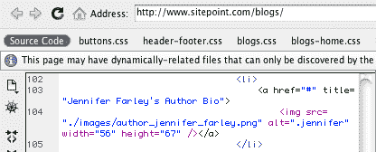
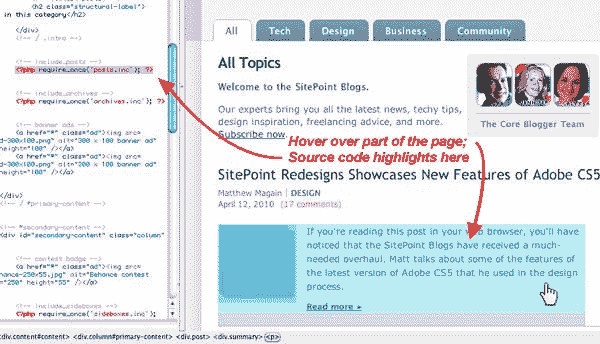

# SitePoint 博客的重新设计:一个被揭示的过程

> 原文：<https://www.sitepoint.com/the-sitepoint-blog-redesign-a-process-revealed/>

如果你正在你的网络浏览器中阅读这篇文章，你会注意到 SitePoint 博客已经有了一点改变。这次重新设计是我们试图整合所有 sitepoint.com 子网站的各种视觉风格的第一步。我们喜欢新的外观，希望你也喜欢。

## 为什么

sitepoint.com 已经运行了 11 年，每个月都有数百万的页面浏览量。因为它是以渐进的方式发展的，所以现在它服务于各种各样的用户，并且分布在各种服务器上。拥有这样一个分散的网站集合的副作用之一是，你最终会得到一个缺乏统一的现代美学的网站。现在是改变的时候了，从这些博客开始。此外，正如你在其他博客上读到的，Adobe 的最新版创意套件 [CS5 今天](http://ad.doubleclick.net/click%3Bh%3Dv8/397a/3/0/*/o%3B223901446%3B0-0%3B0%3B47357135%3B4307-300/250%3B36284667/36302545/2%3B%3B~sscs%3D%3fhttp://www.adobe.com/products/creativesuite/design?sdid=FDYAH)发布。我很幸运地得到了该套件的预发布版本，并决定在重新设计时测试一下。正如我在下面所详述的，一些新特性有助于使重新设计过程相对顺利。

**important:** The Disclaimer

环顾四周，你会发现有 Adobe CS5 套件的横幅广告。以下是最重要的免责声明:Adobe 是 SitePoint 的广告合作伙伴。正如我前面提到的，我很幸运地得到了 CS5 的预发布版本，所以你不应该把它看作是对 Dreamweaver 或 Photoshop 的独立评论。不过，我确实使用了这两种工具来重新设计 SitePoint 博客，以配合 CS5 的发布。我在这里写的是对这一过程的洞察。

## 什么

### 布局

我们博客模板最大的变化是我们转向了固定宽度的布局。传统上，sitepoint.com 一直坚持流动布局。然而，关于固定布局还是流动布局更好的争论已经持续了多年。经过深思熟虑，我们决定，对于像 sitepoint.com 这样的广告支持的内容网站，提供固定的宽度为我们提供了一个更强大的平台，以并排的方式提供广告和内容。您还会注意到，通过页面顶部的选项卡，在博客类别之间切换变得更加容易。在这里，我们可能没有打破任何新的 UX 模式，但是可以说标签很受欢迎，因为它们工作得很好——尤其是在像我们这里的博客类别这样的情况下。

### 颜色和风格

SitePoint 的品牌颜色橙色和蓝色虽然是互补色，但却是一种极具挑战性的搭配。使用太多的蓝色，你会冒创建一个冰冷无菌的界面的风险。不过，用太多的橙色，而且…嗯…我认为只有一个人能逃脱这一关。不同深浅的蓝色与明亮有力的橙色按钮相结合，达到了我们满意的平衡，并计划推广到网站的其他部分。橙色的 RSS、搜索按钮、转发、时事通讯注册和其他行动号召给蓝色的基础带来了温暖。我只是简单地谈到了我们的想法，以及我们为达到你所看到的用户界面和它所描绘的情绪所采取的步骤。我计划发表一篇后续文章，详细阐述我们是如何到达现在的位置的。

## 节目

正如我提到的，这次重新设计的模型是在 Photoshop CS5 的预发布版本中创建的，Dreamweaver CS5 在编码和设计 WordPress 模板时证明了自己是一个有价值的编辑器。

### Photoshop CS5

在设计新的博客模板时，我并没有真正利用 Photoshop CS5 中任何时髦的新东西，比如人们经常谈论的[内容感知填充](http://www.youtube.com/watch?v=NH0aEp1oDOI)或新的 3D 功能，所以我不能说我已经探索了它的全部潜力。然而，据我所知，Adobe 为这个版本的 Photoshop 增加了一大堆*功能。如果润色照片和数字绘画是你使用 Photoshop 的目的，那么有一些令人兴奋的新工具可以玩，所以一定要检查一下，以便自己决定是否值得升级。*

### Dreamweaver CS5

Dreamweaver 作为一个 HTML 和 CSS 编辑器肯定能保持自己的地位。当你浏览 WordPress 模板，或者处理一堆你不熟悉的 CSS 或 JavaScript 时(想象一下:大型团队在一个大型网站上工作)，相关文件等新功能是一个巨大的帮助。

**Dreamweaver CS5 的相关文件功能显示外部 JavaScript 文件、样式表和服务器端包含的文件。**

然而，对我个人来说，最有用的新功能是新的*检查模式*。检查模式是不言自明的。它基本上是 [Firebug](http://getfirebug.com) 的 **Inspect 元素**特性，被集成到您的代码编辑器中。要启用检查模式，只需选择`Split View`，然后点击`Inspect`按钮。然后，您可以将鼠标悬停在页面的某个区域上，您会看到源代码的相关部分变得突出显示，就像 Firebug 中的 DOM 树一样。

 **在 Dreamweaver CS5 的 Inspect 模式下，您可以将鼠标悬停在页面上的区域上；即使内容是动态生成的，相关的源代码也会突出显示！**

更酷的是，这种功能不仅限于静态文件。例如，如果你正在编写一个 WordPress 或 Drupal 主题，你仍然会发现这很有用。建立一个本地的登台服务器是可能的(这是我经常做的事情)。在 Dreamweaver 项目中配置临时服务器，您就可以检查动态生成的内容。我认为这对于 web 开发人员来说是一个非常有用的特性，对于 Dreamweaver 用户来说也是一个受欢迎的新增功能。

## 竞争

作为 Adobe 发布活动的一部分，Behance.net 正在举办一场比赛，在 5 周内每周赠送 5 份 Adobe CS5 大师作品集。sitepoint.com 重新设计的屏幕截图自豪地作为之前/之后的示例显示在竞赛页面上，同时还有其他使用 Adobe CS5 预发布版本重新设计的参赛网站。如果你有兴趣赢得一份 Adobe CS5，你绝对应该考虑参加！*非常感谢 [SitePoint 论坛](https://www.sitepoint.com/forums/)的每一个人，他们提供了反馈来帮助设计。可能有一些风格需要调整——让我们知道你对新设计的想法，如果你注意到网站上的任何古怪之处。*

## 分享这篇文章