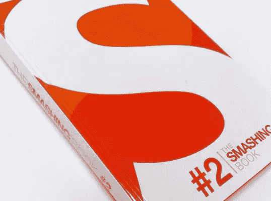
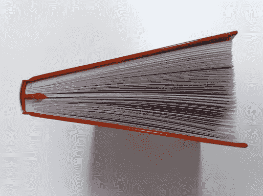
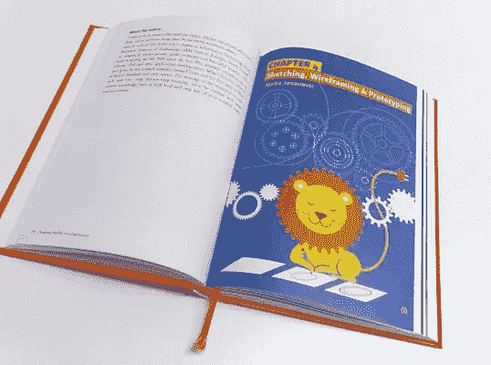
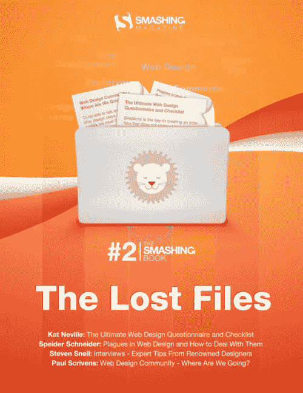
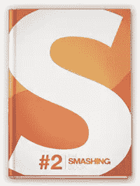

# 加入我们，赢取畅销书籍#2

> 原文：<https://www.sitepoint.com/the-smashing-book-2-a-review/>

收到我的那本[畅销书籍#2](https://shop.smashingmagazine.com/smashing-book-2-intl.html#d=smashing-book-2) 后，我想以评论的形式分享一些想法。此外，请参见下面的信息，了解如何参加抽奖以赢得五本书中的一本！

## 摘要

畅销书籍#2 是我书架上最近增加的一本书，与我最有价值的几本*作品分享空间(***印刷风格的元素*，*阿拉伯印刷*，日常事物的设计，奥莱利大量的*字体&编码*，*CSS 设计的禅*——仅举几个例子)。Smashing Magazine 的新书能和他们其他人站得住脚吗？结论:不完全是，但它有不同的目的和用途。*

 *## 进入细节

### 产品/书籍设计

#### 一个坚固的好盖子

虽然我没有我记得的平装本封面的第一本书，但我很高兴看到第二本精装书。平装书当然很好，但精装书很好地让我打开书，把它平放以供参考，而不用强行阻止它合上或书页翻过来。

#### 添加了“内置”书签

这本书还配有一个方便的亮橙色品牌彩色书签带，让你可以记下自己的位置，或者将一页或一章放在手边，以便快速参考。

#### 报纸

在翻过空白书页内的橙色和纹理橙色后，我立即注意到，正文纸的选择有一种抛光的光泽，让我想起了廉价的杂志副本——这是一种本能的联系和反应——但随后意识到这本书有大量全彩色截图和插图，解释了纸饰面的选择。虽然我喜欢丰富的，有纹理的和无光泽的纸张，但当打印全彩色图像时，光泽整理是很好的选择。

在开幕传单的说明上，在扉页之后是一个来自 Smashing 社区的名字的双页 ASCII 艺术特征。就我个人而言，这本书真的很棒。

#### 字体设计

身体是设置在 garalde 土坯 Garamond 专业设置相当松散，在一个相当大的尺寸。(我可能会选择一些不那么人性化或者老式的东西。Scala 还是 Quadraat？，还是众多优秀代工厂之一的新作？)关于排版，我只有两点意见。首先，身体被相当有限的边缘包围，特别是内侧边缘；我喜欢看到页面和它的主体被充足的页边所包围——足以让拇指放进去。最后，我注意到有一些小事情可能会受到一些印刷上的注意，例如缩写和首字母缩写的设置，它们以大写字母突出，本来可以用小写字母设置得更好。然而，最终这本书还是很有可读性的。

#### 漂亮的插图

这本书以美丽的全彩插图为特色，显著地标志着每一个新章节的开始。这件作品是由臭名昭著的推特[【失败的鲸鱼】](http://www.yiyinglu.com/?portfolio=lifting-a-dreamer-aka-twitter-fail-whale)的设计者[陆一英](http://www.yiyinglu.com/)完成的。

## 内容

所以它具有可读性和视觉吸引力，但内容经得起考验吗？回答:是的。这本书涵盖了一系列主要的设计主题；这是章节概要:

1.  Matt Ward 和 Alexander Charchar 著《伟大平面设计的原则》
2.  *可见与不可见的设计*，作者 Francisco Inchauste
3.  *设计移动用户体验*，作者 Mike Rundle
4.  Janko Jovanovic 的素描、线框和原型制作
5.  *网络开发中的危险信号*，作者克里斯蒂安·海尔曼
6.  网络排版的未来，维维安·安纳伊恩著
7.  应用于 UX 设计的游戏设计技术
8.  点击时:网页设计心理学
9.  电子商务网站的设计模式(一项研究)
10.  *如何制作一本书(像这一本)*，由 Smashing 杂志团队制作

### 介绍章节&永恒的设计

虽然书中的主题是临时安排的，但不一定有逻辑。如前所述，我没有第一本书的副本，但据我所知，第一本书特别关注编码和布局技术，而第二本书在设计和用户体验理论方面更扎实。这当然很好，但这意味着这本书需要一个好的开头介绍，并把一些东西结合在一起，这一点它做得很好。

我特别喜欢“永恒思维”的号召，这是一种对设计和设计过程的自我批评评估，以确保最终结果不会利用当前的趋势范围来满足客户的需求，而是在明年、五年后甚至遥远的未来保持可访问和有吸引力的质量。(参见《永恒的思考》，第 19 页。)

### 排版章节

是的，我承认，我看的第一章——薇薇安·安娜伊恩的那一章提供了一个关于网页排版现状的实用观点。她的文章包括该领域许多先驱和公认领袖的对话和引文精选，将为您带来 web 上字体设计的最新发展(@font-face、WOFF、托管和许可服务、开源字体设计、高级 OpenType 特性、CSS3 等等)。这一章值得称赞。

我正在看第八章，苏珊·温申克的《网页设计和用户行为心理学》。

### 免费电子书

我应该注意到还有一个[额外的 PDF 电子书，包括四个额外的章节](https://shop.smashingmagazine.com/ebook-the-lost-files-intl.html#d=ebook-the-lost-files),它们原本计划包含在内，但由于出版时未预见到的书的大小，它们被省略了，并作为额外的材料免费提供。你可以通过在 Smashing 商店注册来下载你的拷贝，从而获得价格为 0 美元的无 DRM 的 PDF。

奖金电子书包含以下章节:

*   网页设计行业的瘟疫&如何应对，施奈德
*   网页设计社区:我们要去哪里？，作者保罗·斯克里文斯
*   Kat Neville 的《终极网页设计问卷和清单》
*   史蒂文·斯内尔的访谈:来自著名设计师的专家建议

至于整本书，[将在 Smashing store](https://shop.smashingmagazine.com/smashing-book-2-intl.html#d=smashing-book-2) 独家发售，售价 29.90 美元。

## 最终评估

这本书有着广泛的设计主题和许多有用的技巧和最佳实践，当然值得一看。它比不上设计领域的模范领导者，但我认为它从来没有打算这样做；《了不起的书#2》是一本关于应用于网络的各种设计方面的坚实、漂亮和全面的书，是一个很好的入门门户，也是我们目前所处位置的参考。如果你对网页设计很认真，这是一个很好的跳板。

## 5 份才能赢！

我们很自豪能分发五本畅销书籍#2。为了赢得抽奖，请订阅 SitePoint 的高级设计简讯: **[设计视图](https://www.sitepoint.com/newsletter/ "SitePoint.com:")** 。

我们将在下一期的“设计视图”中宣布五本书的获胜者(4 月第一周，周三，6 日)，所以请务必订阅以赢取您的书。

## 分享这篇文章*