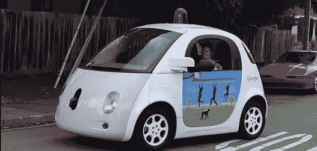

# 电车问题:我们的汽车会成为英雄吗？

> 原文：<https://www.sitepoint.com/the-trolley-problem-will-our-robot-cars-grow-up-to-be-heroes/>

明年是世界上最著名的“思想实验”之一的 50 周年纪念。它可能缺乏'[薛定谔的名猫](https://en.wikipedia.org/wiki/Schr%C3%B6dinger%27s_cat)'的流行文化冲击力，但它仍然是一个绝对引人注目的作品——它被称为'[电车问题](https://en.wikipedia.org/wiki/Trolley_problem)。

菲利帕·富特在 1967 年首次提出了这个想法，这是一个哲学问题，旨在探究你的伦理道德的软肋。此后出现了许多微妙的变化，但核心场景是这样的:

1.  想象一下，一辆失控的电车(或火车)沿着轨道冲向一组五名工人。你没有办法警告他们，如果没有某种干预，他们几乎肯定都会死。
2.  你控制着一个开关杆，它可以将小车转移到一个侧轨上，立即拯救我们的五名工人。然而，还有一个人站在那条侧道上，他现在将没有机会逃脱“飞驰的电车死亡”。

## 你会怎么做？

*   什么都不做，目睹五人死亡，但对生命损失不承担直接责任。
*   或者采取行动，拯救五条生命，却亲自导致另一个人类的死亡。

这是一个棘手的问题，没有简单或明确的正确答案。我女儿想对他们大喊大叫，让他们都走开，但那不是一个选择。

不管值不值得，大多数人选择牺牲单身者。更大的利益。

然而，最常见的变化是引入了一个新人，被不客气地称为“胖子”场景。在这个故事中，你可以选择拯救工人——尽管听起来可能很恶心——把一个身材相当匀称的男人推到迎面而来的电车前面。

不出所料，大多数人都对这个想法感到震惊。不考虑好的一面，把一个无辜的人推到火车前杀死他肯定是一个怪物的行为吗？！

当然，从严格的数学意义上来说，上面两个故事的唯一区别在于你选择了什么方法来打发这个不幸的人。杠杆当然比适时的肘击干净得多。方法重要吗？还是一切都与结果有关？

如果你不明白这个想法，哈里·谢尔——他因《辛普森一家》和《脊椎动物》而出名—[—在 2014 年为 BBC 广播 4](https://www.youtube.com/watch?v=bOpf6KcWYyw) 制作了一个很棒的视频，很好地解释了这个问题。

## 幸运的是思想实验是无害的，对吗？

当然，这都只是理论。脑力游戏。一次恶作剧的酒吧谈话，或者，最糟糕的是，一次哲学书呆子在晚宴上炫耀的机会。

不完全是。

<small>谷歌自动驾驶汽车。</small>

众所周知，世界上大多数主要汽车公司都在投资无人驾驶技术。我们知道这些系统已经比普通的人类司机更安全了。与我们不同，机器人汽车每秒钟可以扫描周围的交通数千次，并立即适应变化。

但是他们不能预测所有的事情。轮胎会发生灾难性的故障。树木不可预测地倒下。司机会癫痫发作。无人驾驶汽车偶尔也会出现在自己的“无轨电车”场景中。并且——*大概是*——软件开发人员目前正在编写决策算法来处理它们。*设定‘0’我们直行——设定‘1’我们转弯*。

这引发了一些沉重的道德问题。

*   如果你买了一辆车，你会希望它优先考虑你的安全吗？
*   是‘拯救最多人类’的纯数字游戏吗？
*   人们的年龄应该有所不同吗？或许婴儿有偏好？
*   汽车应该考虑潜在事故受害者的估计体重吗？
*   豪华轿车应该做出与经济型轿车不同的决定吗？
*   唐纳德·特朗普的车会加速吗？(jk)

软件工程师有能力处理这些棘手的伦理问题吗？这当然不是大多数计算机科学课程的一部分。也许谷歌、沃尔沃和福特需要雇佣更多的哲学家和伦理学家。

目前地球上只有几百辆自动驾驶汽车，这些问题仍然属于“思想实验”的范畴。

但 10 年后，可能会有数百万辆自动驾驶汽车每天都在做出生死抉择。事情即将变得“真实”——很快。

愿你生活在有趣的时代。

## 分享这篇文章