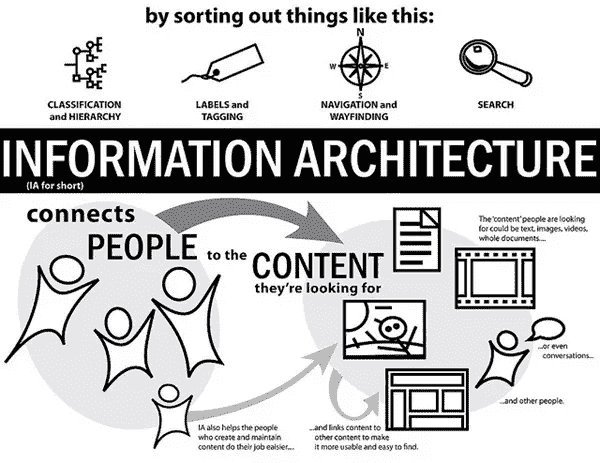

# 网页设计过程第 2 部分:信息架构

> 原文：<https://www.sitepoint.com/the-web-design-process-part-2-information-architecture/>

在昨天的帖子中，我们看到了当你设计一个网站时从哪里开始。第一步是从客户那里收集你的信息(如果你在做自己的网站，也可以从你自己那里收集)。这个过程的下一步是仔细检查、分析和组织你收集的信息。网页设计过程的这一部分属于术语“信息架构”,这篇文章给出了它是如何工作的概述。

**信息架构**

##### 信息架构由[信息架构协会](http://iainstitute.org/)定义如下:

如果你刚刚开始创建你的第一个网站，这听起来可能有点复杂。对于大型网站或信息系统，信息架构是一个完整的职业领域。但是这些原则同样适用于小型网站，也是小型网站的重要基础。

[*默多克 23*](http://www.flickr.com/photos/murdocke/4299568381/)

因此，当你开始查看从客户会议上带回的信息时，你应该对你的许多问题有了答案，现在你必须决定如何安排这些信息。你如何让人们在客户的网站上轻松找到他们想要的信息？在设计过程的这个阶段，你需要集中精力将网站的内容和流程组织成一个结构，你将围绕这个结构创建你的网站。

此时所需的工具是每个人家里都有的。一支钢笔(或铅笔)和许多纸。有些人使用便利贴或便利贴，因为它们便于携带。从你收集的信息中，将网站的各个部分逻辑地组合在一起。例如，如果客户有很多关于他们公司的信息，你可能想把它们分成几部分，比如用我们团队的子菜单把我们分成几部分，

想想需要点击多少次才能找到信息，不要把内容埋得太深。甚至在打开电脑之前，在纸上或便利贴上解决这些问题要容易得多，在这个阶段花时间找出网站的最佳流程和组织是值得的。一旦你解决了这个问题，下一步就是实施了。

在本系列的下一部分，我们将看看如何实现您的组织。

## 分享这篇文章