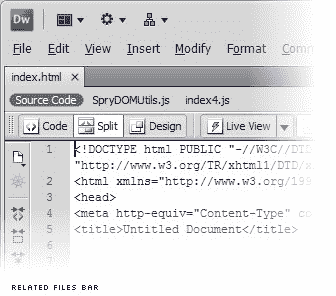
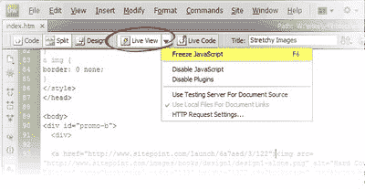
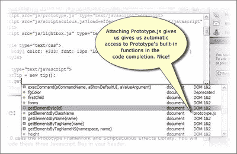
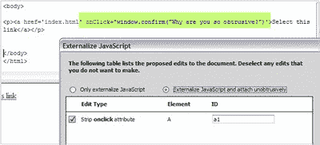

# Dreamweaver CS4 的 6 个优点

> 原文：<https://www.sitepoint.com/things-dreamweaver-cs4/>

5 … 4 … 3 … 2 … 1 … Dreamweaver CS4 开始了！
是的，Dreamweaver CS4 于 10 月 15 日星期三正式上架——并不是说我们中的许多人会从货架上购买它！


虽然我肯定有人会理所当然地升级，但我们大多数人都需要一些好的理由来掏腰包。关键问题:*用我的*血汗钱*购买 Adobe 最新的绿色巨兽能得到什么？*

##### 1)用户界面/工作流程的改进

打开新的 Dreamweaver 时，您会注意到的第一件事是 Adobe 对用户界面做了一些实质性的更改。尽管这些变化意味着长期用户需要重新定位自己，但大多数(但不是全部)变化是向好的方向发展。

除了继承了 Adobe 新外观的所有灰度外观变化之外，UI 的上半部分也得到了显著的简化。标题栏和主菜单已经合并成一个条，水平插入工具栏现在是屏幕右侧的垂直插入*面板*。

好吧。那么，这里有什么大的*胜*呢？

更大的垂直工作空间，允许你看到更多的代码或设计，而不必不断地调整你的屏幕。坦率地说，对我来说，从面板而不是垂直栏添加链接、图片和 div 更自然。右手边是保存和组织*资产*的地方(例如，文件、资产、样式、代码片段)，所以在它们之间放置 HTML 元素对我来说非常有意义。


Adobe 还通过将工作区选择器放在右上角，使其更容易访问。这使您能够在针对设计、应用开发和编码而优化的八种不同模式之间快速切换；甚至还有一个为双屏设置优化的工作空间。很好。

然而，新的用户界面并不是完全没有问题。安装后不久，我突出了一个段落中的一些文本，并去强调它。我按下可信赖的“ *I* 按钮，一个对话框出现，询问我希望如何应用我的 CSS。

嗯……不，我只是想要一个普通的旧标签，请——我是在标记这些内容，而不是试图改变它的风格。


最终，我发现实际上有*两个*属性面板，每个都有自己的“ *I* 和“ **B** ”按钮:一个 CSS 面板和一个 HTML 面板。您可以使用左下角的按钮在这些面板之间翻转，如果您找到它们的话。

就个人而言，我认为这是一个盲点，我怀疑这将难倒相当多的人。也许只是我。也许标签会更好。看你怎么想。

即使考虑到这个(在我看来)UI 故障，新的 UI 也是对 CS3 的一个明显的改进。

##### 2)相关文件工具栏

Adobe 新的相关文件工具栏无疑是生产力的赢家。这是一个简单的概念。Dreamweaver 扫描您打开的文档，并在页面顶部的新工具栏中自动打开任何链接的文件，例如 CSS、服务器端包含、JavaScript、iFrames。



这是一个非常有效的生产力提升工具，你可能会很快依赖它。我只有一个小小的疑问。正如您从图片中看到的，您打开的初始文件总是列在选项卡上，但在相关文件栏上被简单地称为*源代码*。

从 UI 的角度来看，让*源代码*和真实文件名放在一起对我来说有点奇怪。但平心而论，我想不出比这更好的解决方案了。

##### 3)代码导航器

用户都是搞笑的老东西。通过观察——而不是询问——你几乎总能更多地了解他们想要什么。Adobe 的开发团队观察了他们的 CS3 用户，得出了一个有趣的结论。

很少有普通用户使用所见即所得窗格来添加或编辑内容。相反，设计视图更经常被用作导航设备，提供了一种在代码中跳转的可视化方法——与 Photoshop 中的导航器面板没有什么不同。我以为我是唯一一个这么做的人！

Adobe 通过新的*代码导航器*特性迎合了这种使用模式。


单击设计视图中任何可见的项目，等待一秒钟，就会出现一个轮船的小图标。点击这个滚轮图标，你会看到一个可编辑的弹出窗口，只显示你选择的页面元素的相关代码。现在，如果你认为等待那个小轮子的出现听起来很烦人，你是对的；令人高兴的是，你可以通过按住 ALT 键(在 Mac 上按住 Command-Option 键)点击屏幕上的任何地方，直接快捷地找到代码。

这是一个很棒的功能。虽然现代的、组织良好的编码实践要求我们将代码模块化到多重链接的文件中，但是访问这些文件的日常事务已经变得越来越冗长和困难。代码导航器将所有这些不同的代码块带回您的指尖；它让您感觉像是在使用一个单独的独立页面，而不会失去模块化的任何好处。

##### 4)实时视图

自上次 CS 发布以来，web 开发的一个主要趋势是基于浏览器的开发工具的兴起。多亏了 [Firebug](http://getfirebug.com/) 、 [Web Developer](http://chrispederick.com/work/web-developer/) toolbar 以及其他一些工具，浏览器不再是被动的浏览者；当代码蠕动时，他们可以在你面前剖析、破解、删减和重组代码。Dreamweaver CS4 认识到了这一趋势，然后通过将浏览器 [WebKit](http://webkit.org/) 集成到其核心来颠覆这一趋势。

这在实践中是如何运作的？

在 Dreamweaver CS4 中切换到*实时视图*会用一个实时的、像素完美的网页 WebKit 渲染来替换你的老派设计视图窗格；这是完整的动态 Javascript、DOM 操作、数据库查询、服务器端代码和呈现的 CSS，而不是您在设计视图中看到的占位符图标。



然而，真正酷的技巧是代码导航器(如上所述)仍然工作。按住 ALT 键单击(在 Mac 上按住 Command-Option 键单击)实时视图窗口中的任意位置，会立即显示渲染该项目的代码——这与您当前使用 Firefox/Firebug tag 团队的情况没有什么不同。

但这并没有结束，我的朋友们。

由于 Ajax 风格交互的现代乐趣，我们经常需要处理不在初始页面源中的页面对象:在页面加载一段时间后注入页面的项目。例如，您可能需要更改完全用 JavaScript 创建和注入的工具提示的外观。在过去，这需要您费力地通过脚本来确定正在创建什么以及在哪里创建。

*实时视图*让你渲染你的页面，然后你可以点击 F6*在任何时候冻结 JavaScript* ，允许你定位和探索与页面中任何临时项目相关的代码。

##### 5)高级 JavaScript 解释

可以说，Dreamweaver 上一版本的另一大改进是它对 CSS 的处理更加复杂。Dreamweaver CS3 可以在内部跟踪和理解级联，而不是静态链接到样式数据，这使它能够在其代码提示中提供真正的类和 Dreamweaver CS4 将其 JavaScript 解释器与其高级 CSS 引擎相结合。

首先，Dreamweaver CS4 让您可以轻松访问一系列基于 JavaScript 的 Web 小部件。这些都是由所有主流的 JavaScript 库支持的( [jQuery](http://www.jquery.com/) 、 [MooTools](http://mootools.net/) 、 [Prototype](http://www.prototypejs.org/) 、 [Ext](http://extjs.com/) 等等)，使得部署通用的 JavaScript 页面对象变得容易，比如日历、标签、工具提示和表单验证器。

但对我来说，真正的杀手锏是新的智能代码完成。在头部附加您最喜欢的库(对于我们的例子，我们将使用 Prototype)，开始脚本，Dreamweaver 的代码完成将自动呈现 Prototype 的内置函数，以及标准的 DOM 函数。非常圆滑。



##### 6)让 JavaScript 不引人注目

我对 Dreamweaver CS3 的一个疑问是它对 Spry Ajax 框架的关注。虽然 Spry 在允许非技术用户添加 Ajaxy 效果方面做得很好，但它也有一些问题。Spry 小部件倾向于在页面中放置大量内联 JavaScript，如果脚本不可用，就会留下难看的漏洞。

在 Dreamweaver CS4 中，Spry 框架不仅变得更加容易理解和礼貌，它实际上还试图帮助您修复围绕它的不良代码。

它是怎么做到的？

Commands 菜单现在有一个*外部化 JavaScript* 选项，它将处理您的文档，将您的脚本移动到一个单独的文件，从头开始链接新文件，甚至重写您的 HTML 以清除任何内联事件处理程序(如 onclick 属性)。



例如，一些讨厌的内联 JavaScript 如下:

```
<a href='index.html' onClick='window.confirm("Why are you so obtrusive?")'>Select this link.</a> 
```

变得更加友好:

```
<a href='index.html' id='a1'>Select this link.</a>它还向您的文档头添加了新的不引人注目的 JavaScript 代码，以及使其工作所需的 Spry 库。
现在我们实话实说吧。你真的不应该一开始就写那种代码，如果你写了，有更有效的方法来改进它。
但对我来说，最令人印象深刻的一点是，Adobe 认为这是 Dreamweaver 的重要功能，从而把它变成了一个问题。这将不引人注目的 JavaScript 的概念放到了更多的议程上，这真的很有价值。
**判决结果**
Dreamweaver 是一个成熟、完美的应用程序，事实是，对于 Adobe 开发团队来说，交付 wow 总是一个挑战！早期版本的因素。
好消息是 Adobe 抵制了浮华的摇滚明星噱头，并专注于前端编码人员在 2008 年面临的真正工作问题——特别是访问和操作复杂且越来越碎片化的源代码。
对我来说，像*实时视图*、*代码导航器*和升级的 JavaScript 处理能力等功能是对 2008 年我们开发网站方式的深思熟虑的回应
在新版本发布两周后，我不太想回去了。

```

## 分享这篇文章