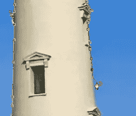
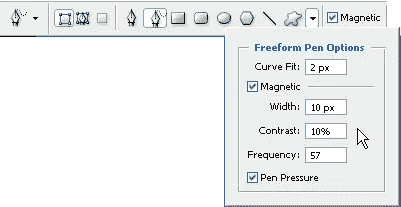
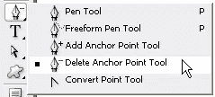
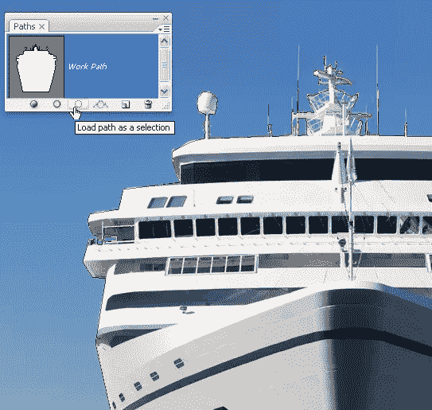

# 三个隐藏的 Photoshop 钢笔工具提示

> 原文：<https://www.sitepoint.com/three-hidden-photoshop-pen-tool-tips/>

这里有三个技巧可以帮助你在 Photoshop 中使用钢笔工具更精确、更快速地工作。每个技巧都基于一些不太为人所知或隐藏的快捷方式和工具选项。

**磁性笔**

什么磁性笔？是的，Photoshop 有一个隐藏得很好的磁性笔选项，非常有用。如果你喜欢使用磁性套索工具进行选择，那么这个选项会很适合你。要找到磁性笔选项，首先从工具箱中选择自由笔工具。(对于钢笔工具，按 P 键，然后按 Shift 键循环切换到任意多边形钢笔工具)。在屏幕顶部的工具选项中，单击磁性复选框。

光标会发生变化，在钢笔工具上显示一个小磁铁，当你开始在一个对象周围绘制时，你绘制的路径会粘在边缘上。如果你用自由笔工具绘图时手不稳，这将非常有帮助。

但是，还有更多选择！再次在工具选项栏上，单击自定义形状工具图标以显示弹出菜单。这些给你更多的控制路径上的点在你绘制时的布局。记住，当绘制路径时，平滑边缘的一个好的经验法则是使用尽可能少的点。

**避开工具栏**

正如您可能知道的，在您使用钢笔工具(或形状工具)绘制路径后，您可以返回并添加或删除锚点。下图显示了工具箱中的各种钢笔工具。但是，您可以节省大量的时间，因为您不必来回查看工具栏来选择这些工具。

假设你已经用钢笔工具画出了一条路径，现在你想添加另一个点。在钢笔工具仍处于活动状态的情况下，当您将光标滚动到线段上时，钢笔光标会自动变为添加锚点工具，以便您可以单击该路径上的任意位置来添加点。当您将光标移到现有锚点上时，光标会变成删除锚点工具(单击该点，它会被删除)。

这是因为钢笔工具选项栏上有一个名为“自动添加/删除”的复选框，默认情况下是打开的。

这被称为“自动添加/删除”，默认情况下它是打开的(如果需要，您可以使用选项栏中的复选框来关闭它)。要在不返回工具箱的情况下使用“转换点”工具，只需按住 Alt/Option 键和钢笔工具，然后单击并拖动任意点，即可将其从直点转换为曲线，反之亦然。

**从路径中进行选择**

用钢笔工具画出路径后，进入路径面板，你会看到路径的缩略图。要将路径更改为选择，请单击加载路径作为选择图标。

为了节省时间，你甚至不需要打开路径面板。画完路径后，只需使用键盘快捷键**Ctrl+Enter**(Win)**Cmd+Return**(PC)。

你有什么想要分享的钢笔工具技巧吗？

## 分享这篇文章