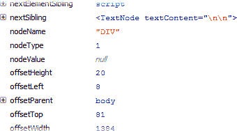

# 三种鲜为人知的开发控制台 API 方法

> 原文：<https://www.sitepoint.com/three-little-known-development-console-api-methods/>

你还记得 Firebug 开始浏览器控制台革命之前的生活吗？我仍然做噩梦。今天，我们被选择宠坏了，开发控制台变得越来越强大。

也就是说，我们中的许多人仍然使用`console.log`作为主要的调试命令。还有几个你可能不知道的方法…

## 控制台.计数

`console.count`显示线路被呼叫的次数。可以向它传递一个可选的名称参数来标识计数器，例如

```
for (var i = 0; i < 3; i++) {
	doSomething(i);
	console.count( "main doSomething loop:" );
}
```


`console.count`可用于 Chrome 的开发者工具，Firebug 和 IE11 F12 工具。

## console.dir 和 console.dirxml

使用`console.log`输出一个 DOM 节点非常有用，它将允许您导航到 HTML 面板，在这里您可以查看它在树中的位置及其属性。但是，您可以直接在控制台中查看这些详细信息。

`console.dir(node)`显示所有对象属性的交互式列表——就像您通常在 DOM 面板中看到的那样，例如

```
console.dir( document.getElementById("test") );
```



`console.dir`可用于 Chrome 的开发者工具、Firebug、Firefox 的 Web 开发者控制台和 IE11 F12 工具。

类似地，`console.dirxml(node)`显示节点和所有后代——就像 HTML 面板的一部分，例如

```
console.dirxml( document.getElementById("test") );
```


`console.dirxml`可用于 Chrome 的开发者工具，Firebug 和 IE11 F12 工具。

## 控制台.表格

`console.table`以表格格式输出一个对象或数组，可通过点击表格标题进行检查和重新排序，例如

```
var browsers = [
	{ name: "Internet Explorer", vendor: "Microsoft", version: "11" },
	{ name: "Chrome", vendor: "Google", version: "31" },
	{ name: "Firefox", vendor: "Mozilla", version: "26" },
	{ name: "Safari", vendor: "Apple", version: "7" },
	{ name: "Opera", vendor: "Opera", version: "18" }
];

console.table( browsers );
```


`console.dirxml`可用于 Chrome 的开发工具和 Firebug 中。您也可以指定一个数组作为第二个参数来定义不同的列标题。

非常有用。值得浏览您最喜欢的浏览器控制台的文档，以找到隐藏在工具中的其他珍宝。

## 分享这篇文章