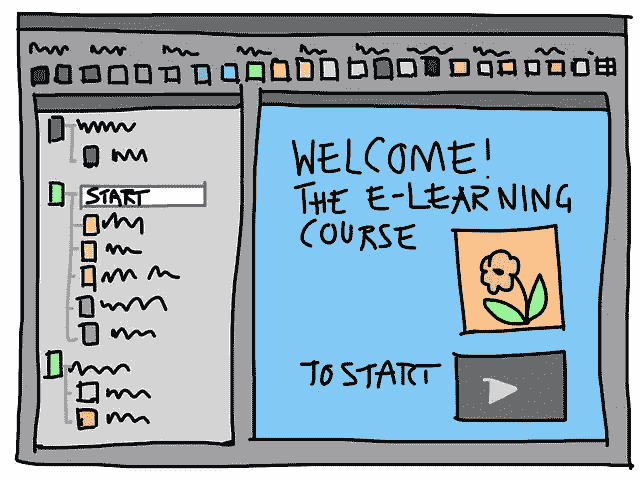
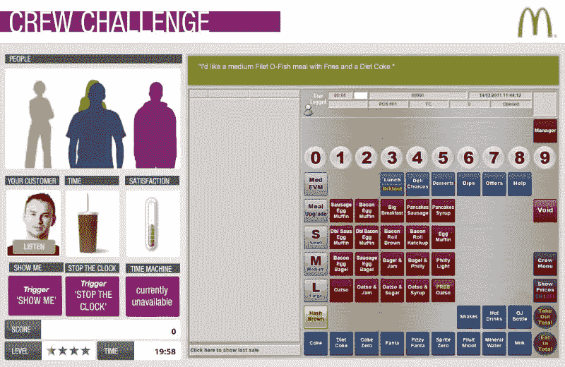
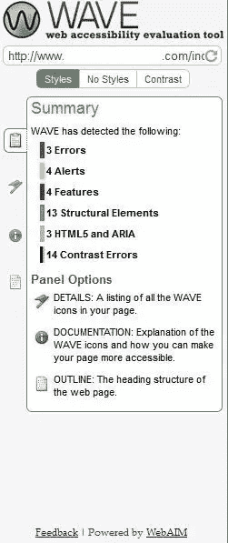

# 创建可访问的电子学习资源的提示

> 原文：<https://www.sitepoint.com/tips-making-accessible-elearning/>

[摄影:文森特 F](https://www.flickr.com/photos/vfung26/6283744958)

你知道吗，在法国，残疾人可以免费参观著名的卢浮宫美术馆。

虽然在线内容很少像蒙娜丽莎那样引人入胜，但许多政府部门现在被要求向内部员工和公众提供可访问的在线内容。

但是那个*到底是什么意思呢？*

可访问的在线内容应该是任何人都可以获得和理解的——无论身体、视觉、听觉或精神障碍或语言能力如何。

报告的残疾用户百分比在全球范围内仅略有不同。澳大利亚统计局(ABS)记录显示，五分之一的人报告说他们有残疾。在美国，这一数字为 12.1%，在英国，近五分之一的人(19%)有残疾。

将这些百分比转换成人数，我们谈论的是数百万的用户。

但是，在使用计算机处理像应收账款这样的任务时，这些障碍中有多少会影响到您部门的员工呢？或者您的公众受众中有多少人需要屏幕阅读器来使用声明门户？

即使答案是万分之一，这个人也和其他人一样有权学习如何使用所提供的软件/服务。

虽然这篇文章对开发人员很有用，但我特别想和“项目利益相关者”——推动这些项目的人——谈谈在与他人签约设计和构建您的电子学习课程时应该考虑什么。

## 首先，我们所说的“电子学习”是什么意思？

电子学习就是通过一系列屏幕或“幻灯片”在电脑/平板电脑/智能手机上提供学习内容，可以随时观看，而不是安排在教室里。一些电子学习嵌入了短视频剪辑(如个人发言或应用程序的屏幕录制)、交互式活动(如在句子中输入单词)，还可以包括评估，如提供即时反馈的多项选择测验。

组织通常使用电子学习进行培训，因为它随时可用，可以交付给成千上万的人。

许多大学为一些课程单元提供电子学习。电子学习也可以变得时髦，有竞争性的游戏元素，如为麦当劳员工设计的 [Till 训练游戏](http://www.kineo.com/case-studies/mcdonalds-till-training-game)(由 City 和 Guilds Kineo 设计)。

## 无障碍电子学习的成本

让我们不要回避它:无障碍电子学习需要更长的时间来设计和开发，因此成本更高。您寻求的可访问性级别越高，获得“通过”所需的时间和精力就越多。

总是需要额外的时间来:

*   通过可访问性检查器运行每个页面(如下面显示的波形工具)
*   用屏幕阅读器测试，
*   为视频写有效的文字记录，
*   为图表编写有用且详细的 ALT 属性，
*   包括下载的文件大小描述。

虽然有某种程度的自动化可用，但是为了准确地测试可访问性遵从性，手动检查是强制性的。可访问的电子学习设计和开发需要多长时间取决于您的电子学习提供商:经验丰富的供应商已经建立了完善的流程，配备了训练有素的人员，他们已经熟悉成功标准，甚至可能已经为可访问性设计了可重用的框架元素。这是一个很大的优势。

### 将不可访问的电子教学转换为可访问的电子教学

不幸的是，没有神奇的“一键”按钮可以将现有的电子教学内容转换为可访问的电子教学内容，尤其是在原始输出是基于 Flash 的情况下(这是常见情况)。

“转换”时间取决于基本代码、交互性水平、音频和视频的存在等因素。当然，肯定有一些立竿见影的效果，比如为图像提供 ALT 属性，但是如果你有五分钟长的视频，有音频和动画，你还有一些工作要做。

还有许多其他潜在的访问问题需要考虑。例如:

*   内容是否依赖于拖放交互？
*   图像中是否嵌入了重要且相关的内容文本？

事实是，使用不同的电子教学创作软件和技术从头开始重新构建课程，往往比试图将可访问性改造到旧的课程材料中更有效。

### 电子学习的类型会影响可访问性合规性的复杂性

您的电子学习的核心内容可以是软技能(例如行为改变或知识积累)、软件技能(例如如何使用 Microsoft Word 2010 或 SAP 模块)或基于行动的技能(例如如何使用灭火器)。

电子学习的类型会影响实现可访问性的方法。对于基于软件技能的电子学习，有一些额外的事情需要考虑:

*   “测试”模拟本质上是不可访问的，因为描述屏幕上发生的事情并给出指示(根据 WCAG 2.0 成功标准 3.3.2)实际上是“给出”答案。系统培训中的“测试”模拟是一系列预先录制的步骤，用户需要在屏幕上选择/输入正确的顺序才能通过。
*   一些电子学习软件比其他软件提供更容易理解的输出。导出为内置 Flash 的电子学习屏幕不是 100%可访问的，而基于 HTML 的输出通常可以。此外，请记住，仅仅因为电子学习软件说它符合 section 508(美国联邦政府可访问性要求)，并不一定等同于 WCAG 2.0 合规性。
*   即使该软件确实符合 AA 标准，也不意味着您收到的课程的电子学习输出将是 AA 可访问的。教学设计、学习管理系统设置和你的标准操作环境都会产生影响。

无论电子学习的类型如何，学习无障碍电子学习课程的最佳方法是从一开始就了解所需的无障碍级别、学习者及其学习需求。

## 如果您的应用程序不符合 AA 标准会怎么样？

仅仅因为最终解决方案不是 *100%可获得的*并不一定意味着它是自动失败的——事实上，达到 100%是极其困难的。

但是你还是要尽一切可能的努力，尽可能的靠近；只要你提供另一种获取知识的方式，一切都没问题。

通常，被确定为患有妨碍他们有效进行学习的障碍的用户可以接受一对一的培训或完整的成绩单。您可以通过沟通渠道或电子学习可访问性声明(通常作为培训课程的一部分)通知他们，因为您或提供商可以通过可访问性声明生成器([http://www.accessibilitystatementgenerator.com](http://www.accessibilitystatementgenerator.com))创建。

请注意，在许多国家，拥有不符合 WCAG 2.0 AA 标准的在线内容(如电子学习)会受到法律制裁。第 508 条和【1992 年《澳大利亚残疾歧视法》就是很好的例子。

但是，只要您有一个策略来有效地培训那些无法访问电子学习的学习者，那么您就已经履行了您的责任。

### 不需要达到 AA 级别的电子学习的豁免

在某些电子学习情况下，有可能不符合成功标准。例如，关于软件的电子学习本身甚至连 A 级都无法访问，或者承担电子学习的工作角色不能有任何损伤。

作为一个现实生活中的例子，关于如何使用飞机维护软件应用程序的电子学习课程不需要达到 AA 级别，因为观众不得有任何会影响其从事工作的能力的障碍——以及电子学习。

然而，对于大多数电子学习项目，你需要确保构建它的人理解并尽可能遵循 WCAG 2.0 AA([https://www.w3.org/TR/WCAG20/](https://www.w3.org/TR/WCAG20/))成功标准。

### 如何判断电子学习提供商是否知道如何实现电子学习

在可能的情况下，要求查看他们以前完成的 AA 级可访问电子学习的示例，并通过可访问性检查器运行 HTML。基本错误，如缺少 ALT 属性和缺少“跳过导航”链接，表明提供程序的可访问性可能很低。

你也可以问电子学习提供商一些棘手的问题，以确定他们的认知水平，比如"*你是如何获得在线输出的？*“那些了解自己的东西的人会提到一些事情，例如通过可访问性检查器进行测试、界面颜色对比度、教学设计规则、可访问的交互、创建还包括屏幕上动作的视频脚本，以及针对那些不符合成功标准的元素的替代学习策略。

请求证明、认证、推荐的合规级别、他们如何培训员工，以及他们如何进行内部合规测试，也将揭示他们是否适合您的项目。

## 如何检查电子教学是否可用

提供商完成工作后，您如何知道他们提供了 AA 级无障碍电子学习？您可以在关闭样式表的情况下查看页面，看看内容的阅读顺序是否正确。你也可以通过在线可访问性检查器(比如[http://wave.webaim.org/](http://wave.webaim.org/))运行几页，但这只能覆盖一定数量的潜在错误。

为了绝对确定，你需要雇佣一个专业的服务来做一个可访问性审计。这要花多少钱(想想几千美元而不是几百美元)取决于电子教学是否有音频和视频，它有多少屏幕以及交互性的水平。

最后，您会收到一份报告，其中详细列出了需要解决的问题，以便于访问。一些地方，如澳大利亚无障碍专家 AccessibilityOz 甚至可以为您进行修复，他们有残疾测试员，可以提供更有意义的评估。

### 摘要

作为项目发起人，你不需要知道如何实现电子学习的所有细节，但你有责任确保电子学习提供商做到这一点。提问，求证，寻求有经验的提供者。始终有一种替代电子学习的培训方式，并让电子学习的受众了解这一点。

### 关键辅助功能术语

**WCAG 2.0** 网页内容无障碍指南。WCAG 2.0 说内容应该是“可感知的”、“可操作的”、“可理解的”和“健壮的”(POUR)。在这四个原则下有 12 个指导方针，每个都有具体的成功标准。

**AA **WCAG 1.0 和 2.0 使用三级评级系统来确定可访问性的级别。在 WCAG 2.0 中，级别单 A (A)是最基本的，通过双 A (AA)和三 A (AAA)移动。AAA 是技术难度最高的级别，但也被认为是为更广泛的用户提供了最易访问的环境。AA 级的指导方针是网站开发者应该满足的，否则一些群体将很难访问在线内容。

### 从哪里获得更多建议:

**易访问性 yOz:** 为技术人员、经理和内容作者准备数据表和清单。见其网站[http://wiki . accessibilityoz . com . au/doku . PHP/checklists/start](http://wiki.accessibilityoz.com.au/doku.php/checklists/start)[http://wiki . accessibilityoz . com . au/doku . PHP/checklists/start](http://wiki.accessibilityoz.com.au/doku.php/checklists/start)。特别感谢他们对这篇文章的帮助。易访问性总监 Chris Foster，培训提供商咨询公司多媒体团队负责人；还有来自 SitePoint 的 Alex Walker。

## 分享这篇文章