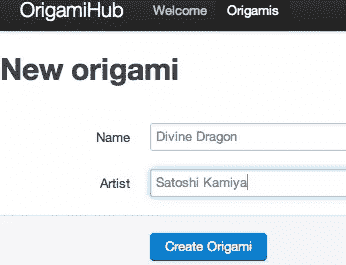
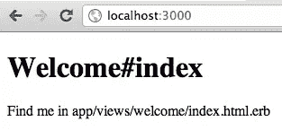
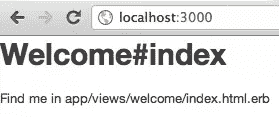
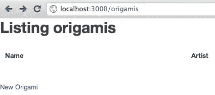
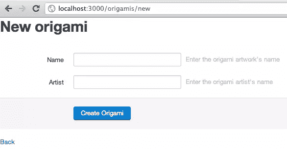
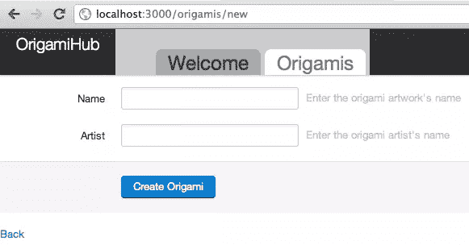
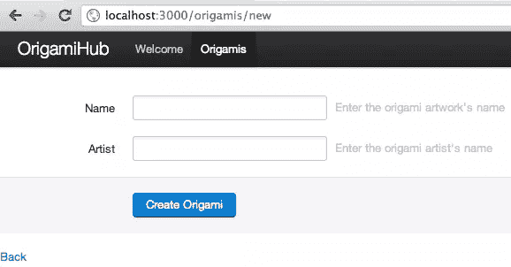
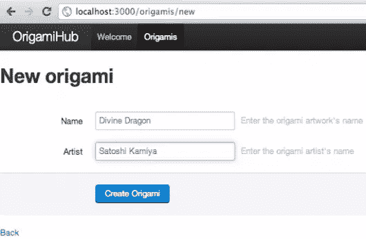

# 好得难以置信！Twitter Bootstrap 满足了形式化和扩展

> 原文：<https://www.sitepoint.com/too-good-to-be-true-twitter-bootstrap-meets-formtastic-and-tabulous/>



这个简单的 5 步教程将使用 Twitter Bootstrap 创建一个 workingRails 3.1 应用程序

[上个月，我讨论了](https://www.sitepoint.com/twitter-bootstrap-less-and-sass-understanding-your-options-for-rails-3-1/)所有可用于集成 [Twitter Bootstrap](http://twitter.github.com/bootstrap/index.html) 和 Rails 3.1 应用的不同宝石。这些宝石使得 Twitter Bootstrap CSS 样式作为 Less 或 Sass 代码在 Rails 3.1 资产管道中可用。然而，获取 Twitter CSS 代码只是第一步——你还需要知道如何在 Rails 应用中使用它。

今天我将迈出下一步。这篇文章是一个详细的、一步一步的教程，它将带你完成编写一个新的 Rails 3.1 应用程序的过程，该应用程序使用 Twitter Bootstrap 和 [Formtastic](https://github.com/justinfrench/formtastic) 和 [Tabulous](https://github.com/techiferous/tabulous) ，这两个伟大的宝石使得在 Rails 中实现 web 表单和基于标签的导航变得更加容易——这是 Twitter Bootstrap 的两个主要特性。我们还将使用第三个名为[的 gem Formtastic-Bootstrap](https://github.com/mjbellantoni/formtastic-bootstrap),它修改 form tastic 生成的 HTML 以更好地处理 Twitter Bootstrap 文件。

请继续阅读，了解更多信息……只需简单的五个步骤，我们就可以建立并运行一个简单的网站，展示如何使用 Rails 3.1 实现 Twitter Bootstrap 表单和选项卡导航！

## 步骤 1:创建一个新的 Rails 应用程序

让我们从创建一个全新的 Rails 3.1.3 应用程序开始，这是我写这篇文章时可用的最新版本的 Rails:

```
$ rails -v
Rails 3.1.3
$ rails new origami_hub
$ cd origami_hub
$ rm public/index.html
$ rails generate controller welcome index
```

你可以看到我们将创建一个网站来跟踪折纸艺术作品！您还可以看到，我删除了默认的静态主页 public/index.html。最后一个命令生成了一个名为“Welcome”的控制器，它将处理 web 站点主页的显示。

下一步是编辑 config/routes.rb 文件。继续将它粘贴到 routes 文件中:

```
OrigamiHub::Application.routes.draw do
  root :to => 'welcome#index'
end
```

最后，让我们启动我们的 Rails 服务器(键入“Rails server”)并打开 http://localhost:3000:



由 rails 控制器生成器创建的默认页面

您应该会在网站的新主页上看到此文本；如果没有，那么仔细检查上面的命令。

## 步骤 2:添加引导-Sass

今天我将使用由[托马斯·麦克唐纳](https://github.com/thomas-mcdonald)开发的 [Bootstrap-Sass](https://github.com/thomas-mcdonald/bootstrap-sass) gem 来导入 Twitter Bootstrap 代码。要了解更多关于 Bootstrap-Sass 及其工作原理，请查看[我在 11 月](https://www.sitepoint.com/twitter-bootstrap-less-and-sass-understanding-your-options-for-rails-3-1)发的帖子。将它添加到我们新的 Rails 应用程序很简单；首先编辑您的 Gemfile 并将其添加到“assets”组:

```
# Gems used only for assets and not required
# in production environments by default.
group :assets do
  gem 'bootstrap-sass'

etc...
```

然后你需要用 Bundler 安装它:

```
$ bundle install
```

接下来，我们需要创建一个新的 Sass 代码文件来保存我们的 CSS 样式代码。在 app/assets/stylesheets 文件夹中创建一个名为“origami_hub.css.scss”的文件，其中包含这一行代码。这会将 Twitter 引导 CSS 样式导入到我们的应用程序中:

```
@import 'bootstrap';
```

现在，如果您停下来，重新运行您的 Rails 服务器并刷新页面，您应该会看到相同的内容，但是在字体和布局上有细微的变化:



带有 Twitter 引导样式的默认页面

这可能看起来没有太大的不同，但实际上字体有微妙的变化，并且文本现在与左上角齐平。这些变化意味着我们已经成功地将 Twitter Bootstrap 加载到我们的 Rails 应用程序中了！如果您在浏览器中运行 View –> Source 并检查 origami_hub.css 请求返回的代码，您会看到所有的 Twitter 样式。

## 步骤 3:添加脚手架

到目前为止，一切顺利；现在我们有我们的网站的导航栏出现正确。下一步，让我们创建一个折纸模型以及显示和编辑它们的页面——Rails 脚手架将是完美的。今天，我只使用两个字符串属性；折纸艺术作品的名字和艺术家的名字。以下是命令:

```
$ rails generate scaffold origami name:string artist:string
$ rake db:migrate
$ rm app/assets/stylesheets/scaffolds.css.scss
$ rm app/assets/stylesheets/origamis.css.scss
```

注意，我删除了两个生成的文件“scaffolds.css.scss”和“origamis.css.scss ”,它们干扰了 Twitter Bootstrap 的样式。现在如果你打开折纸索引页面，http://localhost:3000/origamis，你会看到这个:



来自 Rails scaffold generatorwith 的带有 Twitter 引导样式的索引页面

如果您以前使用过 Rails 搭建，这应该看起来很熟悉，但是这里我们也看到了 Twitter 引导表样式。

## 步骤 4:使用 Formtastic-Bootstrap 添加 Formtastic

我们今天的下一步是将由[贾斯汀·弗伦奇](http://www.justinfrench.com/)编写的 [Formtastic](https://github.com/justinfrench/formtastic) 引入到我们的示例应用程序中。如果你还不熟悉的话，Formtastic 生成的 HTML 比标准的 Rails“form _ for”和相关方法更简洁，更容易创建好看的表单。在编写 Rails 视图代码时，它也更容易使用。最后，在编写 Javascript 代码或 cumber 测试时，Formtastic 的 HTML 也更容易使用，因为添加了 CSS 样式，使查找特定的表单元素更容易。

不幸的是，Formtastic 和 Twitter Bootstrap 不能很好地配合:Twitter 的样式没有引用 Formtastic 产生的 HTML 标签。但是我们可以让这两个组件一起工作，通过使用一个叫做 [Formtastic-Bootstrap](https://github.com/mjbellantoni/formtastic-bootstrap) 的伟大的新宝石，作者是 [Matthew Bellantoni](http://matthewbellantoni.com/) ，一个像我一样的波士顿 ruby 爱好者。查看 github readme 页面，了解关于 Formtastic-Bootstrap 实际工作方式的更多细节。

要将它放入我们的应用程序，我需要首先将它添加到我的 Gemfile 中:

```
gem 'formtastic-bootstrap'
```

现在，正如 Matthew 在他的 readme 页面上解释的那样，我还需要创建一个名为 config/initializer/formtastic . Rb 的新文件，其中应该包含这一行代码:

```
Formtastic::Helpers::FormHelper.builder = FormtasticBootstrap::FormBuilder
```

这指示 Formtastic 使用 Matthew 的新表单生成器对象，而不是 Formtastic 的标准表单生成器。Matthew 的表单生成器生成了 Twitter 期望的 HTML。

接下来，我需要重写 Rails scaffold generator 生成的表单，以使用 Formtastic 的 semantic_form_for 函数——将此代码粘贴到 app/views/origamis/_ form . html . erb 中，覆盖之前的内容:

```
<%= semantic_form_for @origami do |f| %>
  <%= f.semantic_errors %>
  <%= f.inputs do %>
    <%= f.input :name,   :hint => "Enter the origami artwork's name" %>
    <%= f.input :artist, :hint => "Enter the origami artist's name" %>
  <% end %>
  <%= f.buttons do %>
    <%= f.commit_button :button_html => {:class => "primary"} %>
  <% end %>
<% end %>
```

这里需要注意几个细节:

*   我已经为每个字段传递了 Formtastic“提示”选项，以便在屏幕上添加一些帮助文本
*   我已经传递了“button_html”选项来使用 Twitter Bootstrap 蓝色按钮样式

我们需要再次运行`bundle install`来安装马修的宝石；bundler 还将安装 Formtastic 本身，因为它是 Formtastic-Bootstrap 的依赖项:

```
$ bundle install
```

重启服务器并点击“New Origami”链接后，我得到了一个漂亮的表单，它使用了 Twitter Bootstrap 风格:



由 FormtasticBootstrap::form builder 呈现的表单

## 步骤 5:用 Tabulous 添加标签导航

Twitter Bootstrap 的另一个很棒的特性是页面顶部漂亮的黑色导航栏。我们如何将它加入到我们的示例应用程序中呢？我们可以从一个 Twitter 示例页面中复制/粘贴 HTML 代码，但是我将向您展示如何使用一个名为 [Tabulous](https://github.com/techiferous/tabulous) 的新工具。[另一位波士顿 ruby 爱好者 Wyatt Greene](http://techiferous.com) ，今年早些时候写了 Tabulous，它非常容易使用。我们很幸运有这样一个有创意的 Ruby 社区:我今天在 Twitter Bootstrap 上使用的四个宝石中有两个是在波士顿写的！要了解更多关于 Tabulous 的信息，请务必阅读 Wyatt 在三月份介绍 gem 时写的两篇精彩文章:[介绍 Tabulous:Rails 中的标签](http://techiferous.com/2011/03/introducing-tabulous-tabs-in-rails/)和[使用 Tabulous 向 Rails 添加标签的教程](http://techiferous.com/2011/03/tutorial-for-adding-tabs-to-rails-using-tabulous/)。

同样，让我们首先通过编辑 gem 文件将宝石添加到我们的应用程序中:

```
gem 'tabulous'
```

…并运行捆绑包安装:

```
$ bundle install
```

正如 Wyatt 在他的教程中解释的那样，我们需要运行这个命令:

```
$ rails generate tabs
```

这将创建一个名为 app/tabs/tabulous.rb 的新文件，我们在其中声明了我们希望在站点中显示的所有选项卡。我不会在这里解释所有的语法；再次参考 [Wyatt 的教程](http://techiferous.com/2011/03/tutorial-for-adding-tabs-to-rails-using-tabulous/)以获得更多关于 tabulous.rb 中确切内容的信息。

对于我们的示例应用程序，我们只需要对选项卡表做一个小小的编辑:

```
config.tabs do
[
  [ :welcome_tab,  'Welcome',  root_path,     true, true ],
  [ :origamis_tab, 'Origamis', origamis_path, true, true ],
]
end
```

令人惊讶的是 Wyatt 的发电机已经为我们做了大部分工作！我在这里做的只是重新排列两行。为了可读性和节省空间，我删除了一些通常出现在 tabulous.rb 文件中的注释，解释了表中每一列的用途；如果你打开你机器上的 tabulous.rb 文件，你会看到这些。

我们就快完成了！我需要做的最后一件事是添加用于显示 Twitter 引导导航栏的 HTML。为此，我将从他们的“fluid.html”示例页面中复制/粘贴一些 HTML——你可以在[Twitter Bootstrap github repo](https://github.com/twitter/bootstrap/blob/master/examples/fluid.html)中找到这个 HTML。HTML 应该放在 app/views/layouts/application . HTML . erb 文件中，在< body >标签和 yield 调用之间:

```
<body>

<div class="topbar">
  <div class="topbar-inner">
    <div class="container-fluid">
      <a class="brand" href="#">OrigamiHub</a>
      <%= tabs %>
    </div>
  </div>
</div>

<%= yield %>
```

注意，我用一个对的调用替换了 Twitter 示例中的

HTML。这将显示我在上面的选项卡表中声明的选项卡！

现在再次重启我的服务器——记得我之前运行过`bundle install`—让我们刷新页面:



Twitter 引导导航条显示了扩展的脚手架样式

差不多了…但这仍然不太对。默认情况下，Tabulous 会包含一些脚手架标签 CSS 代码来帮助你入门。然而，由于我们使用 Twitter Bootstrap，我们不需要任何东西。要移除它，我们需要做的就是将 app/tabs/tabulous.rb 中的“脚手架”设置改为`false`:

```
config.css.scaffolding = false
```

我们还需要将“active_tab_clickable”设置改为 true——这将告诉 Tabulous 始终为每个标签生成一个

```
config.active_tab_clickable = true
```

现在让我们再次刷新页面:



Twitter 引导导航栏中的标签页缺少正文填充样式

而且很管用！现在我们看到标签出现正确，不仅如此，他们实际上也工作！你可以点击“Welcome”来查看上面的欢迎索引占位符页面，点击“Origamis”来获取 Origami 索引页面，因为我们已经在 app/tabs/tabulous.rb 的 tab 表中输入了这些路径。

这里还有一个你可能没有注意到的 CSS 错误:表单顶部的“新折纸”文本被导航栏遮住了——这是因为 Twitter 的 CSS 代码的工作方式是假设 HTML 主体上有填充。要解决这个问题，我们只需要像这样在我们的 origami_hub.css.scss 文件中手动添加 body 样式的 60px 填充——确保在导入后放置填充样式，否则它将不起作用:

```
@import 'bootstrap';

body {
  padding-top: 60px;
}
```

再次刷新页面，我们得到:

[](https://www.sitepoint.com/?attachment_id=2672)

Twitter 引导导航栏中的小标签，带有适当的主体填充

Wyatt 的 Tabulous gem 也会自动正确显示当前活动的选项卡，因为 Tabulous 和 Twitter Bootstrap 都使用“活动的”CSS 样式来表示。一切正常！现在，当我向我的应用程序添加更多页面时，我只需要在选项卡表中添加条目，并且我还可以自由地对它们进行重新排序。

## 结论

Twitter Bootstrap 是一种非常快速地建立一个好看的网站的奇妙方法；然而，拥有一个复杂的 CSS 库只能让你到此为止。您仍然需要构建某种 web 应用程序来将 Twitter 设计元素带入生活。在后端使用 Rails 可能是对 Twitter Bootstrap 的完美补充，但是，正如我们今天所看到的，使用 Rails 也可能是一个挑战，因为这两个框架并没有设计成完美地协同工作。在您开始使用 Twitter Bootstrap 构建下一个 Rails 3.1 应用程序之前，请务必做好您的功课——有许多 gem 作者正在这个领域积极工作，随着 Twitter Bootstrap 变得越来越受欢迎，预计会看到更多新的 gem 和对现有 gem 的更改。

## 分享这篇文章