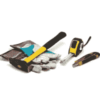

# 进行营销审计的工具

> 原文：<https://www.sitepoint.com/tools-for-conducting-a-marketing-audit/>

我们已经介绍了关于[营销审计](https://www.sitepoint.com/small-business-marketing-audit)的基础知识，现在是时候探索一些你在开始审计时可以使用的工具了。你在审计中使用的分析和测量工具越多，你就能学到越多，从而使你的营销活动更加成功。

## 四点分析

SWOT 分析是一种战略工具，它评估你的优势、劣势、机会和威胁，以评估你的业务并制定前进计划。

它在有效的营销审计中起着重要的作用，您很可能希望在营销审计的开始就着手进行分析，这样您就有了可用的信息来作为流程其余部分的衡量标准。

关于 SWOT 分析的更多信息，请访问[如何使用 SWOT 分析让你的企业摆脱自满](../2010/01/16/how-to-use-a-swot-analysis)。

## 害虫分析

“PEST”代表“政治、经济、社会和技术”，它指的是对影响你的营销过程的内部和外部环境因素的分析。

内部因素可能包括您和与您一起工作的任何人，以及与人员和技术直接相关的问题。外部因素可能是您的客户、与您的工作相关的法律或政府问题，或者技术变革。

PEST 分析主要用于了解市场的增长或衰退，你当前的商业地位，以及你未来的潜力。

更多关于害虫分析的信息，请访问[MindTools.com](http://www.mindtools.com/pages/article/newTMC_09.htm)。

## 五力分析

五力分析是评估竞争环境的工具。

由哈佛商学院的迈克·E·波特于 1979 年提出，这种分析集中于决定潜在竞争的五种力量，以衡量特定产品或服务的市场吸引力。这五种力量包括:

1.  **供应商力量:**供应商提价的难易程度取决于哪些因素？
2.  买家力量:是否存在潜在的风险，即你的客户会转向另一家收费更低、提供你所能提供的服务的供应商？
3.  竞争对手:您有多少竞争对手，他们的服务与您的有多大可比性？
4.  替代的威胁:你的客户能找到其他方式来做你现在为他们做的事情吗？
5.  **新进入者的威胁:**随着新供应商的加入，您所在的行业是否持续增长？

欲了解更多信息，请参见 [QuickMBA 的战略管理指南](http://www.quickmba.com/strategy/porter.shtml)。

有许多其他的工具可以用来开发一个全面综合的营销审计。但是，无论您使用哪种工具，结果应该是一样的。你想要了解你当前的营销活动如何与你的竞争对手相抗衡，保持在你可用的资源范围内，并制定一个改进计划。

这可能是一个漫长的过程，尤其是你第一次处理它的时候，但是定期这样做可以增加你在营销上投入的时间、金钱和其他资源的回报。你做营销审计吗？如果没有，为什么没有？

*图片来源:[forward com](http://www.sxc.hu/profile/forwardcom)*

## 分享这篇文章