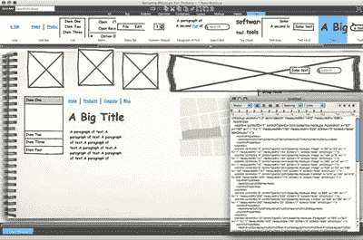
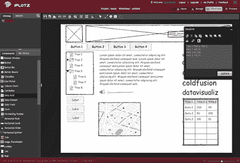

# 16 原型和线框文章的设计工具

> 原文：<https://www.sitepoint.com/tools-prototyping-wireframing-2/>

### 8.Balsamiq 模型

Balsamiq 样机(价格:79 美元，提供演示)是一款运行在 Adobe AIR 上的有趣产品。它对界面元素的表现有一种令人耳目一新的手绘效果，就像素描一样。这确实有助于提高线框的可变性，因为它们看起来非常像草图。如果你缺乏创建手绘草图的技能，那么 Balsamiq 是一个有用的工具，因为它可以让你制作出高质量的草图。Balsamiq 还提供了一个交互式屏幕元素的标准集合，这对开始很有帮助。

Balsamiq 样机还引入了 BMML(XML 的一种风格)，使您能够导出您的线框。

然而，与其说它是一个原型工具，不如说它更倾向于通过线框图之类的方式传达一个被提议的接口的概念。

### 9.Lucid Spec(不再提供)

Elegance Technologies 的 Lucid Spec(价格:499 美元起，提供演示)是基于 windows 的。几乎是 Axure 的克隆版。它有一系列快速屏幕绘图工具和原型测试模式，他们称之为“即时应用程序模拟”，可以在全屏模式或应用程序中查看。甚至有一个独立的 Lucid Spec 播放器，允许您在不需要完整应用程序的情况下进行原型测试。

Lucid Spec 缺乏的一个方面是允许状态间的类似 Ajax 的交互。呈现的交互在很大程度上基于传统的逐页屏幕流。

### 10.ConceptDraw Pro

ConceptDraw Pro (价格:249 美元起，提供演示版)宣传自己是 OmniGraffle 和 Visio 的替代产品，目标是商业和技术制图市场。

我很高兴地说，它确实不负众望，其各种功能可与其竞争对手相媲美。

除此之外，它还有自己的脚本语言 ConceptDraw Basic。使用这种脚本语言可以生成复杂的定制原型。如果您想避免走定制脚本的路线，您可以使用标准的导出到 HTML 或 PDF 进行原型制作。

ConceptDraw 也有一个针对美国网页设计师的网页设计插件，WebWave 插件(价格:99 美元起，提供演示)。WebWave 插件简化了设计过程，允许更容易地开发网站和内容结构，以模拟中等分辨率的线框——有点像在灰色框中着色。然后，您可以从 ConceptDraw 获取最终的实体模型页面，并为原型生成 CSS 和页面。

ConceptDraw Pro 可用于 Windows 和 Mac 平台。

### 11.iPlotz

iPlotz (价格:免费到每年 99 美元)是一个新的 web 应用程序，目标是设计和开发生命周期市场。它捆绑了项目管理功能以及线框化、协作评论和测试原型生成。作为基于浏览器的应用程序，可以在任何有网络接入的地方使用，允许真正的远程协作设计和实现。

从视觉上看，iPlotz 是一个有吸引力的专业应用程序。这是一个 Flex 应用程序，因此从管理到预览的所有功能都是通过 Flash 界面访问的，因此需要最新的 Flash 插件，这对设计师或开发人员来说很容易。

这个应用程序中快速生成的线框让我想起了 Axure 的速度和易用性，但却有 Balsamiq 模型的手绘外观。iPlotz 的另一个优点是它只专注于网页设计，而不是其他。这是一个令人愉快的变化。

对于 iPlotz 来说，现在还为时过早，但是还有一些问题需要解决。评论界面可能会有点分散注意力；如果你有很多评论，评论会挤满屏幕。只有一种字体——漫画字体。此外，目前导出功能仅限于 JPG、PNG 或 PDF。不过，这个应用程序绝对值得一看。

### 12.走向模拟

离开电脑，用铅笔和纸做最初的线框图，有很多值得说的。你也可以把它扩展到纸上原型。它(建造)快，便宜，容易使用。对于小组，您可以使用大型白板、记号笔和一些磁性页面元素来制作原型。这两种方法都倾向于与观众高度互动，并能给枯燥的过程带来适度的幽默。

这些模拟方法也有缺点，因为生产和修改屏幕可能会很慢，并且由于最终产品的一次性性质，很容易被管理层忽视。我发现它们对生成过程很有用，但是最终的文档需要以正式的工具呈现。

## 多功能应用

### 13.PowerPoint 或 Keynote

通常，一个组织负担不起用于原型制作或线框制作的专门软件。在这里可以使用类似于[微软 PowerPoint](http://office.microsoft.com/en-us/powerpoint/default.aspx) (价格:229 美元起，提供演示)或[苹果 Keynote](http://www.apple.com/iwork/keynote/) (价格:79 美元起，提供 iWorks，演示)的应用程序。这两个软件包都非常适合生产非常快速、简单的原型。它们与大多数团队的技能高度兼容，因此通过使用这些工具，您通常可以让任何团队成员立即轻松地为原型做出贡献。缺点是缺少了许多更好的交互元素，比如状态之间的交互，并且您的逻辑路径往往是非常线性的。不过，您也可以将原型导出到 HTML 或 Flash。

### 14.Adobe Fireworks

Adobe Fireworks (价格:299 美元起，有演示版)是一款我还没有考虑过用于原型制作的工具——我是一个很久以前的 Photoshop 爱好者。然而，随着 Adobe CS4 的发布，这一切都改变了。

Fireworks 现在正在发展成为一种可行的工具，可以使用嵌套符号、智能向导以及生成其背后的所有代码来生成低保真度和高保真度的原型。像往常一样，这段代码在自动生成过程中会受到一些影响，所以如果您想在最终的产品模型中重用它，就需要对它进行调整，使其具有合理的形状。

一个附带说明是，我知道其他人也使用 Adobe Photoshop 和 Illustrator 或 Microsoft Expression Studio 作为线框文档工具。当你有一个好的对象库时，比如画笔之类的，这些往往会工作得很好。

### 15.超文本标记语言

如果你有技能，你可以用 HTML 开发你的原型。如果您正在生成与最终网站标准一致的前端代码，这一点尤其有用。这样做可以减少总的生产时间，从而节省时间和金钱。

如今——通过使用各种 jQuery 插件——您可以轻松地表示几乎所有的状态间接口或主要接口类型。

通过使用[质子](http://www.protonotes.com/)也可以获得功能；你可以让你的团队在你的原型上合作，留下动态的、虚拟的便利贴。

即使您的技能集没有达到面向技术的水平，您也可以使用像 Adobe Dreamweaver 及其改进的 JavaScript Spry 组件这样的开发平台来产生合理的视觉表示。

我承认我经常这样做，从 Dreamweaver 中快速地拼凑出一个可工作的 HTML 原型，而很少考虑底层代码。请记住，这只是一个原型，所以只需要在视觉上代表最终产品。我不敢这么说，但在这种情况下，代码是次要的。

### 16.Adobe Flash

Adobe Flash (价格:699 美元起，提供演示)是制作[快速交互原型](http://skyrize.com/)或屏幕流的伟大工具，但不适合线框和规范文档。然而，通过使用库对象、时间轴和绘图工具，制作一个交互原型[非常容易](http://www.boxesandarrows.com/view/quick-and-easy-flash)。Flash 特别适合的一个领域是再现那些中间状态，这是许多静态表示工具所缺乏的。

Adobe 现在正在扩展使用 Flash 作为原型工具的功能，为设计人员和开发人员引入了一种全新的工具: [Catalyst](http://tv.adobe.com/#vi+f15384v1003) 。现在我还没有亲自尝试过 Catalyst 我只能依靠 Adobe 视频和同事们的报告来了解它的运行情况。但是请相信我，这个应用程序将会改变市场，让 RIA 开发成为下一件大事！好了，我说出来了；有些人会不同意，这没关系。

Catalyst 对像我这样使用 Mac 的人有希望的另一件事是，它将使我们比使用 Axure 的同事领先一步。我们会看到的。

*如果你喜欢阅读这篇文章，你会爱上[site point Premium](https://www.sitepoint.com/premium/)；向大师们学习新技能和技术的地方。会员可以即时访问 SitePoint 的所有电子书和互动在线课程，如[网页设计 Photoshop】。](https://www.sitepoint.com/premium/courses/photoshop-for-web-design-2901)*

*图像归属:[凯旺](http://www.flickr.com/photos/kevandotorg/184032078/)*

**Go to page:** [1](https://www.sitepoint.com/tools-prototyping-wireframing) | [2](https://www.sitepoint.com/tools-prototyping-wireframing-2/)

## 分享这篇文章