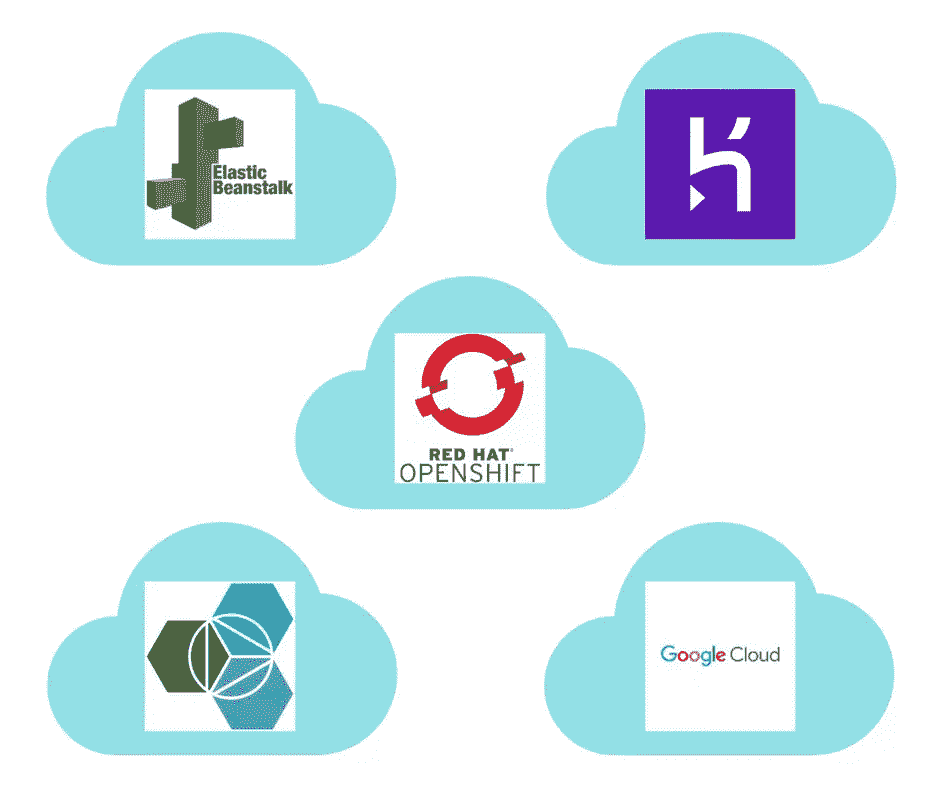

# 开发 Java 应用程序的五大 PaaS 解决方案

> 原文：<https://www.sitepoint.com/top-5-paas-solutions-developing-java-applications/>

### 目录 

*   [为什么要使用 PaaS？](#whyusepaas)
*   [亚马逊的弹性豆茎](#amazonselasticbeanstalk)
*   [Heroku](#heroku)
*   [RedHat 的 OpenShift](#redhatsopenshift)
*   IBM 的 Bluemix
*   [谷歌应用引擎](#googleappengine)
*   [总结](#summary)
*   [评论](#comments)

*平台即服务* (PaaS)是一种云计算模式，允许开发人员通过互联网构建和交付应用程序，而无需担心维护基础设施的复杂性，这通常与开发和运行应用程序相关。开发人员可以通过 web 浏览器轻松地访问和管理 PaaS，但有些开发人员有 IDE 插件来简化使用。

更详细地说，PaaS 就像预订优步:你上车，选择你的目的地和你想去的路线。如何保持汽车运行并解决细节问题取决于优步的司机。*另一方面，基础设施即服务* (IaaS)就像租车:驾驶、加油(设置、维护软件等)。)，这是你的工作，但修好它是别人的问题。

如果你喜欢 IaaS 模型，看看这篇关于托管 Java 应用程序的 5 大 IaaS 解决方案的文章。

## 为什么使用 PaaS？

PaaS 是一个运行在 IaaS 和主机软件即服务应用之上的云应用平台。PaaS 由操作系统、中间件、服务器、存储、运行时、虚拟化和其他软件组成，允许应用程序在云中运行，同时抽象出许多系统管理。这允许组织关注两件重要的事情，他们的客户和他们的代码。PaaS 负责设置服务器和虚拟机、安装运行时、库、中间件、配置构建和测试工具的所有系统管理细节。PaaS 中的工作流非常简单，只需在 IDE 中编写代码，然后使用 Git 等工具推送代码，就可以立即看到变化。

通过交付基础设施即服务，PaaS 也提供了与 IaaS 相同的优势，但增加了开发工具的其他功能。

*   **更短的编码时间**:由于 PaaS 为开发工具提供了预编码的应用程序组件，因此编码新应用程序的时间缩短了。
*   **动态分配**:在当今竞争激烈的世界中，大多数 IT 团队都需要能够灵活地部署应用程序的新功能或新服务，以便进行快速测试，或者在面向全球发布之前在一小部分客户端上进行测试。有了 PaaS，这样的任务现在已经成为可能。
*   **轻松开发跨平台应用** : PaaS 服务提供商为我们提供了针对不同平台(如电脑、移动设备和平板电脑)的各种开发选项，使跨平台应用的开发变得更加简单快捷。
*   **地理上的支持**:这在多个开发人员在一个项目上工作，但不在附近的情况下很有用。
*   **使用负担得起的有用工具**:现收现付法允许您根据使用情况付费。因此，可以根据需要使用必要的软件或分析工具。它为完整的 web 应用程序生命周期提供支持:构建、测试、部署、管理和更新。

Iaas 提供交付云服务所需的存储和基础架构资源，而使用 PaaS 的组织不必担心基础架构，也不必担心软件更新、存储、操作系统、负载平衡等服务。IaaS 可用于需要完全控制其高性能应用程序的组织、时间和精力有限的初创公司和小公司、不想投入硬件/软件资源的成长型组织、需求不稳定的应用程序——根据流量峰值或谷值扩大或缩小规模至关重要。

PaaS for Java 非常适合，因为 JVM、应用服务器和部署档案(即 WARs 或 ear)为 Java 应用程序提供了自然隔离，允许许多开发人员在同一基础架构中部署应用程序。作为一名 Java 开发人员，在选择 PaaS 服务之前，我们应该记住以下几点:

*   选择应用服务器的灵活性，如 JBoss、Tomcat 等
*   能够控制 JVM 调优，即 GC 调优
*   能够插入您选择的堆栈，如 MongoDB、MySQL、Redis 等
*   合适的测井设备

在本文中，我们将比较五个 PaaS 服务提供商； *AWS 的弹性豆茎*、 *Heroku* 、 *IBM 的 Bluemix* 、 *RedHat 的 OpenShift* 和 *Google App Engine* 从一个 Java 开发者的角度来看。

## 亚马逊的弹性豆茎

[Elastic Beanstalk](https://aws.amazon.com/elasticbeanstalk/) 允许用户在亚马逊网络服务(AWS)控制台中创建、推送和管理网络应用。使用 Elastic Beanstalk，只需上传您的代码，它就会自动处理部署、负载平衡器的供应以及 WAR 文件到一个或多个运行 Apache Tomcat 应用服务器的 EC2 实例的部署。此外，您可以继续完全控制为您的应用程序提供支持的 AWS 资源。

弹性豆茎不另收费。对于存储和运行您的应用程序所需的 AWS 资源，它遵循**按需付费**模式。符合 [AWS 免费使用等级](https://aws.amazon.com/free/)的用户可以免费使用。

[在这里](http://docs.aws.amazon.com/elasticbeanstalk/latest/dg/java-getstarted.html)你可以在 AWS 上入门 Java 应用。一旦将代码打包到标准的 Java Web 应用程序档案(WAR 文件)中，就可以使用 AWS 管理控制台、AWS Toolkit for Eclipse 或任何其他命令行工具将它上传到 Elastic Beanstalk。这个工具包是一个开源插件，让您可以在 Eclipse 中管理应用程序和环境的 AWS 资源。它具有内置的 CloudWatch 监控指标，如平均 CPU 利用率、请求数和平均延迟，一旦应用程序运行，您就可以测量这些指标。通过其亚马逊简单通知服务，只要应用程序有任何变化，你就可以收到电子邮件。

Elastic Beanstalk 的一个缺点是缺乏清晰的文档。没有关于新堆栈升级的发行说明、博客或论坛帖子。

Elastic Beanstalk 的几个用户是[亚马逊公司](https://www.amazon.com)、 [RetailMeNot 公司](https://www.retailmenot.com/)、 [Vevo 公司](https://hq.vevo.com/)、[可信实验室公司](https://www.credible.com/)和 [Geofeedia 公司](https://geofeedia.com/)。

## Heroku

Heroku 是另一个 PaaS 服务，用于简化代码的部署和可伸缩性。这是最古老的 PaaS 服务之一，但可以与亚马逊、谷歌或微软相提并论。Heroku 通过提供必要的工具，允许你以自己的方式构建应用程序。

假设您想在应用服务器上使用标准库，比如 Tomcat、Jetty 等。你可以用 Heroku 轻松完成这种定制。默认情况下，Heroku 支持 Ruby、Node、Python、Java、Clojure、Go、Groovy、Scala 和 PHP，但它是可扩展的，也就是说，可以通过使用定制的构建包来使用另一种语言。

Heroku 使用 Git 来管理应用程序部署。您只需要将您的 Git 存储库推送到他们的服务器来部署您的应用程序。

Heroku 提供了一些特殊的安全服务，比如管理特定于环境的配置的能力(比如银行服务的凭证)。它确保您的源代码与这些配置分开，以获得更高的安全性和可移植性。

Heroku 提供跨服务器实例的自动会话共享，因为它的每个服务器实例都包装在一个定制的 Jetty 实例中。其开发人员友好的重点和承诺，让您可以立即学习 Heroku 应用程序。

关于定价，Heroku 免费试用云应用程序，爱好应用程序每月 7 美元，高流量专业应用程序每月 25-500 美元。在 Heroku 上开发一个 Java 应用程序之前，你应该知道[约束](https://devcenter.heroku.com/articles/java-faq#what-constraints-should-i-be-aware-of-when-developing-applications-on-heroku)。

你可以从 Heroku 的用户那里读到一些成功的故事，比如 Citrix 如何在 Heroku 上免费建立 GoToMeeting，或者 T2 的 UrbanDaddy 的应用程序组合如何在 Heroku 上展示最好的城市时尚。

## RedHat 的 OpenShift

Red Hat OpenShift 基于开源应用程序，包含多种语言、数据库和组件。它们支持多种语言，如 Java、Ruby、Node、Python、PHP、Perl 等等。

使用 OpenShift，用户可以在一个健壮、可扩展的平台上快速构建、部署和管理 Docker 映像。OpenShift 还让您可以完全控制私有数据库实例。人们可以从不同的数据库中进行选择，如 MySQL、PostgreSQL、MongoDB 和 SQLite。他们有预编码的存储库来快速启动。一个简单的“git push”命令将您的代码部署到应用程序中。

OpenShift 做的不仅仅是部署，它还为管理您的整个软件生命周期提供了复杂的工具。它还为您提供了用于备份和恢复应用程序的工具，如应用程序快照。快照存储在包含应用程序、本地文件和日志文件的 tar 文件中。通过 OpenShift 平台与 Eclipse、JBoss Developer Studio 的内置集成，许多开发人员可以完全在他们熟悉的 IDE 中进行开发。

其定价结构为免费、青铜或白银计划。免费计划在云中托管多达 3 个 web 应用程序。青铜计划是免费的，可选择按使用付费访问额外资源，白银计划是随使用付费的支持系统。

借助 OpenShift，您可以使用自己喜欢的应用服务器和框架快速部署和运行 [Java](https://www.openshift.com/web-hosting/java.html) 应用。

你可以阅读一些关于[“你必须知道不要失败的事情”](https://developers.redhat.com/blog/2017/03/14/java-inside-docker/)的博客，或者[先锋](https://www.openshift.com/container-platform/customers.html#pioneer)如何为他们最新的汽车导航系统*超级寻路器*采用基于 Red Hat OpenShift 容器平台的云环境，或者[思科 IT](https://www.openshift.com/container-platform/customers.html#cisco) 如何在被应用请求淹没时从 OpenShift 获得帮助。

## IBM 的 Bluemix

Bluemix 是 IBM 开放云架构的一个实现。它基于 CloudFoundry，使开发人员能够通过其仪表板构建、部署和管理他们的应用程序。Bluemix 支持各种编程语言，如 Java、Node.js、PHP 和 Python，并且可以扩展以支持其他语言。

它的平台还包括中间件服务，并自动提供这些服务的新实例。开发人员还可以随着工作负载需求的变化扩展他们的应用程序，使用 Bluemix 目录来访问服务。Bluemix 还有一个令人难以置信的可组合运行时服务选择，可以与您想要使用的运行时一起工作。它们已经在平台上安装并获得许可，这使您可以更轻松地进行实例化和配置，并且它们具有基于使用的定价。

Bluemix 既是企业生产平台，也是开发者的沙盒。它通过 OpenStack 进行虚拟机部署，因此您可以控制整个软件堆栈。Bluemix 的定价为 0.07 美元/GB 小时，您可以免费获得 375GB 小时，为期 30 天。

一个示例应用程序将教你如何使用 Java 和 Eclipse 工具运行、修改、测试和部署一个 web 应用程序到云中。他们的文档很好(虽然不是很好)，但让事情有点混乱的是他们的演示应用程序。

查看一些客户的故事，例如 [Bluebee](http://ecc.ibm.com/case-study/us-en/ECCF-WUC12567USEN) 如何通过 Bluemix 的混合基础设施在 Bluemix 中获得全球网络和基因组数据存储，或者 [Sonnet](http://ecc.ibm.com/case-study/us-en/ECCF-WUC12568USEN) 如何将保险工作负载转移到云。

## 谷歌应用引擎

谷歌应用引擎 (GAE)是一个 PaaS 产品，允许你在谷歌的基础设施上构建和运行应用。它的应用程序易于构建、维护和扩展，适合您的流量数据和存储。

由于不需要维护服务器，您只需上传您的应用程序，它就可以运行了。应用程序在安全的沙盒环境中运行，允许 GAE 跨多个服务器分发请求，并进行扩展以满足流量需求。您可以在试运行和生产环境中轻松创建、开发、测试和托管不同版本的应用。

App Engine 允许您在应用程序有实际需求时动态分配系统资源。Google Stackdriver 是一个调试器工具，可以帮助您诊断和监控应用程序的性能。它使用 Jetty Servlet 容器来托管应用程序，并支持 Java Servlet API。不幸的是，支持非阻塞 IO 的 3.0 版本仍然不可用，这是我现在能想到的唯一缺点。

您可以通过选择您的首选环境来开始使用 Java 的 GAE:[灵活](https://cloud.google.com/appengine/docs/flexible/java/)和[标准](https://cloud.google.com/appengine/docs/standard/java/)。GAE 应用程序在这些环境中作为实例运行，因此定价是每个实例每小时的成本。详细定价在这里[解释。](https://cloud.google.com/appengine/pricing)

一些客户分享了他们使用谷歌应用引擎的奇妙旅程，如 [Floreysoft](https://cloud.google.com/customers/floreysoft/) ，它通过谷歌应用引擎将公司、同事和客户聚集在一起，或者[百思买](https://cloud.google.com/customers/best-buy/)如何通过谷歌应用引擎削减应用开发时间和资源。

## 摘要

下表将帮助您决定哪种 PaaS 产品最适合您:

| 性能 | 弹性豆茎 | Heroku | OpenShift(在线) | Bluemix | 应用引擎 |
| --- | --- | --- | --- | --- | --- |
| 部署 | 公共 PaaS | 公共平台即服务、虚拟私有平台即服务 | 公共平台即服务、虚拟私有平台即服务 | 公共 Paas、私有 PaaS | 公共 PaaS |
| 缩放比例 | 垂直、水平、自动缩放 | 垂直、水平 | 垂直、水平、自动缩放 | 垂直、水平、自动缩放 | 水平和自动缩放 |
| 运行时间 | Dotnet，Java，Ruby，Node，PHP，go，python | Java，Ruby，Node，PHP，go，Python，Groovy，Closure，Scala 加可扩展 | Java，Node，Perl，Php，Python，Ruby plus 可扩展 | Java，Node，Perl，Php，Python，Ruby plus 可扩展 | Java，Node，Perl，Php，Python，Ruby plus 可扩展 |
| 框架选择 | 钠 | Django，Flask，Grails，Play，rails | Django、Drupal、Flask、Rails、Vert.x、开关站 | 辛纳特拉铁路公司 | Django，Webapp2 |
| 服务 | 钠 | Postgresql，Redis | Jenkins，MongoDB，MySQL，openshift metrics，postgresql | 49 服务可用，如工作负载调度器、物联网、数据缓存、API 管理等。 | 谷歌云数据存储，谷歌云 SQL，谷歌云存储 |
| 基础设施 | 亚洲、欧洲、北美、大洋洲、南美 | 欧洲、北美 | 欧洲、北美 | 欧洲、北美、大洋洲 | 欧洲、北美 |

在过去的几年里，面向 Java 的 PaaS 已经走过了漫长的道路。它的产品仍在快速发展，并被越来越多的人使用。有了这些知识，我希望您能够决定使用哪个 PaaS 产品。

## 分享这篇文章