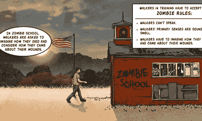
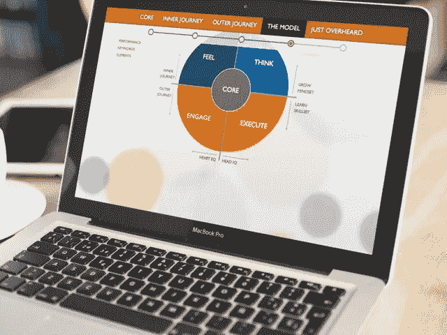
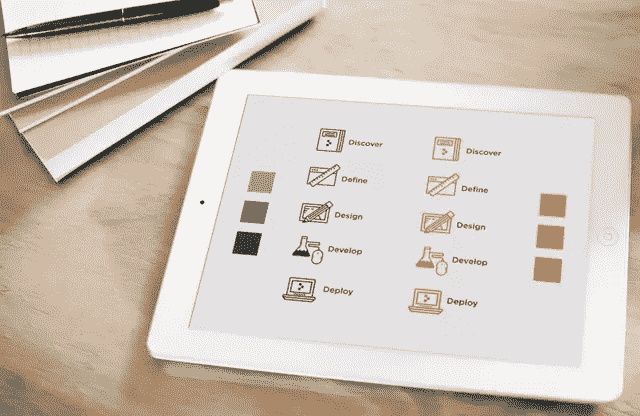
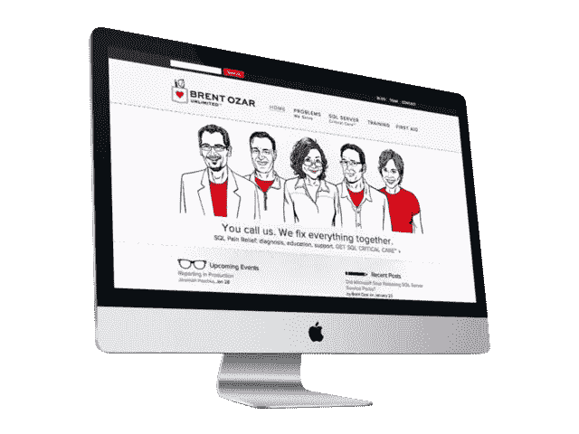

# 将于 2014 年实施的顶级网站设计趋势

> 原文：<https://www.sitepoint.com/top-website-design-trends-implement-2014/>

我们所知道的网络已经有 20 多年的历史了。正如任何事物的发展一样，万维网在过去的二十年里发生了巨大的变化。像互联网一样，网站设计技术也在不断发展，以增强用户体验。

虽然不是所有即将到来的趋势都适合你的网站重新设计或受众，但了解什么是可用的和受欢迎的是很好的，这样你就可以有效地和高效地接触到你的访问者。

## 2014 年网站设计趋势

行尸走肉网站用了很大的视差效果。

### 视差滚动:

视差滚动使网站栩栩如生，同时增加了图像和文本的深度。这种技术的示例包括更改图形或动画，以便当您在页面上滚动经过它们时，它们开始播放。

这种滚动技术实现了 HTML5 和 CSS3，是一种低成本、装饰性的设计解决方案，可以提高网站的惊艳度。

### 单页设计:

网站通常有一些页面，您可以使用导航链接来访问。内容较少的小网站正从这种模式转向更简单的模式，将图片和内容整合到一个网页上。

单页设计通常利用视差滚动，这样访问者就不必在许多页面中寻找最重要的信息。

虽然这种趋势对于消除不必要的混乱是很好的，但如果你的网站内容丰富，或者你的目标是提高搜索引擎优化，这可能不是最好的。

随着响应式设计的出现，固定式割台越来越受欢迎。

### 固定标题

内容丰富的网站在 2014 年的热门趋势是页面顶部的固定标题栏。一个固定的页眉保持在浏览器窗口上，不会随着访问者向下滚动页面而消失。这种技术使得在站点内的页面之间导航更容易，而不是滚动回到页面的顶部。

### 响应式网站设计

响应式设计简化了为桌面和移动设备设计网站的流程，确保网站内容看起来一致，并且适用于所有尺寸的设备。

### 平面网页设计

Windows 8、脸书和 Gmail 都使用它——一种利用简单性的平面网页设计和用户界面。平面设计去除了沉重的梯度，阴影，不必要的装饰，三维效果和图像，不会增加内容的价值。

相反，重点是大胆的线条，创造性的排版和饱和的颜色。这种设计技术为更容易扫描和处理的内容提供了更整洁的外观。扁平化设计可以增强网站的响应性设计，让页面加载更快。

### 更大的字体

虽然 12 号字体对于学校的论文来说很好，但在电脑屏幕上阅读起来很困难，在一些移动设备上看起来也不可能。2014 年是网站重新设计的一年，将会包含更大的文字，吸引眼球，可读性更好，也更容易阅读。

一个可靠的、有针对性的网页设计比一个没有目的的流行设计更重要。当你和网站设计者一起计划你的改变时，考虑你的网站目标，你公司的目标和价值，以及你想要增强的关键转换点。

## 分享这篇文章