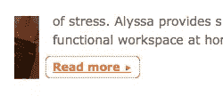
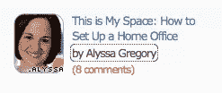

# 走向更酷的焦点插入符号

> 原文：<https://www.sitepoint.com/towards-a-cooler-focus-caret/>

焦点插入符号是当 HTML 元素具有焦点时，您在它们周围看到的虚线轮廓。在一些 Mac 浏览器中，你会看到一个标准化的发光蓝色边框，但大多数浏览器显示的是虚线轮廓。这通常不太好，但是指出哪个元素有焦点是完全必要的。

(一些开发人员非常讨厌它们，以至于试图用像`onfocus="this.blur()"`这样令人厌恶的 JavaScript 来压制它们。但是我认为你，我亲爱的读者，宁愿*咬掉自己的腿*也不愿做那样可怕的事情。)

以下是脱字符号的一个示例(这张截图是用 Mac/Firefox 拍摄的):


对于用键盘导航的人来说，焦点按钮提供了一个重要的辅助功能，因此，我们作为开发人员应该做的不是压制它们，而是让它们变得更明显。事实证明，我们可以使用一些 <abbr title="Cascading Style Sheets">CSS</abbr> 属性来做到这一点，并使*在交易中更有吸引力*——我说的是`outline`。

[的轮廓属性](https://www.w3.org/TR/CSS2/ui.html#dynamic-outlines)与`border`相似，有`outline-width`、`outline-style`和`outline-color`的子属性以及相同的简写语法，但它在布局的顶部绘制了一个边框*，而不是在布局内——所以它不会影响框的尺寸或导致任何位移，如果足够大，它可以覆盖其他元素或自身。*

这本身就使它成为一个有用的开发工具，因为您可以在元素上绘制测试边界，而不会影响它们占用的空间。

但它真正有用的是作为一个焦点插入符号，事实上我们发现浏览器的内置焦点插入符号是一种`outline`样式，通常是这样的:

```
a:focus
{
    outline:1px dotted 
}
```

继承元素焦点颜色的虚线边框。我建议你基本上保持原样——这是人们所期望的，而且有视觉意义。

但是你可以用两个额外的属性来补充它，通过给它**更多的空间**，让它看起来更酷一点**；这就是这篇文章的全部内容:**

 ***   [`outline-offset`](https://www.w3.org/TR/css3-ui/#outline-offset) 移动边框远离边框，在元素与其轮廓之间创建空间；和
*   [`-moz-outline-radius`](https://developer.mozilla.org/en/CSS/-moz-outline-radius) 赋予它可爱的圆角！

因此，作为一项全球规则，我们可以这样做:

```
a:focus
{
    outline:1px dotted;
    outline-offset:2px;
    -moz-outline-radius:5px;
}
```

我已经在新的博客设计中使用了这些风格的链接——所以效果就在你的周围！试着在页面上跳来跳去，你应该明白我的意思了——Firefox 是最好的浏览器，因为虽然偏移是跨浏览器的，但是半径是 Firefox 独有的。

然后，经过反复试验，我采用了以下惯例:

*   默认情况下，元素有`5px`半径和`2px`偏移:
    
*   对于非常小的文本，将偏移量减小到 1px:
    
*   对于已经有清晰边框的元素，比如主导航栏中的链接，清除偏移，使轮廓完美地包围元素:
    
    对于紧密包围的轮廓，你可能更喜欢去掉圆角——在导航栏链接上，我保留了它们，因为我觉得它们看起来有点酷！但是在类别选项卡上，我改变了它们，只有顶部的角是圆的，而底部的角是方的，以匹配选项卡本身:
    
    紧紧拥抱选项卡的现有边框，这样做确实会使轮廓不那么明显——这是你必须小心的——但是因为那里也有背景滚动，我认为总体上足够清楚了。

现在你知道了！当然，这些在 <abbr title="Internet Explorer">IE</abbr> 中都不起作用(尽管核心`outline`属性在 <abbr title="Internet Explorer 8">IE8</abbr> 中起作用)，但是我猜你已经猜到了！不过这真的没关系，因为我们没有丢失任何东西——默认轮廓没有受到影响并照常运行——所以这是教科书式的[渐进增强](https://www.sitepoint.com/progressive-enhancement-graceful-degradation-basics/)。

但我认为这比任何事情都更能证明的是**易访问性特征不一定是乏味的或功能性的**——它们可以像设计的任何其他部分一样展示出同样多的才华(无论[圆角](https://www.sitepoint.com/how-to-get-smoother-rounded-corners/)是否是你的东西！).对这些特性的关注使它们变得更有用，对那些不希望拥有它们的人来说也不那么烦人了。

*缩略图鸣谢:[ihtatho](http://www.flickr.com/photos/ihtatho/627226315/)*** 

## **分享这篇文章**