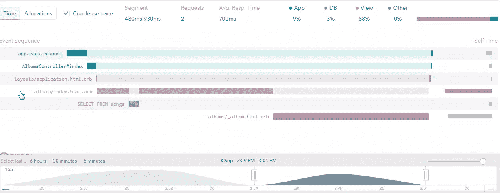
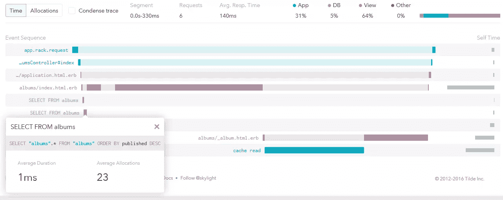

# 使用 Skylight 跟踪常见的 Rails 性能问题

> 原文：<https://www.sitepoint.com/tracking-common-rails-performance-issues-with-skylight/>


今天我将向大家介绍[Skylight](https://www.skylight.io/)——一款智能且易于使用的在线工具，用于分析 Rails、Sinatra 和 Grape 应用程序。在发现其主要特性的同时，我们将讨论常见的 Rails 性能问题以及解决这些问题的方法。

Skylight 有点类似于名为 [New Relic](https://newrelic.com/) 的流行服务，但它是专门为 Rails 应用程序设计的，目标是使与仪表板的交互更容易。 [Skylight 的团队认为](https://docs.skylight.io/faqs/#feature-requests-do-you-have-this-feature-that-new-relic-has)新遗迹有太多的特征，并不是所有的特征都真的有用。因此，Skylight 团队专注于提供即时价值的核心组件。Skylight [是免费的](https://www.skylight.io/#pricing)，每个月最多 10 万次请求，你还可以免费试用 30 天来测试它的功能。不错吧，嗯？

示例应用程序的源代码可以在 [GitHub](https://github.com/bodrovis/Sitepoint-source/tree/master/Tracking_with_Skylight) 上找到。

## 准备

要查看 Skylight 的运行情况，我们需要一个示例 Rails 应用程序。这将非常简单，但对于这篇介绍性文章来说已经足够了:

```
$ rails new SkylightDiag -T 
```

我用的是 Rails 5.0.0.1，但是 Skylight 也可以在版本 3 和 4 上使用。

假设，在这个应用程序中，我们想要列出音乐专辑及其曲目。所有的数据都是假的，但这并不重要。创建一个`Album`和一个`Song`模型:

```
$ rails g model Album title:string musician:string
$ rails g model Song title:string duration:integer album:belongs_to
$ rails db:migrate 
```

确保关联设置正确:

*models/album.rb*

```
[...]
has_many :songs, dependent: :delete_all
[...] 
```

*models/song.rb*

```
[...]
belongs_to :album
[...] 
```

添加控制器和根路由(稍后将添加视图):

*相册 _ 控制器. rb*

```
class AlbumsController < ApplicationController
  def index
    @albums = Album.all
  end
end 
```

*config/routes.rb*

```
[...]
root 'albums#index'
[...] 
```

让我们依靠 *db/seeds.rb* 和 [Faker](https://github.com/stympy/faker) gem 返回各种随机数据，而不是手工填充样本数据:

*Gemfile*

```
[...]
gem 'faker'
[...] 
```

别忘了跑步

```
$ bundle install 
```

这个 gem 最近进行了更新，现在包括了更多类型的样本数据(包括啤酒和星球大战英雄的名字)。准备 *seeds.rb* 文件:

*db/seeds.rb*

```
50.times do
  album = Album.create({title: Faker::Book.title, musician: Faker::StarWars.character})
  30.times do
    album.songs.create({title: Faker::Book.title, duration: rand(500)})
  end
end 
```

好吧，如果你是《权力的游戏》的粉丝，你可以用[来代替](https://github.com/stympy/faker#fakergameofthrones) …

最后，跑

```
$ rails db:seed 
```

来填充数据库。现在我们的实验室环境已经准备好了，我们可以继续下一步了。

## 集成天窗

在深入代码之前，我们先快速讨论一下 [Skylight 支持哪些环境](https://docs.skylight.io/running-skylight/)。它适用于 Ruby 1.9.2 和更高版本，但是推荐使用 2.1+版本来充分利用这些服务的工具。正如我之前说过的，它支持 Rails 3+，但也支持 Sinatra 1.2+，甚至 Grape 0.10+(但你会有更少的详细信息)。最后，Skylight 可以与任何*nix 服务器一起工作，甚至对于 Heroku 也不需要特殊的配置。跟踪客户端是用 Rust 和 C 编写的，所以应该不会消耗太多内存。

首先，点击这里获取你的 30 天试用版[(你还将从我这里获得 50 美元的积分作为小奖励:)。填写关于你自己和你的申请的基本信息，然后在*gem 文件*中添加一个新的 gem:](http://www.skylight.io/r/QUbJRYcJYjL2)

*Gemfile*

```
[...]
gem "skylight"
[...] 
```

奔跑

```
$ bundle install 
```

另请注意，Skylight 的设置向导要求您运行如下命令:

```
$ bundle exec skylight setup SOME_KEY 
```

这个命令通过创建一个 *config/skylight.yml* 文件来完成集成。之后，你就可以走了。请注意，您会看到一个用于共享应用程序数据的私有令牌。可以在你的账户设置页面[重新生成](https://docs.skylight.io/getting-set-up/#regenerating-the-app-token)。另外，不要忘记 Skylight 不会在开发环境中发送任何数据，所以您的应用程序必须部署在某个地方才能开始跟踪其性能。例如，在 Heroku 上部署时，可以使用以下命令设置 Skylight 的令牌:

```
$ heroku config:add SKYLIGHT_AUTHENTICATION='123abc' 
```

[这一页](https://docs.skylight.io/getting-set-up/)提供了 Skylight 与其他平台集成过程的完整概述，并解释了如何跟踪 Rails 之外的服务，如`Net::HTTP`、Moped、Redis 等。

## N+1 查询问题

完成所有设置后，让我们模拟第一个也可能是最广为人知的问题，称为“N+1 查询”。要查看它的实际效果，请在应用程序的主页上列出所有专辑及其曲目:

*views/albums/index . html . erb*

```
<h1>Albums</h1>
<ul>
  <%= render @albums %>
</ul> 
```

*views/albums/_ album . html . erb*

```
<li>
  <strong><%= album.title %></strong> by <%= album.musician %>
  <ul>
    <% album.songs.each do |song| %>
      <li><%= song.title %> (<%= song.duration %>s)</li>
    <% end %>
  </ul>
</li> 
```

启动服务器并导航至`http://localhost:3000`。在终端内部，您将看到类似于以下内容的输出:

```
Album Load (1.0ms)  SELECT "albums".* FROM "albums" ORDER BY published DESC
Song Load (0.0ms)  SELECT "songs".* FROM "songs" WHERE "songs"."album_id" = ?  [["album_id", 301]]
Song Load (1.0ms)  SELECT "songs".* FROM "songs" WHERE "songs"."album_id" = ?  [["album_id", 300]]
Song Load (1.0ms)  SELECT "songs".* FROM "songs" WHERE "songs"."album_id" = ?  [["album_id", 299]]
Song Load (0.0ms)  SELECT "songs".* FROM "songs" WHERE "songs"."album_id" = ?  [["album_id", 298]]
....
.... many similar stuff goes here 
```

基本上，对于每个父记录(专辑),我们发送一个单独的查询来获取其子记录(歌曲),并有效地向数据库发送垃圾信息。将您的应用程序部署到生产环境中，打开它的主页，几分钟后刷新 Skylight 的仪表板。

仪表板本身真的很好很整洁，你可以阅读[这份文件](https://docs.skylight.io/get-to-know-skylight/)来更好地了解它，了解 Skylight 的主要概念。它提供了有关每分钟请求数、典型响应时间和问题响应时间的信息，以及有关端点的一般信息。在我们的例子中，端点将是`AlbumsController#create`方法。在页面底部，您可以选择要显示的时间范围——差不多就是这样。


端点名称附近的红色数据库图标意味着它有许多重复的 SQL 查询，而饼图表明它有较高的对象分配。还要注意 Skylight 的特殊算法计算的“痛苦”栏，以找出哪个端点对应用程序的用户产生了最不利的影响。假设您有两个端点:一个端点的响应时间为 600 毫秒，但收到大量请求，而第二个端点的响应时间为 3 秒，但几乎没有请求。显然，600 毫秒比 3 秒好得多，但是只要第一个端点收到更多的请求，就应该优先考虑进一步减少其响应时间。

现在，如果您单击`AlbumsController#create`端点，您会看到类似这样的内容:


靠近绿色 SQL 行的两个循环红色箭头意味着[查询不是最优的](https://docs.skylight.io/performance-tips/)，并且很可能有
N+1 问题(尽管并不总是这样，在后面的部分我们将看到一个例子)。

因此，解决这个问题非常简单。你所要做的就是实现一个[所谓的“急切加载”](https://www.sitepoint.com/silver-bullet-n1-problem/)
来大大减少查询的数量。这是通过使用[包括](http://api.rubyonrails.org/classes/ActiveRecord/QueryMethods.html#method-i-includes)方法来完成的:

*相册 _ 控制器. rb*

```
[...]
def index
  @albums = Album.includes(:songs)
end
[...] 
```

现在在终点站你会看到

```
Album Load (1.0ms)  SELECT "albums".* FROM "albums"
Song Load (13.0ms)  SELECT "songs".* FROM "songs" WHERE "songs"."album_id" IN (202, 203, 204, 205, 206, ...) 
```

这当然更好。将应用程序的更新版本部署到服务器后，Skylight
不再报告该问题:



太好了！

## 启用片段缓存

另一种非常常见的加速应用程序的技术是[启用缓存](https://www.sitepoint.com/speed-things-up-by-learning-about-caching-in-rails/)。在这个演示中，我们将利用[嵌套片段缓存方法](http://guides.rubyonrails.org/caching_with_rails.html#russian-doll-caching)。首先，为父集合启用它:

*views/albums/index . html . erb*

```
<%= render @albums, cached: true %> 
```

接下来是儿童记录:

*views/albums/_ album . html . erb*

```
<li>
  <strong><%= album.title %></strong> by <%= album.musician %>
  <ul>
    <% album.songs.each do |song| %>
      <% cache song do %>
        <li><%= song.title %> (<%= song.duration %>s)</li>
      <% end %>
    <% end %>
  </ul>
</li> 
```

不要忘记你必须在你的服务器上设置缓存，这样才能正常工作。至于 Heroku，设置非常简单。启用 [Memcachier 插件](https://devcenter.heroku.com/articles/memcachier)(免费版):

```
$ heroku addons:create memcachier:dev 
```

掉落在[达利宝石](https://github.com/petergoldstein/dalli)

*Gemfile*

```
[...]
gem 'dalli'
[...] 
```

安装它

```
$ bundle install 
```

并调整生产环境的配置:

*配置/环境/生产. rb*

```
[...]
config.cache_store = :dalli_store,
    (ENV["MEMCACHIER_SERVERS"] || "").split(","),
    {:username => ENV["MEMCACHIER_USERNAME"],
     :password => ENV["MEMCACHIER_PASSWORD"],
     :failover => true,
     :socket_timeout => 1.5,
     :socket_failure_delay => 0.2,
     :down_retry_delay => 60
    }
[...] 
```

部署到生产后，Skylight 将显示关于使用缓存存储的附加信息，而响应时间将显著减少:


## 分组交易记录

另一种不太常用的提升应用性能的技术是将多个事务组合成一个。假设用户可以通过上传 CSV 文件向应用程序添加额外的相册。当然，我们不会执行文件的实际解析——让我们通过引入一个简单的循环来模拟它:

*相册 _ 控制器. rb*

```
 [...]
  def create
    50.times do
      Album.create({title: Faker::Book.title, musician: Faker::StarWars.character})
    end
    redirect_to root_path
  end
  [...] 
```

添加路线

*config/routes.rb*

```
[...]
resources :albums, only: [:create]
[...] 
```

并将按钮放在主页上以运行导入过程:

*views/albums/index . html . erb*

```
[...]
<%= link_to 'add more albums', albums_path, method: :post %>
[...] 
```

当按下这个按钮时，你会看到每个操作都是在自己的事务中完成的(是的，尤达现在是一名音乐家):

```
(0.0ms)  begin transaction
SQL (4.0ms)  INSERT INTO "albums" ("title", "musician", "created_at", "updated_at") VALUES (?, ?, ?, ?)  [["title", "The Far-Distant Oxus"], ["musician", "Yoda"], ["created_at", 2016-09-13 13:09:29 UTC], ["updated_at", 2016-09-13 13:09:29 UTC]]
(81.0ms)  commit transaction 
```

我们在插入操作上花费了 4 毫秒，而事务的提交持续了 20 多倍！这是天光的视觉效果:


相反，最好将所有这些`INSERT`指令组合成一个事务，并且只应用一次:

*相册 _ 控制器. rb*

```
 [...]
  def create
    Album.transaction do
      50.times do
        Album.create({title: Faker::Book.title, musician: Faker::StarWars.character})
      end
    end
    redirect_to root_path
  end
  [...] 
```

现在的输出是:

```
(1.0ms)  begin transaction
SQL (1.0ms)  INSERT INTO "albums" ("title", "musician", "created_at", "updated_at") VALUES (?, ?, ?, ?)  [["title", "A Handful of Dust"], ["musician", "Yoda"], ["created_at", 2016-09-13 13:14:26 UTC], ["updated_at", 2016-09-13 13:14:26 UTC]]
...
many other INSERTs here
...
(133.0ms)  commit transaction 
```

如果您希望在出现错误时中止导入过程，这也更好，因为事务不能被部分应用。

以下是图示:


那些红色的循环箭头仍然存在，因为我们确实有循环执行的查询。

## 添加索引

另一种非常简单但有时被忽略的性能优化技术是添加数据库索引。绝对有必要对你的所有列进行外键和主键的索引；具有布尔值的列(如`admin`、`banned`或`published`)也是不错的选择。lol_dba gem 可以扫描你的模型并给出一个应该被索引的列的列表。

让我们引入一个新的`published`列，说明一张专辑是否已经发行:

```
$ rails g migration add_published_to_albums published:boolean 
```

稍微修改一下迁移

```
def change
  add_column :albums, :published, :boolean, default: false
end 
```

并应用它:

```
$ rails db:migrate 
```

“发布”20 张随机专辑:

*db/seeds.rb*

```
Album.all.shuffle.take(20).each {|a| a.toggle!(:published)}

$ rails db:seed 
```

现在，让我们使用这个新列来显示已发行专辑的列表或完整的订购列表:

*相册 _ 控制器. rb*

```
def index
  if params[:published] == 't'
    @albums = Album.includes(:songs).where(published: true)
  else
    @albums = Album.includes(:songs).order('published DESC')
  end
end 
```

以下是 Skylight 仪表盘上的结果:


当然，正如您已经猜到的,`published`列是添加索引的绝佳选择，所以现在让我们开始吧:

```
$ rails g migration add_missing_index_to_albums 
```

*migrations/XYZ _ add _ missing _ index _ to _ albums . Rb*

```
[...]
def change
  add_index :albums, :published
end
[...] 
```

应用迁移:

```
$ rails db:migrate 
```

并在天光上观察结果:



性能提升可能没有那么高，但是当执行许多涉及列的操作时，索引的存在会带来很大的不同。

## 结论

在本文中，我们讨论了 Skylight——一个用于 Rails、Sinatra 和 Grape 应用程序的智能分析器。在探索它的主要特性时，我们有机会看看 Rails 应用程序中一些最常见的性能问题。当然，我们的示例应用程序不是很有代表性，但是您至少已经对 Skylight 的功能有了一个基本的概念，所以一定要在一个真实的项目中尝试一下。

希望你喜欢阅读这篇文章，现在会更关心你的应用程序的性能。我感谢你陪着我。下次见！

## 分享这篇文章