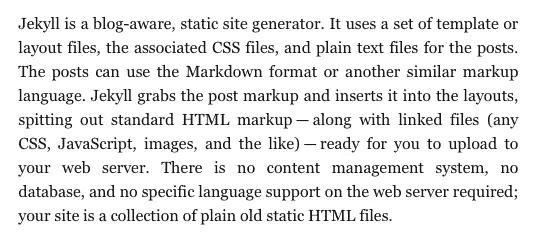
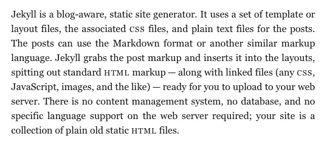
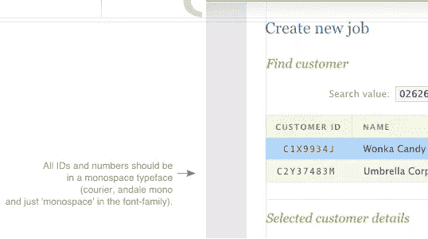
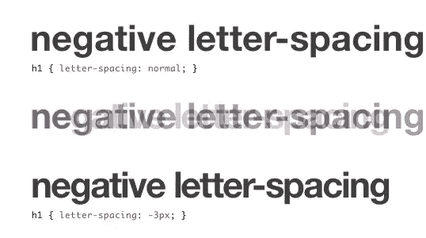

# 跟踪 CSS 字母间距及其使用位置

> 原文：<https://www.sitepoint.com/tracking-css-letter-spacing-and-where-to-use-it/>

属性是一个经常被遗忘的 CSS 选项，它允许我们改变字母之间的间距。很少需要改变默认间距，因为文本字体是为设置较大文本块的易读性和可读性而设计和优化的。但是，对字母之间水平间距的精细控制在特定情况下会很有用。

## 字母间距属性

CSS 属性从 CSS1 开始就有了，谢天谢地，它几乎得到了所有主流浏览器的完美支持。要使用该属性，我们只需调用它并给它一个长度值:

```
h1 { letter-spacing: −1px; }
```

除了默认间距(称为字距调整)之外，还会在字符之间插入该长度值。快速提示:虽然负值是允许的，但百分比是不允许的(有充分的理由)。如果您想确保您的跟踪保持相对于字体大小(万一它是减少或增加)，设置您的 ems 值。

该属性也接受描述性的值“normal”和“inherit ”,但是后者有一些问题。

跟踪还与文本对齐交互，文本对齐由用户代理(如浏览器)和字体渲染引擎计算。当文本对齐时(如 `text-align: justify;`)，浏览器不会改变跟踪，除非`letter-spacing: normal;`被设置。但是请记住，“正常”和“0”值在这方面是不等价的，所以如果您想要重置继承的字母间距并确保其相应地运行，请确保将其设置回“正常”。

还有另一个 CSS 属性类似于 letter-spacing 提供对`word-spacing`的控制。用例:几乎从不。

## `letter-spacing`的用例

### 增加易读性

首先也是最重要的`letter-spacing`允许我们在文本之间插入额外的空间，这有助于提供更好的可读性。这方面的两个主要例子是设置首字母缩略词和一系列数字或图形。

#### 空格缩略词

首字母缩略词主要是一串大写字符，由于大写字母的高度和基线的一致性，比小写字母更难识别(见我之前的帖子，*:# 6*)。

避免在一段文本中出现首字母缩略词并使其成为眼中钉的一个常用技巧是用小型大写字母(`font-variant: small-caps;`)来设置它们。通过这样做，现在“小”大写字母的高度与文本中嵌套得更好的 [x 高度](https://secure.wikimedia.org/wikipedia/en/wiki/X-height "Wikipedia (EN): x-height")对齐。然而，由于现在更小，小型大写字母会变得有些难以辨认，因为默认情况下它们彼此靠得很近。

在这里，我们可以通过在字形之间添加一些额外的间距单位来调用跟踪。例如:

```
acronym, .caps, abbr {
    text-transform: lowercase;
    font-variant: small-caps;
    font-style: normal;
    letter-spacing: 1px;
    }
```

[](https://www.sitepoint.com/wp-content/uploads/2011/03/acronym-styling_off.png)
[](https://www.sitepoint.com/wp-content/uploads/2011/03/acronym-styling_on.png)

#### 间隔衬里图形

第二个例子是偶尔给划线图形增加的间距，即图形(即数字)高度一致，不超过 x 高度，也不像[文本或“旧式”图形](https://secure.wikimedia.org/wikipedia/en/wiki/Text_figures "Wikipedia (EN): Text figures")那样低于基线。

设置首字母缩略词的原则同样适用。虽然主要不是用于正文中的数字(因为理想情况下你会使用文本数字),但衬线数字通常用于表格工作:例如财务报告。见下面的例子，其中内衬数字以 ID 号的形式与全大写字母混合在一起:

[](https://www.sitepoint.com/wp-content/uploads/2011/03/aurora-tabular-liningcap-eg.png)

### 为了美观

跟踪也可以用于美学。一个特别流行的趋势是负面空间 Helvetica(或 Arial):

[](https://www.sitepoint.com/wp-content/uploads/2011/03/negative-letter-spacing-helvetica-3.png)

注意:在应用负间距时要非常小心，不要让文本变得难以辨认。如果设置为较小的尺寸，上面的样式将变得难以阅读，因此为特殊场合保留负间距，并且只有在足够大的尺寸下。

## 关闭

跟踪只是另一个工具，允许设计者和排版者微调文本的水平间距。它的应用应该大体上是为了增加易读性。出于纯粹的风格原因，在应用跟踪时要小心:[不要无缘无故地改变整数间距](http://webtypography.net/Rhythm_and_Proportion/Horizontal_Motion/2.1.9/ "The Elements of Typographic Style Applied to the Web: 2.1.9 Don't alter the widths or shapes of letters without cause")。

## 分享这篇文章