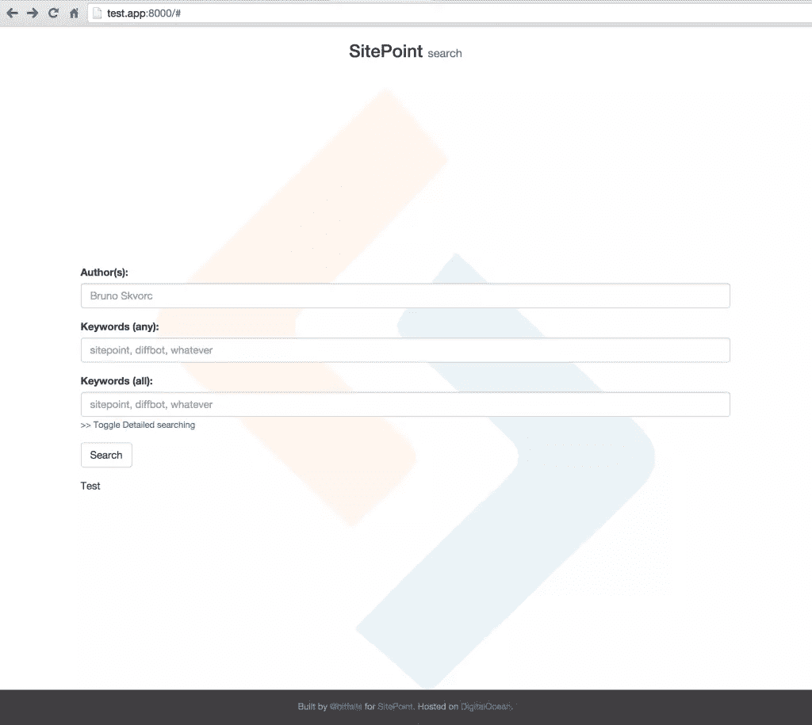
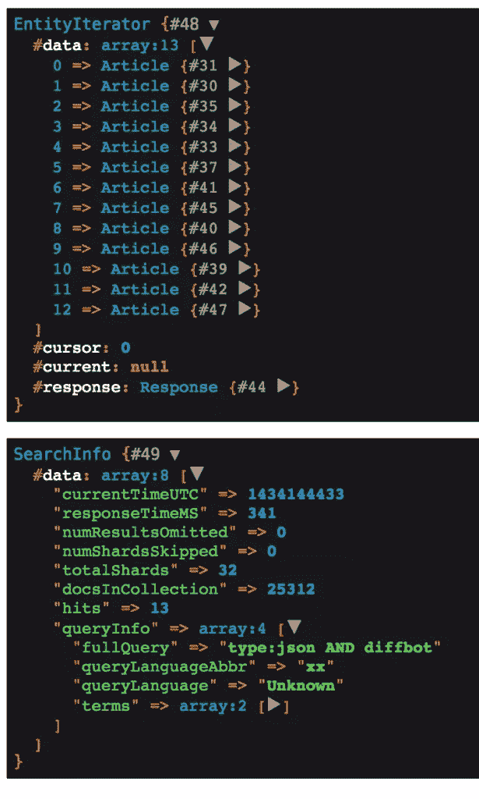
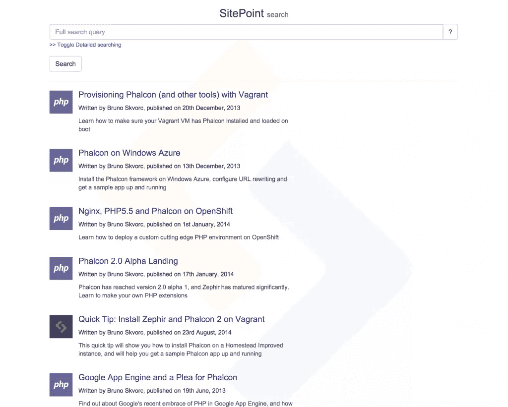
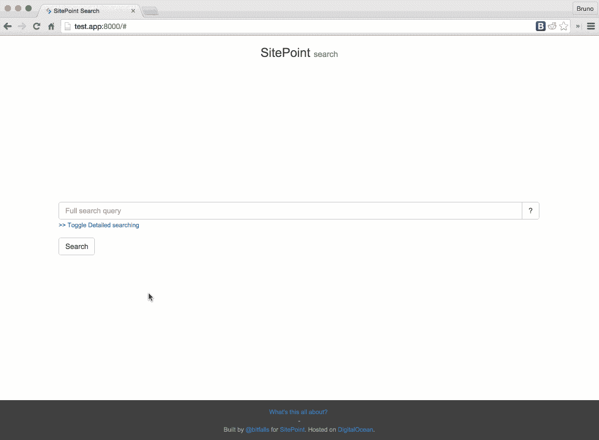

# 用 PHP 将抓取的网站变成搜索引擎

> 原文：<https://www.sitepoint.com/turning-crawled-website-search-engine-php/>

在本教程的前一部分中，我们使用 Diffbot 设置了一个 crawljob，最终将 SitePoint 的内容收集到一个数据集合中，完全可以通过 Diffbot 的[搜索 API](https://www.diffbot.com/dev/docs/search/) 进行搜索。我们还通过应用一些常见的过滤器并列出结果来展示这些搜索功能。


在这一部分中，我们将构建一个足够简单的 GUI 供普通人使用，以便拥有一个相对漂亮、实用、轻量级但详细的 SitePoint 搜索引擎。更重要的是，我们将不会使用一个框架，而是仅仅使用三个库来构建整个应用程序。

你可以在这里看到演示应用[。](http://search.sitepoint.tools)

本教程是完全独立的，因此如果你选择跟随，你可以从一个新的 [Homestead 改进的](https://www.sitepoint.com/quick-tip-get-homestead-vagrant-vm-running/)实例开始。请注意，为了真正充分利用我们构建的内容，您需要一个具有 Crawljob 和搜索 API 功能的 Diffbot 帐户。

## 拔靴带

继续，我假设你用的是流浪机器。如果没有，找出[你为什么要](https://www.sitepoint.com/re-introducing-vagrant-right-way-start-php/)，然后再回来。

在新的 [Homestead 改进的](https://www.sitepoint.com/quick-tip-get-homestead-vagrant-vm-running/) VM 上，引导程序如下:

```
composer global require beelab/bowerphp:dev-master
mkdir sp_search
cd sp_search
mkdir public cache template template/twig app
composer require swader/diffbot-php-client
composer require twig/twig
composer require symfony/var-dumper --dev
```

按顺序，这:

*   全局安装 [BowerPHP](https://www.sitepoint.com/bower-vs-bowerphp/) ，因此我们可以在整个虚拟机上使用它。
*   创建项目的根文件夹和几个子文件夹。
*   安装 [Diffbot PHP 客户端](https://github.com/Swader/diffbot-php-client)，我们将使用它对 API 进行所有调用，并遍历结果。
*   安装 [Twig 模板引擎](http://twig.sensiolabs.org)，所以我们不会像农民一样在 PHP 中回显 HTML:)
*   在开发模式下安装 [VarDumper](https://www.sitepoint.com/var-dump-introducing-symfony-vardumper/) ，这样我们就可以在开发的同时轻松调试。

为了引导我们应用程序的“前端”部分，我们执行以下操作:

```
cd public
mkdir assets assets/{css,js,img}
bowerphp install bootstrap
bowerphp install normalize.css
touch assets/css/main.css assets/js/main.js index.php token.php
```

我还使用了 [iconifier](http://iconifier.net/) 来生成一些图标，并抓取了一个大的 SitePoint 徽标图像作为网站的背景，但这都是完全可选的。

以上命令创建一些文件夹和空白文件，并安装引导程序。他们还创建了我们的小搜索应用程序的前端控制器(`index.php`)。我们可以这样设置这个文件:

```
<?php

use SitePoint\Helpers\SearchHelper;
use Swader\Diffbot\Diffbot;

require_once '../vendor/autoload.php';
require_once '../token.php';

$loader = new Twig_Loader_Filesystem(__DIR__ . '/../template/twig');
$twig = new Twig_Environment($loader
   , array('cache' => false, 'debug' => true)
);
$vars = [];

// Get query params from request
parse_str($_SERVER['QUERY_STRING'], $queryParams);

// Check if the search form was submitted
if (isset($queryParams['search'])) {

    $diffbot = new Diffbot(DIFFBOT_TOKEN);

    // Building the search string
    $string = '';

    // Basics
    $search = $diffbot
        ->search($string)
        ->setCol('sp_search');

    // Pagination
    // ...
}

echo $twig->render('home.twig', $vars);
```

本质上，我们设置 Twig，获取`$_GET`内容，并初始化 Diffbot 搜索调用(但从不执行它)。最后，我们制作模板文件`template/twig/home.twig`:

```
Hello!
```

如果你现在尝试运行这个“应用”，你应该会看到“你好”。您还应该看到模板的缓存版本出现在`cache`文件夹中。确保首先建立`token.php`文件——它需要以下内容:

```
<?php

define('DIFFBOT_TOKEN', 'my_token');
```

然后，我们将这个文件添加到项目的`.gitignore`文件中。请随意使用这个并根据需要进行更新。这样我们就不会意外地将 Diffbot 令牌提交给 Github——被盗的令牌可能会变得非常昂贵。

自举完成后，现在让我们来看看事情的实质。

## 前端

这个想法(在这一点上)是有一个主搜索字段，像 Google 一样，接受几乎原始的搜索 API 查询，和三个普通的旧文本字段，用户可以在其中输入逗号分隔的值:

*   “作者”将支持作者。输入几篇文章将会进行“或”搜索——比如，作者 1、作者 2 或作者 3 写的文章等等…
*   “Keywords (any)”将在任何 Diffbot 提取的字段中搜索任何给定的关键字。这包括正文、标题、元数据，甚至作者等等。
*   “Keywords (all)”也搜索关键字，但是那些**必须全部**出现在任何 Diffbot 提取的字段中。

让我们更新我们的`home.twig`文件，受 HTML5 样板的启发。

```
<!doctype html>
<html lang="en">
<head>
    <meta charset="utf-8">
    <meta http-equiv="x-ua-compatible" content="ie=edge">
    <title>SitePoint Search</title>
    <meta name="description" content="Diffbot-powered SitePoint Search Engine">
    <meta name="viewport" content="width=device-width, initial-scale=1">

    <link rel="apple-touch-icon" href="/apple-touch-icon.png">

    <link rel="stylesheet" href="/bower_components/normalize.css/normalize.css">
    <link rel="stylesheet"
          href="/bower_components/bootstrap/dist/css/bootstrap.min.css"/>
    <link rel="stylesheet" href="/assets/css/main.css">

</head>
<body>

<header>
    <h3>SitePoint
        search
    </h3>
</header>
<div class="content">
    <!--[if lt IE 8]>
    <p class="browserupgrade">You are using an <strong>outdated</strong>
        browser.
        Please <a href="http://browsehappy.com/">upgrade your browser</a> to
        improve
        your experience.</p>
    <![endif]-->

    <div class="search-form">
        <form id="main-form" class="submit-once">

            <div class="main-search form-group">
                <div class="input-group">
                    <input class="form-control" type="text" name="q" id="q"
                           placeholder="Full search query"/>
                <span class="input-group-btn">
                    <button class="btn btn-default" type="button"
                            data-toggle="modal"
                            data-target="#examples-table">?
                    </button>
                </span>
                </div>
                <a href="#" class="small detailed-search">>> Toggle Detailed
                    searching</a>
            </div>

            <div class="detailed-search-group" style="display: none;">
                <div class="form-group">
                    <label for="authorinput">Author(s): </label><input
                            class="form-control"
                            id="authorinput"
                            name="authors"
                            type="text"
                            placeholder="Bruno Skvorc"/>
                </div>
                <div class="form-group">
                    <label for="kanyinput">Keywords (any): </label><input
                            class="form-control"
                            id="kanyinput"
                            name="keywords_any"
                            type="text"
                            placeholder="sitepoint, diffbot, whatever"/>
                </div>
                <div class="form-group">
                    <label for="kallinput">Keywords (all): </label><input
                            class="form-control"
                            id="kallinput"
                            name="keywords_all"
                            type="text"
                            placeholder="sitepoint, diffbot, whatever"/>
                    <a href="#" class="small detailed-search">>> Toggle Detailed
                        searching</a>
                </div>

            </div>

            <div class="form-group">
                <input id="submit" class="btn btn-default" type="submit"
                       value="Search" name="search"/>
            </div>

        </form>
        
    </div>

    <script src="/bower_components/jquery/dist/jquery.min.js"></script>
    <script src="/bower_components/bootstrap/dist/js/bootstrap.min.js"></script>
    <script src="/assets/js/main.js"></script>

    

</div>
<footer>
    <a href="what.html">What's this all about?</a>
    <br>-<br>
    Built by <a href="https://twitter.com/bitfalls">@bitfalls</a> for <a
            href="https://www.sitepoint.com">SitePoint</a>. Hosted on <a
            href="http://bit.ly/do-ref">DigitalOcean</a>.
</footer>



</body>
</html>
```

请注意，我还将 HTML 中一些乏味的部分提取到子模板中。这些包括[谷歌分析片段](https://github.com/Swader/diffbot-sp-search/blob/master/template/google-analytics.htpl)，带有搜索查询示例的[模态](https://github.com/Swader/diffbot-sp-search/blob/master/template/modal-examples.htpl)，以及最重要的，我们稍后将用来输出结果的结果模板。只有结果是重要的，所以创建文件`template/twig/results.twig`，即使它是空的或者只有“测试”的内容。其他的可以从`home.twig`模板中一起移除，或者你可以从 [Github repo](https://github.com/swader/diffbot-sp-search) 中获取它们。

现在，让我们给整个事情添加一点 CSS flexbox 魔法、背景图像和基本的 jQuery-ism，使元素和谐相处。例如，我们使用一个 form 类来防止重复提交，我们还使用`localStorage`来记住用户是喜欢详细搜索还是常规搜索:

```
// main.js

$(document).ready(function () {

    $('form.submit-once').submit(function(e){
        if( $(this).hasClass('form-submitted') ){
            e.preventDefault();
            return;
        }
        $(this).addClass('form-submitted');
        $('#submit').addClass('disabled');
    });

    var dsg = $('.detailed-search-group');
    var ms = $('.main-search');

    if (localStorage.getItem('detailed-on') == "true") {
        dsg.show();
        ms.hide();
    } else {
        dsg.hide();
        ms.show();
    }

    $(".detailed-search").click(function (e) {
        ms.toggle();
        dsg.toggle();
        localStorage.setItem('detailed-on', dsg.is(':visible'));
    });
});
```

```
/* main.css */

body {
    display: flex;
    min-height: 100vh;
    flex-direction: column;
    font-family: arial,sans-serif;
}

div.content {
    display: flex;
    flex: 1;
    align-items: center;
    justify-content: center;
}

div.content.what {
    max-width: 500px;
    margin: auto;
}

div.hidden {
    display: none;
}

div.search-form {
    width: 80%;
}

.results {
    max-width: 600px;
    font-size: small;
}

footer {
    padding: 1.5rem;
    background: #404040;
    color: #999;
    font-size: .85em;
    text-align: center;
    z-index: 1;
}

header {
    text-align: center;
}

img.bg {
    /* Set rules to fill background */
    min-height: 100%;
    min-width: 1024px;

    /* Set up proportionate scaling */
    width: 100%;
    height: auto;

    /* Set up positioning */
    position: fixed;
    top: -60px;
    left: 0;

    z-index: -1000;

    opacity: 0.05;
    filter: alpha(opacity=5);
}

@media screen and (max-width: 1024px) { /* Specific to this particular image */
    img.bg {
        left: 50%;
        margin-left: -512px;   /* 50% */
    }
}
```

而且我们有我们的基本接口(用来自一个嘲弄的`results.twig`的“测试”):



有一个主搜索域，类似于 Google，它接受以搜索 API 友好方式构建的任何关键字或短语。把它想象成对搜索 API 的直接访问。参见[示例模态](https://github.com/Swader/diffbot-sp-search/blob/master/template/modal-examples.htpl)了解其内容。

然而，通过点击“Toggle Detailed ”,情况发生了变化，我们有了自己的搜索字段，可以获得更精确的结果。让我们现在把这些田地连接起来。

## 后端

让我们将`index.php`的`Building the search string`部分改为如下:

```
// Building the search string
    $searchHelper = new \SitePoint\Helpers\SearchHelper();
    $string = (isset($queryParams['q']) && !empty($queryParams['q']))
        ? $queryParams['q']
        : $searchHelper->stringFromParams($queryParams);
```

为了代码更简洁，我们将查询构建机制抽象为一个强力 SearchHelper 类。

```
// [root]/app/helpers/SearchHelper.php

<?php

namespace SitePoint\Helpers;

class SearchHelper
{
    protected $strings = [];

    public function stringFromParams(array $queryParams)
    {
        $this->authorCheck($queryParams);
        $this->keywordCheck($queryParams);

        if (empty($this->strings)) {
            die("Please provide at least *some* search values!");
        }

        return (count($this->strings) > 1) ? implode(' AND ',
            $this->strings) : $this->strings[0];
    }

    protected function authorCheck(array $queryParams)
    {
        if (isset($queryParams['authors']) && !empty($queryParams['authors'])) {

            $authors = array_map(function ($item) {
                return 'author:"' . trim($item) . '"';
            }, explode(',', $queryParams['authors']));

            $this->strings[] = '(' . ((count($authors) > 1)
                    ? implode(' OR ', $authors)
                    : $authors[0]) . ')';
        }
    }

    protected function keywordCheck(array $queryParams)
    {
        $kany = [];
        if (isset($queryParams['keywords_any']) && !empty($queryParams['keywords_any'])) {
            $kany = array_map(function ($item) {
                return trim($item);
            }, explode(',', $queryParams['keywords_any']));
        }

        $kall = [];
        if (isset($queryParams['keywords_all']) && !empty($queryParams['keywords_all'])) {
            $kall = array_map(function ($item) {
                return trim($item);
            }, explode(',', $queryParams['keywords_all']));
        }

        $string = '';
        if (!empty($kany)) {
            $string .= (count($kany) > 1) ? '(' . implode(' OR ',
                    $kany) . ')' : $kany[0];
        }

        if (!empty($kall)) {
            $string .= ' AND ';
            $string .= (count($kall) > 1) ? implode(' AND ', $kall) : $kall[0];
        }

        if (!empty($string)) {
            $this->strings[] = '(' . $string . ')';
        }
    }
}
```

方法`stringFromParams`调用一些子方法，这些子方法在传入的参数数组中寻找一些预定义的数组键，并使用它们来构建符合搜索 API 的查询字符串。为了简单起见，我在本教程中只包括了作者和关键字检查。

自然，我们需要将`SitePoint\Helpers`名称空间添加到 Composer 中进行自动加载:

```
"autoload": {
    "psr-4": {
      "SitePoint\\Helpers\\": "app/Helpers/"
    }
  }
```

编辑完一个自动加载程序块后，我们需要用`composer dump-autoload`更新自动加载程序。

到目前为止，我们已经有了查询构建功能和搜索表单。

让我们测试一下，看看是否能得到一些结果。

在`index.php`的`if (isset($queryParams['search'])) {`块的末尾，放置以下内容:

```
dump($search->call());
dump($search->call(true));
```

在主搜索栏中输入`diffbot`,我确实得到了 13 篇 SitePoint 帖子:



我们应用程序的两个方面仍然存在:

*   将这些数据很好地打印在模板中。
*   如果返回的结果超过 20 个，允许用户浏览页面。

## 输出

为了获得正确的输出，我们应该做的第一件事是将数据分配给模板变量:

```
// index.php modification - instead of the two `dumps`

    // Add to template for rendering
    $vars = [
        'results' => $search->call(),
        'info' => $search->call(true)
    ];
```

然后，我们编辑`results.twig`模板。

```
<hr>
<div class="results">
    

        <div class="Media post">
                

            <div class="Media-body">
                <h3><a target="_blank"
                       href="{{ article.pageUrl }}">{{ article.title }}</a></h3>

                <p class="author">Written by {{ article.author }}, published on {{ article.date|date("jS F, Y") }}</p>

                <p class="description">{{ article.meta.description }}</p>
            </div>
        </div>

    
        <p>No results :(</p>

    
</div>
```

我们还需要将[媒体对象样式](http://philipwalton.github.io/solved-by-flexbox/demos/media-object/)添加到 CSS 中。

```
.Media h3 {
    font-size: 18px;
    margin-top: 0;
}

.Media h3 a {
    text-decoration: none;
    color: #1a0dab;
}

.Media h3 a:visited {
    color: #609;
}

.Media h3 a:hover {
    text-decoration: underline;
}

.Media {
    display: flex;
    align-items: flex-start;
    width: 530px;
}

.Media.post {
    margin-bottom: 23px;
}

.Media-figure {
    margin-right: 1em;
    width: 50px;
}

.Media-body {
    flex: 1;
}

.Media .description {
    line-height: 1.4;
    word-wrap: break-word;
    color: #545454;
}
```

瞧。我们有一个基本的类似谷歌的结果页面:



***注**:由于不同的链接指向相同的资源(重定向)，有些结果是重复的。这是一个临时的搜索 API 限制，可以通过手动清除重复项来解决，直到 Diffbot 的开发团队添加一个修复程序。*

## 页码

要添加分页，我们需要总点击量和每页的结果数。如果我们知道当前页面，那么我们就可以很容易地计算出其他所有内容。为了实现分页，我们执行以下操作。

首先，我们通过在`results.twig` include 标签下添加以下代码片段来编辑`home.twig`:

```

```

然后创建模板:

```

    <nav>
        <ul class="pagination">
            
                <li><a href="/{{ qprw({ 'page': 1 }) }}">&laquo;&nbsp;First</a></li>
            
                <li class="disabled">
                    <span>&laquo;&nbsp;{{ 'First' }}</span>
                </li>
            

            
                <li><a href="/{{ qprw({ 'page': paginationData.currentPage - 1 }) }}">&lsaquo;&nbsp; Previous</a></li>
            
                <li class="disabled">
                    <span>&lsaquo;&nbsp;{{ 'Previous' }}</span>
                </li>
            

            
                
                    <li>
                        <a href="/{{ qprw({ 'page': page }) }}">{{ page }}</a>
                    </li>
                
                    <li class="active">
                        <span>{{ page }}</span>
                    </li>
                

            

            
                <li><a href="/{{ qprw({ 'page': paginationData.currentPage + 1 }) }}">Next&nbsp;&rsaquo;</a></li>
            
                <li class="disabled">
                    <span>{{ 'Next' }}&nbsp;&rsaquo;</span>
                </li>
            

            
                <li><a href="/{{ qprw({ 'page': paginationData.pageCount }) }}">Last ({{ paginationData.pageCount }})&nbsp;&raquo;</a></li>
            
                <li class="disabled">
                    <span>{{ 'Last' }}&nbsp;&raquo;</span>
                </li>
            

        </ul>
    </nav>

```

前两个 IF 块呈现第一个和最后一个页面链接，或者如果用户已经在第一个页面上，则显示为禁用。中间的循环遍历一系列页面并呈现它们——当前页面之前几页，之后几页，也称为“滑动分页”。最后两个块分别呈现“下一页”和“最后一页”链接。

为了获得这个模板使用的`paginationData`值，我们将创建另一个助手类:

```
// app/Helpers/PaginationHelper.php

<?php

namespace SitePoint\Helpers;

use Swader\Diffbot\Entity\EntityIterator;
use Swader\Diffbot\Entity\SearchInfo;

class PaginationHelper
{
    public function getPaginationData(
        $currentPage,
        $itemsPerPage,
        $pageRange,
        EntityIterator $res,
        SearchInfo $searchInfo
    ) {

        $paginationData = [];

        $paginationData['pageCount'] = !count($res)
            ? 0
            : ceil($searchInfo->getHits() / $itemsPerPage);

        $paginationData['currentPage'] = ($paginationData['pageCount'] < $currentPage)
            ? $paginationData['pageCount']
            : $currentPage;

        $paginationData['pageRange'] = ($pageRange > $paginationData['pageCount'])
            ? $paginationData['pageCount']
            : $pageRange;

        $delta = ceil($paginationData['pageRange'] / 2);

        if ($paginationData['currentPage'] - $delta > $paginationData['pageCount'] - $paginationData['pageRange']) {
            $pages = range($paginationData['pageCount'] - $paginationData['pageRange'] + 1,
                $paginationData['pageCount']);
        } else {
            if ($paginationData['currentPage'] - $delta < 0) {
                $delta = $paginationData['currentPage'];
            }
            $offset = $paginationData['currentPage'] - $delta;
            $pages = range($offset + 1, $offset + $paginationData['pageRange']);
        }

        $paginationData['pagesInRange'] = $pages;

        $proximity = floor($paginationData['pageRange'] / 2);

        $paginationData['startPage'] = $paginationData['currentPage'] - $proximity;
        $paginationData['endPage'] = $paginationData['currentPage'] + $proximity;

        if ($paginationData['startPage'] < 1) {
            $paginationData['endPage'] = min($paginationData['endPage'] + (1 - $paginationData['startPage']),
                $paginationData['pageCount']);
            $paginationData['startPage'] = 1;
        }

        if ($paginationData['endPage'] > $paginationData['pageCount']) {
            $paginationData['startPage'] = max($paginationData['startPage'] - ($paginationData['endPage'] - $paginationData['pageCount']),
                1);
            $paginationData['endPage'] = $paginationData['pageCount'];
        }

        $paginationData['previousPage'] = $paginationData['currentPage'] > 1;
        $paginationData['nextPage'] = $paginationData['currentPage'] < $paginationData['pageCount'];

        return $paginationData;

    }
}
```

很大程度上受来自 [KnpLabs](https://github.com/KnpLabs/KnpPaginatorBundle) 的类似实现的启发，这个类集合了使分页控件工作所需的`paginationData`数组。如果你对它的功能感兴趣，可以浏览一下——这很简单，如果不感兴趣，请告诉我，我会尽力解释。

最后，我们需要在`index.php`中实现这个。该文件的最终版本如下所示:

```
<?php

use SitePoint\Helpers\PaginationHelper;
use SitePoint\Helpers\SearchHelper;
use Swader\Diffbot\Diffbot;

require_once '../vendor/autoload.php';
require_once '../token.php';

$loader = new Twig_Loader_Filesystem(__DIR__ . '/../template/twig');
$twig = new Twig_Environment($loader
   , array('cache' => false, 'debug' => true)
);

$function = new Twig_SimpleFunction('qprw', function (array $replacements) {
    parse_str($_SERVER['QUERY_STRING'], $qp);
    foreach ($replacements as $k => $v) {
        $qp[$k] = $v;
    }
    return '?'.http_build_query($qp);
});
$twig->addFunction($function);

$vars = [];

// Get query params from request
parse_str($_SERVER['QUERY_STRING'], $queryParams);

$resultsPerPage = 20;
$pageRange = 9;

if (!isset($queryParams['page'])) {
    $queryParams['page'] = 1;
}

// Check if the search form was submitted
if (isset($queryParams['search'])) {

    $diffbot = new Diffbot(DIFFBOT_TOKEN);

    // Building the search string
    $searchHelper = new SearchHelper();
    $string = (isset($queryParams['q']) && !empty($queryParams['q']))
        ? $queryParams['q']
        : $searchHelper->stringFromParams($queryParams);

    // Basics
    $search = $diffbot
        ->search($string)
        ->setCol('sp_search')
        ->setStart(($queryParams['page'] - 1) * $resultsPerPage)
        ->setNum($resultsPerPage)
    ;

    // Add to template for rendering
    $results = $search->call();
    $info = $search->call(true);

    $ph = new PaginationHelper();
    $vars = [
        'results' => $results,
        'info' => $info,
        'paginationData' => $ph->getPaginationData(
            $queryParams['page'], $resultsPerPage, $pageRange, $results, $info
        )
    ];

}

echo $twig->render('home.twig', $vars);
```

我们添加了一个自定义的 Twig 函数，我们将在模板中使用它来替换一个查询参数(例如 URL 中的`page`值——参见上面模板代码中的`qprw`)。我们还为每页的结果数和页面范围(在分页控件中显示的页数)添加了变量。如果没有传入页面参数，我们将初始化第一个页面，然后修改搜索 API 调用以适应这种情况。最后，我们将所需的值传递到模板中，这样我们就有了一个工作的 SitePoint 搜索引擎:



## 按日期自动排序

最后但并非最不重要的一点，我们可以而且应该按照出版日期进行自动排序——现在，搜索 API 按照处理的顺序返回 URL，这可能是完全随机的。我们可以通过改进 SearchHelper 类来实现这一点:

```
protected function sortCheck(array $queryParams)
    {
        if (isset($queryParams['sort']) && !empty($queryParams['sort'])) {
            $operator = (isset($queryParams['dir']) && $queryParams['dir'] == 'asc') ? "revsortby:" : "sortby:";
            $this->appendStrings[] = $operator . $queryParams['sort'];
        } else {
            $this->appendStrings[] = "sortby:date";
        }
    }
```

我们还需要加入一个新的受保护的属性:

```
protected $appendStrings = [];
```

这是因为像`sortby`(参见[文档](https://www.diffbot.com/dev/docs/search/))这样的杂项非条件查询值不能是布尔链接的，因此，它们前面不能有`AND`，否则结果变得不可预测。它们必须通过空格与查询字符串分开。

## 结论

在 SitePoint 搜索引擎教程的第 2 部分中，我们为抓取的 SitePoint 文章数据构建了一个简单的搜索 GUI，使得整个站点的库可以跨多个领域进行即时搜索。我们了解了快速启动新项目是多么容易，也看到了 Twig 和 BowerPHP 等工具让我们变得多么有效——所有这些都不需要引入整个框架。

在不久的将来，当我将它部分集成到另一个应用程序中时，我将对该应用程序进行逐步改进(包括上述内容),所以请继续关注！我们甚至会在未来的教程中处理其中的一些升级，所以如果当你访问它[这里](http://search.sitepoint.tools)时，应用程序看起来不像在本教程的截图中那样，它只是进化了。总有原始的 [0.1 版本](https://github.com/Swader/diffbot-sp-search/releases/tag/0.1)你可以克隆得到这个精确的副本。

如果您有任何问题或意见，请在下面留下！

## 分享这篇文章