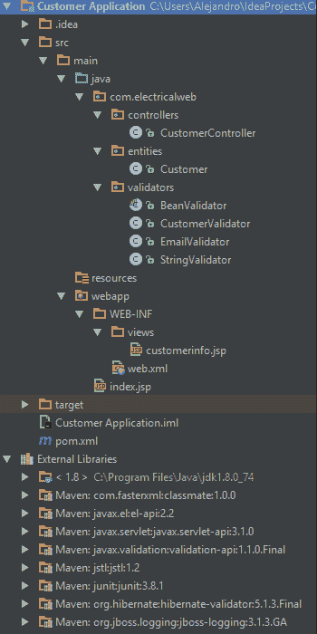

# 用 Java Servlets 构建 Web 应用程序

> 原文：<https://www.sitepoint.com/tutorial-building-web-app-with-java-servlets/>

Java 最好的特性之一是它丰富的、多面性的本质。当然，构建传统的桌面甚至移动应用程序都很好。但是，如果你想离开当前的背景，开始涉足网络领域，该怎么办呢？好消息是这种语言附带了成熟的 Servlet API，这让您可以轻松地构建健壮的 web 应用程序。

你现在脑子里一定在转的问题是“怎么做？”，我说的对吗？

## Java Servlets 的快速入门

进入[*servlet*](https://en.wikipedia.org/wiki/Java_servlet/ "Servlets")，一种在 [*web 容器*](https://en.wikipedia.org/wiki/Web_container/ "Web Container") 范围内执行的特定类型的 Java 程序(也称为 *servlet 容器*，Tomcat 和 Jetty 是主要的例子)，它允许以一种直接和高性能的方式处理客户端请求和服务器响应。这不是用什么是 servlet 的学术定义来烦你的地方和时间。只要说 servlets 是由它们的容器而不是开发人员来实例化和销毁的就够了，它充当客户机(通常是 web 浏览器)和运行在服务器上的其他应用程序(例如数据库)之间的中间层。

Servlets 是强大的生物，它可以从客户端获取数据(通常通过 GET 和 POST 请求),处理 cookies 和会话参数，通过附加的应用层处理数据，并以文本和二进制格式(HTML、XML、PDF、JPG、GIF 等)将输出发送回客户端，在许多情况下是通过使用 [Java Server Pages](https://en.wikipedia.org/wiki/JavaServer_Pages/ "Java Server Pages") (JSP)文件。

开始使用 servlets 的最好方法是使用一个具体的例子。因此，在接下来的几行中，我将构建一个简单的 web 应用程序，让客户使用普通的 HTML 表单进行注册。客户提交的数据将由一个 servlet 收集，并通过一些静态助手在非常基础的级别上进行验证。

## 使用 HTTP 客户端-服务器模型

为了对客户应用程序的结构有一个清晰的概念，下面是它的布局:



没什么意外，对吧？但首先要做的是。

构建应用程序的第一步是定义所谓的 [*部署描述符*](https://en.wikipedia.org/wiki/Deployment_descriptor/ "Deployment Descriptor") (DD)。顾名思义，它指定了在特定环境中应该如何部署应用程序。毫不奇怪，对于 web 应用程序，部署描述符是一个名为`web.xml`的普通 XML 文件，是标准 Java EE 规范的一部分。在这种特殊情况下，它看起来像这样:

```
<?xml version="1.0" encoding="UTF-8"?>

<web-app version="3.1"
             xmlns="http://xmlns.jcp.org/xml/ns/javaee"
             xmlns:xsi="https://www.w3.org/2001/XMLSchema-instance"
             xsi:schemaLocation="http://xmlns.jcp.org/xml/ns/javaee http://xmlns.jcp.org/xml/ns/javaee/web-app_3_1.xsd"
             metadata-complete="false">

</web-app> 
```

如上所示，`web.xml`文件不包含任何指令，只定义了我们将在应用程序中使用的 Java Servlet 规范(3.1)的版本。它当然可以容纳更多的内容，包括 [servlet 映射指令](http://docs.oracle.com/cd/E13222_01/wls/docs92/webapp/configureservlet.html)、[初始化参数](http://docs.oracle.com/cd/E13222_01/wls/docs92/webapp/configureservlet.html)、一系列[欢迎文件](https://docs.oracle.com/cd/E14571_01/web.1111/e13712/web_xml.htm#WBAPP525)和一些附加设置。但是为了使整个开发过程易于理解，我将保持文件简单。

由于示例应用程序将使用 [Servlet API](http://docs.oracle.com/javaee/6/api/?javax/servlet/package-summary.html/ "Servlet API") 并使用 Java 服务器页面来显示客户数据，我们需要获取所有需要的 jar。 [Maven](https://maven.apache.org/ "Maven") 将为我们完成这项艰巨的工作，所以下面是 POM 文件的定义方式:

```
<project xmlns="http://maven.apache.org/POM/4.0.0" xmlns:xsi="https://www.w3.org/2001/XMLSchema-instance"
             xsi:schemaLocation="http://maven.apache.org/POM/4.0.0 http://maven.apache.org/maven-v4_0_0.xsd">
    <modelVersion>4.0.0</modelVersion>
    <groupId>com.electricalweb.customerapplication</groupId>
    <artifactId>customerapplication</artifactId>
    <packaging>war</packaging>
    <version>1.0-SNAPSHOT</version>
    <name>Customer Application</name>
    <url>http://maven.apache.org</url>

    <dependencies>
        <dependency>
            <groupId>junit</groupId>
            <artifactId>junit</artifactId>
            <version>4.12</version>
            <scope>test</scope>
        </dependency>

        <dependency>
            <groupId>javax.servlet</groupId>
            <artifactId>javax.servlet-api</artifactId>
            <version>3.1.0</version>
        </dependency>

        <dependency>
            <groupId>jstl</groupId>
            <artifactId>jstl</artifactId>
            <version>1.2</version>
        </dependency>

        <dependency>
            <groupId>javax.el</groupId>
            <artifactId>el-api</artifactId>
            <version>2.2</version>
        </dependency>
    </dependencies>

    <build>
        <finalName>Customer Application</finalName>
    </build>
</project> 
```

简而言之，`pom.xml`文件定义了使用 servlets 所需的所有依赖项:JSP、 [Java 标准标记库](https://jstl.java.net/ "Java Standard Tag Library") (JSTL)和 [Java 表达式语言](http://docs.oracle.com/javaee/6/tutorial/doc/gjddd.html/ "Java Expression Language") (JEL)。

至此，我们已经成功创建了客户应用程序配置文件。然而，在当前状态下，应用程序实际上什么都不做。呀！因为这里的主要目标是让客户使用 HTML 表单注册，所以我们需要做的下一件事是定义 JSP 文件，该文件的任务是呈现上述表单，并在注册过程成功完成后显示客户数据。这正是下一节要讨论的主题。

## 创建注册和欢迎视图

表示层将由两个 JSP 文件组成——在一个 [MVC](https://en.wikipedia.org/wiki/Model%E2%80%93view%E2%80%93controller/ "Model-View-Controller") 环境中，这些被称为*视图*。第一个将负责呈现注册表单，并显示验证输入数据后触发的最终错误。第二个将是一个典型的`welcome`页面，它将显示客户在成功完成注册过程后提交的数据。

下面是第一个 JSP 文件:

```
<%@ taglib prefix="c" uri="http://java.sun.com/jsp/jstl/core" %>
<!DOCTYPE html>
<html lang="en">
<head>
    <meta charset="UTF-8">
    <title>Customer Sign Up</title>
</head>
<body>
    <h1>Customer Sign Up</h1>

    <c:if test="${violations != null}">
        <c:forEach items="${violations}" var="violation">
            <p>${violation}.</p>
        </c:forEach>
    </c:if>

    <form action="${pageContext.request.contextPath}/processcustomer" method="post">
        <label for="firstname">First Name : </label>
        <input type="text" name="firstname" id="firstname" value="${firstname}">
        <label for="lastname">Last Name:</label>
        <input type="text" name="lastname" id="lastname" value="${lastname}">
        <label for="email">Email: </label>
        <input type="text" name="email" id="email" value="${email}">
        <input type="submit" name="signup" value="Sign Up">
    </form>
</body>
</html> 
```

该文件包含简单的 HTML，并做了一些调整。这就是 JSP 技术与 JSTL 和 JEL 结合的美妙之处。请注意，通过使用标准标记，如`<c:if>`和`<c:forEach>`，检查验证违规并在文件的顶部遍历它们是多么容易。

注册表单的`action`属性指向以下 URL: `${pageContext.request.contextPath}/processcustomer`。简而言之，这意味着每次客户试图注册时，数据将被提交给`processcustomer`,而不管应用程序的上下文路径。所以不管注册表单最终在哪个 URL 下可用，动作的 URL 总是相对于它的。这要归功于 JSP 文件中可访问的对象的功能，比如`request`。

我们将在下面看到 servlet 如何映射到`processcustomer` URL，以及它如何控制输入的数据。但是在我定义这个 servlet 之前，这里有一个呈现`welcome`页面的 JSP 文件:

```
<%@ taglib prefix="c" uri="http://java.sun.com/jsp/jstl/core" %>
<!DOCTYPE html>
<html lang="en">
<head>
    <meta charset="UTF-8">
    <title>Customer Data</title>
</head>
<body>
    <h1>Thanks for signing up with us!</h1>
    <h2>You provided the following data:</h2>
    <p><strong>First Name:</strong> ${firstname}</p>
    <p><strong>Last Name:</strong> ${lastname}</p>
    <p><strong>Email: </strong>${email}</p>
</body>
</html> 
```

到目前为止，一切顺利。已经设置了表示层，下一步是创建负责从 POST 请求中收集客户数据的 servlet，并以基本方式验证数据。

## 构建客户控制器

相信我，定义一个能够获取之前注册表单中输入的数据的 servlet 是轻而易举的事情。我们所要做的就是继承原生的`HttpServlet`类，并实现它的`doGet()`或`doPost()`方法(或者在需要时两者都实现)。在这种特殊情况下，客户 servlet 将拦截来自 POST 请求的数据。

其定义如下:

```
@WebServlet(name = "CustomerController", urlPatterns = "/processcustomer")
public class CustomerController extends HttpServlet {

    @Override
    protected void doPost(
            HttpServletRequest request, HttpServletResponse response)
            throws ServletException, IOException {

        RequestCustomer customer = RequestCustomer.fromRequestParameters(request);
        customer.setAsRequestAttributes(request);
        List<String> violations = customer.validate();

        if (!violations.isEmpty()) {
            request.setAttribute("violations", violations);
        }

        String url = determineUrl(violations);
        request.getRequestDispatcher(url).forward(request, response);
    }

    private String determineUrl(List<String> violations) {
        if (!violations.isEmpty()) {
            return "/";
        } else {
            return "/WEB-INF/views/customerinfo.jsp";
        }
    }

    private static class RequestCustomer {

        private final String firstName;
        private final String lastName;
        private final String email;

        private RequestCustomer(String firstName, String lastName, String email) {
            this.firstName = firstName;
            this.lastName = lastName;
            this.email = email;
        }

        public static RequestCustomer fromRequestParameters(
            HttpServletRequest request) {
            return new RequestCustomer(
                    request.getParameter("firstname"),
                    request.getParameter("lastname"),
                    request.getParameter("email"));
        }

        public void setAsRequestAttributes(HttpServletRequest request) {
            request.setAttribute("firstname", firstName);
            request.setAttribute("lastname", lastName);
            request.setAttribute("email", email);
        }

        public List<String> validate() {
            List<String> violations = new ArrayList<>();
            if (!StringValidator.validate(firstName)) {
                    violations.add("First Name is mandatory");
            }
            if (!StringValidator.validate(lastName)) {
                    violations.add("Last Name is mandatory");
            }
            if (!EmailValidator.validate(email)) {
                    violations.add("Email must be a well-formed address");
            }
            return violations;
        }

    }

} 
```

这里要强调的第一点是`@WebServlet(name = "CustomerController", urlPatterns = "/processcustomer")`注释的使用。它告诉 servlet 容器使用`CustomerController`类来处理对`/processcustomer` URL 的 HTTP 请求。可以通过在`web.xml`文件中包含 servlet 映射指令来实现相同的行为，如这里的[所示](https://docs.oracle.com/cd/E11035_01/wls100/webapp/configureservlet.html)，但是因为我使用的是 Servlet 规范 3.1，所以不需要求助于部署描述符中的映射指令。只有普通的类级注释为我们处理映射过程。

在这种情况下，我将 servlet 命名为`CustomerController`,因为我坚持一个基本的模型-视图-控制器模式，因此 servlet 的行为就像一个典型的动作控制器。但是，只要命名约定在整个应用程序中保持一致，用其他名称命名也是可行的。一般来说，使用 servlet 类名作为`@WebServlet`注释的`name`属性的值被认为是一个好的实践。否则，一些 servlet 容器将无法进行映射，并抛出一个难看的 HTTP status 404 错误，告诉您所请求的资源(servlet 本身)不可用。

也就是说，`CustomerController`类本身执行一些简单的任务。首先，它通过使用本机`HttpServletRequest`接口的实现来收集在注册表单中输入的数据，该接口保存与注册表单的`firstname`、`lastname`和`email`字段相对应的值。其次，它将这些值设置为请求属性，因此它们可以在注册表单视图或结果视图中重新显示。最后，通过使用几个静态帮助器来验证数据，这些帮助器检查空字符串和格式良好的电子邮件地址。

验证器本身是简单的类，检查一些期望的属性，例如名称是否非空，电子邮件地址看起来是否像电子邮件地址。如果你想知道它们是如何实现的，你可以在这里看看它们[。](https://gitlab.com/alejandrogervasio/customerapplication/tree/master/src/main/java/com/electricalweb/validators)

验证过程的结果基本上控制了应用程序的流程:如果数据无效，客户将通过一个[请求调度器对象](http://docs.oracle.com/javaee/6/api/javax/servlet/RequestDispatcher.html)被转发到注册表单视图，错误就显示在那里。否则，当客户成功注册时，将呈现`welcome`页面。

至此，我们已经构建了一个全功能的 web 应用程序，它允许客户使用一个 HTML 表单、一个基本的 servlet 和几个 JSP 文件进行注册。也许这里最大的陷阱是使用静态助手来检查客户数据，而不是求助于标准方法，例如通过使用 [Java Bean Validation](http://docs.oracle.com/javaee/6/tutorial/doc/gircz.html/ "Java Bean Validation") 来验证域对象甚至整个对象图。如何做到这一点的细节将作为下一篇文章的主题。


## 运行应用程序

如果你和我一样，你应该渴望在你自己的开发平台上运行这个应用程序，这样你就可以自己看看它是否像我承诺的那样好用。为此，只需遵循以下步骤:

1.  作为先决条件，您需要 [Git](https://git-scm.com/downloads) (确保选择与您的操作系统兼容的版本)、 [Maven](https://maven.apache.org/) 和一个 servlet 容器(其中有 [Apache Tomcat](http://tomcat.apache.org/) 、 [Jetty](http://www.eclipse.org/jetty/) 或 [JBoss Wildfly](http://wildfly.org/) )。您的 IDE 可能附带了一个或多个这样的系统，在这种情况下，您可以使用嵌入式版本。

2.  使用 Git 将应用程序库克隆到您的本地机器上，并将其导入到您的 IDE 中，最好是作为 Maven 项目。

3.  将整个项目部署到 servlet 容器并运行它。部署项目意味着构建一个 [WAR 文件](https://en.wikipedia.org/wiki/WAR_(file_format)) (Web 归档)或一个展开的 WAR(又名[展开部署](http://stackoverflow.com/questions/1289358/what-does-exploded-development-mean-in-java))并将其放在 servlet 容器的默认部署文件夹中。在很多情况下，只要你点击*运行*按钮，你的 IDE 就会自动为你部署项目，所以除非万不得已，否则不要尝试手动执行这个任务，以免弄糟你的生活。查看你的 IDE 文档以获得详细信息(这里是 IntelliJ IDEA 的[)。一旦项目被正确部署，如果一切如预期的那样，默认浏览器将弹出，您将看到客户注册表单。](https://www.jetbrains.com/help/idea/2016.2/configuring-web-application-deployment.html)

4.  尝试提交没有任何值的表单，或者甚至提交一些缺失值的表单(这里有足够的空间进行实验)。您将看到根据违规输入在表单顶部很好地显示了错误。最后，如果您愿意提供强制数据，您将会看到欢迎页面。

随意拍拍自己的背。恭喜你！您已经开发了一个全功能的 Java web 应用程序。

## 最后的想法

至此，您已经掌握了开始构建自己的 Java web 应用程序所需的所有技能，最重要的是，您根本不必求助于任何框架的复杂性。你所需要的就是使用 [Servlet API](http://docs.oracle.com/javaee/6/api/?javax/servlet/package-summary.html/%22Servlet%20API/ "Servlet API") ，使用某种渲染技术，比如 [JSP](https://en.wikipedia.org/wiki/JavaServer_Pages/%22Java%20Server%20Pages? "Java Server Pages") 和普通 Java。这不是很好吗？

值得注意的是，`CustomerController`类的实现突出了 servlets 暴露的优点和缺点:一方面，它简单地展示了处理请求参数和以不同格式将响应发送回客户机是多么容易。但是这种功能是有代价的:接口`HttpServletRequest`和`HttpServletResponse`的实现都是简单的[服务定位器](http://www.martinfowler.com/articles/injection.html)。这本身并不是坏事，因为定位器只是数据持有者。不幸的是，每当您将 servlet 放入应用程序范围时，就会有这些实现与之耦合。

如果您想尝试一下客户应用程序，只需从 GitLab 中克隆[库。请随时给我留下您的评论。我会尽快回复你。](https://gitlab.com/alejandrogervasio/customerapplication.git)

## 分享这篇文章