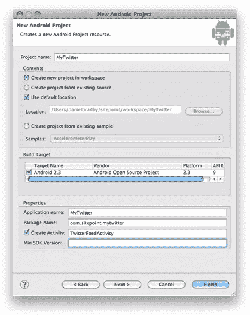
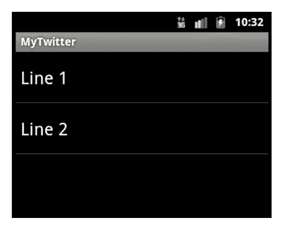
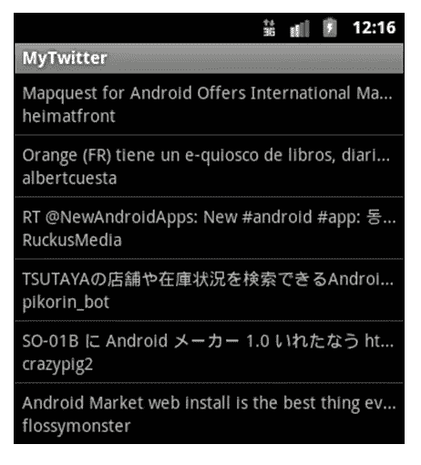

# 推特，认识一下安卓

> 原文：<https://www.sitepoint.com/twitter-meet-android/>

在我最近的文章 [Hello Android](https://www.sitepoint.com/writing-your-first-android-app/) 中，我们创建了第一个具有基本 Hello World 功能的 Android 应用。看起来移动世界真正的 Hello World 是一个 Twitter feed。

本教程将指导您创建一个简单的 Android 应用程序，显示来自 Twitter 提供的基于 JSON 的搜索 API 的推文列表。我们将从以下几点着手:

*   显示项目列表
*   自定义每个列表项的外观
*   访问远程服务和解析数据
*   创建响应用户界面

有关如何设置 Android 开发环境的说明，请查看之前的文章 [Hello Android](https://www.sitepoint.com/writing-your-first-android-app-2/) ，该文章将指导您从安装软件和建立工作区，一直到在 Android 模拟器中运行一个框架应用程序。

### 显示列表

为了开始我们的新项目，在 Eclipse 中创建一个新的 Android 项目(***)File->New->Other->Android***，并选择***Android Project****)*，，输入适当的项目名称、应用程序名称、包名称以及单个启动活动的名称。

你可以在下面看到我使用的选项:



为了检查您是否正确创建了项目，请在模拟器中运行 skeleton 应用程序，方法是在 Eclipse 中突出显示项目名称，并选择***Run->Run As***->***Android 应用程序*** 。

目前，您创建的`Activity`将扩展`android.app.Activity`，并且在您的`onCreate`方法中，您将把活动的`ContentView`设置为`R.layout.mai` n(链接到`/res/layout/main.xml`中指定的布局)。Android SDK 使用一个名为`android.app.ListActivity`的超类提供了一种快速显示数据列表的便捷方式。这个`Activity`已经提供了一个`ContentView`，配置了一个`ListView`，随时可以使用并填充数据。

现在改变`TwitterFeedActivity`的超类来扩展`ListActivity`，从`onCreate`方法中移除`ContentView`的设置。

现在需要给`ListView`提供要显示的数据，以及将数据映射到行的方法。`ListAdaptors`提供此机制，并使用`setListAdaptor`设置在`ListActivity`的底层`ListView`上。

创建一些包含两个字符串的样本数据，以及一个 Android SDK 提供的适配器(`ArrayAdaptor`)，该适配器知道如何将任意数据数组处理到`ListViews`(Android SDK 还附带了其他几个`ListAdaptors`，比如`Cursor Adaptors`，它可以在将本地数据存储连接到`ListView`时提供帮助)。您还需要为适配器提供一个布局，它可以使用这个布局将元素呈现到每一行上。在下面的例子中，我们使用 Android SDK 提供的布局`simple_list_item_1`，这是一个单一的文本标签，非常适合放置我们的单个字符串:

```
public class TwitterFeedActivity extends ListActivity {

@Override

public void onCreate(Bundle savedInstanceState) {

super.onCreate(savedInstanceState);

String[] elements = {"Line 1", "Line 2"};

setListAdapter(new ArrayAdapter&lt;String&gt;(this, android.R.layout.simple_list_item_1, elements));

}

}
```

如上调整您的代码，并在模拟器中确认以下结果:



### 自定义列表项目

基本的 Twitter 客户端每行至少需要显示两个字段:tweet 的作者和 tweet 的内容。为了实现这一点，你必须超越内置的布局和`ArrayAdaptor`,实现你自己的布局。

首先创建一个名为`Tweet`的类，它可以用来保存作者和内容作为`Strings`。然后创建一个`Tweet`对象，并填充一些测试数据，显示在自定义列表项中:

```
package com.sitepoint.mytwitter;

public class Tweet {

String author;

String content;

}
```

在`/res/layout/list_item.xml`中创建一个布局 XML 文件，定义两个`TextViews`在不同的行上显示内容和作者。为了一个接一个地显示它们，使用一个`LinearLayout`，配置为垂直呈现其中的每个元素(`android:orientation="vertical"`)。

```
&lt;?xml version="1.0" encoding="utf-8"?&gt;

&lt;LinearLayout xmlns:android="<a href="http://schemas.android.com/apk/res/android">http://schemas.android.com/apk/res/android</a>"

android:orientation="vertical"

android:layout_width="fill_parent"

android:layout_height="?android:attr/listPreferredItemHeight"

android:padding="6dip"&gt;

&lt;TextView android:id="@+id/toptext" android:layout_width="fill_parent"

android:layout_height="wrap_content"

android:gravity="center_vertical" android:singleLine="true" /&gt;

&lt;TextView android:layout_width="fill_parent"

android:layout_height="wrap_content"  android:id="@+id/bottomtext"

android:singleLine="true" /&gt;

&lt;/LinearLayout&gt;
```

一旦创建了 XML 文件，Android Eclipse 插件会自动将它作为引用添加到生成的`R`文件中。这个`R`文件保存在项目的`/gen`文件夹下，充当 XML 元素和 Java 代码之间的桥梁。它允许您的 Java 代码引用在`/res`文件夹下创建的 XML 元素和文件。您刚刚创建的文件现在可以在 Java 代码中作为`R.layout.list_item`被引用，就像您接下来将在定制列表适配器中做的那样。

创建一个名为`TweetListAdaptor`的私有类(在`Activity`中)，它是`ArrayAdaptor`的子类。这个类应该用来存储正在显示的 Tweets 的`ArrayList`，并提供一种方法将`Tweet`对象映射到您在上面的布局中创建的`TextViews`。

这个映射覆盖了`ListAdaptor`中的`getView`方法，应该会返回一个`View`对象，其中填充了所请求位置的数据内容:

```
public View getView(int position, View convertView, ViewGroup parent) {
```

此外，如果可能的话，它应该重用通过`convertView`参数传递到方法中的任何`View`对象。如果必须为列表中的每个元素创建一个新的 V `iew`对象，那么大的列表在滚动时会断断续续。缓存`Views`允许创建最少数量的`View`对象来填充一个大的数据列表。

自定义`TweetListAdaptor`的完整实现如下。注意“if 语句”检查传递的`convertView`是否能够被重用。如果`View`为空，则`ListView`已经用完了要显示的`Views`，并要求为该行创建一个新的`View`。

这是通过使用`LayoutService`来实现的，它能够按照您之前在 XML 中指定的方式展开(或加载)布局。您将在这里看到如何通过`R.layout.list_item`引用使用生成的`R`类来引用布局文件。

一旦`View`被创建(或重用)，特定的 Tweet 就从`ArrayList`中提取出来，放在需要由`ListView`呈现的位置。然后，您能够使用在 XML 中分配给它们的 id(例如，`android:id="@+id/toptext"`)获得对两个`TextView`元素的引用。一旦有了引用，就可以用来自`Tweet` 对象的适当内容和作者来设置它们。

```
private class TweetListAdaptor extends ArrayAdapter&lt;Tweet&gt; {

private ArrayList&lt;Tweet&gt; tweets;

public TweetListAdaptor(Context context,

int textViewResourceId,

ArrayList&lt;Tweet&gt; items) {

super(context, textViewResourceId, items);

this.tweets = items;

}

@Override

public View getView(int position, View convertView, ViewGroup parent) {

View v = convertView;

if (v == null) {

LayoutInflater vi = (LayoutInflater) getSystemService

(Context.LAYOUT_INFLATER_SERVICE);

v = vi.inflate(R.layout.list_item, null);

}

Tweet o = tweets.get(position);

TextView tt = (TextView) v.findViewById(R.id.toptext);

TextView bt = (TextView) v.findViewById(R.id.bottomtext);

tt.setText(o.content);

bt.setText(o.author);

return v;

}

}
```

现在可以对`onCreate`方法进行调整，以使用定制列表适配器和创建的测试数据，如下所示:

```
public void onCreate(Bundle savedInstanceState) {

super.onCreate(savedInstanceState);

Tweet tweet = new Tweet();

tweet.author = "dbradby";

tweet.content = "Android in space";

ArrayList&lt;Tweet&gt; items = new ArrayList&lt;Tweet&gt;();

items.add(tweet);

TweetListAdaptor adaptor = new TweetListAdaptor(this,R.layout.list_item, items);

setListAdapter(adaptor);

}
```

当在模拟器中运行时，它将显示以下内容:


### 访问远程服务和解析数据

Android SDK 包含旨在简化对基于 HTTP 的 API 的访问的包。Apache HTTP 类已经包含在内，可以在`org.apache.http`包中找到。您将使用这些类和`org.json`类来解析从调用 Twitter 搜索 API 返回的数据。

在从 Android 应用程序访问任何远程服务之前，必须声明一个权限。这将提醒用户(你的应用程序)应用程序可能正在做什么。权限可以是监控收到的短信，阅读地址簿，或者，在你的情况下，只是在互联网上提出请求。在安装应用程序之前，这些权限会在 Android Market place 中显示给用户，让用户选择是否要给这个应用程序声明的权限。

您需要使用的权限是 INTERNET，应该插入到`AndroidManifest.xml`文件中的应用程序标记之外。

```
&lt;/application&gt;

&lt;uses-permission android:name="android.permission.INTERNET" /&gt;

&lt;/manifest&gt;
```

有了权限，我们可以在`Activity`中创建一个私有方法，该方法发出请求，解析结果，并返回一个`Tweet`对象的`ArrayList`。下面列出的代码发出请求并寻找产生的 JSON 数组，该数组被迭代以提取每条 tweet 的`text`和`from_user`元素。

```
private ArrayList&lt;Tweet&gt; loadTweets(){

ArrayList&lt;Tweet&gt; tweets = new ArrayList&lt;Tweet&gt;();

try {

HttpClient hc = new DefaultHttpClient();

HttpGet get = new

HttpGet("<a href="http://search.twitter.com/search.json?q=android">http://search.twitter.com/search.json?q=android</a>");

HttpResponse rp = hc.execute(get);

if(rp.getStatusLine().getStatusCode() == HttpStatus.SC_OK)

{

String result = EntityUtils.toString(rp.getEntity());

JSONObject root = new JSONObject(result);

JSONArray sessions = root.getJSONArray("results");

for (int i = 0; i &lt; sessions.length(); i++) {

JSONObject session = sessions.getJSONObject(i);

Tweet tweet = new Tweet();

tweet.content = session.getString("text");

tweet.author = session.getString("from_user");

tweets.add(tweet);

}

}

} catch (Exception e) {

Log.e("TwitterFeedActivity", "Error loading JSON", e);

}

return tweets;

}
```

现在，当在`onCreate`方法中构造定制列表适配器时，用对`loadTweets`方法的调用替换您先前使用的虚拟数据。

```
TweetListAdaptor adaptor = new TweetListAdaptor(this,R.layout.list_item, loadTweets());
```

在模拟器中运行这个，您现在应该看到从 API 请求返回的真实数据显示在列表视图中，如下所示:



### 创建响应用户界面

当前状态下的代码有可能导致应用程序不响应(ANR)对话框出现，提示用户退出您的应用程序。这可能是由于在诸如`onCreate`之类的方法中执行的对数据的远程请求的长时间运行工作造成的。

长时间运行的任务不应该在主应用程序线程上执行(它驱动用户界面事件循环)。相反，它们应该被派生到子线程中来执行工作。

虽然 Java 的`Thread`类可以用于这个任务，但有一个复杂之处，即一旦长时间运行的任务完成，它通常希望更改用户界面来报告结果(即显示从请求中加载的 tweets 列表)。

用户界面元素只能从主线程改变它们的状态，因为 Android UI toolkit 不是线程安全的，因此后台线程需要向主线程发回消息来操作 UI。

令人欣慰的是，Android SDK 提供了一个方便的类`AsyncTask`，它为异步任务提供了一个简单的机制来安全地与 UI 线程交互。这是通过子类化`AsyncTask`并覆盖`doInBackground`方法来执行长时间运行的任务，然后覆盖`onPostExecute`来执行 UI 上的任何操作来实现的。

当`AsyncTask`被创建(它必须在 UI 线程上创建)并执行时，在后台线程上调用`doInBackgroun` d 方法。完成后，`onPostExecute`方法在主 UI 线程上被调用。

要在你的应用中使用它，你需要在`Activity`中实现一个名为`MyTask`的私有类(像自定义适配器类一样)，它是`AsyncTask`的子类。您可以用之前的`loadTweets`方法的内容覆盖`doInBackground`方法。

不是返回`ArrayList`，而是在`Activity`中维护一个实例变量，以便数据可以在私有类之间共享。然后在`onPostExecute`中，你可以用数据设置`List Adaptor` ，就像之前在`onCreate`中所做的那样。`onCreate`方法现在简单地创建`MyTask`对象并调用 execute 方法。

为了演示在执行后台请求时 UI 的响应，我也给`AsyncTask`添加了一个`ProgressDialog`。`Activity`的完整列表如下:

```
package com.sitepoint.mytwitter;

import java.util.ArrayList;

import org.apache.http.HttpResponse;

import org.apache.http.HttpStatus;

import org.apache.http.client.HttpClient;

import org.apache.http.client.methods.HttpGet;

import org.apache.http.impl.client.DefaultHttpClient;

import org.apache.http.util.EntityUtils;

import org.json.JSONArray;

import org.json.JSONObject;

import android.app.ListActivity;

import android.app.ProgressDialog;

import android.content.Context;

import android.os.AsyncTask;

import android.os.Bundle;

import android.util.Log;

import android.view.LayoutInflater;

import android.view.View;

import android.view.ViewGroup;

import android.widget.ArrayAdapter;

import android.widget.TextView;

public class TwitterFeedActivity extends ListActivity {

private ArrayList&lt;Tweet&gt; tweets = new ArrayList&lt;Tweet&gt;();

@Override

public void onCreate(Bundle savedInstanceState) {

super.onCreate(savedInstanceState);

new MyTask().execute();

}

private class MyTask extends AsyncTask&lt;Void, Void, Void&gt; {

private ProgressDialog progressDialog;

protected void onPreExecute() {

progressDialog = ProgressDialog.show(TwitterFeedActivity.this,

"", "Loading. Please wait...", true);

}

@Override

protected Void doInBackground(Void... arg0) {

try {

HttpClient hc = new DefaultHttpClient();

HttpGet get = new

HttpGet("<a href="http://search.twitter.com/search.json?q=android">http://search.twitter.com/search.json?q=android</a>");

HttpResponse rp = hc.execute(get);

if(rp.getStatusLine().getStatusCode() == HttpStatus.SC_OK)

{

String result = EntityUtils.toString(rp.getEntity());

JSONObject root = new JSONObject(result);

JSONArray sessions = root.getJSONArray("results");

for (int i = 0; i &lt; sessions.length(); i++) {

JSONObject session = sessions.getJSONObject(i);

Tweet tweet = new Tweet();

tweet.content = session.getString("text");

tweet.author = session.getString("from_user");

tweets.add(tweet);

}

}

} catch (Exception e) {

Log.e("TwitterFeedActivity", "Error loading JSON", e);

}

return null;

}

@Override

protected void onPostExecute(Void result) {

progressDialog.dismiss();

setListAdapter(new TweetListAdaptor(

TwitterFeedActivity.this, R.layout.list_item, tweets));

}

}

private class TweetListAdaptor extends ArrayAdapter&lt;Tweet&gt; {

private ArrayList&lt;Tweet&gt; tweets;

public TweetListAdaptor(Context context,

int textViewResourceId,

ArrayList&lt;Tweet&gt; items) {

super(context, textViewResourceId, items);

this.tweets = items;

}

@Override

public View getView(int position, View convertView, ViewGroup parent) {

View v = convertView;

if (v == null) {

LayoutInflater vi = (LayoutInflater)

getSystemService(Context.LAYOUT_INFLATER_SERVICE);

v = vi.inflate(R.layout.list_item, null);

}

Tweet o = tweets.get(position);

TextView tt = (TextView) v.findViewById(R.id.toptext);

TextView bt = (TextView) v.findViewById(R.id.bottomtext);

tt.setText(o.content);

bt.setText(o.author);

return v;

}

}

}
```

现在，您应该有一个完整的应用程序在后台请求 Twitter 数据。

`AsyncTask`有相当多的功能需要探索。您可以确信我们将在以后的文章中涉及这些内容。与此同时，你应该在 [Android 开发者](http://developer.android.com/)网站上阅读涵盖这些类的优秀 Android 文档。

## 分享这篇文章