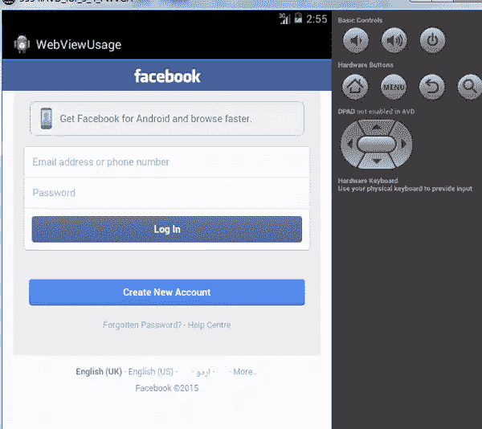
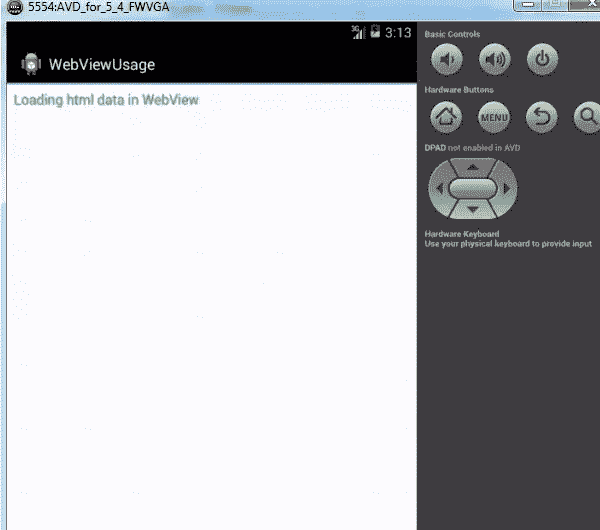
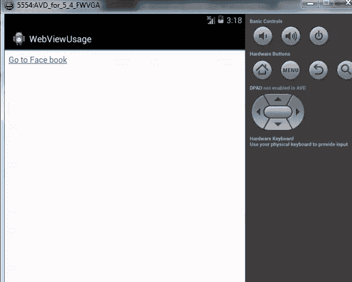
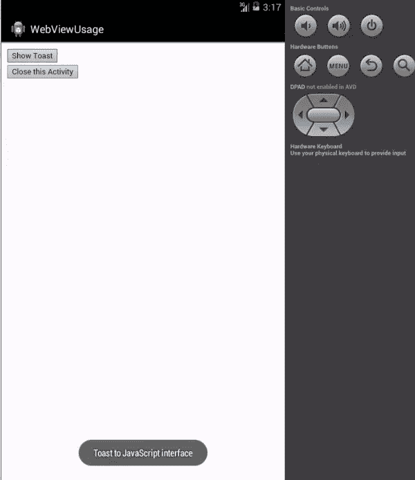

# 了解 Android 网络视图

> 原文：<https://www.sitepoint.com/understanding-android-webviews/>

Android 提供了多种视图来构建应用程序的 UI。一个例子是`WebView`，视图可以嵌入到你的`Activities`中，用来显示网页。在活动中显示网页的能力有很多优势，因为它有助于在 Android 应用程序中重用网页和 web 应用程序。可以直接从服务器控制和更改网页的内容。这对于像用户协议、条款和条件这样只需要定期修改的页面非常有用。`Webview`对于响应式设计和你需要加载一个不受你控制且没有公开 android `intent`的外部页面的情况很有用。

这篇文章向你展示了如何在你的活动中嵌入一个`WebView`来显示网页。

## 在活动中嵌入 WebView 以显示网页。

让我们从向活动添加`WebView`开始。要将`WebView`添加到布局 xml，请使用以下代码:

```
<?xml version="1.0" encoding="utf-8"?>
<LinearLayout xmlns:android="http://schemas.android.com/apk/res/android"
    android:layout_width="match_parent"
    android:layout_height="match_parent"
    android:orientation="vertical" >

    <WebView
      android:id="@+id/webview"
      android:layout_width="fill_parent"
      android:layout_height="fill_parent"
  />
</LinearLayout>
```

在上面的代码中，我创建了一个线性布局，这将是一个容纳 WebView 的容器视图。在线性布局中，我添加了一个 WebView 来通过 URL 加载网页。由于通过 URL 加载网页需要互联网连接，请将以下权限添加到`AndroidManifest.xml`:

```
<uses-permission android:name="android.permission.INTERNET" />
```

定义了布局和权限后，创建一个将使用此布局的活动并加载网页:

```
import android.app.Activity;
import android.os.Bundle;
import android.webkit.WebView;

public class WebVievActivityWithURL extends Activity {

    private WebView myWebView;

    @Override
    protected void onCreate(Bundle savedInstanceState) {
        super.onCreate(savedInstanceState);
        setContentView(R.layout.activity_with_web_view);

        myWebView = (WebView) findViewById(R.id.webview);

        myWebView.loadUrl("https://m.facebook.com");
    }

}
```

在上面的代码中，活动的`onCreate`将内容视图设置为定义的布局，然后使用函数`findViewById`获取`WebView`。然后，`loadUrl`函数将 url 加载到 WebView 中。一旦完成并启动活动，您应该会看到加载的网页。



## 在活动中嵌入 WebView 以显示静态 HTML。

在某些情况下，您可能不想从 URL 加载网页，而是直接将 HTML 内容加载到 WebView 中。`WebView`使用`loadDataWithBaseURL`函数提供了实现这一点的功能:

```
import android.app.Activity;
import android.os.Bundle;
import android.webkit.WebView;

public class WebViewActivityWithHTML extends Activity {

    private WebView myWebView;

    @Override
    protected void onCreate(Bundle savedInstanceState) {
        super.onCreate(savedInstanceState);
        setContentView(R.layout.activity_with_web_view);

        myWebView = (WebView) findViewById(R.id.webview);
        myWebView.loadDataWithBaseURL("file:///android_asset/", getHTMLData(),
                "text/html", "UTF-8", "");
    }

    private String getHTMLData() {
        StringBuilder html = new StringBuilder();
        html.append("<html>");
        html.append("<head>");

        html.append("<link rel=stylesheet href='css/style.css'>");
        html.append("</head>");
        html.append("<body>");
        html.append("<div id ='main'> Loading html data in WebView</div>");
        html.append("</body>");
        html.append("</html>");

        return html.toString();
    }
}
```

上面的`WebViewActivityWithHTML`活动使用已经定义的相同的`activity_with_web_view`布局。在`onCreate`功能中，对 WebView 的引用再次出现。用它来调用`loadDataWithBaseURL`，它接受用于 HTML 内容中所有相对路径的`base_url`。

接下来，通过`file:///android_asset/`来检测 CSS。第二个参数是 HTML 数据。其他参数是 mime 类型、字符编码和历史 url。

为了避免传递基本 URL，使用函数`loadData`,它有三个参数:数据、mimetype 和字符编码。

我在 HTML 中引用了 *css/style.css* 。为此，在*资产*文件夹中添加一个名为 *css* 的目录，并在其中添加一个包含以下内容的 *style.css* 文件:

```
#main {
    color: #00ff00;
}
```

一旦`WebViewActivityWithHTML`启动，WebView 就会加载静态 HTML。



## 处理网络视图中的导航

使用 WebViews 时，在加载网页期间可能需要回调。例如，当在 WebView 中单击一个链接时，Android 会执行默认操作，这很可能是在不同的浏览器中打开该 URL。

要覆盖它并在 WebView 本身中加载 URL，请在 WebView 中提供一个`WebViewClient`实例来处理回调:

```
import android.app.Activity;
import android.graphics.Bitmap;
import android.os.Bundle;
import android.webkit.WebView;
import android.webkit.WebViewClient;

public class WebViewActivityWithWebClient extends Activity {

    private WebView myWebView;

    /** (non-Javadoc)
     * @see android.app.Activity#onCreate(android.os.Bundle)
     */
    @Override
    protected void onCreate(Bundle savedInstanceState) {
        super.onCreate(savedInstanceState);
        setContentView(R.layout.activity_with_web_view);

        myWebView = (WebView) findViewById(R.id.webview);
        myWebView.setWebViewClient(new MyWebViewClient());

        myWebView.loadData(getHTMLData(),"text/html", "UTF-8");
    }

    /**
     * @return - Static HTML data
     */
    private String getHTMLData() {
        StringBuilder html = new StringBuilder();
        html.append("<html>");
        html.append("<head>");
        html.append("</head>");
        html.append("<body>");
        html.append("<div id ='main'> <a href ='https://m.facebook.com'> Go to Face book</a></div>");
        html.append("</body>");
        html.append("</html>");

        return html.toString();
    }

    private class MyWebViewClient extends WebViewClient {
        @Override
        public boolean shouldOverrideUrlLoading(WebView view, String url) {
           view.loadUrl(url);
           return true;
        }

        @Override
        public void onPageStarted(WebView view, String url, Bitmap favicon) {
            super.onPageStarted(view, url, favicon);
            //You can add some custom functionality here
        }

        @Override
        public void onPageFinished(WebView view, String url) {
            super.onPageFinished(view, url);
          //You can add some custom functionality here
        }

        @Override
        public void onReceivedError(WebView view, int errorCode,
                String description, String failingUrl) {
            super.onReceivedError(view, errorCode, description, failingUrl);
          //You can add some custom functionality here
        }
     }

}
```

上面的代码设置了一个定制的 WebView 客户端，它覆盖了`shouldOverrideUrlLoading`函数并将 url 直接加载到 WebView 而不是另一个浏览器中，然后返回 true 以表示它将覆盖 URL 加载。如果我们运行此活动并点击*前往脸书*链接，它将在 WebView 中打开脸书链接。

还有其他的回调函数如`onPageStarted`、`onPageFinished`、`onReceivedError`，可以根据 app 需求进行不同种类的处理。



## 在 WebViews 中注入 JavaScript

当构建更复杂的移动网页时，你可能需要从你的网页中调用一些本地方法。要在 WebView 中实现这一点，请在 WebView 中启用 JavaScript 设置，并提供一个将公开从 JavaScript 调用的方法的类:

```
import java.io.BufferedReader;
import java.io.InputStream;
import java.io.InputStreamReader;

import android.app.Activity;
import android.content.res.AssetManager;
import android.os.Bundle;
import android.webkit.JavascriptInterface;
import android.webkit.WebSettings;
import android.webkit.WebView;
import android.widget.Toast;

public class WebViewActivityWithJavaScript extends Activity {
    private WebView myWebView;

    /* (non-Javadoc)
     * @see android.app.Activity#onCreate(android.os.Bundle)
     */
    @Override
    protected void onCreate(Bundle savedInstanceState) {
        super.onCreate(savedInstanceState);
        setContentView(R.layout.activity_with_web_view);

        myWebView = (WebView) findViewById(R.id.webview);
        WebSettings webSettings = myWebView.getSettings();
        webSettings.setJavaScriptEnabled(true);
        myWebView.addJavascriptInterface(new MyJavaScriptInterface(this), "Android");
        myWebView.loadData(getHTMLData(),"text/html", "UTF-8");
    }

    /**
     * @return - Static HTML data
     */
    private String getHTMLData() {
        StringBuilder html = new StringBuilder();
        try {
            AssetManager assetManager = getAssets();

            InputStream input = assetManager.open("javascriptexample.html");
            BufferedReader  br = new BufferedReader(new InputStreamReader(input));
            String line;
            while ((line = br.readLine()) != null) {
                html.append(line);
            }
            br.close();
        } catch (Exception e) {
           //Handle the exception here
        }

        return html.toString();
    }

    public class MyJavaScriptInterface {
        Activity activity;

        MyJavaScriptInterface(Activity activity) {
            this.activity = activity;
        }

        @JavascriptInterface
        public void showToast(String toast) {
            Toast.makeText(activity, toast, Toast.LENGTH_SHORT).show();
        }

        @JavascriptInterface
        public void closeActivity() {
            activity.finish();
        }
    }
}
```

在上面的代码中，`WebView`的`WebSettings`是通过调用`getSettings`方法并使用方法`setJavaScriptEnabled`启用 JavaScript 来显示的。

然后调用`addJavascriptInterface`方法，给它传递一个对象和一个字符串。该字符串可用于调用带有注释`@JavascriptInterface`的对象上的方法。在`MyJavaScriptInterface`类中有两个方法:`showToast`，它显示一个 Android toast 和`closeActivity`，它完成活动。

在上面的例子中，`loadData`加载网页(`loadUrl`可以从 url 加载网页)，该网页从*资产*文件夹中的`javascriptexample.html`获取`getHTMLData`函数中的 HTML。

在`assets`文件夹中创建文件`javascriptexample.html`:

```
<html>

<body>
<input type="button" value="Show Toast" onClick="showAndroidToast('Toast to JavaScript interface')" />
<br>
<input type="button" value="Close this Activity" onClick="closeActivity()" />
</body>
<script type="text/javascript"> function showAndroidToast(toast) {
        Android.showToast(toast);
    }

     function closeActivity() {
        Android.closeActivity();
    } </script>

</html>
```

上面的代码创建了两个按钮，单击这两个按钮会调用一个 Javascript 函数。这些函数依次调用我们公开的 JavaScipt 接口函数。如果我们运行该活动并点击 *Show Toast* ，就会显示 Toast。



## 结论

Android 中的 WebViews 提供了丰富的功能，对于构建需要加载外部网页或 HTML 数据的应用程序非常重要。WebViews 提供了有趣的方法，让网页使用 JavaScript 接口与 Android 应用程序进行交互。

祝您在下一个 Android 应用中使用 WebView 愉快，如果您有任何问题或意见，请告诉我。

## 分享这篇文章