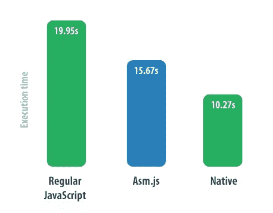

# 了解 asm.js

> 原文：<https://www.sitepoint.com/understanding-asm-js/>

asm.js 是当前 web 开发中的一个热门话题。阅读关于 asm.js、其目标和路线图的完整指南是不可能的，因为您必须阅读多篇文章并自己将它们放在一起。本文试图通过一个循序渐进的指南和真实世界的例子，加上几个基准，总结出您需要了解的关于 asm.js 的几乎所有内容。

## 历史

JavaScript 是世界上最流行的编程语言之一。您可以将它作为客户端语言在 web 浏览器中使用。现在，随着 NodeJS 的出现，JavaScript 也成为服务器端应用程序的流行语言。过去(实际上，直到今天)，transpilers(源代码到源代码的编译器)被用来隐藏 JavaScript 的一些丑陋部分。CoffeeScript、ClojureScript 和 TypeScript 是一些比较流行的 transpilers。

Transpilers 主要使用现有的语言(如 C 或 C++)，或者，他们定义一种新的语言(如 CoffeeScript)。然后，不用写 JavaScript，你可以用 transpiler 转换成 JavaScript 的另一种语言来开发。在本文中，我们将回顾 Emscripten，一个 JavaScript transpiler 的 LLVM 字节码。

## 那么，asm.js 是什么？

asm.js 是 JavaScript 的严格子集。这不是一种新语言。asm.js 是一组有限的定义，提供了良好的性能特征。这些定义可以组合起来，就像汇编语言指令一样，来创建非常快速的 JavaScript 应用程序。asm.js 利用了一些低级的 JavaScript 特性，比如类型化数组。它不使用任何插件或模块来运行 JavaScript 代码，使其向后兼容。

## 它是如何工作的

主要思想是更严格地使用 JavaScript。例如，消除动态类型。为了提供一个例子，我们将声明一个变量并给它赋一个整数值。然后，我们声明另一个变量，并将之前的变量赋给新变量。下面，你会发现标准 JavaScript 中的例子。

```
var first = 5;
var second = first;
```

上述代码对应的 asm.js 语法如下:

```
var first = 5;
//By using a bitwise operator, we make sure that the value is 32-bit integer
var second = first | 0;
```

第一个和第二个代码示例之间的唯一区别是 asm.js 示例最后一行上的按位 OR 运算符。通过使用按位运算符，我们将变量`first`的值转换为 32 位整数。这确保了`second`总是被视为 32 位整数。asm.js 还有许多其他类似的规则。通过将这些规则与普通 JavaScript 结合起来，可以创建更快的代码。有关这些规则及其工作原理的更多信息，请参考 [asm.js 规范](http://asmjs.org/spec/latest/)。

值得一提的是，手工编写 asm.js 代码并不是一个好主意。结果很难维护，调试起来也很耗时。基于这一观察，剩下的问题是——我们如何使用 asm.js 开发应用程序？

好消息是，有一些工具可以根据 asm.js 规范从其他语言(如 C 或 C++)生成 JavaScript 代码。在本文中，我们将重点关注 Emscripten，但是请记住，还有许多类似的工具。

那么，什么是 Emscripten 呢？答案是它是一个 LLVM 到 JavaScript 的编译器。Emscripten 接受 LLVM 字节码，并将它们转换成 asm.js JavaScript。那么，如何生成 LLVM 字节码呢？可以用 Clang 把 C/C++代码转换成 LLVM！为了更好地理解这一过程，请考虑下图:


下面是使用 Emscripten:
1 生成 JavaScript 代码的步骤。创建一个 C/C++应用程序。
2。使用 Clang 编译它，生成 LLVM 字节码。
3。将字节码传递给 Emscripten 以获取 JavaScript 代码。

值得一提的是，Emscripten 自己执行最后两个步骤。因此，您唯一需要做的事情就是将 C/C++代码传递给 Emscripten 并获得 JavaScript 输出。

## 你好世界

让我们用 C++编写一个简单的程序，并将其转换为基于 asm.js 的 JavaScript 应用程序。下面是计算`n=45`的斐波那契数的 C++代码片段。

```
#include <stdio.h>

int fib(int x) {
if (x < 2) {
return 1;
} else {
return fib(x - 1) + fib(x - 2);
}
}

int main() {
int result = fib(45);

printf("%d\n", result);
return 1;
}
```

如你所见，算法非常简单明了。要将这个 C++代码转换成 JavaScript，首先需要安装 Emscripten。有关安装说明，请参考[emscriten wiki](https://github.com/kripken/emscripten/wiki)。安装 Emscripten 后，您可以使用下面的命令简单地转换 C++代码。

```
./emcc -O1 -s ASM_JS=1 ./hello_world.cpp
```

通过将`ASM_JS`属性设置为`1`，可以强制 Emscripten 发出基于 asm.js 规范的 JavaScript 代码。发出命令后，您将得到一个`a.out.js`文件。这是一个从你的 C++代码创建的 JavaScript 文件。为了执行相应的 JavaScript 文件，可以安装 Node.js 并发出以下命令。

```
node ./a.out.js
```

通过执行上述命令，您将看到应用程序的输出。恭喜你，你做了第一个 asm.js app。

## 让我们来看一个基准

在这一节中，我们比较了上面给出的 Fibonacci 示例的本地 JavaScript 代码与基于 asm.js 的版本的执行时间。为了更好地进行比较，我们使用 Clang 编译器编译 C++代码，并执行相应的生成的本机代码。因此，我们可以比较三种不同的环境——(1)普通 JavaScript，(2) asm.js 代码，(3)原生应用。要使用 clang 编译 C++代码，只需发出以下命令:

```
clang ./hello_world.cpp
```

这将创建一个包含本机可执行文件的`a.out`文件。

下面的代码显示了普通的 JavaScript 示例。

```
var result = 0;

function fib(x) {
if (x < 2) {
return 1;
} else {
return fib(x - 1) + fib(x - 2);
}
}

result = fib(45);
console.log(result);
```

我们可以使用以下命令运行普通的 JavaScript 和 asm.js 示例。

```
node ./handmade.js
node ./a.out.js
```

要执行本机应用程序，请运行以下命令。

```
./a.out
```

得到的执行时间如下图所示。实验在 OS X 10.9.2 操作系统上进行，利用了最新版本的 Clang、Node.js 和 Emscripten。



## 结论

在本文中，我们讨论了 asm.js，它是 Mozilla 创建底层 JavaScript 环境的规范之一。js 是 JavaScript 编程语言的一个更快的子集。我们学习了 Emscripten，它是一个将 C/C++代码转换成 LLVM 字节码，然后再转换成 asm.js JavaScript 代码的工具。我们还使用 C++代码创建了一个非常简单的“Hello world”程序，并使用 Emscripten 将其转换为 asm.js。此外，我们还提供了一些基准，以展示普通 JavaScript 代码和基于 asm.js 的 JavaScript 代码在性能上的巨大差异。应该注意的是，asm.js 仍然是一项正在进行的工作，将来性能会得到更好的提高。

## 分享这篇文章