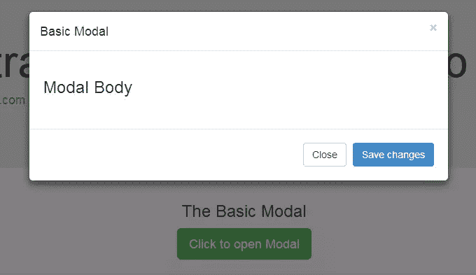

# 理解引导模式

> 原文：<https://www.sitepoint.com/understanding-bootstrap-modals/>

在本教程中，我们将讨论最有用的 jQuery Bootstrap 插件之一，Bootstrap [Modal](http://getbootstrap.com/docs/4.0/components/modal/) 。 *Bootstrap Modals* 提供了一个轻量级的、多用途的 JavaScript 弹出窗口，可以定制和响应。它们可用于在网站中显示警告弹出窗口、视频和图像。基于 Bootstrap 的网站可以使用 Bootstrap 模态来展示，例如，条款和条件(作为注册过程的一部分)，视频(类似于标准灯箱)，甚至社交媒体小部件。

现在让我们检查一下 Bootstrap 模态的不同部分，这样我们可以更好地理解它们。

引导模式分为三个主要部分:页眉、主体和页脚。每个都有自己的角色，因此应该相应地使用。我们将很快讨论这些。关于 Bootstrap modals 最令人兴奋的事情是什么？您不必编写一行 JavaScript 就可以使用它们！所有的代码和风格都是由 Bootstrap 预定义的。所有需要的是你使用正确的标记和属性，它们只是工作。

## 默认模式

默认的引导模式如下所示:



要触发模态，您需要包含一个链接或一个按钮。触发器元素的标记可能如下所示:

```
<a href="#" class="btn btn-lg btn-success" data-toggle="modal" data-target="#basicModal">
Click to open Modal
</a>
```

注意 link 元素有两个定制数据属性:`data-toggle`和`data-target`。toggle 告诉 Bootstrap 要做什么，target 告诉 Bootstrap 要打开哪个元素。所以每当点击这样的链接时，就会出现一个 ID 为“basicModal”的模态。

现在让我们看看定义模态本身所需的代码。下面是标记:

```
<div class="modal fade" id="basicModal" tabindex="-1" role="dialog" aria-labelledby="basicModal" aria-hidden="true">
<div class="modal-dialog">
<div class="modal-content">
<div class="modal-header">
<h4 class="modal-title" id="myModalLabel">Basic Modal </h4>
<button type="button" class="close" data-dismiss="modal" aria-label="Close">
<span aria-hidden="true">×</span>
</button>
</div>
<div class="modal-body">
<h3>Modal Body</h3>
</div>
<div class="modal-footer">
<button type="button" class="btn btn-default" data-dismiss="modal">Close</button>
<button type="button" class="btn btn-primary">Save changes</button>
</div>
</div>
</div>
</div>
```

modal 的父级`div`应该与上面的 trigger 元素中使用的 ID 相同。在我们的例子中，应该是`id="basicModal"`。

*注意:像父模态元素中的`aria-labelledby`和`aria-hidden`这样的定制属性用于可访问性。让所有人都可以访问你的网站是一个好习惯，所以你应该包含这些属性，因为它们不会对模型的标准功能产生负面影响。*

在模态的 HTML 中，我们可以看到一个包装器`div`嵌套在父模态`div`中。这个`div`有一个`modal-content`类，它告诉`bootstrap.js`在哪里寻找模态的内容。在这个`div`中，我们需要放置我之前提到的三个部分:页眉、主体和页脚。

模态标题，顾名思义，是用来给模态一个标题和一些其他的元素，比如“x”关闭按钮。这应该有一个`data-dismiss`属性，告诉 Bootstrap 删除该元素。

然后我们有了模态体，模态头的兄弟`div`。把身体想象成一块可以玩耍的开放的画布。您可以在正文中添加任何类型的数据，包括 YouTube 视频嵌入、图像或任何其他内容。

最后，我们有模态页脚。默认情况下，此区域右对齐。在这个区域，你可以放置动作按钮，如“保存”、“关闭”、“接受”等。，它们与模式正在显示的操作关联。

现在我们完成了第一个模态！你可以在我们的[演示页面](http://codepen.io/SitePoint/pen/KkHyw)上查看。

## 更改模型的大小

前面我提到过自举模态是响应性的和灵活的。

模态有两种风格:大的和小的。为较大模态的`.modal-dialog` `div`添加一个修饰符类`modal-lg`，或为较小模态的`modal-sm`。

## 用 jQuery 激活引导模式

modal 是一个 jQuery 插件，所以如果你想使用 jQuery 控制 modal，你需要在 modal 的选择器上调用`.modal()`函数。例如:

```
$('#basicModal').modal(options);
```

这里的“选项”是一个 JavaScript 对象，可以传递它来定制行为。例如:

```
var options = {
'backdrop' : 'static'
}
```

可用选项包括:

*   **背景**:可以是`true`也可以是`static`。这定义了您是否希望用户能够通过单击背景来关闭模式。
*   **键盘**:如果设置为`true`模式将通过`ESC`键关闭。
*   **显示**:用于打开和关闭模态。可以是`true`也可以是`false`。
*   **焦点**:初始化时将焦点放在模态上。它可以是真或假，默认设置为`false`。

## 引导模式事件

通过使用在打开和关闭模式时触发的各种事件，可以进一步自定义引导模式的正常行为。这些事件必须使用 jQuery 的`.on()`方法绑定。

各种可用事件包括:

*   **show.bs.modal** :在 modal 打开之前触发。
*   **showed . bs . modal**:显示模态后触发。
*   **hide.bs.modal** :在隐藏模态之前触发。
*   **hidden.bs.modal** :关闭模态后触发。

您可以像这样使用上述事件之一:

```
$('#basicModal').on('shown.bs.modal', function (e) {
alert('Modal is successfully shown!');
});
```

## 结论

modal 是 Bootstrap 提供的最好的插件之一。对于设计新手来说，这是无需编写任何 JavaScript 就能在弹出屏幕中加载内容的最佳方式之一。

下面是一个 CodePen 演示，有三个引导模式的例子。

参见 [CodePen](http://codepen.io) 上 SitePoint ( [@SitePoint](http://codepen.io/SitePoint) )的 Pen [Bootstrap 3.1.0 模态演示](http://codepen.io/SitePoint/pen/KkHyw)。