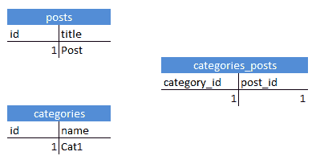

# 通过 Rails 了解 SQL

> 原文：<https://www.sitepoint.com/understanding-sql-rails/>


结构化和关系数据库无处不在。人们常说 web 应用程序是后端数据库的前端接口。在像 HTTP 这样的无状态协议中，您的数据库保存状态并充当持久层。它是机器背后的大脑。

在 MVC 设计模式的传统意义上，您的数据模型解决了这个问题。构建数据库的方式与整体解决方案直接相关。如果您最终得到的是一个充满令人费解的膨胀和重复的数据库，您的前端代码将完全反映这一点。

因此，在这篇文章中，我想看看 SQL 数据库。事实证明，Rails 让这变得很容易。该框架使得将现实世界的问题视为数据模型和关系变得容易。

数据模型中的关系将模型转化为现实世界的“对象”。令人惊叹的是它在 OOP 范例中的适用性。它简化了代码库，使架构变得清晰和敏捷。

我希望，在本文结束时，您会对结构化数据库和关系数据库有所了解。这将有助于您理解为什么后端结构化存储对良好的体系结构至关重要。

我们都想设计一个美丽的建筑，对吗？让我们开始吧。

## 设置

如果你愿意，我们非常欢迎你跟着去。我将在本文末尾链接代码。

要开始，键入以下规范命令:

```
rails new understanding_sql_through_rails
```

对于这个特殊的例子，这是一个工厂过帐系统的运行。它由用户、文章和类别组成。由此，我们将定义关系并开始使用 SQL。

这里的主要焦点是 MVC 设计模式中的模型。

所以，输入:

```
rails g model User name:string{30}
rails g model Post title:string{40} content:text{3200} user:references:index
rails g model Category name:string{15}
rails g migration CreateCategoriesPostsJoinTable categories:index posts:index
```

作为最佳实践，我建议为您的字段设置最大限制。在结构化数据库中，当您设置合理的大小时，计算机将更容易索引数据。结构化数据集的最大优点是它占用了一定的空间，因此可以很容易地进行查询。我的建议是利用这一点。(注意:这是一个适用于大多数 RDBMS 系统的通用语句，PostgreSQL 除外，其中[字段长度不影响性能](http://dba.stackexchange.com/questions/20974/should-i-add-an-arbitrary-length-limit-to-varchar-columns)。)

现在，以下面的话结束:

```
rake db:migrate
```

简单。Rails 为我设置了实体数据模型。您可以研究您的迁移文件，看看在幕后产生了什么。这个框架的惊人之处在于，通过简单的命令来设置我的关系数据库是多么简单。

最后，确保您的模型中有正确的关联。

在 app/models/category.rb 中:

```
class Category < ActiveRecord::Base
  has_and_belongs_to_many :posts
end
```

在 app/models/post.rb 中:

```
class Post < ActiveRecord::Base
  belongs_to :user
  has_and_belongs_to_many :categories
end
```

在 app/models/user.rb 中

```
class User < ActiveRecord::Base
  has_many :posts
end
```

这些关联是 Rails 开箱即用的内置特性。注意这些，大声读出来。一个用户有许多帖子，例如，一个帖子属于一个用户。当我们深入到 SQL 级别时，这些关系将非常有意义。

现在把这个放到你的 db/seeds.rb 中:

```
user = User.create({name: 'Joe'})
post = Post.create({title: 'Post', content: 'Something', user_id: user.id})
Category.create({name: 'Cat1', post_ids: [post.id]})
```

以下列内容结束:

```
rake db:seed
```

结束了。

## 关系

有了 Rails，您的整个数据库都已经设置好了。现在，是我们深入探究刚刚发生的事情的时候了。框架很好地将它抽象了出来。唉，对我们来说，是时候弄清楚这一切是如何运作的了。

键入:

```
rails console
> post = Post.first
> post.categories
> category = Category.first
> category.posts
> user = User.first
> user.posts
```

框架使用这些关系为您触发各种 SQL。正如你所看到的，一篇文章有并且属于许多类别。类别拥有并属于许多帖子。一个用户有许多帖子。

这些关系非常直观，因为你可以用普通的英语谈论它们。这其中最激进的是，你甚至不需要了解任何隐藏在背后的技术。任何对这个问题有足够了解的人现在都可以熟练地使用领域模型。

在任何解决方案中，领域模型都是由现实世界中的对象和关系组成的。这是你与顾客沟通的媒介。它促进了与那些不关心你如何解决他们问题的人的交流。

一个只关心你的最终产品的客户或个人会非常了解这一点。客户非常乐意根据领域来描述问题。这意味着你，作为架构师，现在能够将现实世界的问题与计算机程序联系起来。

不用说，还记得我说过你的模型是如何解决问题的吗？

不知何故，您的 SQL 数据库有办法跟踪这些关系。但问题是，怎么做？

## SQL 查询

这一次，键入:

```
rails dbconsole
```

让记录表明，我们已经正式脱离了 Rails 的世界，进入了 SQL。SQLite 应该是默认的数据库。

如果我们想要查询属于 id 为 1 的用户的帖子，请尝试:

```
SELECT id, title FROM posts WHERE posts.user_id = 1;
```

如图所示，当一个子对象属于一个父对象时，子对象从父对象获得一个添加的外键。

现在来点更难的，比如说我想要属于“第一类”的帖子:

```
SELECT posts.id,
  posts.title
FROM categories,
  posts,
  categories_posts
WHERE categories.id = categories_posts.category_id
  AND posts.id = categories_posts.post_id
  AND categories.name = 'Cat1';
```

下面是这些关系的示意图:



我使用隐式连接。这样可以很容易地看到`WHERE`子句中的关系。在任何给定的 SQL 对象或表中，`id`是主键。注意主键是如何成为绘制关系的支点的。计算机总是更擅长处理数字，所以主键是链接信息的理想场所。

我将 SQL 视为简单的查询语言。因此，在我的实践中，我使用它进行简单的信息查询。做得更多意味着将业务逻辑放在 SQL 中。我建议你不惜一切代价避免这种情况。您的域逻辑不属于 SQL。

有了这个基础，您应该能够有效地利用 SQL 关系来减少数据重复。每当你看到一个表格中的行充满了重复的数据，是时候退后一步思考关系了。

毕竟，这就是使用关系型和结构化数据库的好处。

## 使最优化

你可能注意到了，也可能没注意到，我在一些专栏的末尾添加了奇怪的`:index`。我将这些添加到创建迁移的模型生成器中。原来，这些是索引。在 SQL 中，当您跨关系查询信息时，索引会优化您的数据库。默认情况下，每个主键都有一个索引，但是关系外键没有。

在`dbconsole`中键入这些内容，查看 SQLite 中的运行情况:

```
.schema
```

您应该会看到类似这样的内容:

```
CREATE INDEX "index_categories_posts_on_category_id_and_post_id"
ON "categories_posts" ("category_id", "post_id");
CREATE INDEX "index_categories_posts_on_post_id_and_category_id"
ON "categories_posts" ("post_id", "category_id");
CREATE INDEX "index_posts_on_user_id" ON "posts" ("user_id");
```

因此，当涉及到架构您的领域模型时，您应该是交付高性能解决方案的专家，让您的客户超级高兴。

## 结论

那是一个包裹。在我看来，SQL 数据库将会存在一段时间。他们会比我这一代和我孩子这一代都长寿。我希望您能看到 SQL 有多强大，以及如何在现实世界的问题中有效地使用它。

你可以在 GitHub 上找到剩下的代码。

黑客快乐！

## 分享这篇文章