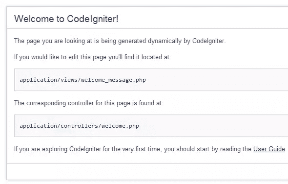
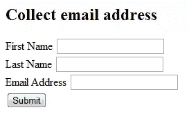
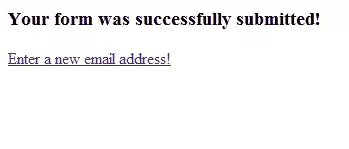

# 用 CodeIgniter 解开 MVC

> 原文：<https://www.sitepoint.com/untangling-mvc-with-codeigniter/>

当我第一次开始编程时，我写的唯一一种代码是过程性的。你知道这种类型，一件事导致另一件事，到处都有函数，你就有了一个工作的应用程序。随着我成为一名程序员，我开始发现这种编程方式适用于小项目，但当我开始开发更大的应用程序时，我的代码变得非常混乱，难以阅读。为了解决这个问题，我开始编写自己的类来帮助我编写更好的、可重用的代码，这些代码可以在我所有的应用程序中使用。然后我意识到，虽然我通过这样做学到了很多东西，但我是在重新发明轮子。我写的大部分内容已经在各种 PHP 框架中完成了很多次。我开始研究几乎无穷无尽的 PHP 开发框架，发现大多数都是基于 MVC 的。

学习使用 MVC 进行编程对我来说是一次彻底的范式转变，但这是值得努力的。如果你想用结构化的、可读的代码开发应用程序，这样你就可以快速诊断问题，那么 MVC 就是你的选择。在本文中，我将使用 CodeIgniter(一个基于 MVC 模式的 PHP 框架)为您解开 MVC 的奥秘。我将首先介绍 MVC 的高级概述，它是什么以及它如何帮助您成为一名更好的程序员，然后指导您以 CodeIgniter 的方式编写一个简单的 web 表单，以便您可以看到该模式的实际效果。

## 什么是 MVC？

MVC 是另一个你想添加到你无尽的缩略词书中的缩略词；它代表模型-视图-控制器，是一种软件架构设计模式。遵循的 MVC 模式将把你的应用程序的逻辑从它的数据和表现中分离出来。如果您曾经见过这样的代码:

```
<?php if($somthing == $thisthing) echo "<p>Hello there</p>"; ?>
```

然后你就会完全理解一个混合了 PHP 和 HTML 的页面是如何变得难以维护和阅读的。所以让我们看看 MVC 的每个部分，看看每个部分代表什么。

*   **模型**–封装您的数据管理例程。通常这是您的代码中检索、插入、更新和删除数据库(或您用于数据存储的任何东西)中的数据的部分。
*   **视图**–封装呈现给用户的信息。这是实际的网页、RSS 提要，甚至是页面的一部分，如页眉或页脚。
*   **控制器**–协调应用程序的模型和视图部分，以响应请求。控制器接受来自用户的输入，并指示模型和视图基于该输入执行动作；它控制应用程序中的信息流。

为了更好地理解 MVC 模式是如何工作的，让我们看看使用这种模式编写 PHP 表单的步骤。

1.  用户与呈现 web 表单的视图进行交互。
2.  用户提交表单，控制器接收 POST 请求。它将这些数据传递给模型。
3.  该模型更新并查询数据库，并将结果发送回控制器。
4.  控制器将模型的响应传递给视图。
5.  视图用新数据更新自己，并显示给用户。

## 安装 CodeIgniter

有这么多 MVC 框架，你如何决定选择哪一个呢——它们不都提供相似的功能，只是在实现和语法上略有不同吗？我以前从未使用过框架，所以我不得不通读大量的文档并尝试使用它们来找出哪一个适合我。我发现 CodeIgniter 的学习曲线比其他的要短得多，这可能就是它被誉为初学者的原因。它的文档非常清晰，并提供了许多代码示例来帮助您。尽管在本文中我将使用 CodeIgniter，但 MVC 的概念将适用于您选择的几乎任何框架。

为您的系统安装和配置 CodeIgniter 非常容易。遵循这些步骤，您将在不到五分钟的时间内启动并运行。

1.  下载最新版本的 CodeIgniter 。在撰写本文时，最新版本是 2.0.3。
2.  解压缩归档文件，并将解压缩后的目录放在您的 web 根目录中。
3.  将目录从`CodeIgniter_2.0.3`重命名为`CI`
4.  打开`CI/application/config/config.php`并将基本 URL 更改为您的服务器。我的情况是:`$config['base_url'] = "http://localhost/CI";`
5.  使用 web 浏览器转到服务器上的`CI`目录。同样，在我的例子中是`http://localhost/CI`。

现在您已经完成了 CodeIgniter 的安装，应该会看到如下所示的网页:



现在您已经安装了所有的东西，您可能已经注意到了 CodeIgniter 的所有目录。不要被吓倒；您不必处理其中的大部分，因为您的大部分工作将发生在`system/application`目录中。

在`system/application`目录中，有名为`controllers`、`models`和`views`的子目录。这是放置应用程序文件的地方。您的控制器文件将在`controllers`目录中，模型文件在`models`目录中，视图文件在`views`目录中。

## 少说多做

现在您已经对 MVC 架构有了基本的了解，并且安装了 CodeIgniter，让我们开始一些编码工作。在本例中，您将使用 CodeIgniter 的表单助手类和表单验证库创建一个非常简单的表单来收集电子邮件地址。让我们开始吧。

### 创建控制器

在您的`application/controllers`目录中创建一个名为`sitepointform.php`的新文件，其中包含以下代码:

```
<?php
class Sitepointform extends CI_Controller
{
    public function index() {
        // Load the Form helper which provides methods to assist
        // working with forms.
        $this->load->helper("form");
        // Load the form validation classes
        $this->load->library("form_validation");

        // As you have loaded the validation classes, you can now
        // apply rules to the fields you want validated. The
        // functions below take three arguments:
        //     1\. The name of form field
        //     2\. The human name of the field to be displayed in
        //        the event of an error
        //     3\. The names of the validation rules to apply
        $this->form_validation->set_rules("first", "First Name",
            "required");
        $this->form_validation->set_rules("last", "Last Name",
            "required");
        $this->form_validation->set_rules("email", "Email Address",
            "required|valid_email");

        // Check whether the form validates. If not, present the
        // form view otherwise present the success view.
        if ($this->form_validation->run() == false) {
            $this->load->view("sitepointform_view");
        }
        else {
            $this->load->view("formsuccess");
        }
    }
}
```

### 创建视图

接下来，在您的`application/views`目录中创建一个名为`sitepointform_view.php`的文件，代码如下:

```
<?php
// Display any form validation error messages
echo validation_errors();

// Using the form helper to help create the start of the form code
echo form_open("sitepointform");
?>
   <label for="first">First Name</label>
   <input type="text" name="first"><br>

   <label for="last">Last Name</label>
   <input type="text" name="last"><br>

   <label for="email">Email Address</label>
   <input type="text" name="email"><br>

   <input type="submit" name="submit" value="Submit">
 </form>
</html>
```

使用此代码创建文件`application/views/formsuccess_view.php`，该代码将在表单成功提交后显示:

```
<html>
 <head>
  <title>Form Success</title>
  </head>
 <body>
  <h3>Your form was successfully submitted!</h3>
  <p><a href="http://localhost/CI/index.php/sitepointform">Enter a new
email address!</a></p>
 </body>
</html>
```

现在访问`http://localhost/CI/index.php/sitepointform/index`，您将看到您新创建的表单:



在您的应用程序中，URL 遵循以下模式:

```
http://yourwebroot/[controller-class]/[controller-method]/[agruments]
```

这里`sitepointform`是控制器类，`index`是想要的方法。如果您将该方法重命名为`myForm()`，URL 将如下所示:

```
http://localhost/CI/index.php/sitepointform/myForm
```

如果 URL 中没有方法，CodeIgniter 将假设`index`。

在文本字段中没有任何输入的情况下点击 submit 来尝试验证。您将看到 CodeIgniter 强制执行您之前在控制器中设置的规则，并显示错误消息。

### 创建模型

现在您已经构建了表单，您需要一个地方来存储所有的姓名和电子邮件地址。在数据库中用以下语句创建一个表`addresses`:

```
CREATE TABLE addresses (
    id INTEGER UNSIGNED NOT NULL AUTO_INCREMENT,
    last_name VARCHAR(128) NOT NULL,
    first_name VARCHAR(128) NOT NULL,
    email VARCHAR(128) NOT NULL,
    PRIMARY KEY (id)
);
```

有了数据库表，现在您必须告诉 CodeIgniter 它在哪里。打开`application/config/database.php`并输入您的数据库凭证。为*主机名*、*用户名*、*密码*、*数据库*和 *dbdriver* 键指定适当的值。

然后，用以下代码创建`application/models/sitepointform_model.php`:

```
<?php
class Sitepointform_model extends CI_Model
{
    public function insert_address($data) {
        $this->load->database();
        $this->db->insert("addresses", $data);
    }
}
```

该类有一个名为`insert_address()`的方法，它接受从控制器传入的值数组。CodeIgniter 有一个内置的数据库类，所以你根本不用写任何 SQL`$this->db->insert()`会自动为你生成并执行 SQL。

### 尝试一下

要使用控制器的模型，打开`application/controllers/sitepointform.php`并更新`index()`方法，如下所示:

```
<?php
public function index() {
    $this->load->helper("form");
    $this->load->library("form_validation");

    $this->form_validation->set_rules("first", "First Name",
        "required");
    $this->form_validation->set_rules("last", "Last Name",
        "required");
    $this->form_validation->set_rules("email", "Email Address",
        "required|valid_email");

    if ($this->form_validation->run() == false) {
        $this->load->view("sitepointform_view");
    }
    else {
        $first = $_POST["first"];
        $last = $_POST["last"];
        $email = $_POST["email"];
        $data = array("first_name" => $first,
                      "last_name" => $last,
                      "email" => $email);

        $this->load->model("sitepointform_model");
        $this->sitepointform_model->insert_address($data);
        $this->load->view("formsuccess");
    }
}
```

从表单提交的输入数据被放入一个关联数组中，并传递给模型的`insert_address()`方法。注意数组中的键与地址表中的列同名。这对于创建模型的最后一步非常重要。然后用`$this->load->model()`加载模型，将数据传递给`insert_address()`方法，并显示成功视图。

回到`http://localhost/CI/index.php/sitepointform`并输入一些数据。如果您正确填写了所有文本字段，您将看到成功页面，数据现在已经在您的数据库中。



## 摘要

希望你现在明白 MVC 是怎么回事了，一种基于功能分离代码片段的方法，使一切更有条理。虽然 CodeIgniter 碰巧是我选择的框架，但该模式的知识几乎适用于您选择的任何其他框架，当然，您也可以在没有框架的情况下用自己的代码实现它。

<small>图片 via [阿列克谢·罗扎诺夫斯基](http://www.shutterstock.com/gallery-480505p1.html)/</small>

## 分享这篇文章