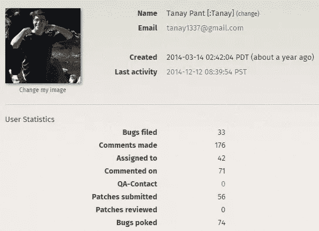
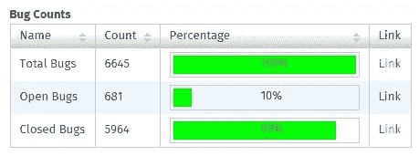

# 如何使用 Bugzilla 高效地消灭 bug

> 原文：<https://www.sitepoint.com/use-bugzilla-efficiently-squash-bugs/>

Bugzilla 是一个开源(Mozilla 公共许可证)的 bug 管理框架，被开源开发社区广泛使用，如 Linux 内核、Mozilla、OpenBSD、Webkit、GNOME、KDE、Apache、Red Hat 和 LibreOffice。

20 年来，Bugzilla 一直是开发人员的最爱，帮助他们实现共同的目标——[**Zarro Boogs**](http://www.bugzilla.org/docs/3.0/html/glossary.html)。Bugzilla 是用 Perl 编写的，它可以在各种数据库上工作，包括 MySQL、Oracle、PostgreSQL 和 SQLite。

让我们来看看这个框架，看看为什么开发人员应该考虑使用 Bugzilla，以及它如何帮助将 bug 管理从特性请求中分离出来，使开发人员和管理员的生活更加轻松。

## 使用角色登录

Bugzilla 允许你用 Mozilla 的[角色](https://login.persona.org/about)登录，这有助于替换多个密码并保护你的隐私。这意味着您可以使用任何现有的角色帐户登录 Bugzilla，一切就绪。

## 单一安装

每个组织只需要安装一个 Bugzilla。您可以从管理面板管理和添加不同的项目和项目子组件。

## 用于审阅的标志

如果您想在采取行动之前从用户那里获得信息，该怎么办？或者您希望您的代码在关闭 bug 之前被其他人审查？Bugzilla 用像`needinfo`、`sec-review`、`review`和`sec-bounty`这样的标志来拯救我们，在这里你可以添加用户的名字，这样他们就会得到通知，并在他们的仪表板上看到关于这个 bug 的未决操作。相当酷！

## 补丁和注释的附件

Bugzilla 允许你对 bug 进行评论(虽然一旦发布就不能编辑了，所以要小心)，这允许开发者和管理者就 bug 进行对话。用户可以给 bug 添加附件，比如图像、代码样本或补丁，这些必须合并到主代码库中。这些附件可以是公开可见的，也可以设置为私有的。

## 白板(用于在白板中添加标签以进行搜索)

因此，从一开始就困扰我们的问题是:如何将 bug 与特性请求分开。在 Bugzilla 中有很多方法可以做到这一点，但是最主要的两种方法是制作一个自定义下拉列表或者使用白板。您可以在白板上添加标记，如`feature-request`，它表示已经为功能请求提交了一个 bug。我看到管理员经常使用的另一个标签是`goodfirstbug`,这表明新来的人也可能会犯这个错误，因为它很容易解决！这些标签可以通过搜索栏进行搜索。

## 易访问的表单，便于缺陷归档

Bugzilla 非常适合帮助非技术用户在几秒钟内提交一个 bug。他们所要做的就是点击归档一个 Bug ->选择产品->填写 Bug 细节->提交。简单对吗？您还可以为 bug 表单创建自定义字段。它还有一个名为 Bugzilla Helper 的功能，引导用户一步一步地提交 bug。

## 每个成员的简介

Bugzilla 的每个成员都有一个个人资料，显示用户的详细信息，如“提交的 bug”、“发表的评论”、“分配给成员的 bug”、“评论”、“QA-Contact”、“提交的补丁”、“审查的补丁”和“戳到的 bug”。这有助于管理团队跟踪单个开发人员的工作。

## 将 bug 和 QA 联系人分配给开发人员

您可以将 bug 分配给用户，或者为`QA-contact`标记 bug。当您将 bug 分配给用户时，他们可以在仪表板和个人资料中看到分配给他们的 bug。类似地，您可以为某个特定的 bug 标记一个人为`QA-Contact`,这样在 bug 被关闭后，就可以联系他来保证特定区域的质量。

## 设置错误的状态、优先级和严重性

对于管理员来说，一个重要的特性是你可以设置错误的状态(`ASSIGNED, NEW, UNCONFIRMED, REOPENED`)、优先级(`--, P1, P2, P3`)和严重性(`normal, major, enhancement, minor, trivial, blocker, critical`)。毕竟，重要的事情应该先处理，看一眼就足以知道 bug 的位置。

## 通过邮件发送产品仪表板和通知

Bugzilla 有一个产品仪表板，可以显示一个产品下的总 bug 数，还可以制作漂亮的条形图，按状态、优先级、严重性和个人受让人显示 bug 的百分比。它甚至通过向你发送通知来提醒你程序中的错误，并通过电子邮件抄送给你。

## Bugzilla vs 其他人

还有很多其他好的错误跟踪选项，包括 JIRA、螳螂、Trac、Redmine、EventNum 和 Fossil。Bugzilla 支持通过电子邮件集成报告、图表和计划报告，而其他人集成了 wiki。Redmine 似乎是这个领域最有特色的。Bugzilla、JIRA、Redmine 和 Trac 支持测试计划集成、可定制的工作流和 unicode 支持，而 Fossil 不支持以上任何一项，Mantis 没有测试计划集成。

Redmine、Fossil 和 Trac 不支持索引全文搜索。Bugzilla 和 JIRA 提供了 CLI、REST 和 SOAP 等接口。JIRA 提供了令人印象深刻的 Visual Studio 界面。JIRA 也有一个简单的认证系统，但 Bugzilla 的角色更胜一筹。如果你热衷于一个好的、稳定的、不是 Bugzilla 的 bug 管理应用，你最好的选择是 JIRA。

## 结论

Bugzilla 是一个伟大的产品，正如你所看到的，被广泛使用。它可以提高管理、缺陷管理以及跟踪项目开发和开发人员活动的效率。

在你的项目中使用一个 bug 管理应用程序——任何 bug 管理应用程序——都有助于提高生产力，并为你的用户提供一个简单的平台来报告他们心爱产品的 bug。很值得调查。

你使用 bug 管理应用吗？你有什么有效消灭虫子的窍门？

## 分享这篇文章