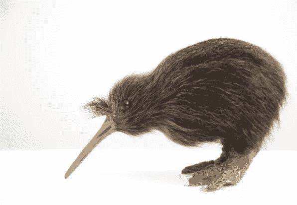
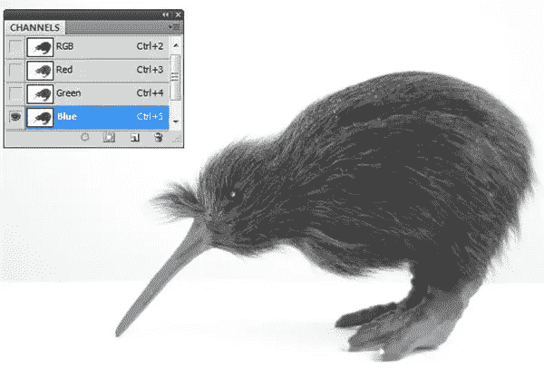
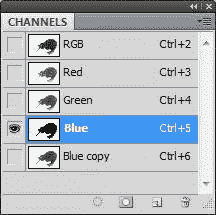
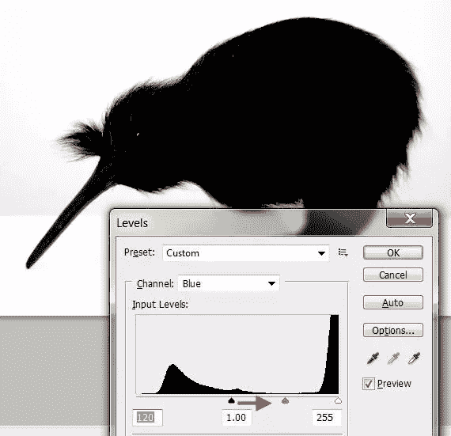
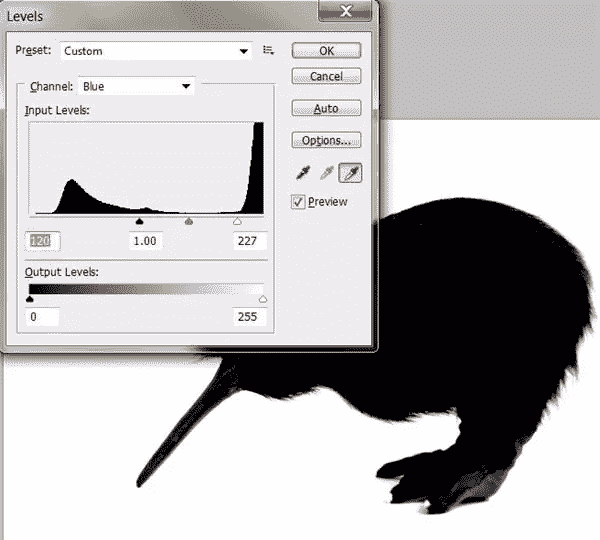
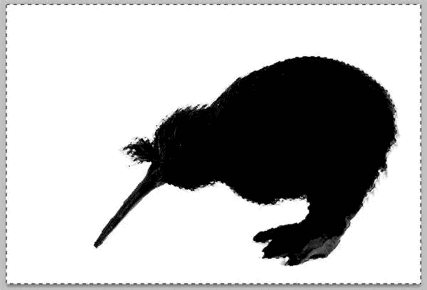
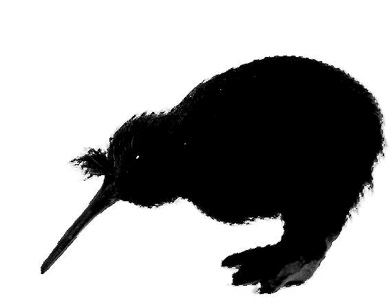
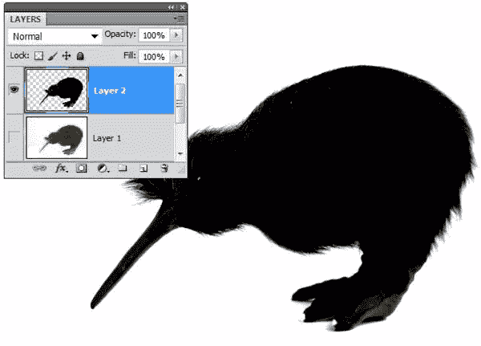
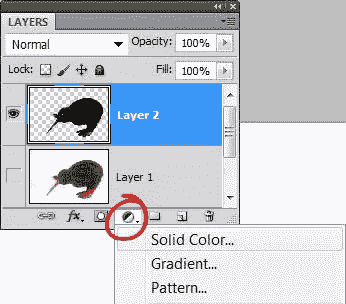
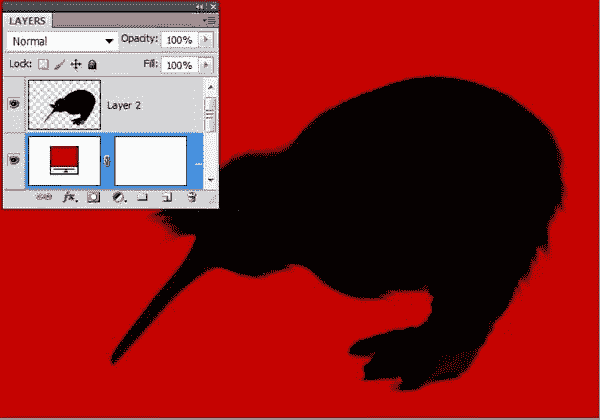

# 在 Photoshop 中使用通道创建剪影

> 原文：<https://www.sitepoint.com/use-channels-to-create-a-silhouette-in-photoshop/>

近年来，剪影一直与苹果 iPod 广告联系在一起，但多年来，从标志到海报设计，它们一直被用作引人注目的图形设计工具。本教程分为两部分，第一部分是如何使用通道选择你想要制作剪影的对象，第二部分是如何创建剪影并添加颜色层。

1.打开包含要变成剪影的对象的图像。我用的是 mmgallen 的一张可爱的小几维鸟的图片，可以从 [Stock Xchng](http://www.sxc.hu/photo/319110) 免费下载。

2.打开通道面板，单击每个通道(红色、绿色和蓝色)，查看几维鸟最暗的地方。通常这是蓝色通道。

3.通过在“通道”面板中右键单击(PC)或按住 Ctrl 键单击(Mac)蓝色通道，并从快捷菜单中选择“复制通道”来复制该通道。我们正在复制它，以便我们所做的任何更改都不会对原始图像产生负面影响。Photoshop 将复制的通道放在“通道”面板的底部，并将其命名为“蓝色副本”

 
4。选择 Image > Adjustments > Levels 来调整复制的蓝色通道的色阶，使猕猴桃变成黑色，背景完全变成白色。要使猕猴桃变暗，在对话框的
输入色阶部分，向右拖动阴影滑块(黑色小三角形)，直到猕猴桃几乎变成黑色。暂时不要关闭“级别”对话框。

5.使用对话框右侧的白色滴管，单击蓝灰色背景，使其变为白色。这种技术被称为“重置白点”。单击一次，将滴管鼠标移到您的文档上，然后单击背景的灰色部分。不断点击不同的灰色区域，直到背景变成白色。完成后，
点击确定关闭等级对话框。

6.如果你愿意，你可以很容易地用黑漆修饰猕猴桃，用白漆修饰背景，但是你现在应该有一个相当好的黑白图像了。

7.在“通道”面板中，通过按住 Ctrl 键单击(PC)或单击(Mac)通道的缩略图或单击面板底部的“将通道
加载为选区”按钮(虚线圆圈),将复制的蓝色通道加载为选区。

这将围绕图像的背景进行选择，因此选择**选择>反转**使选择围绕您的猕猴桃而不是整个文档。这就完成了我们使用通道的选择设置。这是一个很好的方法来做一些相当复杂的选择，注意猕猴桃后面的小绒毛，用选择工具很难选择。

9.在“通道”面板中，打开复合通道(RGB ),这样您就可以看到图像的全色版本，并隐藏重复的蓝色通道。

10.点击面板底部的“创建新图层”按钮，在图层堆栈顶部添加一个新图层。然后将新图层拖到图层堆栈的顶部，并关闭原始照片图层的可见性。

11.从“使用”弹出菜单中选择“编辑”>“填充”并选择“黑色”,用黑色填充选区，然后单击“确定”关闭“填充”对话框。你的轮廓完成了。现在你可以添加任何你喜欢的颜色背景。

12.在图层面板的底部，单击调整图层图标。从出现的菜单中选择纯色，使 Photoshop
打开拾色器；选择一种明亮的颜色，然后单击确定。

13.在层堆栈中，将新填充层拖到剪影层下方。

如果您想返回并更改背景色，只需双击纯色填充层，然后从生成的颜色选择器中选择一种新颜色。

最后，我在黑色矩形的顶部添加了一些文字。

最后一步，你可以使用模糊蒙版来锐化轮廓。选择“滤镜”>“锐化”>“模糊遮罩”。瞧啊。

## 分享这篇文章