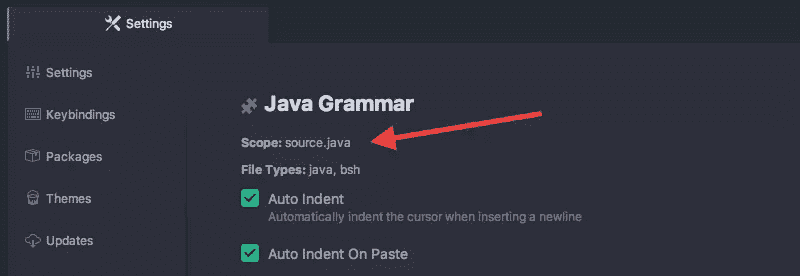

# 如何在 Atom 中使用代码片段

> 原文：<https://www.sitepoint.com/use-code-snippets-atom/>

代码片段是经常使用的代码块，可以快速插入到程序文件中。它们很有用，是 [Atom 文本编辑器](https://atom.io/)的核心特性。也就是说，你可以使用编辑器好几个月，却没有意识到代码片段是可用的，也没有意识到它们的威力！

Atom 包和语言语法通常附带预定义的代码片段。例如，启动或打开一个新的 HTML 文件，然后键入`img`并按 Tab 键。出现以下代码:

```

```

并且光标将在`src`属性引号之间。再次点击 Tab，光标将移动到`alt`属性。最后一次按 Tab 移动到标签的末尾。

开始键入时，代码片段触发器文本用绿色箭头指示。您可以通过将光标放在任意位置并按下 **Alt-Shift-S** 来查看当前文件语言类型的所有已定义代码片段。滚动或搜索列表以找到并使用特定的代码片段。

或者，打开**设置**中的**包**列表，输入“语言”查看所有语法类型的列表。选择一个并滚动到**片段**部分，查看预定义的触发器和代码。

## 如何创建自己的代码片段

您将拥有自己经常使用的代码块，这些代码块可以被定义为代码片段。我在调试 Node.js 应用程序时使用的一个有用的命令是将对象作为 JSON 字符串记录到控制台:

```
console.log('%j', Object);
```

Atom 已经为`console.log();`预定义了一个`log`触发器，但是您可以使用自定义代码片段来改进它。

自定义片段在位于您的`~/.atom`文件夹中的`snippets.cson`文件中定义。从**文件**菜单中选择**打开您的片段**进行编辑。片段需要以下信息:

1.  语言标识符，或*范围*字符串
2.  简明描述代码的名称
3.  点击 Tab 时触发代码片段的触发器文本，以及
4.  带有可选制表位的代码段正文代码。

转到`snippets.cson`的末尾，键入`snip`然后按 Tab——是的，甚至有一个代码片段来帮助您定义代码片段！…

```
'.source.js':
  'Snippet Name':
    'prefix': 'Snippet Trigger'
    'body': 'Hello World!'
```

注意，CSON 是 CoffeeScript 对象符号。这是一个直接映射到 JSON 的简洁语法；本质上，使用缩进而不是方括号。

首先，您需要范围字符串，该字符串标识您的代码片段可以应用的语言。确定范围最简单的方法是在**设置**中打开**包**列表，输入‘语言’。打开你需要的语法包，在顶部寻找**作用域**的定义。



`snippets.cson`中的代码片段范围还必须在该字符串的开头添加一个句点。流行的网络语言范围包括:

*   HTML: `.text.html.basic`
*   CSS: `.source.css`
*   萨斯:`.source.sass`
*   JavaScript: `.source.js`
*   JSON:t0 版
*   PHP: `.text.html.php`
*   Java: `.source.java`
*   露比:`.text.html.erb`
*   Python: `.source.python`
*   纯文本(包括降价):`.text.plain`

因此，您可以用以下代码定义一个 JSON 日志片段:

```
'.source.js':
  'log JSON':
    'prefix': 'lj'
    'body': 'console.log(\'%j\', ${1:Object});$2'
```

一旦您的`snippets.cson`文件被保存，该代码片段就会被激活。

在本例中:

1.  对于 JavaScript，范围被设置为`.source.js`
2.  该片段被命名为“`log JSON`”
3.  选项卡触发器(前缀)设置为`lj`
4.  片段主体被设置为`console.log('%j', Object);`(但是，我们添加了一些额外的控制代码，如下所示)。

正文中的单引号必须用前面的反斜杠(`\'`)进行转义。

制表位是用美元后跟一个数字来定义的，例如$1、$2、$3 等。$1 是光标出现的第一个制表位位置。当点击 Tab 时，光标移动到$2，以此类推。

上面的制表位$1 已经用默认文本定义，以提醒或提示用户:`${1:Object}`。当使用该代码片段时，在`console.log('%j', Object);`中选择了**对象**，因此可以将其更改为适当的对象名。

额外的代码片段可以添加到`snippets.cson`文件的底部。如果您需要同一种语言的两个或更多代码段，请将它们添加到适当的范围部分。例如，您可以在`'.source.js'`范围内创建另一个 JavaScript 片段来记录任何数组的长度:

```
'.source.js':
  'log JSON':
    'prefix': 'lj'
    'body': 'console.log(\'%j\', ${1:Object});$2'
  'log array length':
    'prefix': 'llen'
    'body': 'console.log(\'${1:array} length\', ${1:array}.length);$2'
```

注意这里有两个`${1:array}`制表位。当`console.log('array length', array.length);`出现时，你会看到两个光标和两个**数组**的实例都被高亮显示——你只需要输入一次数组名，两个都会改变！

## 多行代码片段

如果您更喜欢冒险，可以在代码体的开头和结尾使用三个双引号`"""`来定义更长的多行代码片段。这个代码片段生成一个 2×2 的表格，只有一个标题行:

```
'.text.html.basic':
  '2x2 table':
    'prefix': 'table2x2'
      'body': """
        <table summary="$1">
          <thead>
            <tr>
              <th>$2</th>
              <th>$3</th>
            </tr>
          </thead>
          <tbody>
            <tr>
              <td>$4</td>
              <td>$5</td>
            </tr>
            <tr>
              <td>$6</td>
              <td>$7</td>
            </tr>
          </tbody>
        </table>
        $8
      """
```

代码片段体中的代码缩进对 CSON 定义没有任何影响，但是我建议您将它缩进到`body`定义之外，以提高可读性。

快乐剪刀手！

如果你是 Atom 新手，你也应该参考 [10 个 Atom 基本插件](https://www.sitepoint.com/10-essential-atom-add-ons/)来获得推荐的软件包。

## 分享这篇文章