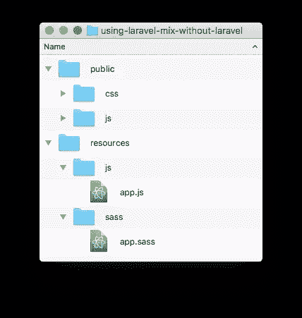
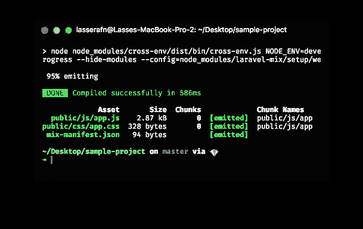

# 如何在非 Laravel 项目中使用 Laravel Mix

> 原文：<https://www.sitepoint.com/use-laravel-mix-non-laravel-projects/>

*这篇文章由[尤尼斯·拉菲](https://www.sitepoint.com/author/yrafie)、[沃恩·安切塔](https://www.sitepoint.com/author/wancheta)和[克里斯多佛·皮特](https://www.sitepoint.com/author/assertchris)进行了同行评议。感谢 SitePoint 的所有同行评审员使 SitePoint 的内容尽可能做到最好！*

* * *

如果你像我一样，只想尽快启动并运行一个项目，你可能不想花时间配置像 Webpack 这样的构建工具。Laravel Mix 解决了这个问题，并使资产编译变得非常容易，但是如果您想在一个非 Laravel 项目中使用它呢？本文向您展示了如何实现这一点。


## 什么是 Laravel Mix？

Laravel Mix，以前称为 Elixir，可以定义为 Webpack 的 API 包装器。它有一个流畅的语法，通常易于使用。设置版本控制、热重装和资产构建/编译轻而易举，只需要一个配置文件和几行代码。

## 背景

对于我的大多数项目，无论是客户还是个人，我都选择 Laravel，但我最近有一个客户想要编辑他们网站上的页面和内容，他想要一个 CMS。考虑到它是基于 Laravel 的，我决定尝试一下 [OctoberCMS](http://octobercms.com) 。

我从 PhpStorm 设置了文件观察器，但它不如运行 Laravel Mix 工作得好。在使用文件监视器一周后，我试着从一个 Laravel 项目中取出 Laravel Mix，结果感觉就像它应该的那样。

## 要求

对于本教程，我假设您已经掌握了管理 JSON 文件的基本知识，并且您的系统上已经安装了 [NPM](https://npmjs.com) 和[节点](https://nodejs.org/en/)。

如果你想使用版本控制和热重装，你需要使用 PHP 和 [Composer](https://getcomposer.org) 。

要验证您是否拥有 NPM 和节点，您可以在终端中运行以下命令:

```
node -v
npm -v 
```

您应该会看到节点和 NPM 的版本。

*注意:你也可以使用[家园改进版](https://www.sitepoint.com/quick-tip-get-homestead-vagrant-vm-running/)，它附带了所有这些安装。如果你对此感到困惑，请用我们的书[来澄清！](http://bit.ly/phpenv-spp)*

## 入门指南

首先启动您最喜欢的终端/控制台应用程序。

如果你还没有一个项目，想从一个空的项目开始，只需在你的计算机上创建一个空的目录，并把它作为你的项目目录。你不需要任何初始文件来开始。

## 安装 Laravel Mix 和 SASS

您现在将安装 Laravel Mix，但是您还需要另一个名为“cross-env”的依赖项，以便能够跨不同平台使用环境变量。此外，您将需要“node-sass”来编译 sass 文件。

要安装 Laravel Mix、SASS 和 cross-env，请运行以下命令:

```
npm install laravel-mix cross-env node-sass --save-dev 
```

如果一切正常，您将拥有一个名为`node_modules`的新目录，并且您的`package.json`文件也将被更新。

如果你打算对你的作品进行版本控制，记得将`node_modules`添加到你的`.gitignore`文件中。

## 创建 Webpack 混合文件

有了 Laravel Mix，您将不必担心创建 Webpack 配置文件，这是我在几乎所有 web 项目中使用它的主要原因。您只需要创建一个文件来定义您想要编译的资产。

首先在项目的根目录下创建一个名为`webpack.mix.js`的新文件。添加以下内容:

```
const mix = require('laravel-mix');

mix.js('resources/js/app.js', 'public/js')
   .sass('resources/sass/app.scss', 'public/css'); 
```

这定义了您想要使用 Webpack 编译的一个 Javascript 文件和一个 SCSS/SASS 文件，以及输出目录。您可以根据需要设置文件和输出名称。出于本教程的目的，我将把`mix.js(..).sass(..)`代码称为“混合链”。

## 向 package.json 添加脚本

要实际使用 Mix，您必须在您的`package.json`文件中包含一些脚本。为了让它尽可能与 Laravel 相似，我决定直接从一个新的 Laravel 5.4 项目中复制它们。

如果您的文件中已经有一个脚本变量，您可以删除它的内容。

在代码编辑器中打开您的`package.json`文件，添加`scripts`和`config`变量，内容如下:

```
 "scripts": {
    "dev": "node node_modules/cross-env/dist/bin/cross-env.js NODE_ENV=development node_modules/webpack/bin/webpack.js --progress --hide-modules --config=node_modules/laravel-mix/setup/webpack.config.js",
    "watch": "node node_modules/cross-env/dist/bin/cross-env.js NODE_ENV=development node_modules/webpack/bin/webpack.js --watch --progress --hide-modules --config=node_modules/laravel-mix/setup/webpack.config.js",
    "hot": "node node_modules/cross-env/dist/bin/cross-env.js NODE_ENV=development node_modules/webpack-dev-server/bin/webpack-dev-server.js --inline --hot --config=node_modules/laravel-mix/setup/webpack.config.js",
    "production": "node node_modules/cross-env/dist/bin/cross-env.js NODE_ENV=production node_modules/webpack/bin/webpack.js --progress --hide-modules --config=node_modules/laravel-mix/setup/webpack.config.js"
  }, 
```

您的文件看起来应该类似于[这个](https://github.com/LasseRafn/sitepoint-laravel-mix-without-laravel/blob/master/package.json)。

## 创建要编译的资产

在您的`webpack.mix.js`文件中，我们定义了一些要编译的文件，但是如果它是一个新项目，这些文件可能不存在。您希望您的文件夹结构如下所示:



您可以将一些内容添加到您的`resources/sass/app.sass`文件中进行测试:

```
body {
    background: red;
} 
```

## 运行 Laravel Mix

要测试一切是否按预期运行，请运行以下命令:

```
npm run dev 
```

您应该会看到类似如下的屏幕:



## 设置缓存破坏和热重装

热重装允许你调整你的资产，并使改变立即出现在你的浏览器中，而不需要实际刷新。这对于 CSS 调整特别有用。它会在每次更改时自动注入最新版本的文件。

Laravel Mix 为此使用了 BrowserSync，它还附带了许多简洁的功能，例如可以在其他设备上查看内容，并在设备之间同步状态(输入、滚动等)。

缓存破坏是一种通过向编译后的资产添加哈希来避免浏览器缓存的方法，因此`app.js`可能会变成`app.b2328beb0372c051d06d.js`。这迫使浏览器从服务器获取文件。

为了设置缓存破坏和热重载，我们必须包含一个提供相同`mix()`方法的 php 文件(您可能从 Laravel 中知道)。

`mix()`方法是一个基本的助手，它可以找到资产的正确版本，并判断是否启用了热重装。

在您的项目根目录(或者您希望的位置)创建一个名为`mix.php`的文件，包含以下内容:

```
<?php
 if (! function_exists('mix')) {
    /**
     * Get the path to a versioned Mix file.
     *
     * @param string $path
     * @param string $manifestDirectory
     * @return string
     *
     * @throws \Exception
     */
    function mix($path, $manifestDirectory = '')
    {
        static $manifest;
        $publicFolder = '/public';
        $rootPath = $_SERVER['DOCUMENT_ROOT'];
        $publicPath = $rootPath . $publicFolder;
        if ($manifestDirectory && ! starts_with($manifestDirectory, '/')) {
            $manifestDirectory = "/{$manifestDirectory}";
        }
        if (! $manifest) {
            if (! file_exists($manifestPath = ($rootPath . $manifestDirectory.'/mix-manifest.json') )) {
                throw new Exception('The Mix manifest does not exist.');
            }
            $manifest = json_decode(file_get_contents($manifestPath), true);
        }
        if (! starts_with($path, '/')) {
            $path = "/{$path}";
        }
        $path = $publicFolder . $path;
        if (! array_key_exists($path, $manifest)) {
            throw new Exception(
                "Unable to locate Mix file: {$path}. Please check your ".
                'webpack.mix.js output paths and try again.'
            );
        }
        return file_exists($publicPath . ($manifestDirectory.'/hot'))
                    ? "http://localhost:8080{$manifest[$path]}"
                    : $manifestDirectory.$manifest[$path];
    }
} 
```

### 让我们用 Composer 自动加载它。

打开您的`composer.json`文件，或者在您的项目根目录下创建一个新文件。

我们希望在所有 PHP 请求之前自动加载`mix.php`。添加以下内容:

```
{
    ...

    "autoload": {
        "files": ["mix.php"]
    }

    ...
} 
```

你的档案应该类似于[这个](https://github.com/LasseRafn/sitepoint-laravel-mix-without-laravel/blob/master/composer.json)。

## 建立一个索引文件来测试你的资产

1.  为了实际测试版本化是否有效，我们必须对我们的资产进行版本化(并且可选地启用热重新加载)，所以转到您的`webpack.mix.js`文件，并将其更改为:

```
const mix = require('laravel-mix');

mix.js('resources/js/app.js', 'public/js')
   .sass('resources/sass/app.scss', 'public/css')
   .version()
   .browserSync(); // Hot reloading 
```

你希望它看起来像这样。

1.  现在，创建一个用于测试资产的`index.php`文件，并添加一些演示内容:

```
<?php
  require_once 'vendor/autoload.php';
?>
<!DOCTYPE html>
<html>
  <head>
    <title>Demo</title>
    <link rel="stylesheet" href="<?php echo mix('css/app.css'); ?>" />
  </head>

  <body>
    Hello world.

    <script src="<?php echo mix('js/app.js'); ?>"></script>
  </body>
</html> 
```

1.  在终端/命令行中转到您的项目根目录。

### 如果你想热重装

在您的终端中运行`npm run hot`来生成版本化资产并初始化热重装。现在应该会打开一个网页，显示您的站点。如果您选择了这一步，您可以跳过下一小节。

### 如果你不想热重装

运行以下命令:

```
npm run dev 
```

现在运行以下命令:

```
php -S localhost:8080 
```

这将启动一个 PHP 服务器。

打开浏览器，导航到端口为 8080 的网站 URL，例如`homestead.app:8080`

### 结果

你应该看到一个红色的背景(如果你决定在你的`app.scss`文件中保留身体的样式)

就是这样！现在，您可以使用 Laravel Mix 进行非常灵活的 Webpack 配置，而不需要 Laravel 本身。请务必查看 [Laravel Mix 文档](https://laravel.com/docs/5.4/mix)。

### 附加命令

在您的`package.json`文件中，实际上还有两个脚本/命令:`production`和`watch`。这两者对你的工作流程都非常有用。

#### `production`命令

当您准备好将项目部署到生产环境中时，您会想要生成缩小的资产，这正是`production`命令所做的。你像这样运行它:

```
npm run production 
```

缩小的生产资产现在应该已经生成了。

#### `watch`命令

为脚本或样式的每个微小变化运行`dev`会很快变成一种痛苦。`watch`对此有所帮助。这个命令的作用是监视文件的变化，如果检测到变化，就重新编译资源。

```
npm run watch 
```

请注意，在运行`watch`命令的情况下，诊断构建错误(尤其是 JS 语法错误)会更加困难。如果遇到问题，运行`dev`命令以获得更清晰的输出。

## 结论

如果您对遵循这个过程不感兴趣，只想马上开始，您可以去 [Github 库](https://github.com/LasseRafn/sitepoint-laravel-mix-without-laravel)看看这个示例项目。

对我来说，这是在我不使用 Laravel 的小型项目中使用 Laravel Mix 的最佳方式。在习惯了这个流程之后，设置它只需要几分钟，而配置 Webpack 需要很长时间。

你同意/不同意吗？你在你的 PHP 项目中使用纯 webpack，还是其他捆绑器/构建器？请在评论中告诉我们！

## 分享这篇文章