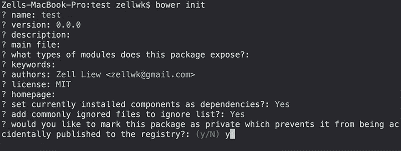
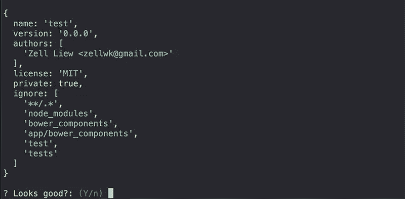
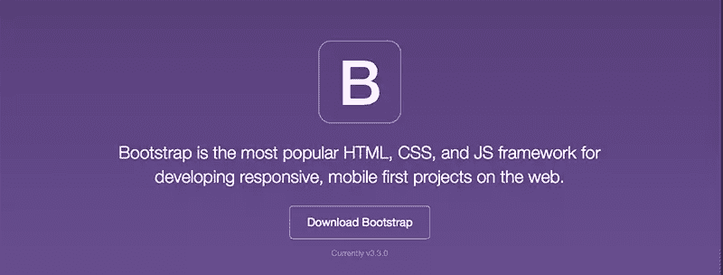

# 如何将 Susy 与 Bootstrap 一起使用

> 原文：<https://www.sitepoint.com/use-susy-bootstrap/>

Susy 是一个网格布局引擎，旨在帮助 web 开发人员轻松创建 web 布局。它允许我们创建自定义的网格，而且它的工作做得非常好。

关于 Susy 的一个常见抱怨是它太简单了，它只是一个网格布局引擎。它没有附带的 UI 工具包，这降低了希望快速原型化的开发人员的速度。

好消息是，Susy 可以集成到几乎任何框架或 UI 工具包中，包括主要的，如 Bootstrap 和 Foundation。

这正是本教程所要讲的——将 Susy 与另一个框架集成，具体来说就是 Bootstrap。即使您不是 Bootstrap 的粉丝，也可以通过本教程了解如何将 Susy 与您选择的 UI 工具包集成。

## 本教程的假设和结果

本教程假设您对 Susy 和 Bootstrap 有所了解。

如果你对 Bootstrap 完全陌生，我建议你在继续之前先看看由 [Fazle](https://www.sitepoint.com/author/sfrahman/) 撰写的[这篇教程](https://www.sitepoint.com/twitter-bootstrap-3-javascript-components/)。

如果你对 Susy 完全陌生，我建议你先看看我关于 Susy 的入门教程。

我们使用 [Bower](http://bower.io) 将 Bootstrap 的 Sass 包安装到项目中，因为这将允许我们定制包含哪些文件。在继续之前，您还应该在系统上安装 Bower。

在本教程中，我们将使用 Susy 创建 [Bootstrap 主页](http://getbootstrap.com)的一部分。我们还将学习如何

*   使用按钮、表单和其他引导用户界面元素
*   为您的项目定制引导变量
*   包括必要的引导组件，以减少 CSS 和 JS 的占用空间。

这是我们将在文章中得出的结果的摘录。


## 入门指南

首先，为您的项目创建一个新文件夹，并在终端中运行以下命令:

```
bower init
```

Bower 将运行一个初始化过程，如下所示:



Bower 将创建一个摘要，然后在您输入提示的答案后创建一个 bower.json 文件。



一旦创建了 bower.json 文件，就可以使用以下命令开始安装软件包:

```
bower install <package-name>
```

让我们从安装 bootstrap-sass 开始。

```
bower install bootstrap-sass
```

现在，让我们安装另外两个组件——normalize-scss 和 breakpoint-sass。

Normalize-scss 是 [normalize.css](http://necolas.github.io/normalize.css/) 的 Sass 版本，是由[尼古拉斯·加拉格尔](https://twitter.com/necolas)开发的一个 web 重置文件。我们需要 normalize.css 来确保我们的网站跨浏览器保持一致。

[Breakpoint-sass](http://breakpoint-sass.com) 是由 [@import](https://github.com/at-import) 开发的一个实用程序库，它有助于使媒体查询更容易处理。

```
bower install normalize-scss
bower install breakpoint-sass
```

安装后，可以在`apps/bower_components/component-name`下找到 Bower 包。

如果您现在在 finder 或 windows 资源管理器上查看文件夹，您会在`bower_components`目录中看到五个文件夹:


两个额外的组件，jQuery 和 sassy-maps，是由 Bower 自动安装的，因为 Bootstrap 需要 jQuery 工作，而 Breakpoint 需要 sassy-maps 工作。

关于 Bower 的巧妙之处在于它为我们安装了这些依赖包。

现在我们已经准备好了包，让我们创建项目文件夹。它应该是这样的:


并在 sass 文件夹中添加`styles.scss`。

在任何新网站上，我们需要做的第一件事是将 normalize.scss 添加到项目中，以标准化浏览器之间的样式。如果您遵循了上述配置，那么在`bower_components`文件夹中会找到`normalize.scss`。

我们需要的文件的位置是`../app/bower_components/normalize-scss/normalize`。

```
// Resets
@import "../app/bower_components/normalize-scss/normalize";
```

当我们这样做的时候，让我们也为这个项目包含其他的包，比如 Susy 和 Bootstrap。

```
@import "susy"; // Susy
@import "../app/bower_components/breakpoint-sass/stylesheets/breakpoint"; // Breakpoint
@import "../app/bower_components/bootstrap-sass/lib/bootstrap"; // Boostrap
```

最后，确保在`index.html`中链接到 styles.css、jQuery 和 Bootstrap 的 js 文件

```
<!DOCTYPE html>
<head>
  <link rel="stylesheet" href="css/styles.css">
</head>
<body>
  <script src="app/bower_components/jquery/dist/jquery.min.js"></script>
  <script src="app/bower_components/bootstrap-sass/dist/js/bootstrap.js"></script>
</body>
</html>
```

这就是建立项目的全部内容。我们现在需要一种方法来观察 Sass 并将其编译成 CSS，下面是您如何使用终端来完成它:

```
sass --watch scss:css -r susy
```

该命令告诉终端观察`scss`文件夹的变化，并将文件输出到`css`文件夹。Susy 是作为一个 gem 安装的，我们需要用`-r susy`标志运行它。

当您运行上面的命令时，应该会得到以下提示。


注意:如果您愿意，您可以选择通过其他方式将 Sass 编译成 CSS，如 Compass、Grunt、Codekit 或 Prepos。

我们现在可以开始集成 Susy 和 Bootstrap 了。

## 使用 Susy 和 Bootstrap(理论)

在我上一篇关于 Sitepoint 的文章中，我[比较了 Susy 和 Bootstrap](https://www.sitepoint.com/bootstraps-grid-system-vs-susy-comparison/) 并指出比较它们的唯一方法是比较它们的网格。

这对今天的话题是一个巨大的暗示。我们谈论的是哪个框架并不重要。只要你能切换网格，苏西就能很好地工作。

让我们用一个例子来说明一下。假设我们试图制作一个简单的三列布局，如下所示:


带有 Bootstrap 的 HTML 是:

```
<div class="container">
  <div class="row">
    <div class="col-md-4"></div>
    <div class="col-md-4"></div>
    <div class="col-md-4"></div>
  </div>
</div>
```

有了 Susy，我们可以抛弃拥有一个`.row`的概念，为每一列设置自定义类。我还建议切换`.container`类，这样我们就不会混淆引导网格和我们自己的 Susy 布局。

```
<div class="wrap">
  <div class="apple"></div>
  <div class="banana"></div>
  <div class="carrot"></div>
</div>
```

Susy 适用于您决定使用的任何类。虽然使用水果很有趣，但更实际的选择是像`.content`和`.sidebar`这样的类。

这些类本质上是语义类，对于小型网站来说非常有用。但是随着网站变大，它们很难扩展和重用。

重命名这些类的更好方法是将网格类抽象成一个父类，作为布局模式。

```
<div class="wrap">
  <div class="three-columns">
    <div class="grid-item"></div>
    <div class="grid-item"></div>
    <div class="grid-item"></div>
  </div>
</div>
```

你可以在这里找到更多关于为什么以及如何用这种方式写类的信息。

无论你如何命名你的类，Susy 都工作得很好。现在，让我们在本文的剩余部分继续使用`.three-columns`模式。

我们需要为刚刚创建的类编写 Susy 代码。

```
$susy: (
 columns: 12,
 container: 1140px,
 global-box-sizing: border-box,
 debug: (image: show)
  );

 @include border-box-sizing;

  .wrap {
 @include container();
  }

  .three-columns {
 @include clearfix;
    .grid-item {
 @include gallery(4);
    }
  }
```

这是如何开始使用 Susy 网格的快速入门。如果这让你感到困惑，我建议你后退一步，先[阅读本教程](http://www.zell-weekeat.com/susy2-tutorial/)

很容易编写媒体查询来增加响应设计的 Susy。在这样做的同时，我们希望确保尽可能多地编写[移动优先的](http://www.html5rocks.com/en/mobile/responsivedesign/#toc-style-mobilefirst)媒体查询。

移动优先媒体查询尽可能使用`min-width`查询，只在较大的断点处改变布局。

在这种情况下，这三列可以在一个较小的视窗中显示为一列，它将在 760 像素处分成 3 列。这种样式应该是:

```
.three-columns {
 @include clearfix
  .grid-item {
 @media (min-width: 760px) {
 @include gallery(4);
    }
  }
}
```

因为我们已经安装了断点-sass，所以我们可以选择使用断点 mixin 来处理媒体查询:

```
.three-columns {
 @include clearfix
  .grid-item {
 @include breakpoint(760px) {
 @include gallery(4);
    }
  }
}
```

我们现在有一个网格，其中三个项目在移动设备上是全幅的，并在 760 像素处分成 3 列。


我们现在在网格上有了灵活性，最棒的是我们仍然可以使用 Bootstrap UI 类快速创建元素！

```
<div class="wrap">
  <div class="three-columns">
    <div class="grid-item">
      <!-- Some buttons here -->
      <button href="#" class="btn btn-default btn-lg">This is a button!</button>
    </div>
    <div class="grid-item">
      <!-- some form inputs here -->
      <input class="input-lg" type="text" placeholder="This is an input!">
    </div>
    <div class="grid-item">
      <div class="alert alert-success">This is an alert!</div>
    </div>
  </div>
</div>
```


这里有一个代码笔来总结我们到目前为止所做的工作。尝试使用它，看看如何向它添加输入、按钮和其他引导 UI 元素。

这就是在初级水平上将 Susy 与 Bootstrap 集成的方式。

Bootstrap 的一个常见问题是代码膨胀，即有大量的代码在您的项目中实际上并不使用。这可能也适用于您选择的框架。

让我们把 Bootstrap 拆开，只集成项目所需的组件，让代码好 10 倍。

## 正在拆除引导程序

Bootstrap 可以分成不同的 CSS 和 JavaScript 组件。对于 CSS，我们要做的就是创建一个自定义的引导包含文件来包含必要的组件。对于 JavaScript，我们只需在 html 文件的末尾添加单独的 JS 组件。

从 html 文件中删除`bootstrap.js`开始这个过程。我们将在下一节添加 JS 组件。

然后，在项目目录中创建一个名为`_custom-bootstrap.scss`的单独文件，并导入这个文件，而不是 Bootstrap 的默认 Sass 文件。

```
@import "susy"; // Susy
@import "../app/bower_components/breakpoint-sass/stylesheets/breakpoint"; // Breakpoint
@import "custom-bootstrap"; // Our own version of customized bootstrap
```

如果在 bootstrap-sass 的 lib 文件夹中打开原始的`bootstrap.scss`,您会发现一大块导入代码:

```
// Core variables and mixins
@import "variables";
@import "mixins";

// Reset
@import "normalize";
@import "print";

// Core CSS
@import "scaffolding";
@import "type";
@import "code";
@import "grid";
@import "tables";
@import "forms";
@import "buttons";

// Components
@import "component-animations";
@import "glyphicons";
@import "dropdowns";
@import "button-groups";
@import "input-groups";
@import "navs";
@import "navbar";
@import "breadcrumbs";
@import "pagination";
@import "pager";
@import "labels";
@import "badges";
@import "jumbotron";
@import "thumbnails";
@import "alerts";
@import "progress-bars";
@import "media";
@import "list-group";
@import "panels";
@import "wells";
@import "close";

// Components w/ JavaScript
@import "modals";
@import "tooltip";
@import "popovers";
@import "carousel";

// Utility classes
@import "utilities";
@import "responsive-utilities";
```

这些组件使 Bootstrap 变得健壮和流行，但同时也令人讨厌。

在大多数情况下，我们并不需要所有的东西。这些是我们绝对需要的文件。将这些导入放在`_custom-bootstrap.scss`文件中。

```
// Core variables and mixins
@import "../app/bower_components/bootstrap-sass/lib/variables";
@import "../app/bower_components/bootstrap-sass/lib/mixins";

// Core CSS
@import "../app/bower_components/bootstrap-sass/lib/scaffolding";
@import "../app/bower_components/bootstrap-sass/lib/type";
@import "../app/bower_components/bootstrap-sass/lib/forms";
@import "../app/bower_components/bootstrap-sass/lib/buttons";

// Components
@import "../app/bower_components/bootstrap-sass/lib/component-animations";
```

在更深层次上定制引导程序时，用你自己的变量替换默认的引导程序变量会有所帮助，就像我们现在所做的。

这样，您可以更改变量输入，并快速更改 Bootstrap 输出的样式。

在您的项目中创建一个`_bootstrap-variables.scss`，导入它，并将 Bootstrap 变量文件的内容复制到这个文件中。

```
// Core variables and mixins
@import "bootstrap-variables"; // Custom Bootstrap Variables
@import "../app/bower_components/bootstrap-sass/lib/mixins";

// Core CSS
@import "../app/bower_components/bootstrap-sass/lib/scaffolding";
@import "../app/bower_components/bootstrap-sass/lib/type";
@import "../app/bower_components/bootstrap-sass/lib/forms";
@import "../app/bower_components/bootstrap-sass/lib/buttons";

// Components
@import "../app/bower_components/bootstrap-sass/lib/component-animations";
```

我们完成了设置，让我们继续构建一些真实的东西。我们将构建引导主页的一小部分，从导航开始。


## 导航

如果您已经熟悉 Bootstrap，Bootstrap 的导航非常简单。

主要想法是这样的:

1.  创建一个单独的 div 来保存将在移动视口中显示的导航切换按钮。
2.  创建另一个 div 来保存所有导航链接

在这个布局中，我们不需要 Susy 来导航。任何事情都可以用 Bootstrap 来完成。

```
<header class="navbar navbar-default" role="navigation">
  <div class="container-fluid">

    <!-- Menu Button for Toggling mobile nav -->
    <div class="navbar-header">
      <!-- data-target and data-target work together here to find the element to show or collapse. In this case, data-toggle looks for the class 'collapse' while data-target looks for the class 'bs-navbar-collapse' -->
      <button class="navbar-toggle" type="button" data-toggle="collapse" data-target=".bs-navbar-collapse">
        <span class="sr-only">Toggle navigation</span>
        <span class="icon-bar"></span>
        <span class="icon-bar"></span>
        <span class="icon-bar"></span>
      </button>
      <a href="#" class="navbar-brand">Bootstrap</a>
    </div>

    <!-- Menu (for both mobile and desktop) -->
    <nav class="collapse navbar-collapse bs-navbar-collapse" role="navigation">
      <ul class="nav navbar-nav">
        <li> <a href="#">Getting started</a> </li>
        <li> <a href="#">CSS</a> </li>
        <li> <a href="#">Components</a> </li>
        <li> <a href="#">JavaScript</a> </li>
        <li> <a href="#">Customize</a> </li>
      </ul>
      <ul class="nav navbar-nav navbar-right">
        <li><a href="#">Expo</a> </li>
        <li><a href="#">Blog</a> </li>
      </ul>
    </nav>
  </div>
</header>
```

您可以通过查看 HTML 本身来了解我们需要包含哪些引导组件。很明显，我们需要`navs`和`navbar` Sass 组件。

```
@import "../app/bower_components/bootstrap-sass/lib/navs";
@import "../app/bower_components/bootstrap-sass/lib/navbar";
```

这里棘手的事情是识别所需的 Javascript 文件。如果你看了上面的 HTML，你会知道我们确实需要`collapse.js`文件。

但是组合中缺少的是您还需要`transitions.js`文件，这一点并不明显。

```
<!-- ... -->
<script src="app/bower_components/jquery/dist/jquery.min.js"></script>
<script src="app/bower_components/bootstrap-sass/js/transition.js"></script>
<script src="app/bower_components/bootstrap-sass/js/collapse.js"></script>

</body>
```

还有一点要注意。我在网上找到的大多数自举教程中经常没有提到这一点。

当定制网格时，改变导航进入“移动模式”的断点会非常有帮助，以匹配我们要用 Susy 编码的定制网格布局。

你可以通过改变`$grid-float-breakpoint`变量来实现。

导航现在应该正常工作了。让我们继续看刊头。

## 桅顶



HTML 也相对简单。你几乎可以从 Bootstrap 的主页上找到完整的代码，并做一些细微的调整。

```
<div class="masthead">
  <div class="wrap">
    <!-- centred-content is a custom Susy layout -->
    <div class="centred-content">
      <span class="bootstrap-icon">B</span>
      <p class="lead">Bootstrap is the most popular HTML, CSS, and JS framework for developing responsive, mobile first projects on the web.</p>
      <p>
        <!-- Note how you can still use Bootstrap buttons  -->
        <a href="#" class="btn btn-primary btn-lg">Download Bootstrap</a>
      </p>
      <p class="version">Currently v3.2.0</p>
    </div>
  </div>
</div>
```

这里的不同之处在于，我们现在有了一个`.centred-content` div，它有 10 列，所有的文本导航都在它的中心。

这个`.centred-content`的代码是:

```
.centred-content {
 text-align: center;
 @include breakpoint (760px) {
 @include span(10);
 margin-left: span(1 wide);
  }
}
```

`span(1 wide)`的左边距将内容向内推进一列和一个装订线，形成一个集中的内容。如果你不明白这是如何工作的，我建议你看看[这篇文章](http://www.zell-weekeat.com/context-with-susy/)。

注意这个按钮是如何在 HTML 中被赋予一个`btn-primary`类的。

一旦改变了变量中按钮的样式，也可以在引导布局中使用`btn-primary`和`btn-default`类。

如果你想知道的话，你也可以改变`.navbar`的样式:)

## 内容

如果我们继续这样下去，我最终会重复我自己的话。我们已经讨论了如何在 Bootstrap 中使用 Susy。

如果你准备好迎接挑战，你需要做的一切都可以在上面的例子中找到。使用它们来完成页面的其余部分，并找到可以在 Bootstraps 标记上使用 Susy 的地方。

作为奖励，这里有本教程最终产品的源文件。随意下载这个作为参考。

提示:其余区域不需要额外的 JS 文件。

## 结论

原来这篇文章更多的是关于 Bootstrap 而不是 Susy。

正如您所看到的，在表层集成 Susy 非常简单，并且保持 Bootstrap 中的所有内容不变。如果您想分解 Bootstrap 并只包含项目所需的文件，这就有点困难了。

将 Susy 与其他框架集成的过程也是一样的。归结起来就是理解 Susy 和你的框架，并找到一种方法将它们融合在一起。

如果你学到了有用的东西，想问问题或聊天，请在评论中告诉我。

## 分享这篇文章