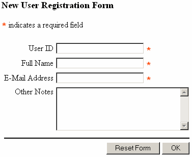
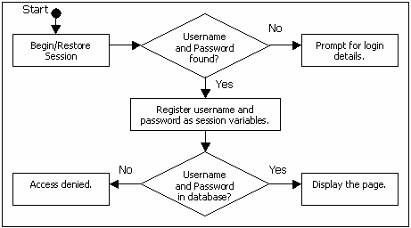

# 使用 PHP 会话和 MySQL 管理用户

> 原文：<https://www.sitepoint.com/users-php-sessions-mysql/>

这篇文章写于 2009 年，至今仍是我们最受欢迎的帖子之一。如果你热衷于学习更多关于 PHP 和 MySQL 的知识，你可能会对这篇最近关于管理 MySQL 的文章很感兴趣。
**注意:这篇文章是最新更新的，适用于 PHP 4.2 或更高版本！**

最近，我有机会和一群人一起做一个小项目。我们很早就决定，仅靠电子邮件不足以让每个人都了解情况，所以我的任务是为这个项目建立一个小型网站。它将包含一个简单的留言板，一个我们可以上传文档和其他文件供团队其他成员使用的地方，以及各个团队成员的联系信息。

为了让这些功能发挥作用，我知道我需要用户在访问网站的相关部分之前登录。我需要的是一个系统，让用户注册一个用户 ID 来访问网站，然后立即使用该 ID，而无需我的任何干预。

在本文中，我将提供我开发的系统的概述，从前半部分的用户注册过程开始。在第二部分中，我将重点介绍站点本身，它如何要求用户登录，然后在整个访问过程中保持登录状态。我将特别关注 PHP 中会话管理特性的使用。最后，您应该拥有了实现自己的类似系统所需的所有信息。

在本文中，我将假设您对 PHP 语言、使用表单向 PHP 脚本提交信息以及如何使用 PHP 与 MySQL 数据库进行交互有基本的了解。如果这些对你来说是陌生的概念，你应该从阅读我的前一篇文章开始，[使用 PHP 和 MySQL](https://www.sitepoint.com/blog/) 构建一个数据库驱动的网站。

## 第一部分:注册过程

### 注册表单

建立一个需要用户注册才能访问的网站的一个自然起点是注册过程本身。正如人们所料，一个简单的基于网络的表单就能达到目的。下面是它的样子:



这是这个表单的代码:

```
<!DOCTYPE html PUBLIC "-//W3C//DTD XHTML 1.0 Transitional//EN"
  "https://www.w3.org/TR/xhtml1/DTD/xhtml1-transitional.dtd">

<html >

<head>

  <title>New User Registration</title>

  <meta http-equiv="Content-Type" content="text/html; charset=iso-8859-1" />

</head>

<body>

  <h3>New User Registration Form</h3>

  <p><font color="orangered" size="+1"><tt><b>*</b></tt></font> indicates a required field</p>

  <form method="post" action="<?=$_SERVER['PHP_SELF']?>">

    <table border="0" cellpadding="0" cellspacing="5">

      <tr>

        <td align="right">

          <p>User ID</p>

        </td>

        <td>

          <input name="newid" type="text" maxlength="100" size="25" />

         <font color="orangered" size="+1"><tt><b>*</b></tt></font>

       </td>

    </tr>

    <tr>

      <td align="right">

        <p>Full Name</p>

      </td>

      <td>

        <input name="newname" type="text" maxlength="100" size="25" />

        <font color="orangered" size="+1"><tt><b>*</b></tt></font>

      </td>

    </tr>

    <tr>

      <td align="right">

        <p>E-Mail Address</p>

      </td>

      <td>

        <input name="newemail" type="text" maxlength="100" size="25" />

        <font color="orangered" size="+1"><tt><b>*</b></tt></font>

      </td>

    </tr>

    <tr valign="top">

      <td align="right">

        <p>Other Notes</p>

      </td>

      <td>

        <textarea wrap="soft" name="newnotes" rows="5" cols="30"></textarea>

      </td>

    </tr>

    <tr>

      <td align="right" colspan="2">

        <hr noshade="noshade" />

        <input type="reset" value="Reset Form" />

        <input type="submit" name="submitok" value="   OK   " />

      </td>

    </tr>

  </table>

</form>

</body>

</html>
```

这个表单中实际上已经嵌入了一段 PHP 代码:

```
<form method="post" action="<?=$_SERVER['PHP_SELF']?>">
```

请注意`action`属性。在一个熟悉的设计模式中，我在以前的文章中称之为**多用途页面**，我们将表单提交到包含表单代码的同一个页面。通过观察 PHP 变量`$_POST['submitok']`，它将由表单中的提交按钮创建(注意标签中的`name="submitok"`)，我们的脚本将能够处理表单提交以及表单本身的显示。

我们还使用了一种相对较新的语法形式来打印出`$_SERVER['PHP_SELF']`变量。如果你不熟悉这个语法，请允许我澄清一下`<?=*expression*?>`和`<?php echo *expression*; ?>`在功能上是相同的。因此，在这种情况下，我们可以改为编写以下内容:

```
<form method="post" action="<?php echo $_SERVER['PHP_SELF']; ?>">
```

现在我们已经获得了表单的代码，我们可以继续编写完整的注册脚本了。

### 注册脚本

如果您习惯于编写数据库驱动的网站，那么注册脚本应该非常简单。首先，我们需要编写一些代码片段，这些代码片段将执行一些常见的功能，比如连接到存储网站用户名和密码的数据库。这些片段将以 PHP 函数的形式存储在包含文件中。我们将使用一个包含文件来存放与数据库相关的函数(`db.php`)，另一个用来存储更通用的函数(`common.php`)。

首先，这里是`db.php`的代码:

```
<?php // db.php

$dbhost = "localhost";
$dbuser = "user";
$dbpass = "password";

function dbConnect($db="") {
global $dbhost, $dbuser, $dbpass;

$dbcnx = @mysql_connect($dbhost, $dbuser, $dbpass)
or die("The site database appears to be down.");

if ($db!="" and !@mysql_select_db($db))
die("The site database is unavailable.");

return $dbcnx;
}
?>
```

这里定义的`dbConnect`函数可以带参数调用，也可以不带参数调用，因为我们已经在函数声明中将默认值(`""`)赋给了`$db`参数。该函数首先使用文件顶部的`$dbhost`、`$dbuser`和`$dbpass`变量连接到 MySQL 服务器(**您需要为您的服务器**将这些变量设置为适当的值)，然后如果给定了数据库名称，它将选择该数据库。假设一切进展顺利，返回对数据库连接的引用。

第二个包含文件`common.php`也包含一个函数:

```
<?php // common.php

function error($msg) {
?>
<html>
<head>
  <script language="JavaScript">
  <!--
  alert("<?=$msg?>");
  history.back();
  //-->
  </script>
</head>
<body>
</body>
</html>
<?
exit;
}
?>
```

我们将使用这个错误函数来告诉用户他或她什么时候做错了。它将一个错误消息作为参数，然后在返回到上一页之前，在一个 JavaScript 弹出消息中显示它。这个函数用`exit`命令结束调用它的脚本，所以它适合在脚本出错时使用。

随着这些无聊细节的消失，您现在可以将注意力转向注册脚本(`signup.php`)。该脚本首先加载我们刚刚编写的两个包含文件:

```
<?php // signup.php
include 'common.php';
include 'db.php';
```

这假设所讨论的文件在包含路径中是可用的。例如，考虑下面的包含路径，我在我的`php.ini`文件中使用了它:

```
include_path = ".;c:php4pear;d:wwwphpinclude"
```

在 Unix 服务器上，它可能看起来像这样:

```
include_path = ".:/usr/local/php/lib/php:/home/kyank/phpinclude"
```

在任一情况下，您都可以选择将包含文件放在使用它们的文件所在的目录中，或者放在包含路径中列出的目录中。对于包含密码等敏感信息的文件，后一种选择更安全，因为如果 Web 服务器中的 PHP 支持失败，PHP 文件中未存储在服务器的 Web 根目录下的信息将不会暴露在窥探的目光之下。

接下来，脚本检查是否存在一个`$_POST['submitok']`变量，这将表明注册表单已经提交。如果找不到变量，脚本将显示上一节中的表单，供用户填写:

```
if (!isset($_POST['submitok'])):
// Display the user signup form
?>
<!DOCTYPE html PUBLIC "-//W3C//DTD XHTML 1.0 Transitional//EN"
"https://www.w3.org/TR/xhtml1/DTD/xhtml1-transitional.dtd">
<html >
<head>
<title>New User Registration</title>
...
```

脚本的其余部分负责通过向数据库添加新用户来处理表单提交，所以让我们暂停一会儿，看看数据库表的设计。下面是创建表的 MySQL 命令:

```
mysql> CREATE TABLE user (
-> ID INT PRIMARY KEY AUTO_INCREMENT,
-> userid VARCHAR(100) UNIQUE NOT NULL,
-> password CHAR(16) NOT NULL,
-> fullname VARCHAR(100) NOT NULL,
-> email VARCHAR(100) NOT NULL,
-> notes TEXT);
```

如您所见，该表相当简单。在您的应用程序中，您可能需要额外的列甚至多个表，但是对于这个例子来说，这个简单的设计就足够了。

因此，回到脚本，当检测到`$submit`变量时，脚本需要准备使用来自`db.php`的`dbConnect`函数将新条目插入数据库:

```
 <?php
else:
// Process signup submission
dbConnect('sessions');
```

注意，我假设包含用户表的数据库名为`sessions`。**如果您使用不同的数据库名称，请务必更改此名称。**

脚本需要做的下一件事是检查表单中的必填字段是否已填写。如果发现任何相应的变量是空字符串，脚本从`common.php`调用`error`函数，告诉用户哪里出错了，并返回表单:

```
 if ($_POST['newid']=='' or $_POST['newname']==''
or $_POST['newemail']=='') {
error('One or more required fields were left blank.\n'.
'Please fill them in and try again.');
}
```

接下来，脚本需要确定用户选择的 ID 是否已经存在于数据库中，在这种情况下，用户必须选择一个新的 ID。这个查询的处理有点不寻常，因为我们获取一个值(具有匹配用户 ID 的条目的计数),这个值实际上要么是 0，要么是 1。因为只有一个值，所以没有必要遍历结果集。相反，我们使用`mysql_result`函数来获取第一行(索引 0)的第一列(索引 0)的值:

```
 // Check for existing user with the new id
$sql = "SELECT COUNT(*) FROM user WHERE userid = '$_POST[newid]'";
$result = mysql_query($sql);
if (!$result) {
error('A database error occurred in processing your '.
'submission.\nIf this error persists, please '.
'contact you@example.com.');
}
if (@mysql_result($result,0,0)>0) {
error('A user already exists with your chosen userid.\n'.
'Please try another.');
}
```

**不要忘记更改错误消息中的电子邮件地址！**

完成所有检查后，在将条目添加到数据库之前，只剩下一项任务需要完成。您可能已经注意到注册表单没有包含供用户输入密码的字段。这是故意的。许多网站不是让用户预先设置密码，而是自动生成初始密码，并将其发送到用户输入的电子邮件地址。

这是检查是否输入了有效地址的有效方法；然而，在一个实际的系统中，你可能会在数据库中找到很多“坏”的条目。要纠正这一点，一个解决方案是向用户数据库添加两列。第一个包含用户创建时的时间戳。第二个是一个布尔值(真/假),它最初被设置为假，在用户第一次登录时被设置为真。然后，您可以编写一个脚本，作为自动任务每周运行一次(例如，使用 cron ),删除一周前已经注册但尚未登录的用户的任何条目。实际上，这些条目的电子邮件地址无效，其密码从未到达用户手中。

脚本接下来必须执行的任务是为用户生成密码。虽然有许多方法可以生成半随机文本字符串用作密码，但下面的一行程序对我很有用:

```
 $newpass = substr(md5(time()),0,6);
```

这是通过获取当前时间并对其执行 MD5 散列来实现的。这基本上是一个单向的文本字符串加密编码，然后使用`substr`函数将其分割成 6 个字符。结果是一个 6 个字符的密码，很难猜到。

最后，脚本执行数据库插入:

```
 $sql = "INSERT INTO user SET
userid = '$_POST[newid]',
password = PASSWORD('$newpass'),
fullname = '$_POST[newname]',
email = '$_POST[newemail]',
notes = '$_POST[newnotes]'";
if (!mysql_query($sql))
error('A database error occurred in processing your '.
'submission.\nIf this error persists, please '.
'contact you@example.com.');
```

再次将邮件中的电子邮件地址更改为您自己的地址。

上面代码中唯一值得一提的一点是使用了 MySQL 的`PASSWORD`函数对数据库中的密码进行编码。当然，您可以以纯文本的形式存储密码，但是当管理员无法读取密码时，系统用户通常会感觉更舒服。虽然这并没有增加太多的安全性，但是由于假设管理员拥有对数据库的完全访问权限，用户通常会珍惜他们所能获得的任何隐私。

现在用户已经在数据库中注册了，脚本需要发送一封电子邮件，指明已经分配给用户的密码。使用 PHP 的`email`函数很容易做到这一点:

```
 // Email the new password to the person.
$message = "G'Day!

Your personal account for the Project Web Site
has been created! To log in, proceed to the
following address:

http://www.example.com/

Your personal login ID and password are as follows:

userid: $_POST[newid]
password: $newpass

You aren't stuck with this password! You can change it at any time after you have logged in.

If you have any problems, feel free to contact me at <you@example.com>.

-Your Name
Your Site Webmaster
";

mail($_POST['newemail'],"Your Password for Your Website",
$message, "From:Your Name <you@example.com>");
```

为你自己的目的定制邮件，**确保在适当的地方插入你自己的电子邮件地址和你网站的 URL 和名称**。

最后，该脚本输出页面的 HTML，用户将在成功注册后看到该页面:

```
 ?>
<!DOCTYPE html PUBLIC "-//W3C//DTD XHTML 1.0 Transitional//EN"
"https://www.w3.org/TR/xhtml1/DTD/xhtml1-transitional.dtd">
<html >
<head>
<title> Registration Complete </title>
<meta http-equiv="Content-Type"
content="text/html; charset=iso-8859-1" />
</head>
<body>
<p><strong>User registration successful!</strong></p>
<p>Your userid and password have been emailed to
<strong><?=$_POST[newemail]?></strong>, the email address
you just provided in your registration form. To log in,
click <a href="index.php">here</a> to return to the login
page, and enter your new personal userid and password.</p>
</body>
</html>
<?php
endif;
?>
```

请注意，该消息将用户定向到`index.php`作为站点的“登录页面”。这假设您的整个站点都需要注册才能访问，唯一的例外是注册页面本身。如果您只想保护站点的特定区域，您可能应该更改此消息，将用户引导到站点的密码保护区域。你不需要引导他们到一个特定的登录页面；正如我们将在本文的第 2 部分看到的，如果用户还没有登录，站点的任何受保护页面都会提示访问。

随着注册过程的开始，我们已经为一个需要用户注册才能访问的网站打下了基础。用户现在可以为自己创建一个帐户，并立即提供给他们，不需要站点管理员的干预。通过为每个新用户自动生成初始密码，并按照他们在注册时提供的地址通过电子邮件发送给他们，您可以确保每个用户提供的电子邮件地址是有效的。如果你认为合适的话，这也打开了一扇方便的“给我发送忘记密码的邮件”的大门。

## 第二部分:控制访问

下一步是构建站点本身，虽然提示用户输入用户名和密码以及将输入的值与 MySQL 数据库中的条目进行匹配在实现上是相当简单的过程，但本文后半部分面临的主要挑战是如何做到这一点，即用户在访问站点时只需登录一次。正如我将要展示的，对 PHP 会话的内置支持是达到这一目的的一个很好的手段。

### PHP 会话

如果您从未使用过 PHP 4.0 版本中添加的对会话的支持，您可能会对什么是会话这个问题有点模糊。尽管名字听起来很复杂，但会话实际上只是一种创建变量的简单方法，这些变量在用户停留在您的站点期间一直存在。除非另行配置，否则 PHP 会话的工作方式是在用户的浏览器中自动设置一个包含会话 ID 的 cookie，会话 ID 是一个由字母和数字组成的长字符串，用于在访问期间在您的站点上唯一地标识该用户。然后，浏览器会将该 cookie 与来自您站点的每个页面请求一起发送，以便 PHP 可以使用它来识别该请求属于正在进行的会话中的哪一个。使用存储在 Web 服务器上的一组临时文件，PHP 跟踪每个会话中已注册的变量及其值。

在使用 PHP 中出色的会话管理特性之前，您需要确保已经正确设置了`php.ini`文件的相关部分。如果您使用的是属于您的 Web 主机的服务器，那么可以安全地假设这已经为您完成了。否则，在文本编辑器中打开您的`php.ini`文件，并查找标有`[Session]`的部分。在它下面，你会发现 20 多个以单词`session`开头的选项。如果保持原样，它们中的大多数都很好，但是这里有几个你想要检查的关键的:

```
session.save_handler  = files
session.save_path     = "C:WINDOWSTEMP"
session.use_cookies   = 1
```

告诉 PHP 在哪里创建用于跟踪会话的临时文件。必须将它设置为系统中存在的目录，否则当您试图在其中一个页面上创建会话时，会得到难看的错误消息。在 Unix 下，`/tmp`是一个流行的选择。在 Windows 中，你可以使用`C:WINDOWSTEMP`，或者其他你喜欢的目录(我使用`D:PHPSESSIONS`)。做出这些调整后，重新启动您的 Web 服务器软件以使更改生效。

现在您已经准备好开始使用 PHP 会话了。在进入访问控制脚本之前，让我们快速看一下 PHP 中最常见的会话管理函数。要告诉 PHP 寻找一个会话 ID，或者如果找不到就启动一个新的会话，只需调用`session_start`。如果在调用这个函数时找到了一个现有的会话 ID，PHP 将恢复属于这个会话的变量。

```
session_start();
```

要告诉 PHP 您希望在当前会话中存储一个特定的变量，以便在同一会话中运行的其他脚本可以使用它，只需在`$_SESSION`数组中设置一个变量。例如，下面将在当前会话中存储名为`$_SESSION['pwd']`的变量:

```
$_SESSION['pwd'] = *value*;
```

要从当前会话中删除变量，只需使用 PHP 的`unset`函数:

```
unset($_SESSION['pwd']);
```

最后，如果您想结束当前会话，删除进程中所有注册的变量，您可以清空`$_SESSION`数组，然后使用`session_destroy`:

```
$_SESSION = array();
session_destroy();
```

关于 PHP 中这些和其他会话管理函数的更多详细信息，请参见 PHP 手册的相关章节: [会话处理函数](http://www.php.net/session)。

### 访问控制脚本

对于您希望使用此访问控制方案保护的每个页面(以便只有注册用户可以查看)，您的脚本必须遵循下面的流程图所描述的过程。



第一次请求受保护的页面时，用户还没有输入他或她的登录详细信息。该脚本检测到这一点，并使用登录表单提示用户输入用户名和密码，而不是显示所请求的页面。当提交表单时，页面被重新加载，这一次指定了用户名和密码。该脚本发现已经指定了登录细节，并将它们注册为会话变量，以便它们在用户访问的其余时间仍然可用。最后，脚本检查数据库以确保用户名/密码组合有效。如果是，将显示请求的页面。否则，将显示一条“拒绝访问”消息，并带有一个链接，邀请用户再次尝试登录。

因为这个过程对于所有受保护的页面都是相同的，所以将其实现为一个公共的包含文件是有意义的。这将允许您通过简单地在文件顶部添加以下行来保护页面:

```
<?php include 'accesscontrol.php'; ?>
```

现在目标明确了，我将带您浏览一下`accesscontrol.php`的代码。从包含两个方便的包含文件开始:

```
<?php // accesscontrol.php
include_once 'common.php';
include_once 'db.php';
```

我在这里使用`include_once`而不是`include`，以防主文件也使用这些包含文件。例如，如果`common.php`被包含了两次，PHP 会发出警告，说明`error`函数被声明了两次。

接下来，我调用`session_start`开始一个新的会话(如果这是用户访问的第一页)，或者加载属于用户当前会话的变量。

```
session_start();
```

此时，用户的登录详细信息应该是可用的，无论它们是从登录表单提交的(在`$_POST`数组中)还是存储在用户的会话中的(在`$_SESSION`数组中)。因此，首先，脚本需要从`$_POST`或`$_SESSION`数组中提取登录凭证:

```
$uid = isset($_POST['uid']) ? $_POST['uid'] : $_SESSION['uid'];
$pwd = isset($_POST['pwd']) ? $_POST['pwd'] : $_SESSION['pwd'];
```

这两行使用了一种方便的(如果令人困惑的话)语法，称为**三元运算符**，其形式如下:

```
condition ? value_if_true : value_if_false
```

如果 *`condition`* 为真，则表达式等于 *`value_if_true`* 。如果没有，就等于 *`value_if_false`* 。

因此，如果您将此行与上面的第一行进行比较，您会发现，如果在`$_POST`数组(`isset($_POST['uid'])`)中有一个`'uid'`值，`$uid`将被设置为`$_POST['uid']`的值。如果不是，它将被设置为`$_SESSION['uid']`的值。从`$_POST`或`$_SESSION`数组创建`$pwd`也会发生同样的事情。

如果你真的不习惯三元运算符，你可以用下面的方法对`if`语句做同样的事情:

```
if (isset($_POST['uid']) {
$uid = $_POST['uid'];
} else {
$uid = $_SESSION['uid'];
}
if (isset($_POST['pwd']) {
$pwd = $_POST['pwd'];
} else {
$pwd = $_SESSION['pwd'];
}
```

如您所见，如果您能理解三元运算符，它可以节省大量的输入时间！

现在，在这个阶段，用户 ID 和密码不可用的唯一情况是在访问站点时没有输入。

```
if(!isset($uid)) {
?>
<!DOCTYPE html PUBLIC "-//W3C/DTD XHTML 1.0 Transitional//EN"
"https://www.w3.org/TR/xhtml1/DTD/xhtml1-transitional.dtd">
<html >
<head>
<title> Please Log In for Access </title>
<meta http-equiv="Content-Type"
content="text/html; charset=iso-8859-1" />
</head>
<body>
<h1> Login Required </h1>
<p>You must log in to access this area of the site. If you are
not a registered user, <a href="signup.php">click here</a>
to sign up for instant access!</p>
<p><form method="post" action="<?=$_SERVER['PHP_SELF']?>">
User ID: <input type="text" name="uid" size="8" /><br />
Password: <input type="password" name="pwd" SIZE="8" /><br />
<input type="submit" value="Log in" />
</form></p>
</body>
</html>
<?php
exit;
}
```

当提交上面的登录表单时，页面将被重新加载，这一次将变量`$uid`和`$pwd`设置为用户的 ID 和密码。根据上面的流程图，下一步是将这些注册为会话变量，确保用户在访问期间查看的所有其他受保护的页面都可以使用它们。注意，此时，脚本仍然不知道输入的用户 ID 和密码是否有效。我将很快解释为什么这个脚本按照这个顺序运行。

```
$_SESSION['uid'] = $uid;
$_SESSION['pwd'] = $pwd;
```

为了确定用户 ID 和密码是否有效，脚本在数据库中搜索匹配的条目。在`SELECT`查询中，我已经使用 MySQL 的`PASSWORD`函数对`$pwd`变量进行了编码，使其与存储的密码相匹配，该密码也是经过编码的。**请确保在这里使用您自己的数据库名称——我已经将我的数据库命名为`sessions`——并在错误消息中使用您自己的电子邮件地址。**

```
dbConnect("sessions");
$sql = "SELECT * FROM user WHERE
userid = '$uid' AND password = PASSWORD('$pwd')";
$result = mysql_query($sql);
if (!$result) {
error('A database error occurred while checking your '.
'login details.\nIfhis error persists, please '.
'contact you@example.com.');
}
```

如果在数据库中找不到匹配的行，则提供的登录详细信息不正确。该脚本使用`mysql_num_rows`函数对此进行检查，并显示一条拒绝访问该站点的消息，并邀请用户再次尝试登录。为了实现这一点，该脚本还注销了两个会话变量(`$_SESSION['uid']`和`$_SESSION['pwd']`)，这样下次运行该脚本时，它将显示登录表单。因为变量在检查它们的有效性之前已经在脚本中注册了，所以脚本在试图取消注册它们之前不需要检查它们是否已经注册。

```
if (mysql_num_rows($result) == 0) {
unset($_SESSION['uid']);
unset($_SESSION['pwd']);
?>
<!DOCTYPE html PUBLIC "-//W3C//DTD XHTML 1.0 Transitional//EN"
"https://www.w3.org/TR/xhtml1/DTD/xhtml1-transitional.dtd">
<html >
<head>
<title> Access Denied </title>
<meta http-equiv="Content-Type"
content="text/html; charset=iso-8859-1" />
</head>
<body>
<h1> Access Denied </h1>
<p>Your user ID or password is incorrect, or you are not a
registered user on this site. To try logging in again, click
<a href="<?=$_SERVER['PHP_SELF']?>">here</a>. To register for instant
access, click <a href="signup.php">here</a>.</p>
</body>
</html>
<?php
exit;
}
```

既然登录详细信息已经存储为会话变量并检查了有效性，脚本就可以安全地授予对所请求页面的访问权。在结束`accesscontrol.php`并将控制权交还给受保护的页面之前，我做的最后一件事是获取用户的全名，这可以从前面生成的 MySQL 结果集中获得。这不需要注册为一个会话变量，因为它将被每个受保护的页面使用存储在会话中的`'uid'`和`'pwd'`值再次检索。

```
$username = mysql_result($result,0,'fullname');
?>
```

这就完成了`accesscontrol.php`，门禁系统也随之完成！重申一下，现在只需在脚本顶部包含`accesscontrol.php`就可以将任何页面限制为仅限成员访问。下面是一个非常简单的例子，它利用`$username`变量来显示用户名:

```
<?php include 'accesscontrol.php'; ?>
<!DOCTYPE html PUBLIC "-//W3C//DTD XHTML 1.0 Transitional//EN"
"https://www.w3.org/TR/xhtml1/DTD/xhtml1-transitional.dtd">
<html >
<head>
<title> Members-Only Page </title>
<meta http-equiv="Content-Type"
content="text/html; charset=iso-8859-1" />
</head>
<body>
<p>Welcome, <?=$username?>! You have entered a members-only area
of the site. Don't you feel special?</p>
</body>
</html>
```

#### 总结

至此，我已经为您提供了一个简单的访问控制系统的所有要素。这里有一个压缩文件中的[完整代码](https://www.sitepoint.com/examples/accesscontrol/accesscontrol.zip)供您下载使用！本文中的**粗体**显示了所有需要修改的地方，以便在你自己的服务器上使用。

然而，仍有一些东西需要补充:

*   用户可以在此页面上更改他们的密码、电子邮件地址以及您想要存储在您的用户配置文件中的任何其他选项和信息。这显然是一个成员专用页面，在确定数据库中要更新哪条记录时,`$uid`变量应该很方便。
*   一个“给我发送我的密码”功能，允许用户忘记通过电子邮件发送给他或她的登录信息。当然，如果要实现这个功能，就不能存储使用 MySQL 的 PASSWORD 函数加密的密码(因为 PASSWORD 是单向操作，不可逆转)。如果您想要更高的安全性，您可以实现这样一种方案，即用户在注册时选择一个问题，他或她必须回答这个问题才能找回忘记的密码。
*   只有成员才能访问非 HTML 文件。因为 PHP 同样能够发送 HTML 和二进制信息，所以您可以创建一个传递脚本，仅当在当前会话中找到正确的`$uid` / `$pwd`组合时才检索所请求的文件。

这些只是让你开始的一些想法，我相信你能想出一些更令人兴奋的。我会把它们留给你来完成，作为一个练习，但是如果你遇到了困难，请随时到[SitePoint.com 论坛](http://www.sitepointforums.com/)寻求帮助！

如果你喜欢读这篇文章，你会爱上[可学的](https://learnable.com/)；向大师们学习新技能和技术的地方。会员可以即时访问 SitePoint 的所有电子书和交互式在线课程，如 [PHP & MySQL 初学者网络开发](https://learnable.com/courses/php-mysql-web-development-for-beginners-13)。

## 分享这篇文章