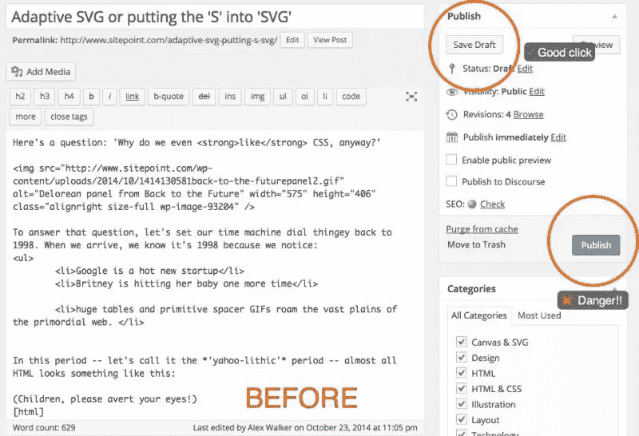
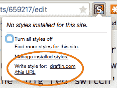
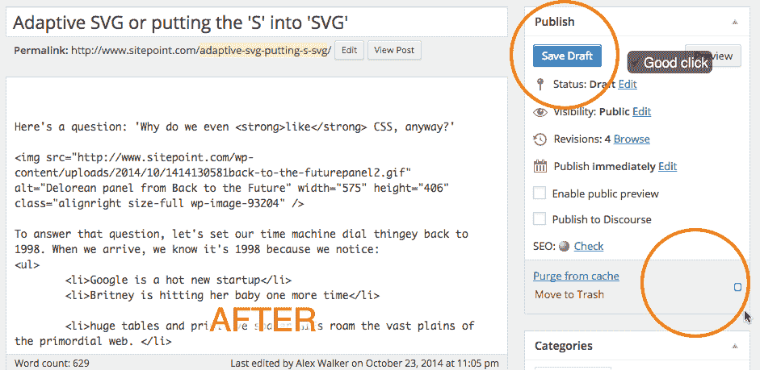

# 用户风格，莫莉守卫和白痴证明网络

> 原文：<https://www.sitepoint.com/userstyles-making-molly-switch/>

这是一个快速突击测验。什么是'**防差错【T1 '？**

难道是:

*   a)。来自泰国的美味冻干鸡蛋点心？
*   b)。像啄木鸟一样的口袋妖怪？
*   c)。日本的防错系统？

如果您回答了' **c** '好，完成，您将获得一颗金星！

[防差错系统](https://en.wikipedia.org/wiki/Poka-yoke)由丰田生产系统发明，是一种通过使操作员不可能(或极难)犯错误来消除操作员错误的方法。它最初被称为“ *baka yoke* ”，翻译过来就是“傻瓜校对”或“白痴校对”。

你可能已经知道使用这种想法的产品。我的手动沃尔沃甚至不会尝试启动，除非离合器接合。

同样，现在也不可能以错误的方式插入苹果的 lightning 电缆，因为——与以前的电缆设计不同——没有错误的方式。甚至大多数电源插座的设计都是为了确保正确使用。

这是一个非常有用的原则，可以融入到我们的设计中，甚至可以改进我们使用的工具。

### 网络防错

我花了很长时间在 WordPress 上，所以我觉得我已经很好地锁定了它的优点和缺点。我最讨厌的是在 WP 帖子撰写页面上。

正如这个屏幕截图所示，页面几乎完全是暗文本下的白色和浅灰色。作为一名作家，大多数时候你会按下右上角那个单调、不显眼的“保存草稿”按钮。

这个“灰色海洋”的主要视觉例外是右边可爱的蓝色大按钮“发布”。

在你准备好之前，这是一个你真的不想按的按钮，因为它会立即释放出汹涌澎湃的 RSS 条目、推文、脸书帖子、话语条目以及谁知道还有什么。

这是没有“撤销”或 CMD-Z 的，所以心不在焉地被引诱去发送一个半生不熟、半编辑的帖子是非常糟糕的。

(所以我被告知…可靠消息…[无辜地吹口哨]..).

## 那么，你能做些什么呢？

那么，你*可以*开始争取 WordPress 来改变它。权力属于人民，没错！但是你还有多长时间？

你*可以*写一个合法的 WordPress 扩展来解决这个问题，如果你这样做了，我会向你致敬，先生或女士。

但是有时候，即使获得许可安装一个新的 WordPress 扩展也是一个障碍。这个扩展将如何影响服务器性能？是否兼容 WordPress x.xx…？我们真的需要它吗？

系统管理员被雇来问这些问题，而我们经常缺乏好的答案。

## 用时尚击中它

一个经常被忽视的解决这类 UI 问题的方法是直接在你的浏览器中解决问题。

Chrome 的 styles 是为数不多的用户风格扩展之一( [Stylebot](https://stylebot.me/ "Stylebot") 是另一个)，它可以让你重新设计你每天使用的网站和网络应用。

如果您以前没有使用过，这些扩展允许您在每次访问目标站点时自动重新编码 CSS。想在脸书买更大的文本框吗？重新编码。讨厌博客上的字体吗？重新编码。

作为前端人员，我们往往更敏锐地注意到 UX 的问题。这是你修复它们的机会。

### 莫莉护卫队

莫莉护卫队——照片由马克·沃尔拍摄

今天，我想让你们体验一下我称之为“[莫莉卫士](https://en.wiktionary.org/wiki/molly-guard)”的用户风格。最初的“莫莉防护”是 IBM 4341 大型计算机上“大红色开关”的改良有机玻璃罩。显然‘莫莉’是程序员的女儿，她在一天之内两次重置了大红色开关。

也很公平。毕竟，红色大开关很难被忽视。

所以，我想要一些类似的东西来保护发布按钮不被不经意的点击。如果你以前没有用过时尚，这里有一个快速的教训。

1.  安装[时尚](https://chrome.google.com/webstore/detail/stylish/fjnbnpbmkenffdnngjfgmeleoegfcffe?hl=en)(其他浏览器也有版本)。
2.  转到您想要调整的 URL/应用程序。
3.  使用“检查元素”查找要更改的 HTML 类或 ID。在我的例子中，我发现 WP 发布按钮的 ID 是' #publish '。
4.  点击时尚按钮，点击“为 URL 编写样式”。
5.  给你的新用户风格起个名字——我的名字是“莫莉护卫”——然后开始写 CSS。在我的例子中，最快、最麻烦的解决方案是在默认情况下让发布按钮变得很小，但是当你在它上面停留一秒钟时，就把它扩展到正常大小——一个悬停状态和一个简单的 CSS 转换提供了魔力。我觉得这很难偶然做到。
6.  完成后，点击“保存”,您就可以开始工作了。你应该在你的时尚按钮上看到一个红色的小通知，告诉你用户风格是活跃的。现在，每当您在该浏览器中呈现站点时，您的新 CSS 都会自动在该域上运行。你也可以通过“管理已安装的样式”面板随时调整你的用户样式。

这是结果。

让我们明确一点:Molly Guard 从来就不是一款精心设计的产品。这更像是 McGuyver 的“电线和口香糖黑客”，但我怀疑它已经拯救了我很多次。我可以花更多的时间来写一个更优雅的解决方案，但这一个完成了工作——它“令人满意”。

我还使用 Stylish 来调整 Campaign Monitor、Tweetdeck、Groupon 和 Spotify 等网站。如果它运行在 CSS 上，你可以在上面释放你的 CSS 超能力。最酷的事情是，你可以停止抱怨网站上糟糕的 UX，只需修复它，继续生活。挺宣泄的。

一些读者提到他们更喜欢 Stylebot 或者 T2 UserCSS。这些看起来很棒，这真的是让我保持时尚的遗产，所以看看吧。Stylebot 显然有更好的社交/分享方面。

### 游击队特征发展

Stylish 的一个有趣的潜在用途是一种游击特性开发方法。您可以在现有站点上构建一个新功能的工作原型——可能是新的模态或导航更改——而不需要接触任何源代码。

如果你的客户、经理或测试对象能看到一个新功能在真实的网站上工作，那么就更容易接受它。这个方法我用过两次，非常有效。有时，用户样式是获得可用结果的最快方式。

*原载于 [SitePoint 设计简讯](https://www.sitepoint.com/newsletter/ "Subscribe to SitePoint")*

## 分享这篇文章