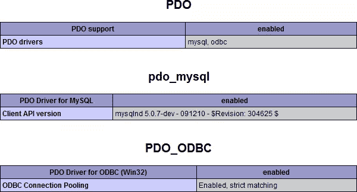

# 在 PHP 中使用 Access 数据库

> 原文：<https://www.sitepoint.com/using-an-access-database-with-php/>

我以前的一个客户有一个他们销售的产品的 Access 数据库，他们一直在离线使用。但是这种工作安排越来越受到限制。有太多的例子表明，他们需要使用数据库，但却不在保存数据库的计算机附近。

如果他们能够在任何地方维护他们的数据库，那不是更好吗？当然，但是怎么做呢？很简单——把它放到网上。此外，将他们的产品数据库放在网上打开了一扇大门，让它成为他们企业网站的基础。

拥有在线数据库还有另一个优势，但这是一个重要的优势——多用户访问。也就是说:将数据库存储在服务器上意味着任何被授权的人只需通过浏览器就可以使用公司的产品数据库。所有这些都是将现有的 Access 数据库文件从脱机位置移动到联机位置的结果。

为了更容易地过渡到在线数据库，现有的 Access 数据库可以保持不变，只需上传到合适的 Windows 主机上。(Linux 主机也是可能的，但是稍微复杂一点。)但是，托管本身是不够的，因为您还需要构建一个允许它们读写数据库的接口。构建一个界面可能听起来令人生畏，但其实不必如此。实际上，您要做的是替换 Access 中“窗体”选项卡下列出的窗体。

在这篇文章中，我将重点介绍 PHP 的基本要素，您将需要使用现有的在线 Access 数据库。Windows 安装的另一个标准项目是 ODBC 驱动程序的可用性。这些对于使用 PHP 的 Access 是必不可少的。

## 前端和后端

首先，让我们弄清楚客户端的 Access 数据库是如何打开的。通常他们会在个人电脑上使用 Microsoft Access，也许是通过双击数据库文件的图标。然而，当数据库联机时，他们将在浏览器中打开数据库。

如何使用浏览器打开、查看和编辑 Access 数据库？嗯，把 MS Access 应用程序想象成一个用户界面。作为一个用户界面，它被设计为在 Windows 中用来读写 Access 数据库文件。请记住，Access 数据库文件完全独立于 MS Access 应用程序软件。因此，可以构建一个可选的 UI 来读写 Access 数据库文件。这个只是碰巧使用网络浏览器运行。

在开始研究 UI 的具体细节之前，记住数据和用户界面是系统的不同方面是很重要的。让我们花点时间来强调使用浏览器访问服务器上的数据库的一个关键方面。

在 PC 上使用 MS Access 使用 Access 数据库时(即脱机)，应用软件是前端，数据库文件(`.mdb`)是后端。同样，上线时，浏览器是前端，数据库文件是后端。换句话说，这种关系没有改变:它仍然是一种前端/后端关系。前端连接后端，后端存储数据。

## 数据库

在我为本文选择的示例中，我们将使用一个非常简单的数据库，它由三个表组成:一个产品表、一个类别表和一个链接产品类别表。

Microsoft Access 数据库包含与本文相关的所有数据和表定义。按照最佳实践，数据被分成不同的表。例如，产品列表存储在`product`表中，类别列表存储在`category`表中。Access 数据库是独立的，没有到外部表的链接。

许多产品可以属于任何给定的类别，并且任何给定的产品可以属于多个类别。例如，如果数据库的目的是存储银古董的详细信息，那么一对 19 世纪的银袖扣可以被分类为 19 世纪的和给男人的礼物。

数据之间的这种关系用 Access 自己的“关系”选项以图表方式显示。


也就是说，产品和类别之间是多对多的关系。因此需要链接表。

## 连接到数据库

在读取或写入数据库之前，必须与它建立连接。Windows 主机具有与 Windows PC 类似的文件夹层次结构，因此文件在 Windows 服务器上的位置可能具有形式为`C:inetpubvhostsexample.comhttpdocs`的路径。您应该能够使用 PHP superglobal `$_SERVER["DOCUMENT_ROOT"]`提取主机根文件夹的路径值。连接到 Access 数据库所需的代码类似于:

```
<?php
$dbName = $_SERVER["DOCUMENT_ROOT"] . "products\products.mdb";
if (!file_exists($dbName)) {
    die("Could not find database file.");
}
$db = new PDO("odbc:DRIVER={Microsoft Access Driver (*.mdb)}; DBQ=$dbName; Uid=; Pwd=;");
```

成功的连接将允许从 PHP 执行 SQL 命令来读取或写入数据库。但是，如果您得到错误消息“PDOException 找不到驱动程序”,那么很可能是没有安装 PDO ODBC 驱动程序。使用`phpinfo()`功能检查您的安装是否参考了 PDO。

如果没有 PDO ODBC 条目，您需要确保您的安装包括 PDO 扩展和 ODBC 驱动程序。要在 Windows 上这样做，取消对`php.ini`中的行`extension=php_pdo_odbc.dll`的注释，重新启动 Apache，然后再次尝试连接到数据库。

安装驱动程序后，`phpinfo()`的输出应该包括如下信息:



## sqlcommand

PHP 使用的四个基本命令与 MS Access 中使用的命令相同，即`SELECT`、`UPDATE`、`INSERT`和`DELETE`。因此，下面的 SQL 示例应该很容易理解。除非您通常使用 Access 的设计视图，在这种情况下，您可能需要学习 SQL 复习课程。

### 选择行

假设您需要获取特定产品的价格。使用产品的 id 从`product`表中选择一个单独的字段，这很容易实现。

```
<?php
$sql  = "SELECT price FROM product";
$sql .= " WHERE id = " . $productId;

$result = $db->query($sql);
$row = $result->fetch();

$productPrice = $row["price"];
```

从下拉列表中选择一个类别后，您可以使用类别 id 来查询链接表，以获得已被分配到该类别的产品列表。

```
<?php
$sql  = "SELECT p.name, p.description, p.price";
$sql .= "  FROM product p, product_category pc";
$sql .= " WHERE p.id  = pc.productId";
$sql .= "  AND pc.category_id = " . $categoryId;
$sql .= " ORDER BY name";

$result = $db->query($sql);
while ($row = $result->fetch()) {
    $productName        = $row["name"];
    $productDescription = $row["description"];
    $productPrice       = $row["price"];
}
```

### 更新行

使用 HTML 表单提供的详细信息，您可以更新产品的详细信息。

```
<?php
$sql  = "UPDATE product";
$sql .= "   SET description = " . $db->quote($strDescription) . ",";
$sql .= "       price       =  " . $strPrice . ",";
$sql .= "       sale_status = " . $db->quote($strDescription);
$sql .= " WHERE id = " . $productId;

$db->query($sql);
```

需要小心的一个麻烦的字符是撇号。撇号不能简单地作为撇号存储在访问表中，而是必须由另一个撇号进行转义。这确保了 Access 知道它将被存储为撇号，而不是分隔字符串的撇号。幸运的是，PHP 的 PDO 库包含一个准备字符串以存储在数据库中的方法，`quote()`。

### 插入行

您可以使用 HTML 表单中输入的详细信息将新产品添加到`product`表中。

```
<?php
$sql  = "INSERT INTO product";
$sql .= "       (name, description, price, sale_status) ";
$sql .= "VALUES (" . $db->quote($strName) . ", " . $db->quote($strDescription) . ", " . $strPrice . ", " . $db->quote($strStatus) . ")";

$db->query($sql);
```

### 删除行

如果某个产品被错误输入，或者数据库中不再需要该产品，您可以将其从`product`表中删除。

```
<?php
$sql  = "DELETE";
$sql .= "  FROM product";
$sql .= " WHERE id = " . $productId;

$db->query($sql);
```

有人可能会说，删除产品不太可能，因为最好有一个合适的状态来表明产品已经售出或已存档等。因此，细节将被保留以供将来参考。

## 摘要

以上是从 PHP 使用 Access 数据库所需的基本内容。我希望它展示了读写 Access 数据库的基本细节需要多么少的 PHP，以及使用 PHP 理解这些数据库交互的基本元素是多么容易。

回顾上面的 SQL，很明显只需要三个 PDO ODBC 命令来允许 PHP 访问 access，即`$db = new PDO()`、`$db->query()`、`$db->query()`和`$db->quote()`。当然，这是最低限度。更复杂的数据库，和更复杂的网站，将需要比本文更多的 SQL，但是现在你已经有了使用 PHP 在线访问你自己的或者你的客户的数据库的基础。

对本文的评论已经关闭。有关于 PHP 的疑问？为什么不在我们的[论坛](https://www.sitepoint.com/forums/forumdisplay.php?34-PHP?utm_source=sitepoint&utm_medium=link&utm_campaign=forumlink)上问呢？

## 分享这篇文章