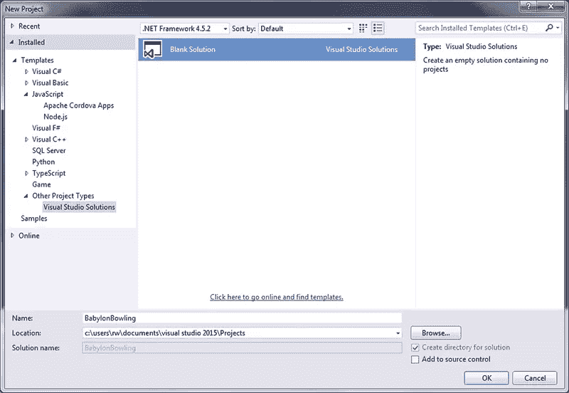
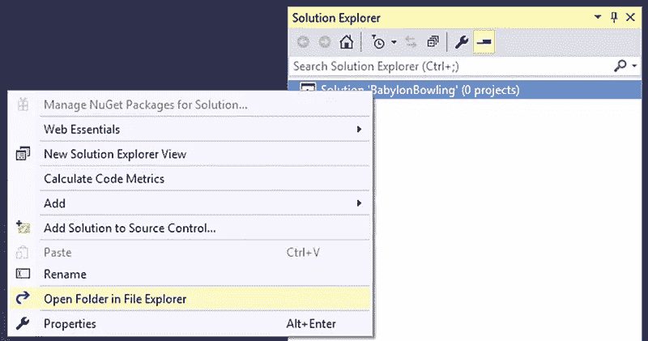
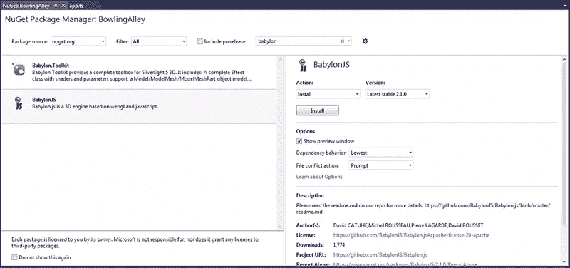
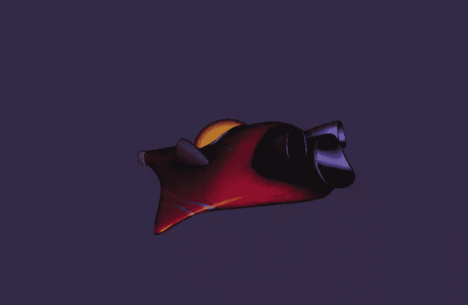
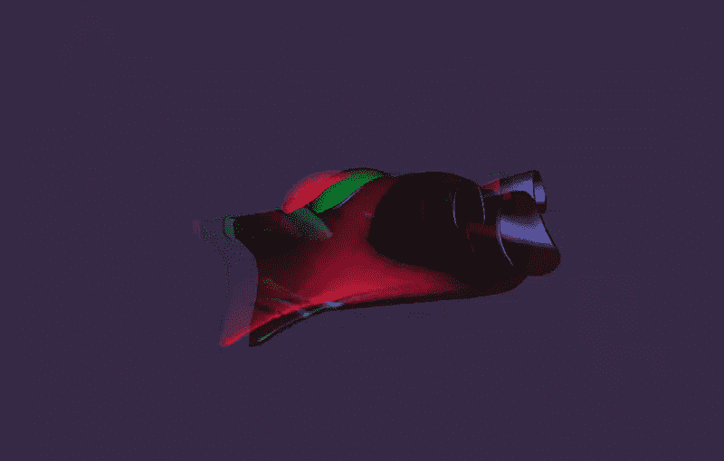
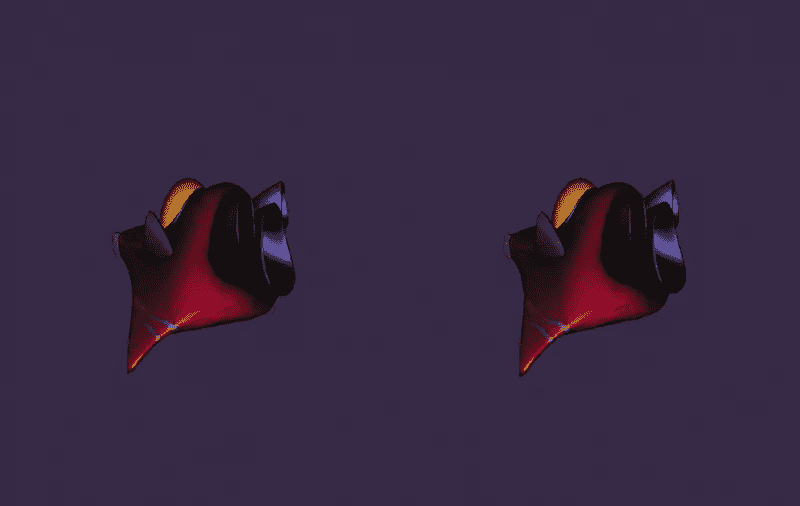
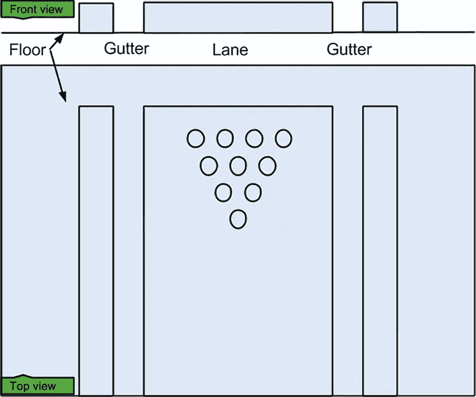
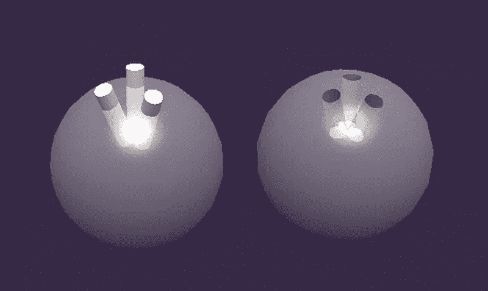
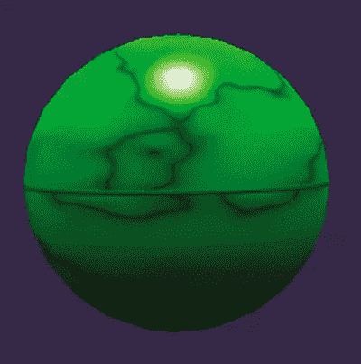
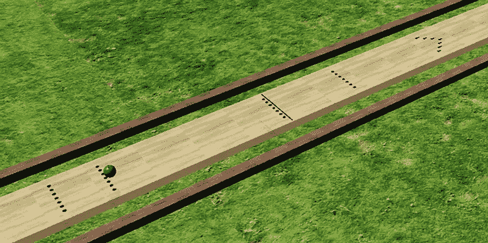

# 使用 Babylon.js 构建网络 3D 游戏

> 原文：<https://www.sitepoint.com/using-babylon-js-build-3d-games-web/>

本文是微软网站开发系列的一部分。感谢您对使 SitePoint 成为可能的合作伙伴的支持。

Babylon.js 是一个基于 WebGL 的 3D 引擎，主要专注于游戏开发和易用性。作为一个 3D 引擎，它有工具来创建、显示和纹理化空间中的网格，并添加光源和相机。因为它专注于游戏，Babylon.js 有一些常规 3D 引擎不需要的额外功能。它具有对碰撞检测、场景重力、面向游戏的相机(例如，跟踪移动对象的跟随相机)的原生支持，以及对 Oculus Rift 和其他虚拟现实(VR)设备的原生支持。它有一个物理引擎插件系统，本地音频支持，一个基于用户输入的动作管理器等等。我将在本教程中探索所有这些特性。

[从这里获取代码开始](http://download.microsoft.com/download/D/5/4/D54647CC-A404-4374-B7EF-E469FB5136B9/Code_Weber.Babylon.1215.zip)

## 关于教程

在本教程中，我将开发一个简单的保龄球游戏。我将创建一个保龄球道，添加 10 个瓶和一个保龄球，并提供投球的能力。我的游戏肯定不会准备好发布，但它将展示如何使用 Babylon.js 提供的工具开发游戏。在开发过程中，我会刻意避免使用任何外部工具。物体、相机、纹理等将仅使用 JavaScript 代码创建。

我将在本教程中使用的 Babylon.js 版本是最新的稳定版本—2.1。David Catuhe 和 Babylon 开发团队正试图保持框架尽可能向后兼容，所以我只能假设本教程将在未来的版本中正常工作，至少直到下一个主要版本。我使用的是 Visual Studio 2015 社区版，但你可以使用任何你喜欢的 IDE。

本教程将分为两部分。在本文中，我将概述 Babylon.js 的基本构建块。我将创建网格，对它们进行纹理处理，添加相机和光源，并实现简单的用户交互。在第二部分中，我将通过添加碰撞和物理、音频、用户动作和特殊类型的摄像机来展示 Babylon.js 真正的闪光点。

## 入门:一个新的 Babylon.js 项目

一个简单的 Babylon.js 项目是一个静态网站。因为我使用的是 Visual Studio，所以我将使用嵌入在 Visual Studio 中的本地 IIS 服务器来托管这些静态文件。Visual Studio 没有静态网站的模板，因此需要一种不同的方法。

首先，创建一个新的空白溶液。打开 Visual Studio 并转到文件|新建|项目。在左侧窗格中选择其他项目类型，然后选择空白解决方案，如**图 1** 所示。给这个解决方案起一个名字(我用的是 BabylonBowling ),然后点击 OK。


**图 1 在 Visual Studio 中创建新的空白解决方案**

要创建一个新的静态网站，首先需要创建一个新的目录来托管它。右键单击空的解决方案，然后在文件资源管理器中单击打开文件夹，如图**图 2** 所示。


**图 2 在文件浏览器中打开解决方案的文件夹**

为名为 BabylonBowling 的项目创建一个新目录，并关闭文件资源管理器。

右键单击解决方案，然后选择添加|现有网站。选择新创建的文件夹(确保选择刚刚创建的文件夹，而不是解决方案的文件夹)，然后单击“打开”。现在，您应该有一个空白网站作为此解决方案的唯一项目。

创建项目后，您需要添加框架和框架的依赖项。有几种方法可以做到这一点。最简单的方法是使用 NuGet 包管理器。

右键单击项目并选择管理 NuGet 包。在搜索栏中点按(键盘快捷键是 Ctrl+E ),然后键入 babylon。您将看到一个类似于图 3 中的窗口。选择 BabylonJS。确保选择的版本是 2.1(或最新的稳定版本)，然后单击安装。在弹出的预览窗口(如果有弹出的话)中单击 OK，Babylon.js 将被安装到您的空项目中，包括一个演示场景。


**图 3 使用 NuGet 包管理器添加 Babylon.js】**

对于那些使用 npm 作为软件包管理器的用户，可以使用以下命令安装 Babylon.js:

```
npm install babylonjs
```

安装软件包后，脚本文件夹中应该有以下文件:

*   babylon.js，Babylon.js 的缩小版
*   babylon.max.js，Babylon.js 的调试版本
*   Oimo.js，将在本教程的第二部分中使用的 Oimo JS 物理引擎
*   poly2tri.js，可选的三角测量库(github.com/r3mi/poly2tri.js)
*   hand-minified.js，指针事件 polyfill 使用 npm 时这是不存在的，因此使用以下命令进行安装:

```
npm install handjs
```

NuGet 安装程序还会创建一个 index.html 文件和一个 index.js 文件。

NuGet 包中的一个错误向 web.config 添加了一个不需要的行。在它被修复之前，双击这个文件并删除在**图 4** 中突出显示的行(在我的解决方案中，它是第 9 行)。


**图 4 从 web.config 中删除高亮显示的行**

您现在可以测试项目了。使用 Ctrl+Shift+W 或单击顶部导航栏上的“运行”按钮，在默认浏览器中打开项目。如果你看到**图 5** 所示的 3D 宇宙飞船，你的项目就全部设置好了。


**图 5 巴比伦默认飞船**

对于那些使用不同 ide 的人来说，只需按照 Babylon.js 文档页面上的“创建基本场景”教程就可以到达当前状态。如果不使用 NuGet，我仍然建议使用 npm 来安装依赖项。教程可以在[bit.ly/1MXT6WP](http://bit.ly/1MXT6WP)找到。

要从头开始，删除 index.js 中的函数`createScene`。

## 积木

我要讨论的前两个元素是引擎和场景。

引擎是负责与底层 WebGL API (WebGL 1 基于 OpenGL ES2，语法非常相似)通信的对象。该引擎提供了更高级、更易于理解的 API，而不是强迫您编写低级别的 WebGL 代码。它对开发人员也是透明的。除了最初的项目设置，我根本不会直接使用引擎。某些低级功能可以使用引擎来完成，但我不会讨论这个。

发动机初始化需要两个参数。第一个是用来画画的画布。画布是 index.html 已经有的 HTML 元素。第二个参数是抗锯齿的状态(开或关)。

打开当前空白的 index.js 并添加以下代码行:

```
 function init() {
  var engine = initEngine();
}
function initEngine() {
  // Get the canvas element from index.html
  var canvas = document.getElementById("renderCanvas");
  // Initialize the BABYLON 3D engine
  var engine = new BABYLON.Engine(canvas, true);
  return engine;
} 
```

在开发过程中，我将使用`init`函数为每个步骤添加新功能。我创造的每个元素都有自己的功能。

为了理解一个场景代表什么，想象一个有不同页面的网站。一个单独的 Web 页面包含文本、图像、事件侦听器以及呈现该单独页面所需的所有其他资源。加载不同的页面会加载不同的资源。就像一个单独的网页一样，场景拥有显示一个单独的 3D“页面”所需的资源这个场景可以非常大，充满了资源——网格、相机、灯光、用户动作等等。但是为了从一页转到另一页，推荐一个新的场景。场景还负责渲染自己的资源，并将所需的信息传递给引擎。保龄球游戏只需要一个场景。但是如果我计划增加新的关卡或奖励游戏，我会用新的场景来创建它们。

初始化场景只需要我创建的引擎。将以下内容添加到 index.js 中:

```
 function createScene(engine) {
  var scene = new BABYLON.Scene(engine);
  // Register a render loop to repeatedly render the scene
  engine.runRenderLoop(function () {
      scene.render();
  });
} 
```

首先，我创建场景对象。接下来的几行是我与引擎的唯一交互。它们告诉引擎在每次渲染循环运行时渲染这个特定的场景。

将这行代码添加到`init`函数的末尾，以实际创建场景:

```
 var scene = createScene(engine); 
```

在我继续之前还有两件事。当您调整浏览器窗口大小时，画布也会被调整大小。引擎还必须调整其内部宽度和高度，以保持场景透视。在返回引擎之前向`initEngine`函数添加以下代码行；陈述将保持对场景的透视:

```
 // Watch for browser/canvas resize events
window.addEventListener("resize", function () {
  engine.resize();
}); 
```

第二件事是改变 index.html 来使用新的`init`函数。打开 index.html，找到包含调用`createScene`的脚本标签。将`createScene`改为`init`，然后保存 index.html 并关闭。

该场景有一个非常高级的调试层，允许您调试正在渲染的场景。它显示正在渲染的网格数量和当前每秒帧数(FPS)。它允许关闭纹理和阴影等功能，并使查找丢失的网格变得容易。打开调试层很简单:

```
scene.debugLayer.show();
```

这样做，你就可以自己调试场景了。

我现在有一个引擎和一个场景，我准备开始添加相机，灯光和网格来创建我的保龄球场场景。

### 摄像机

Babylon.js 提供了许多类型的相机，每一种都有其特定的用途。在为游戏选择相机之前，让我们回顾一下最常见的类型:

*   免费相机是一个第一人称射击相机。它可以使用键盘箭头键在整个场景中自由移动，并且可以使用鼠标设置方向。还可以启用可选的重力和碰撞检测。
*   弧形旋转摄像机用于围绕特定目标旋转。使用鼠标、键盘或触摸事件，用户可以从所有方向查看对象。
*   触摸相机是一个免费的相机，使用触摸事件作为输入。它适用于所有移动平台。
*   跟随摄像机自动跟随特定目标。

Babylon.js 原生支持 WebVR 和设备定向相机，这意味着你可以轻松地处理 Oculus Rift 或谷歌 Cardboard 等设备。

版本 2.1 中引入的一个新概念使每种类型的相机都支持 3D。这意味着每种相机类型都可以设置为适合 Oculus Rift 风格的立体视图和红蓝眼镜(立体 3D)。**图 6** 显示了用无立体摄像机渲染的飞船场景，**图 7** 显示了用立体摄像机渲染的场景。


**图 6 立体 3D 相机**


**图 7 立体摄像机**

对于我的保龄球游戏，我将使用两种类型的摄像机。第一个是玩家的主摄像头，它将设置投球的位置。这就是免费相机的确切目的。我还想添加一个不同的视图——当球在途中时，我想跟踪它，直到它击中球瓶。

首先，我添加免费相机。`createFreeCamera`函数将场景作为单个变量:

```
 function createFreeCamera(scene) {
  var camera = new BABYLON.FreeCamera(
    "player camera", BABYLON.Vector3.Zero(), scene);
  return camera;
} 
```

我在场景的位置 0，0，0 创建了一个摄像机位置。稍后，我将扩展这个函数(必要时)来进一步配置相机。

当然，不要忘记在最后将它添加到`init`函数中:

```
 ...
// Create the main player camera
var camera = createFreeCamera(scene);

// Attach the control from the canvas' user input
camera.attachControl(engine.getRenderingCanvas());

// Set the camera to be the main active camera
scene.activeCamera = camera; 
```

`attachControl`函数注册特定摄像机所需的本地 JavaScript 事件监听器(比如鼠标、触摸或键盘输入的监听器)。设置场景的活动摄影机告诉场景应该使用该摄影机进行渲染。

我将在第二部分中添加第二个摄像头，在投球之后。

### 创建车道

保龄球道是一个相对简单的几何结构。我将从设置一些常数开始，这些常数是保龄球道的实际尺寸，以米为单位。我使用米的原因是物理引擎，这将在本文的第二部分解释。

您可以在项目文件中看到这些常量。为了计算这些值，我使用了网上可获得的关于保龄球道的信息。

设置完常量后，我准备开始创建构建保龄球道的网格。我(2D)的计划如图**图 8** 所示。我将从创建网格开始。纹理网格——给它们材质——将在后面进行。


**图 8 2D 保龄球馆场景平面图**

首先，我将为场景创建一个全局地板:

```
 function createFloor(scene) {
  var floor = BABYLON.Mesh.CreateGround("floor", 100, 100, 1, scene, false);
  return floor;
} 
```

这就产生了一个简单的 100×100 米的地板。使用 Babylon.js 内部函数创建的所有网格都在场景的位置 0，0，0 处创建，并居中。有三个重要的变量可以变换网格并将其正确定位在场景中:

*   `mesh.position`是网格在空间位置的向量
*   `mesh.scaling`是网格在每个轴上的比例因子
*   `mesh.rotation`为各轴旋转的欧拉角(单位为弧度);如果你更喜欢四元数(我知道我是)，你可以用`mesh.rotationQuaternion`来代替

在我的`init`函数中添加了函数并启动场景后，我注意到一个有趣的事情——我根本看不到我添加的楼层！原因是相机和地板都是在空间的同一点(0，0，0)创建的。因为地面完全是平的，只有从上面(或下面)看才会在屏幕上显示出来。回到`createCamera`函数中摄像机的初始化，我将第二个变量，即摄像机的初始位置，更改为一个新的向量——摄像机现在将离地 1.7 个单位(本例中为米):

```
 var camera = new BABYLON.FreeCamera(
  "cam", new BABYLON.Vector3(0,1.7,0), scene
); 
```

如果你现在开始这个场景，你会看到地板伸展到屏幕的一半，如图**图 9** 所示。


**图 9 给场景添加楼层**

试着用箭头和鼠标四处移动，找到控制免费相机的窍门。

你会注意到地板是全黑的。我不见光了！我将添加一个新函数，createLight，稍后我将扩展它。

```
 function createLight(scene) {
  var light = new BABYLON.DirectionalLight(
    "dir01", new BABYLON.Vector3(-0.5, -1, -0.5), scene
  );
  // Set a position in order to enable shadows later
  light.position = new BABYLON.Vector3(20, 40, 20);
  return light;
} 
```

别忘了给`init`加上这一行:

```
var light = createLight(scene);
```

Babylon.js 有四种类型的灯光:

*   半球:环境光，预定义了底色(朝下的像素)、天空色(朝上的像素)和镜面反射色。
*   点:从一个点向四面八方发出的光，如太阳。
*   聚光灯:顾名思义，从单个点发出的具有特定方向和发射半径的光。这种光可以发出阴影。
*   方向性:从任何地方向特定方向发出的光。太阳可能是点光源，但是平行光更能模拟阳光。这种光也可以发出阴影，这就是我在我的例子中使用的。

现在地板将会是白色的。Babylon.js 为每个没有指定材质的网格指定一个默认的白色材质。

车道本身将是一个盒子，放在我刚刚创建的地板上:

```
 function createLane(scene) {
  var lane = BABYLON.Mesh.CreateBox("lane", 1, scene, false);
  lane.scaling = new BABYLON.Vector3(
    laneWidth, laneHeight, totalLaneLength
  );
  lane.position.y = laneHeight / 2; // New position due to mesh centering
  lane.position.z = totalLaneLength / 2;
  return lane;
} 
```

还是那句话，别忘了给`init`加上这个功能。

您可以看到我是如何使用缩放参数的——我创建了一个大小为 1x1x1 的框，并更改了它的缩放比例以适应我预定义的常数。

使用相同的技术，我创建了两个框，它们将作为球道两侧的边沟边界(如果球被扔向错误的方向，这就是球将落入的位置)。尝试自己创建它们，并看看附带的项目，看看我是如何做到的。

### 保龄球瓶和球

现在缺少的是保龄球瓶和球。为了创建大头针，我将使用一个圆柱体，只是一个将被放大许多倍的圆柱体——确切地说是 10 倍。在 Babylon.js 中，这种乘法称为实例。实例是网格的精确副本，除了它在空间中的变换。这意味着实例的几何图形和纹理不能改变，但是位置、缩放和旋转可以。我个人从不在场景中使用原物体；如果我需要 10 个插针，我将创建一个插针，禁用它，并在 10 个预定义的位置创建它的 10 个实例:

```
 function createPins(scene) {
  // Create the main pin
  var mainPin = BABYLON.Mesh.CreateCylinder(
    "pin", pinHeight, pinDiameter / 2, pinDiameter, 6, 1, scene
  );
  // Disable it so it won't show
  mainPin.setEnabled(false);
  return pinPositions.map(function (positionInSpace, idx) {
    var pin = new BABYLON.InstancedMesh("pin-" + idx, mainPin);
    pin.position = positionInSpace;
    return pin;
  });
} 
```

该函数中缺少的变量可以在项目文件中找到，包括`pinPositions`，这是一个包含所有 10 个管脚的全局位置的数组。

现在是保龄球。保龄球是一个简单的球体，有三个手指孔。为了创建球体，我将使用 Babylon.js 提供的`CreateSphere`函数:

```
var sphere = BABYLON.Mesh.CreateSphere("sphere", 12, 0.22, scene);
```

现在我需要钻孔。为此，我将使用集成到 Babylon.js 中的一个名为建设性立体几何(CSG)的功能，该功能允许我从现有网格中添加或减去网格，或者更好的是，从彼此中添加或减去几何。这意味着，如果两个网格相交，我可以将其中一个从另一个中“移除”,得到一个改变的网格。在我的例子中，我想在一个球体上创建三个圆孔。圆柱体会非常合适。

首先，我创建将用于第一个孔的圆柱体:

```
 var cylinder = BABYLON.Mesh.CreateCylinder(
  "cylinder", 0.15, 0.02, 0.02, 8, 1, scene, false
); 
```

接下来，我将更改圆柱体的位置，使其与球体相交:

```
cylinder.position.y += 0.15;
```

然后，我将创建 CSG 对象，并用它们从球体中减去圆柱体:

```
 var sphereCSG = BABYLON.CSG.FromMesh(sphere);
var cylinderCSG = BABYLON.CSG.FromMesh(cylinder);
sphereCSG.subtractInPlace(cylinderCSG);
var ball = sphereCSG.toMesh("test", sphere.material, scene, false); 
```

**图 10** 显示了球体和圆柱体的样子，在它旁边是用 CSG 制作的保龄球。


**图 10 制造保龄球**

**图 11** 和 babylonjs-playground.com/#BIG0J[的操场](http://babylonjs-playground.com/#BIG0J?WT.mc_id=16542-DEV-sitepoint-article78)展示了用于从零开始创建球的完整代码。

**图 11 使用 CSG 创建保龄球**

```
 // The original sphere, from which the ball will be made
var sphere = BABYLON.Mesh.CreateSphere("sphere", 10.0, 10.0, scene);
sphere.material = new BABYLON.StandardMaterial("sphereMat", scene);

// Create pivot-parent-boxes to rotate the cylinders correctly
var box1 = BABYLON.Mesh.CreateBox("parentBox", 1, scene);
var box2 = box1.clone("parentBox");
var box3 = box1.clone("parentBox");

// Set rotation to each parent box
box2.rotate(BABYLON.Axis.X, 0.3);
box3.rotate(BABYLON.Axis.Z, 0.3);
box1.rotate(new BABYLON.Vector3(0.5, 0, 0.5), -0.2);

[box1, box2, box3].forEach(function (boxMesh) {
  // Compute the world matrix so the CSG will get the rotation correctly
  boxMesh.computeWorldMatrix(true);
  // Make the boxes invisible
  boxMesh.isVisible = false;
});

// Create the 3 cylinders
var cylinder1 = BABYLON.Mesh.CreateCylinder(
  "cylinder", 4, 1, 1, 30, 1, scene, false
);
cylinder1.position.y += 4;
cylinder1.parent = box1;
var cylinder2 = cylinder1.clone("cylinder", box2);
var cylinder3 = cylinder1.clone("cylinder", box3);

// Create the sphere's CSG object
var sphereCSG = BABYLON.CSG.FromMesh(sphere);
// Subtract all cylinders from the sphere's CSG object
[cylinder1, cylinder2, cylinder3].forEach(function (cylinderMesh) {
  sphereCSG.subtractInPlace(BABYLON.CSG.FromMesh(cylinderMesh));
});

// Create a new mesh from the sphere CSG
var ball = sphereCSG.toMesh("bowling ball", sphere.material, scene, false); 
```

### 口感

我创建的所有网格都有默认的白色材质。为了使场景更吸引人，我应该添加其他材料。标准的 Babylon.js 材质(默认着色器)有很多定义可以使用，我不会在这里讨论。(要了解更多关于默认 Babylon.js 着色器的信息，您可以在[materialeditor.raananweber.com](http://materialeditor.raananweber.com/?WT.mc_id=16542-DEV-sitepoint-article78)试用 BabylonJS 材质编辑器。)然而，我将讨论我如何纹理化球道和保龄球。

为了给保龄球添加纹理，我将使用另一个奇妙的 Babylon.js 特性——程序纹理。程序纹理不是使用 2D 图像的标准纹理。它们是由 GPU(而不是 CPU)以编程方式创建的纹理，这对场景有积极的性能影响。巴比伦有许多类型的程序纹理——木头、砖块、火、云、草等等。我要用的是大理石纹理。

在创建球的网格后添加以下线条将使它成为一个绿色的大理石球，如图**图 12** 所示:

```
 var marbleMaterial = new BABYLON.StandardMaterial("ball", scene);
var marbleTexture = new BABYLON.MarbleProceduralTexture(
  "marble", 512, scene
);
marbleTexture.numberOfTilesHeight = 2;
marbleTexture.numberOfTilesWidth = 2;
marbleMaterial.ambientTexture = marbleTexture;

// Set the diffuse color to the wanted ball's color (green)
marbleMaterial.diffuseColor = BABYLON.Color3.Green();
ball.material = marbleMaterial; 
```


**图 12 大理石纹理应用于球体**

添加一个木制纹理到车道可以使用标准材质的漫反射纹理。但这不是我想谈论莱恩的材料的原因。如果你看一个真正的保龄球道，你会注意到它上面有几组圆点和一组箭头或三角形。为了模拟这种情况，我可以创建一个非常大的纹理，把它们都放在上面，但是这可能会影响性能(因为纹理非常大)或者降低图像质量。

我也可以使用贴花，这是 Babylon.js 2.1 中引入的新特性。贴花是在已经有纹理的网格上“绘制”的一种方式。例如，它们可以用来模拟墙上的枪声，或者像我一样，给保龄球道添加装饰。贴花是网格，因此使用标准材质进行纹理处理。**图 13** 展示了我是如何添加犯规线的，**图 14** 展示了添加贴花后球道的样子，以及使用程序纹理(砖和草)作为材质后地板和排水沟的样子。

**图 13 添加犯规线贴纸**

```
 // Set the decal's position
var foulLinePosition = new BABYLON.Vector3(0, laneHeight, foulLaneDistance);
var decalSize = new BABYLON.Vector3(1,1,1);

// Create the decal (name, the mesh to add it to, position, up vector and the size)
var foulLine = BABYLON.Mesh.CreateDecal("foulLine", lane, foulLinePosition, BABYLON.Vector3.Up(), decalSize);

// Set the rendering group so it will render after the lane
foulLine.renderingGroupId = 1;

// Set the material
var foulMaterial = new BABYLON.StandardMaterial("foulMat", scene);
foulMaterial.diffuseTexture = new BABYLON.Texture("Assets/dots2-w-line.png", scene);
foulMaterial.diffuseTexture.hasAlpha = true;
foulLine.material = foulMaterial;

// If the action manager wasn't initialized, create a new one
scene.actionManager = new BABYLON.ActionManager(scene);

// Register an action to generate a new color each time I press "c"
scene.actionManager.registerAction(new BABYLON.ExecuteCodeAction({
  trigger: BABYLON.ActionManager.OnKeyUpTrigger, parameter: "c" },
  // The function to execute every time "c" is pressed"
  function () {
    ball.material.diffuseColor =
      new BABYLON.Color3(Math.random(), Math.random(), Math.random());
  }
)); 
```


**图 14 车道加贴花**

**用户输入 Babylon.js 动作管理器**

作为一个全功能的游戏引擎，Babylon.js 有一个简单的方法来与用户输入进行交互。假设我想用 C 键改变球的颜色。每次按下 C 键，我都想给球设置一个随机的颜色:

```
 // If the action manager wasn't initialized, create a new one
scene.actionManager = new BABYLON.ActionManager(scene);

// Register an action to generate a new color each time I press C
scene.actionManager.registerAction(
  new BABYLON.ExecuteCodeAction({ trigger:
    BABYLON.ActionManager.OnKeyUpTrigger, parameter: "c" },
    // The function to execute every time C is pressed
    function () {
      ball.material.diffuseColor =
        new BABYLON.Color3(Math.random(), Math.random(), Math.random());
    }
)); 
```

js 动作管理器是一个根据触发器控制动作的强大工具。触发可以是鼠标移动或点击、网格相交或键盘输入。有许多触发器和动作可供选择。看一看 Babylon.js 教程网站([bit.ly/1MEkNRo](http://bit.ly/1MEkNRo))来了解所有这些。

我将使用动作管理器来控制球并重置场景。我将在教程的第二部分添加这些操作。

## 使用外部资源

我已经使用 Babylon.js 的内部函数创建了我需要的网格。大多数时候，这还不够。Babylon.js 提供了许多网格——从球体和盒子到复杂的丝带——但很难创建复杂的模型，如人、网络末日的武器或太空入侵者克隆的飞船。

Babylon.js 为许多已知的 3D 工具提供导出器插件，如 Blender 和 3D-Studio。您还可以从精彩的 Clara.io 导出您的模型，并下载一个. babylon 文件。

Babylon.js 使用自己的文件格式，可以包含整个场景，包括网格、相机、灯光、动画、几何体和其他信息。所以如果你愿意，你可以只使用 Blender 来建模你的整个场景。也可以导入单个网格。

然而，这不属于本教程的范围。对于本文，我只想展示如何单独使用 Babylon.js 创建一个简单的游戏。

## 下一步是什么？

我跳过了 Babylon.js 中集成的许多功能。它有大量的功能，我强烈建议你查看游乐场([babylonjs-playground.com](http://babylonjs-playground.com/?WT.mc_id=16542-DEV-sitepoint-article78))、文档页面([doc.babylonjs.com](http://doc.babylonjs.com/?WT.mc_id=16542-DEV-sitepoint-article78))和 Babylon.js 主页([babylonjs.com](http://babylonjs.com/?WT.mc_id=16542-DEV-sitepoint-article78))以了解无限的可能性。如果你对本教程的任何部分有困难，请联系我或非常活跃的 Babylon.js HTML5 游戏开发者论坛([bit.ly/1GmUyzq](http://bit.ly/1GmUyzq))上的任何 Babylon.js 英雄。

在下一篇文章中，我将创建实际的游戏——添加物理和碰撞检测，投球的能力，声音等等。

*感谢以下微软技术专家审阅本文:David Catuhe*

## 更多的 Web 开发实践

这篇文章是微软布道者和工程师关于实用 JavaScript 学习、开源项目和互操作性最佳实践的 web 开发系列的一部分，包括[微软 Edge](http://blogs.windows.com/msedgedev/2015/05/06/a-break-from-the-past-part-2-saying-goodbye-to-activex-vbscript-attachevent/?WT.mc_id=16542-DEV-sitepoint-article78) 浏览器和新的 [EdgeHTML 渲染引擎](http://blogs.windows.com/msedgedev/2015/02/26/a-break-from-the-past-the-birth-of-microsofts-new-web-rendering-engine/?WT.mc_id=16542-DEV-sitepoint-article78)。

我们鼓励您在 dev.microsoftedge.com 使用免费工具进行跨浏览器和设备测试，包括 Windows 10 的默认浏览器 Microsoft Edge:

*   [扫描你的网站，寻找过时的库、布局问题和可访问性](http://dev.modern.ie/tools/staticscan/?utm_source=SitePoint&utm_medium=article78&utm_campaign=SitePoint)
*   [下载适用于 Mac、Linux 和 Windows 的免费虚拟机](http://dev.modern.ie/tools/vms/windows/?utm_source=SitePoint&utm_medium=article78&utm_campaign=SitePoint)
*   [跨浏览器检查网络平台状态，包括微软 Edge 路线图](https://dev.modern.ie/platform/status/?utm_source=SitePoint&utm_medium=article78&utm_campaign=SitePoint)
*   [在您自己的设备上远程测试 Microsoft Edge](https://remote.modern.ie/?utm_source=SitePoint&utm_medium=article78&utm_campaign=SitePoint)

**向我们的工程师和传道者进行更深入的学习:**

*   **互操作性最佳实践** ( [系列](https://channel9.msdn.com/Blogs/BeLux-Developer/Riding-the-Modern-Web-5-things-to-consider-as-a-web-developer?WT.mc_id=16542-DEV-sitepoint-article78)):
    *   [如何避免浏览器检测](https://channel9.msdn.com/Blogs/BeLux-Developer/Riding-the-Modern-Web-Avoiding-Browser-Detection?WT.mc_id=16542-DEV-sitepoint-article78)
    *   [使用 CSS 前缀的最佳实践](https://channel9.msdn.com/Blogs/BeLux-Developer/Riding-the-Modern-Web-CSS-Vendor-Prefixes?WT.mc_id=16542-DEV-sitepoint-article78)
    *   [保持你的 JS 框架&库更新](https://channel9.msdn.com/Blogs/BeLux-Developer/Riding-the-Modern-Web-Dealing-with-JavaScript-Libraries?WT.mc_id=16542-DEV-sitepoint-article78)
    *   [构建插件免费网络体验](https://channel9.msdn.com/Blogs/BeLux-Developer/Riding-the-Modern-Web-Dealing-with-Plugins?WT.mc_id=16542-DEV-sitepoint-article78)
*   [GitHub 编码实验室:跨浏览器测试和最佳实践](https://github.com/deltakosh/interoperable-web-development?WT.mc_id=16542-DEV-sitepoint-article78)
*   哇，我可以在 Mac 电脑上测试 Edge & IE 浏览器& Linux！(来自雷伊·班戈)
*   [在不破坏网络的情况下推进 JavaScript】(来自 Christian Heilmann)](http://channel9.msdn.com/Events/WebPlatformSummit/2015/Advancing-JavaScript-without-breaking-the-web?WT.mc_id=16542-DEV-sitepoint-article78)
*   [用 WebGL 释放 3D 渲染](https://channel9.msdn.com/Events/WebPlatformSummit/2015/Unleash-3D-rendering-with-WebGL-and-Microsoft-Edge?WT.mc_id=16542-DEV-sitepoint-article78)(来自 David Catuhe)
*   托管网络应用和网络平台创新

**我们的社区开源项目:**

*   伏龙。JS (跨设备远程 JavaScript 测试)
*   [manifoldJS](http://manifoldjs.com/?WT.mc_id=16542-DEV-sitepoint-article78) (部署跨平台托管的 web 应用)
*   [babylonJS](http://babylonjs.com/?WT.mc_id=16542-DEV-sitepoint-article78) (轻松制作 3D 图形)

**更多免费工具和后端 web 开发工具:**

*   [Visual Studio 代码](https://code.visualstudio.com/?WT.mc_id=16542-DEV-sitepoint-article78)(用于 Mac、Linux 或 Windows 的轻量级代码编辑器)
*   [Visual Studio 开发基础知识](https://www.visualstudio.com/en-us/products/visual-studio-dev-essentials-vs.aspx?WT.mc_id=16542-DEV-sitepoint-article78)(基于订阅的免费培训和云优势)
*   [用节点编码。JS](https://www.microsoftvirtualacademy.com/en-US/training-courses/building-apps-with-node-js-jump-start-8422?WT.mc_id=16542-DEV-sitepoint-article78) 与[在蔚蓝云上试用](https://azure.microsoft.com/en-us/pricing/free-trial/?WT.mc_id=16542-DEV-sitepoint-article78)

## 分享这篇文章