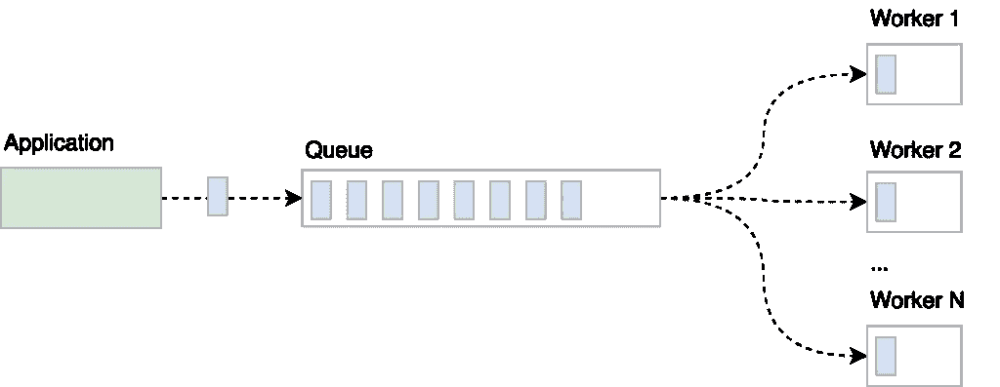
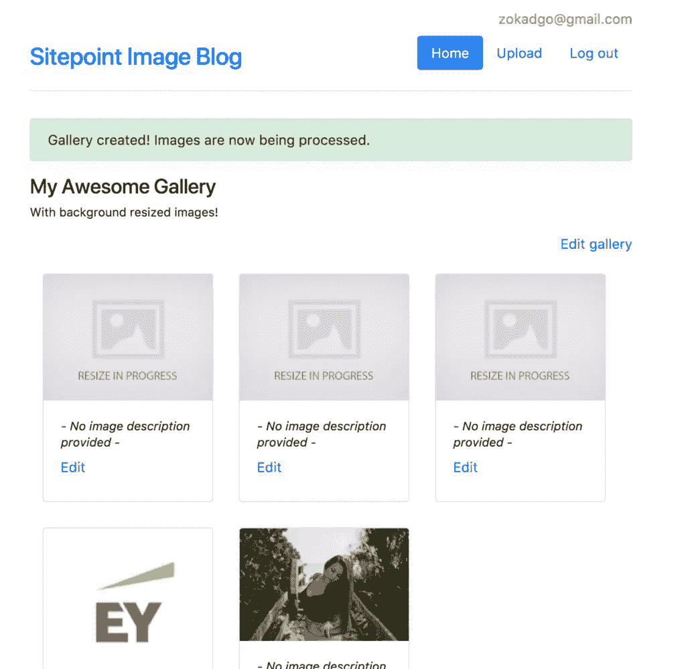

# 使用后台处理加快页面加载速度

> 原文：<https://www.sitepoint.com/using-background-processing-to-speed-up-page-load-times/>

本文是构建一个示例应用程序——一个多图片画廊博客——的系列文章的一部分，用于性能基准测试和优化。(点击此处查看[回购](https://github.com/sitepoint-editors/multi-image-gallery-blog/)。)

* * *

在之前的文章中，我们已经添加了[按需调整图像大小](https://www.sitepoint.com/improving-performance-perception-on-demand-image-resizing)。图像在第一次请求时被调整大小，并被缓存以备后用。通过这样做，我们给第一次加载增加了一些开销；系统必须动态地呈现缩略图，并且在图像呈现完成之前会“阻止”第一个用户的页面呈现。

优化的方法是在创建图库后呈现缩略图。您可能会想，“好吧，但是我们会阻止创建图库的用户？”这不仅是一个糟糕的用户体验，而且也不是一个可扩展的解决方案。用户会对长时间的加载感到困惑，或者更糟糕的是，如果图像太重而无法处理，会遇到超时和/或错误。最好的解决方案是将这些繁重的任务放到后台。

## 后台作业

后台作业是进行任何繁重处理的最佳方式。我们可以立即通知用户我们已经收到了他们的请求并安排了处理。就像 YouTube 处理上传的视频一样:上传后就无法访问了。用户需要等到视频处理完毕后才能预览或分享。

处理或生成文件、发送电子邮件或任何其他非关键任务都应该在后台完成。

### 后台处理是如何工作的？

在后台处理方法中有两个关键组件:作业队列和工人。该应用程序创建的作业应该在工作人员等待并从队列中一次提取一个作业时进行处理。



您可以创建多个工作实例(进程)来加快处理速度，将一个大任务分割成较小的块并同时处理它们。如何组织和管理后台处理取决于您，但是请注意，并行处理不是一项无足轻重的任务:您应该注意潜在的竞争情况，并优雅地处理失败的任务。

### 我们的技术堆栈

我们使用 [Beanstalkd](http://kr.github.io/beanstalkd/) 作业队列来存储作业，使用 Symfony 控制台组件将工人实现为控制台命令，使用[管理器](http://supervisord.org/)来处理工人进程。

如果您使用的是 [Homestead 改进版](https://www.sitepoint.com/quick-tip-get-homestead-vagrant-vm-running/)，Beanstalkd 和 Supervisor 已经安装，因此您可以跳过下面的安装说明。

### 安装 Beanstalkd

Beanstalkd 群岛

> 具有通用接口的快速工作队列，最初设计用于通过异步运行耗时的任务来减少高容量 web 应用程序中页面查看的延迟。

您可以使用许多可用的客户端库。在我们的项目中，我们使用 [Pheanstalk](https://github.com/pda/pheanstalk) 。

要在 Ubuntu 或 Debian 服务器上安装 Beanstalkd，只需运行`sudo apt-get install beanstalkd`。看看[官方下载页面](http://kr.github.io/beanstalkd/download.html)，了解如何在其他操作系统上安装 Beanstalkd。

安装后，Beanstalkd 作为守护进程启动，等待客户端连接并创建(或处理)作业:

```
/etc/init.d/beanstalkd
Usage: /etc/init.d/beanstalkd {start|stop|force-stop|restart|force-reload|status} 
```

通过运行`composer require pda/pheanstalk`将 Pheanstalk 作为依赖项安装。

队列将用于创建和获取作业，因此我们将在工厂服务`JobQueueFactory`中集中创建队列:

```
<?php

namespace App\Service;

use Pheanstalk\Pheanstalk;

class JobQueueFactory
{
    private $host = 'localhost';
    private $port = '11300';

    const QUEUE_IMAGE_RESIZE = 'resize';

    public function createQueue(): Pheanstalk
    {
        return new Pheanstalk($this->host, $this->port);
    }
} 
```

现在，我们可以在任何需要与 Beanstalkd 队列交互的地方注入工厂服务。我们将队列名称定义为一个常量，并在将作业放入队列或在 workers 中观察队列时引用它。

### 安装主管

根据[官方页面](http://supervisord.org/)显示，主管是一名

> 客户机/服务器系统，允许其用户在类似 UNIX 的操作系统上监视和控制许多进程。

我们将使用它来启动、重启、扩展和监控工作进程。

通过运行
`sudo apt-get install supervisor`在你的 Ubuntu/Debian 服务器上安装 Supervisor。安装后，Supervisor 将在后台作为守护进程运行。使用`supervisorctl`控制主管流程:

```
$ sudo supervisorctl help

default commands (type help <topic>):
=====================================
add    exit      open  reload  restart   start   tail
avail  fg        pid   remove  shutdown  status  update
clear  maintail  quit  reread  signal    stop    version 
```

要使用 Supervisor 控制流程，我们首先必须编写一个配置文件，描述我们希望如何控制我们的流程。配置存储在`/etc/supervisor/conf.d/`中。调整大小工作器的简单主管配置如下所示:

```
[program:resize-worker]
process_name=%(program_name)s_%(process_num)02d
command=php PATH-TO-YOUR-APP/bin/console app:resize-image-worker
autostart=true
autorestart=true
numprocs=5
stderr_logfile = PATH-TO-YOUR-APP/var/log/resize-worker-stderr.log
stdout_logfile = PATH-TO-YOUR-APP/var/log/resize-worker-stdout.log 
```

我们告诉 Supervisor 如何命名衍生的进程，应该运行的命令的路径，自动启动和重新启动进程，我们想要多少个进程以及在哪里记录输出。点击了解更多关于主管配置的信息[。](http://supervisord.org/configuration.html)

### 在背景中调整图像大小

一旦我们设置好了基础设施(即安装了 Beanstalkd 和 Supervisor)，我们就可以修改我们的应用程序，以便在创建图库后在后台调整图像的大小。为此，我们需要:

*   更新`ImageController`中的图像服务逻辑
*   将调整工作线程大小实现为控制台命令
*   为我们的员工创建主管配置
*   在 fixture 类中更新设备和调整图像大小。

## 更新图像服务逻辑

到目前为止，我们已经在第一次请求时调整了图像的大小:如果请求大小的图像文件不存在，它会被动态创建。

我们现在将修改 [ImageController](https://github.com/sitepoint-editors/multi-image-gallery-blog/blob/background-image-resize/src/Controller/ImageController.php#L92) 以仅当调整大小的图像文件存在时(即，仅当图像已经被调整大小时)返回请求大小的图像响应。

如果没有，应用程序将返回一个通用的占位符图像响应，说图像正在调整大小。注意占位符图像响应有不同的缓存控制头，因为我们不想缓存占位符图像；我们希望在调整大小过程完成后立即渲染图像。

我们将创建一个名为 [GalleryCreatedEvent](https://github.com/sitepoint-editors/multi-image-gallery-blog/blob/background-image-resize/src/Event/GalleryCreatedEvent.php) 的简单事件，以画廊 ID 作为有效载荷。成功创建图库后，将在`UploadController`内调度此事件:

```
...

$this->em->persist($gallery);
$this->em->flush();

$this->eventDispatcher->dispatch(
    GalleryCreatedEvent::class,
    new GalleryCreatedEvent($gallery->getId())
);

$this->flashBag->add('success', 'Gallery created! Images are now being processed.');
... 
```

此外，我们将用*“图像正在处理中”更新 flash 消息*这样用户就知道，在他们的图像准备好之前，我们还有一些工作要做。

我们将创建 [GalleryEventSubscriber](https://github.com/sitepoint-editors/multi-image-gallery-blog/blob/background-image-resize/src/Service/GalleryEventSubscriber.php) 事件订阅者，它将对`GalleryCreatedEvent`作出反应，并为新创建的画廊中的每个图像请求调整大小的作业:

```
public function onGalleryCreated(GalleryCreatedEvent $event)
{
    $queue = $this->jobQueueFactory
        ->createQueue()
        ->useTube(JobQueueFactory::QUEUE_IMAGE_RESIZE);

    $gallery = $this->entityManager
        ->getRepository(Gallery::class)
        ->find($event->getGalleryId());

    if (empty($gallery)) {
        return;
    }

    /** @var Image $image */
    foreach ($gallery->getImages() as $image) {
        $queue->put($image->getId());
    }
} 
```

现在，当用户成功创建图片库时，应用程序将呈现图片库页面，但一些图像在尚未准备就绪时不会显示为缩略图:



一旦 workers 完成了大小调整，下一次刷新应该会呈现整个图库页面。

### 将调整工作线程大小实现为控制台命令

worker 是一个简单的进程，它为从队列中获得的每个作业做相同的工作。工作者执行在`$queue->reserve()`调用处被阻塞，直到为该工作者保留了作业或者发生了超时。

只有一个员工可以接受和处理一个作业。作业通常包含有效负载，例如字符串或序列化数组/对象。在我们的例子中，是画廊的 UUID 创作的。

一个简单的工人看起来像这样:

```
// Construct a Pheanstalk queue and define which queue to watch.
$queue = $this->getContainer()
    ->get(JobQueueFactory::class)
    ->createQueue()
    ->watch(JobQueueFactory::QUEUE_IMAGE_RESIZE);

// Block execution of this code until job is added to the queue
// Optional argument is timeout in seconds
$job = $queue->reserve(60 * 5);

// On timeout
if (false === $job) {
    $this->output->writeln('Timed out');

    return;
}

try {
    // Do the actual work here, but make sure you're catching exceptions
    // and bury job so it doesn't get back to the queue
    $this->resizeImage($job->getData());

    // Deleting a job from the queue will mark it as processed
    $queue->delete($job);
} catch (\Exception $e) {
    $queue->bury($job);
    throw $e;
} 
```

您可能已经注意到，工作线程将在指定的超时时间后或作业处理完毕后退出。我们可以将工作逻辑封装在一个无限循环中，让它无限期地重复工作，但这可能会导致一些问题，比如长时间不活动后数据库连接超时，并使部署更加困难。为了防止这种情况，我们的员工生命周期将在完成一项任务后结束。然后，Supervisor 将作为一个新的进程重新启动一个 worker。

看一看 [ResizeImageWorkerCommand](https://github.com/sitepoint-editors/multi-image-gallery-blog/blob/background-image-resize/src/Command/ResizeImageWorkerCommand.php) 来清楚地了解 Worker 命令是如何构造的。以这种方式实现的 worker 也可以作为 Symfony 控制台命令手动启动:`./bin/console app:resize-image-worker`。

## 创建主管配置

我们希望我们的工人自动启动，所以我们将在配置中设置一个`autostart=true`指令。
由于在超时或成功处理任务后必须重启 worker，我们还将设置一个`autorestart=true`指令。

后台处理最大的优点是易于并行处理。我们可以设置一个`numprocs=5`指令，Supervisor 将生成我们的 workers 的五个实例。他们将等待作业并独立处理它们，从而使我们能够轻松地扩展我们的系统。随着系统的增长，您可能需要增加进程的数量。由于我们将运行多个进程，我们需要定义一个进程名的结构，所以我们设置了一个`process_name=%(program_name)s_%(process_num)02d`指令。

最后但同样重要的是，我们希望存储工人的输出，以便在出现问题时可以分析和调试它们。我们将定义`stderr_logfile`和`stdout_logfile`路径。

我们的调整大小工作器的完整主管配置如下所示:

```
[program:resize-worker]
process_name=%(program_name)s_%(process_num)02d
command=php PATH-TO-YOUR-APP/bin/console app:resize-image-worker
autostart=true
autorestart=true
numprocs=5
stderr_logfile = PATH-TO-YOUR-APP/var/log/resize-worker-stderr.log
stdout_logfile = PATH-TO-YOUR-APP/var/log/resize-worker-stdout.log 
```

在创建(或更新)位于`/etc/supervisor/conf.d/`目录中的配置文件后，您必须通过执行以下命令告诉 Supervisor 重新读取并更新其配置:

```
supervisorctl reread
supervisorctl update 
```

如果你用的是[宅基地改良版](https://www.sitepoint.com/quick-tip-get-homestead-vagrant-vm-running/)(你应该这样！)可以使用[scripts/setup-Supervisor . sh](https://github.com/sitepoint-editors/multi-image-gallery-blog/blob/background-image-resize/scripts/setup-supervisor.sh)来生成这个项目的主管配置:`sudo ./scripts/setup-supervisor.sh`。

## 更新夹具

图像缩略图不会在第一次请求时被渲染，所以当我们在[LoadGalleriesData](https://github.com/sitepoint-editors/multi-image-gallery-blog/blob/background-image-resize/src/DataFixtures/ORM/LoadGalleriesData.php)fixture 类中加载我们的 fixture 时，我们需要显式地请求渲染每个图像:

```
$imageResizer = $this->container->get(ImageResizer::class);
$fileManager = $this->container->get(FileManager::class);

...

$gallery->addImage($image);
$manager->persist($image);

$fullPath = $fileManager->getFilePath($image->getFilename());
if (false === empty($fullPath)) {
    foreach ($imageResizer->getSupportedWidths() as $width) {
        $imageResizer->getResizedPath($fullPath, $width, true);
    }
} 
```

现在你应该感觉到设备加载是如何变慢的，这就是为什么我们把它移到后台，而不是强迫我们的用户等到它完成！

## 提示和技巧

Workers 在后台运行，因此即使在您部署了新版本的应用程序后，您也会有过时的 workers 在运行，直到它们第一次没有重新启动。

在我们的例子中，我们必须等待所有的工人完成他们的任务或者超时(5 分钟)，直到我们确定所有的工人都被更新。创建部署过程时请注意这一点！

## 分享这篇文章