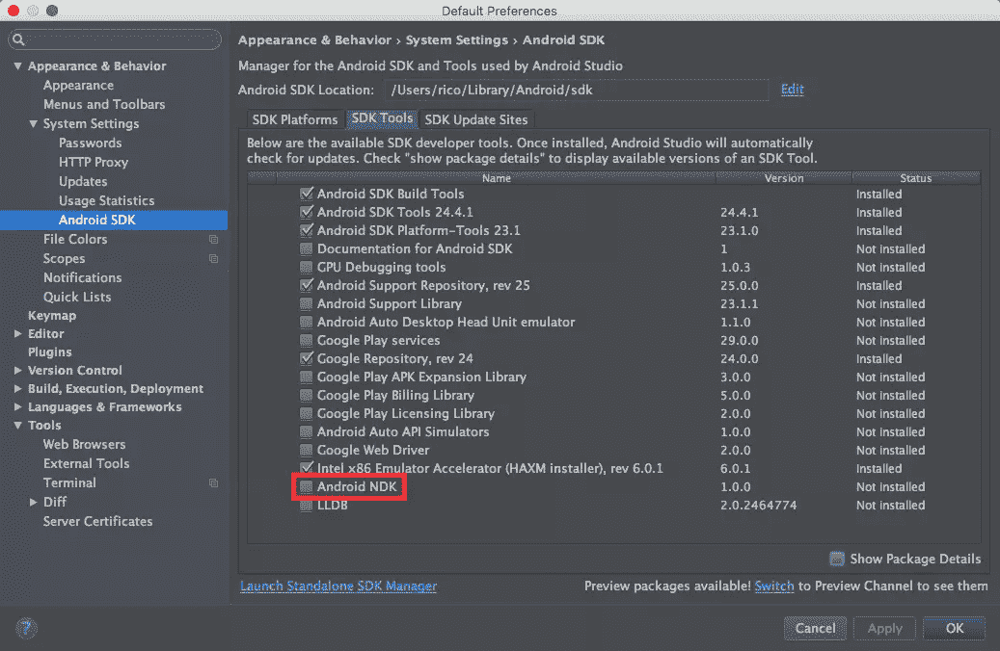
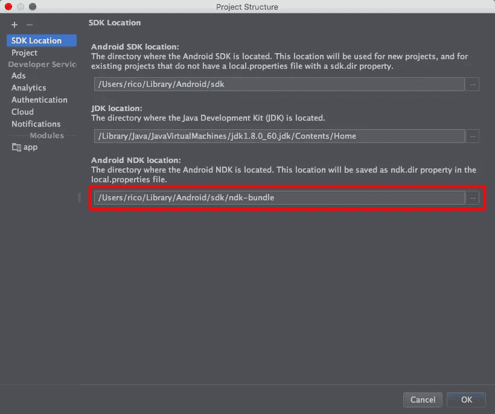
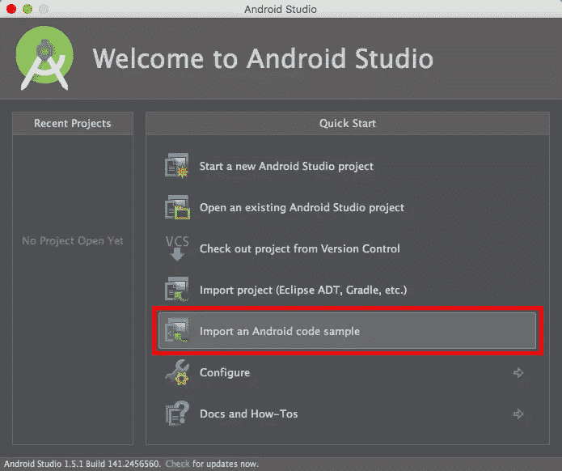
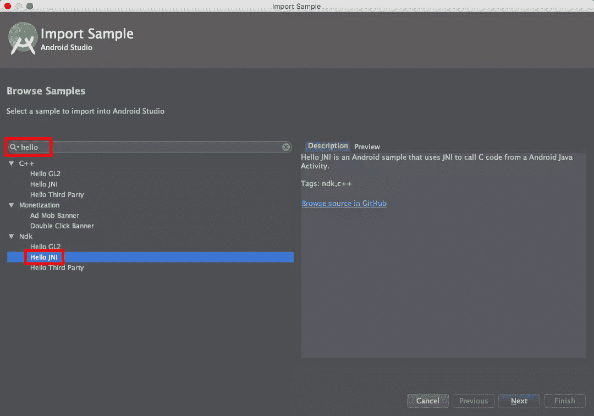
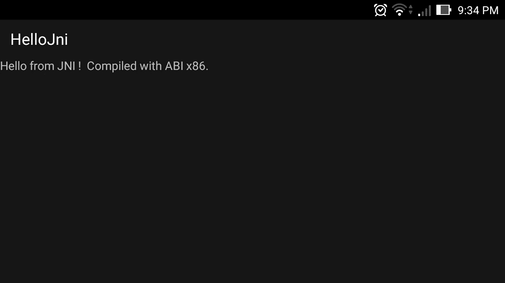
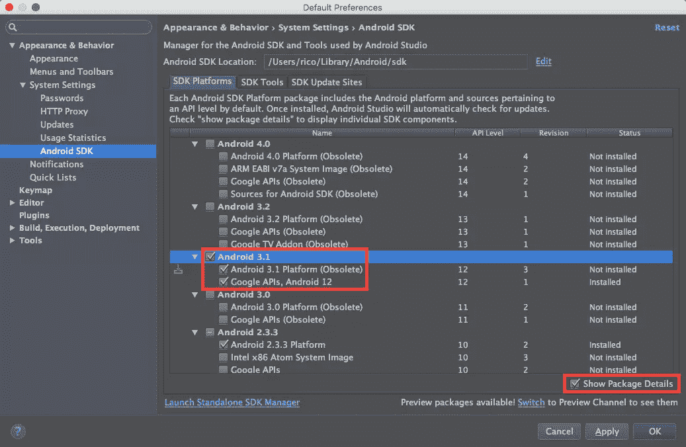
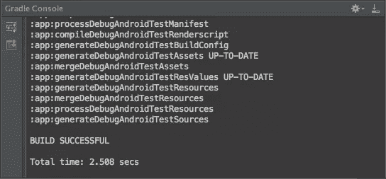
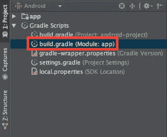
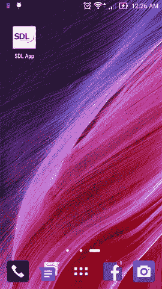

# 通过 NDK 在 Android 应用程序中使用 C 和 C++代码

> 原文：<https://www.sitepoint.com/using-c-and-c-code-in-an-android-app-with-the-ndk/>

在本教程中，我将介绍另一个开发选项，供您的下一个 Android 项目考虑，它非常适合拥有遗留代码或现有 C 和 C++知识的团队。Android 原生开发工具包(NDK)是谷歌官方工具集的一部分，我们将了解 NDK 何时有用以及如何在 Android 应用程序中使用它。

## 什么是 NDK？

NDK 是一个工具集，支持使用 C、C++和其他本地代码语言开发 Android 应用程序，将代码编译成可以在 Android 设备上运行的应用程序。通常不建议使用 NDK，因为应用程序可能会受到性能影响，遇到兼容性问题，更难调试，并降低灵活性。NDK 保证的是通过与本机代码接口增加应用程序的复杂性和连接性。

前面的陈述可能听起来令人沮丧，但 NDK 有很好的使用案例。这包括计算密集型应用程序，如游戏、游戏引擎、信号处理和物理模拟。另一个好的用例是重用用 C/C++编写的现有库。这意味着您可以利用在线提供的大量本机代码库。

在决定是否值得增加额外的复杂性之前，一定要权衡使用 NDK 的利弊。即使你是 C 或 C++的专家，你也不应该根据你喜欢的语言来做决定。

## 使用 NDK

### 安卓工作室

如果你还没有的话，下载谷歌官方 IDE[Android Studio](http://developer.android.com/sdk/index.html)。

### NDK 套餐

Android Studio 只包含默认工具和 SDK，所以需要单独下载并安装 NDK 包。有两种方法可以做到这一点。第一个也是最简单的是 *SDK 工具*选项卡中的自动安装选项。这是一个很大的下载量(~1GB)，所以请确保有良好的互联网连接和/或耐心。



第二种方法是从 [NDK 下载页面](http://developer.android.com/ndk/downloads/index.html)手动下载 NDK。这可以节省一些时间，因为下载文件较小(< .5 GB)，但是需要一些设置。下载适用于您的平台的 NDK 软件包，并按照安装说明进行操作。您可以将解压缩后的包放在任何您想放的地方，但是请记住这个位置，因为您以后会需要它。



### 你好世界

让我们运行一个测试项目，看看 NDK 安装是否有效。NDK 包文件夹包含示例，但如果没有额外的配置，它们似乎无法在 Android Studio 中开箱即用。相反，我们将从*欢迎*屏幕导入示例。这些来自 GitHub 的 [NDK 样本也可以直接下载或克隆。这组样本与最新版本的 Android Studio 具有更好的兼容性。](https://github.com/googlesamples/android-ndk)



选择*导入一个 Android 代码样本*并在搜索框中键入 *hello* 来过滤列表。从 *Ndk* 类别下的过滤列表中选择*你好 JNI* 。点击*下一步*编辑 app 名称和项目位置，然后点击*完成*。



### JNI

在代码加载和 Gradle 同步之后，让我们看看最终的项目结构。您可能已经注意到了项目名称中的差异。为什么叫 *HelloJNI* 而不是 *HelloNDK* ？什么是“JNI”，它与“NDK”有什么不同？“Java 本地接口”是一个使 Java 应用程序能够与本地代码交互的框架。JNI 和 NDK 携手合作，为 Android 应用提供本地支持。NDK 是 Android 框架的一部分，而 JNI 可用于任何 Java 应用程序，而不仅仅是 Android 应用程序。

项目中有一个名为 *jni* 的文件夹，它将保存应用程序的所有原生 C 或 C++源代码。JNI 提供了一个双向接口。C/C++代码能够调用 Java 代码，包括标准的 Android 库，Java 代码能够调用 C/C++代码中定义的本地函数。本机代码由与 Java 代码相同的沙箱和安全规则管理，因此应用程序不能完全不受限制地访问硬件。关于 JNI 更详细的讨论，请阅读来自 [Android 开发者网站](http://developer.android.com/training/articles/perf-jni.html)的 JNI 文章。


### ABI

让我们在模拟器上构建并运行项目，或者导出一个 APK 在设备上进行测试。下面是在我的华硕 Zenfone 上运行的 *hello-jni* ，它使用英特尔或 x86 应用二进制接口(ABI)。当 app 与原生代码交互时，必须支持不同的 CPU 架构。这意味着它必须针对您希望它运行的每个平台进行编译。



每个 ABI 对应一个目标架构，定义应用的本机代码在运行时应该如何表现或与系统交互。目前，NDK 支持 ARMEABI(默认)、MIPS 和 x86 架构。通常，项目需要手动设置，并为每个平台构建本机代码。示例项目中已经考虑到了这一点，所以只需重用示例并将其设置为项目的起点。它已经具备了让应用程序与 NDK 接口的所有基本要求。

## 重用库

如前所述，NDK 的优势在于它能够重用现有的、经过时间考验的强大的 C/C++库。这项功能在 Android Studio 中处于实验阶段，通常推荐给高级开发人员。然而，这是一件有趣且值得探索的事情。

### SDL

[简单 DirectMedia 层](https://www.libsdl.org/)是 18 年前发布的开源硬件抽象库。它主要用于游戏，但也可以用于任何涉及高性能图形的东西。在本节中，我们将设置一个使用 SDL 的基本项目，该项目可用作将来更复杂项目的模板。


### 项目设置

第一步是从[源代码下载页面](https://www.libsdl.org/download-2.0.php#source)下载 SDL 源代码，或者用以下代码克隆 [Mercurial](https://www.mercurial-scm.org/) repo:

`hg clone http://hg.libsdl.org/SDL`

下载或克隆完成后，从 Android Studio 的 SDL 文件夹中导入示例 Android 项目(名为 *android-project* ),接受导入屏幕中的默认值。创建项目后，可能会出现涉及缺少 SDK 版本的同步问题。要解决此问题，请打开 SDK 管理器并下载适合该项目的 SDK 版本。这里说的是 Android 3.1(API 12 级)。选中*显示包细节*框以显示此版本，因为它被标记为过时。可以使用更新的版本，但是现在让我们坚持使用 *android-12* 来保持简单。



安装 SDK 后，项目应该同步，没有错误，在控制台中显示一个<q>构建成功的</q>消息。如果您遇到任何其他错误，请在评论中告诉我。



### Gradle

Android Studio 使用 [Gradle](http://gradle.org/) ，一个用于管理项目及其输出的开源构建自动化系统。大多数项目配置发生在 gradle 文件中。让我们为项目添加一些手动配置。打开 *build.gradle (app module)* ，在`buildToolsVersion`属性下添加以下代码:

```
 sourceSets {
        main {
            jni.srcDirs = []
        }
    }
```

这将隐藏项目浏览器中的本地代码，这有助于使用`ndk-build`手动构建 SDL 和本地代码，这些代码位于 *ndk-bundle* 文件夹中。手动构建本机代码是比使用 Android Studio 和 Gradle 自动构建更可靠的方法。Gradle 对 NDK 的支持仍然是实验性的，并不是所有的用例都能被处理。



### 符号链接

让我们在项目的 *app/src/main/jni/* 文件夹中创建一个[符号链接](http://www.howtogeek.com/howto/16226/complete-guide-to-symbolic-links-symlinks-on-windows-or-linux/)。将其命名为 *SDL* ，并指向之前下载或克隆的 SDL 文件夹。可以直接复制 SDL 文件夹，但是这种方法效率较低并且容易出错。源文件隐藏在 Android Studio 中，因此需要在外部编辑器中手动打开，以进行以下修改。

### Android.mk

[Android.mk](http://developer.android.com/ndk/guides/android_mk.html) 是一个简单的 make 文件，描述了构建系统的项目源代码和共享库。默认情况下，已经导入的项目具有这些 make 文件，但只需要很少的配置。让我们对主应用程序的 *Android.mk* 文件进行修改。该文件位于 *app/src/main/jni/src* 文件夹中。找到写着`YourSourceHere.c`的那一行，换成`main.c`。

### Application.mk

*Application.mk* make 文件包含所有模块通用的配置，并影响整个项目的构建方式。将下面一行添加到 *app/src/main/jni/* 文件夹中的 *Application.mk* 中:

```
APP_PLATFORM := android-12
```

这个属性设置告诉`ndk-build`最低目标版本是 Android 3.1，并将项目指向适当的头文件。在 *Application.mk* 中要改变的另一个设置是使用`APP_ABI`属性的附加目标平台。从以下选择平台或全部添加:

*   arm64-v8a
*   阿尔梅阿比
*   armeabi-v7a
*   分子印迹聚合物
*   mips64
*   x86
*   x86_64

增加对所有这些平台的支持使应用程序有更好的覆盖范围，但会导致更大的 APK。

### 主网站

最后一步是添加自定义代码，该代码初始化 SDL 并调用其函数来查看项目是否工作。为了方便起见，让我们重用[这个 main.c 文件](https://github.com/ennorehling/android-sdl/blob/master/jni/src/main.c)，将其下载到 *app/src/main/jni/src* 文件夹中。

打开 *main.c* ，你会注意到它试图加载并显示一个名为 *image.bmp* 的图像。为了支持这一点，在 *app/src/main* 中创建一个名为 *asset* 的文件夹，并添加一个名为 *image.bmp* 的位图。这次测试我用了 [SitePoint.com 的 logo](https://uploads.sitepoint.com/wp-content/uploads/2016/02/1454667185image.bmp) 。

### 构建和运行

使用终端，打开 *app/src/main/jni/* ，运行`ndk-build NDK_LIBS_OUT=../jniLibs`。该命令构建本机代码并保存结果共享对象(*)。所以*文件到 *jniLibs* 文件夹。如果找不到`ndk-build`，用 complete a path 运行它，或者将其添加到 path 环境变量中。构建完成后，切换到 Android Studio，使用*Tools->Android->sync Project with Gradle Files*菜单项手动调用 Sync。现在可以使用*构建- >构建 APK* 菜单项来创建 APK，以在设备或仿真器上测试应用。这是我在 x86 架构上运行的版本:



## 结论

正如我们所见，在 Android 应用程序中使用 NDK 和本机代码需要一些工作，但带来了一个新的潜力世界。我希望我已经展示了足够的内容，让你明白它是否适合你的项目。

我很想在下面的评论中听到你关于在安卓 NDK 上使用 C 和 C++代码的经验和意见。

## 分享这篇文章