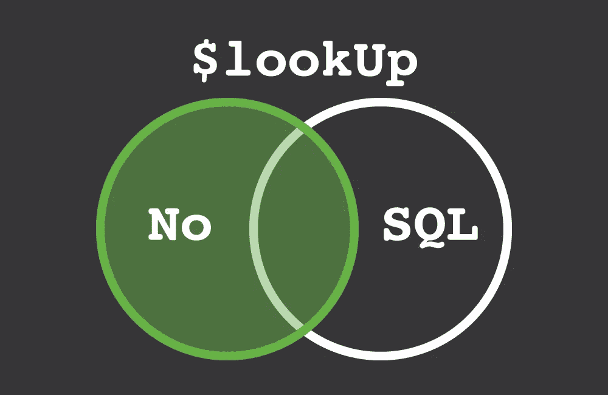

# 在 MongoDB NoSQL 数据库中使用连接

> 原文：<https://www.sitepoint.com/using-joins-in-mongodb-nosql-databases/>



*感谢 [Julian Motz](https://www.sitepoint.com/author/jmotz/) 好心帮助[同行评审](https://www.sitepoint.com/introduction-to-sitepoints-peer-review/)这篇文章。*

* * *

SQL 和 NoSQL 数据库最大的[区别之一是连接。在关系数据库中，SQL JOIN 子句允许您使用两个或多个表之间的公共字段来组合它们中的行。例如，如果您有`books`和`publishers`的表，您可以编写 SQL 命令，例如:](https://www.sitepoint.com/sql-vs-nosql-differences/)

```
SELECT book.title, publisher.name
FROM book
LEFT JOIN book.publisher_id ON publisher.id; 
```

换句话说，`book`表有一个引用`publisher`表中的`id`字段的`publisher_id`字段。

这很实际，因为一个出版商可以提供成千上万本书。如果我们需要更新发布者的详细信息，我们可以更改单个记录。数据冗余被最小化，因为我们不需要重复每本书的出版商信息。这种技术被称为**规范化**。

SQL 数据库提供了一系列规范化和约束特性，以确保关系得到维护。

## NoSQL ==不加入？

*不总是…*

面向文档的数据库，如 [MongoDB](https://www.mongodb.com/cloud/atlas) 被设计用来存储非规范化的数据。理想情况下，集合之间应该没有关系。如果两份或多份文件需要相同的数据，则必须重复。

这可能会令人沮丧，因为很少有情况下你*从不*需要关系数据。幸运的是，MongoDB 3.2 引入了一个新的 [`$lookup`操作符](https://docs.mongodb.com/manual/reference/operator/aggregation/lookup/)，它可以对两个或多个集合执行类似左外连接的操作。但是有一个条件…

## MongoDB 聚合

`$lookup`只允许在[聚合操作](https://docs.mongodb.com/manual/aggregation/)中使用。可以把这些看作是对结果进行查询、过滤和分组的操作流水线。一个操作符的输出被用作下一个操作符的输入。

聚合比更简单的 [`find`查询](https://docs.mongodb.com/manual/tutorial/query-documents/)更难理解，并且通常会运行得更慢。然而，对于复杂的搜索操作来说，它们是强大且无价的选择。

聚合最好用一个例子来解释。假设我们正在创建一个拥有`user`收藏的社交媒体平台。它将每个用户的详细信息存储在单独的文档中。例如:

```
{
  "_id": ObjectID("45b83bda421238c76f5c1969"),
  "name": "User One",
  "email: "userone@email.com",
  "country": "UK",
  "dob": ISODate("1999-09-13T00:00:00.000Z")
} 
```

我们可以根据需要添加任意多个字段，但是所有 MongoDB 文档都需要一个具有唯一值的`_id`字段。`_id`类似于 SQL 主键，必要时会自动插入。

我们的社交网络现在需要一个`post`集合，其中存储了来自用户的大量有见地的更新。这些文档在`user_id`字段中存储了文本、日期、评级和对用户的引用。

```
{
  "_id": ObjectID("17c9812acff9ac0bba018cc1"),
  "user_id": ObjectID("45b83bda421238c76f5c1969"),
  "date: ISODate("2016-09-05T03:05:00.123Z"),
  "text": "My life story so far",
  "rating": "important"
} 
```

我们现在想显示所有用户按时间倒序排列的最后二十篇具有“重要”评级的文章。每个返回的文档应该包含文本、发布时间以及相关用户的姓名和国家。

MongoDB [聚合查询](https://docs.mongodb.com/manual/reference/method/db.collection.aggregate/)被传递给一组[管道操作符](https://docs.mongodb.com/manual/reference/operator/aggregation-pipeline/)，它们按顺序定义每个操作。首先，我们需要使用 [`$match`过滤器](https://docs.mongodb.com/manual/reference/operator/aggregation/match/)从`post`集合中提取具有正确评级的所有文档:

```
{ "$match": { "rating": "important" } } 
```

我们现在必须使用 [`$sort`操作符](https://docs.mongodb.com/manual/reference/operator/aggregation/sort/)将匹配的项目按相反的日期顺序排序:

```
{ "$sort": { "date": -1 } } 
```

因为我们只需要二十个 posts，我们可以应用一个 [`$limit`阶段](https://docs.mongodb.com/manual/reference/operator/aggregation/limit/)，所以 MongoDB 只需要处理我们想要的数据:

```
{ "$limit": 20 } 
```

我们现在可以使用新的 [`$lookup`操作符](https://docs.mongodb.com/manual/reference/operator/aggregation/lookup/#pipe._S_lookup)连接来自`user`集合的数据。它需要一个带有四个参数的对象:

*   `localField`:输入文档中的查找字段
*   `from`:要加入的集合
*   `foreignField`:要在`from`集合中查找的字段
*   `as`:输出字段的名称。

因此，我们的运营商是:

```
{ "$lookup": {
  "localField": "user_id",
  "from": "user",
  "foreignField": "_id",
  "as": "userinfo"
} } 
```

这将在我们的输出中创建一个名为`userinfo`的新字段。它包含一个数组，数组中的每个值都与`user`文档相匹配:

```
"userinfo": [
  { "name": "User One", ... }
] 
```

我们在`post.user_id`和`user._id`之间有一对一的关系，因为一篇文章只能有一个作者。因此，我们的`userinfo`数组将只包含一个项目。我们可以使用 [`$unwind`操作符](https://docs.mongodb.com/manual/reference/operator/aggregation/unwind/)将其解构为一个子文档:

```
{ "$unwind": "$userinfo" } 
```

现在，输出将被转换为更实用的格式，可以应用更多的运算符:

```
"userinfo": {
  "name": "User One",
  "email: "userone@email.com",
  …
} 
```

最后，我们可以使用管道中的 [`$project`阶段](https://docs.mongodb.com/manual/reference/operator/aggregation/project/)返回文本、发布时间、用户名和国家:

```
{ "$project": {
  "text": 1,
  "date": 1,
  "userinfo.name": 1,
  "userinfo.country": 1
} } 
```

## 把所有的放在一起

我们最终的聚合查询匹配帖子、按顺序排序、限制到最近的 20 个条目、连接用户数据、展平用户数组并只返回必要的字段。完整的命令:

```
db.post.aggregate([
  { "$match": { "rating": "important" } },
  { "$sort": { "date": -1 } },
  { "$limit": 20 },
  { "$lookup": {
    "localField": "user_id",
    "from": "user",
    "foreignField": "_id",
    "as": "userinfo"
  } },
  { "$unwind": "$userinfo" },
  { "$project": {
    "text": 1,
    "date": 1,
    "userinfo.name": 1,
    "userinfo.country": 1
  } }
]); 
```

结果是多达二十个文档的集合。例如:

```
[
  {
    "text": "The latest post",
    "date: ISODate("2016-09-27T00:00:00.000Z"),
    "userinfo": {
      "name": "User One",
      "country": "UK"
    }
  },
  {
    "text": "Another post",
    "date: ISODate("2016-09-26T00:00:00.000Z"),
    "userinfo": {
      "name": "User One",
      "country": "UK"
    }
  }
  ...
] 
```

## 太好了！我终于可以转到 NoSQL 了！

MongoDB `$lookup`非常有用和强大，但是即使是这个基本的例子也需要一个复杂的聚合查询。它不能替代 SQL 中提供的更强大的 JOIN 子句。MongoDB 也不提供约束；如果一个`user`文档被删除，孤立的`post`文档将会保留。

理想情况下，应该很少需要`$lookup`操作符。如果您非常需要它，您可能使用了错误的数据存储…

> 如果您有关系数据，请使用关系(SQL)数据库！

也就是说，`$lookup`是 MongoDB 3.2 的一个受欢迎的新增功能。当在 NoSQL 数据库中使用少量关系数据时，它可以克服一些更令人沮丧的问题。

## 分享这篇文章