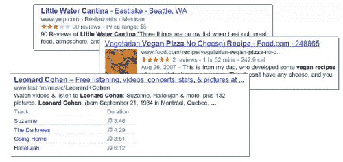
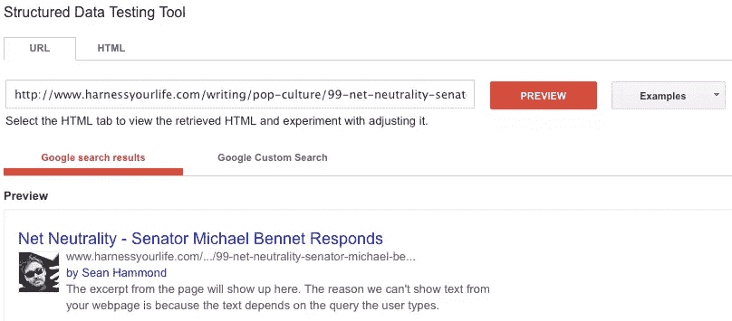
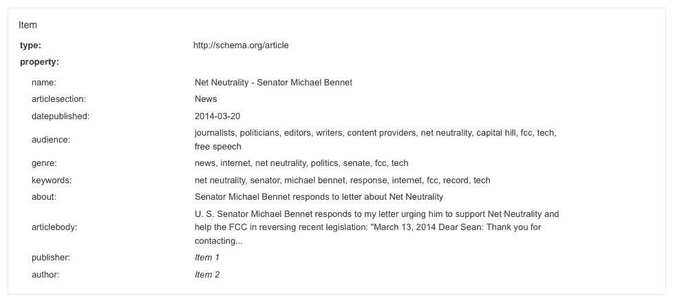

# 使用模式提高搜索结果中的内容可见性

> 原文：<https://www.sitepoint.com/using-schemas-improve-content-visibility-search-results/>

如果你正在寻找一种通过搜索结果增加内容流量的方法，并且你听说过“丰富片段”和“微数据”这样的术语，那么请继续阅读。

在这篇文章中，我将介绍丰富的片段和模式，我将介绍如何使用它们来帮助你的内容获得更多的曝光。

## 什么是丰富的片段？

摘录是您在每个搜索结果下看到的文本行。它们旨在让搜索者了解页面上的内容，以及为什么与他们的搜索相关。

如果搜索引擎理解您页面上的内容，它可以创建丰富的片段或详细的信息，以帮助用户进行特定的搜索。你知道，那些链接下的金星评级或者他们文章旁边的作者照片。



摘录一直在扩展和发展，并且已经成为传递评论和价格的快速信息的常见方式。菜谱页面的片段可能显示总的准备时间、一张照片和菜谱的评论等级；音乐专辑的片段可以列出歌曲以及播放每首歌曲的链接。

对于这篇文章，我们将使用谷歌作为我们的默认搜索引擎，但是所有主要的搜索引擎都支持丰富的片段。下面的列表是常见的内容，但是 Schema.org[支持更多的类别:](http://schema.org)

*   [人](https://support.google.com/webmasters/answer/answer.py?answer=146646)
*   [产品](https://support.google.com/webmasters/answer/answer.py?answer=146750)
*   [企业和组织](https://support.google.com/webmasters/answer/answer.py?answer=146861%29%20-Recipes%20%28https://support.google.com/webmasters/answer/answer.py?answer=173379)
*   [事件](https://support.google.com/webmasters/answer/answer.py?answer=164506)
*   [音乐](https://support.google.com/webmasters/answer/answer.py?answer=1623047)
*   [评论](https://support.google.com/webmasters/answer/146645)
*   [电影](http://schema.org/Movie)
*   [电视节目](http://schema.org/TVSeries)

## 第一步:选择一种格式

帮助搜索引擎创建丰富片段的第一步是选择标记格式；微数据、微格式和 RDFa。不需要这些格式的先验知识，只需要一些基本的 HTML 技能。谷歌推荐使用[微数据](https://support.google.com/webmasters/answer/answer.py?answer=176035)，所以这是我们将使用的格式。

## 第二步:HTML 还是数据荧光笔？

谷歌还提供了一个[数据高亮器](https://support.google.com/webmasters/answer/answer.py?answer=2692911)来“教导”搜索引擎你页面上的一致数据。例如，如果你写了一个博客，你的网站模板会自动生成每个新页面(想想 CMS，而不是从头开始构建每个页面)，使用数据荧光笔，你可以选择文章的标题、作者、发表日期等。，谷歌会将这些参数应用到你所有的页面。你告诉谷歌在哪里可以找到这些特定的信息，它会自动从你所有的其他文章中提取，本质上是为你做标记。

数据荧光笔惊人地快速且易于使用，**但与自己编写标记相比，它远没有那么具体或详细。如果您试图一次为一堆存档文章创建丰富的片段，Data Highlighter 可能是一个不错的选择。**

如果你不能决定在丰富的片段上投入多少精力，可以考虑以下几点:

**在下列情况下使用 HTML 标记:**

*   你希望明确控制谷歌如何理解你网站上的事件、评论、人物、音频/视频或其他类型的数据。
*   您可以一致地向所有数据项添加 HTML 标记。
*   你的网站结构经常变化。
*   除了谷歌，你还想让其他搜索引擎了解你网站上的内容。(Data Highlighter 提取的数据仅供 Google 使用。)

**使用数据荧光笔，如果:**

*   您的站点显示有关事件的数据。
*   您正在考虑为您的站点提供结构化数据和丰富的片段，但是您还没有准备好投入资源来更新 HTML。
*   你更喜欢点击网页，而不是写 HTML。
*   你不能改变网站上的 HTML，或者你不能一致地标记数据项。

## 步骤 3:学习模式

好了，Snippet Master，现在你知道了什么是 Rich Snippet，并且决定使用微数据格式来取悦 Google，那么现在该做什么呢？是时候学习你的模式，并对 schema.org 感到非常舒服了。

什么是 Schema.org？

> “[这是]谷歌、微软和雅虎的合作！通过创建主流搜索引擎支持的结构化数据标记模式来改进 web。页面标记帮助搜索引擎理解网页上的信息，并提供更丰富的结果。共享的标记词汇表使网站管理员更容易决定标记模式，并从他们的工作中获得最大利益。
> 
> [ … ]
> 
> 搜索引擎正在以各种方式使用页面标记——“例如，谷歌用它在搜索结果中创建丰富的片段。并不是 schema.org 的每一种信息都会出现在搜索结果中，但是随着时间的推移，你可以预期更多的数据会以更多的方式被使用。此外，由于标记可从您的网页上公开访问，其他组织也可能会找到有趣的新方法来利用它。”–[谷歌网站管理员工具](https://support.google.com/webmasters/answer/1211158?hl=en&ref_topic=4600154)

对于没有附带文本的内容(例如视频、音频、播客和图像)，模式非常重要。搜索引擎不能“听”并向潜在的搜索者描述音频文件，元标签可能会丢失和混淆(或滥用)。如果实现正确，模式可以提供关于音频文件的大量信息——艺术家、专辑、歌曲名称、持续时间、文件类型、录音质量、评级、评论、巡演日期等。，所有这些信息都有可能直接显示在搜索的丰富摘录结果中。

### 关于模式的一些免责声明

你必须回去花上几个小时/几天来标记旧内容吗？

不，但是标记不是全有或全无。只标记一个项目的一些属性是可以的。然而，标记尽可能多的内容有助于搜索引擎更好地理解你的内容，并以最有用的方式呈现出来。对于许多类型，谷歌需要最少量的信息来以丰富的片段呈现你的内容。

使用模式会提高我的搜索排名和性能吗？

不，不是直接的。

> “谷歌目前不使用标记进行排名，但丰富的片段可以使你的网页在搜索结果中更突出，所以你可能会看到流量的增加。”–[信号源](https://support.google.com/webmasters/answer/1211158?hl=en&ref_topic=4600154)

## 第四步:工具

击鼓！**你拥有的最重要的标记工具:** [谷歌结构化数据测试工具](http://www.google.com/webmasters/tools/richsnippets)。

收藏它，爱它，用它。当您使用标记代码更新您的网站时，只需将您的 URL 复制并粘贴到工具中，然后预览页面。谷歌为你提供关于标记的反馈，如果它被引擎准确地读取，它将如何显示，如果有任何错误。



Schema.org 做了一件了不起的工作，向你展示了如何做和为什么做，以及用于标记的正确代码。他们给出了一个你能想象出的几乎任何内容的例子，并且如果你现在不能找到你所需要的，他们还会继续扩展。

一开始，模式可能有点让人不知所措。基本的标记很容易理解，但是模式所包含的大量细节和层次可能会让你晕头转向。感觉就像你把文章内容重写了两三遍。

不幸的是，我对此没有什么好的建议——至于你想创建多少标记以及你要省略什么，这完全是你自己的决定。如果你正在从头开始写一篇新文章，并且能够投入时间，尽可能多地标记整篇文章——这不会有什么坏处。然而，如果你优先考虑标题、作者、出版日期、人物、关键词、关于和文章正文，事情似乎表现得还不错。

下面是一篇新闻文章中 schema.org 标记的例子。它相当简单——没有评论、事件或音频/视频。

```
<div span itemscope itemtype="http://schema.org/Article"></span>
<span itemprop="name" content="Net Neutrality - Senator Michael Bennet"></span>

<span itemprop="articleSection" content="News"></span>
<span itemprop="datePublished" content="2014-03-20"></span>
<span itemprop="person" content="Michael Bennet"></span>
<span itemprop="affiliation" content="US Senate"></span>

<span itemprop="audience" content="journalists, politicians, editors, writers, content providers, net neutrality, capital hill, fcc, tech, free speech"></span>

<span itemprop="genre" content="net neutrality, news, internet, politics, senate, fcc, tech, broadband"></span>

<span itemprop="keywords" content="net neutrality, senator, michael bennet, response, internet, fcc, on record, tech, broadband"></span>

<span itemprop="about" content="Senator Michael Bennet responds to letter about Net Neutrality"></span>

<span itemprop="image" content="net neutrality" img src="images/blog/Net_Neutrality_Bennet.png"></span>

<span itemprop="articleBody">AAAARRRRTTTTIIIIICCCCLLLLEEEE</span>

<span itemprop="publisher" itemscope itemtype="http://schema.org/Organization"> <meta itemprop="name" content="Harness Your Life"> 
<a rel="publisher" href="https://plus.google.com/+HarnessyourlifeHyL"></a></span> 

<span itemprop="author" itemscope itemtype="http://schema.org/Person"> <meta itemprop="name" content="Sean Hammond">  <a rel="author" href="https://plus.google.com/+SeanHammondIsRad"></a></span>

</div>
```

以下是结构化数据工具为您提供的结果:



## 放松呼吸

模式需要一些耐心和反复试验。他们不难相处，只是很费时间。最困难的部分似乎是在 Schema.org 搜索正确的“道具”。为几篇文章创建好/完整的标记后，保存代码并复制粘贴到下一篇文章中，根据需要更改标记。

在最近的实际经验中，当花时间在重建的网站上实现标记时，我们看到印象增加了 600%,整体流量增加了 2/3。我不会把所有的功劳都归功于这些模式，但我肯定知道它们做出了贡献。

当您的用户找到完整且引人入胜的搜索结果时，丰富的片段会给您带来更加专业的体验。

## 分享这篇文章