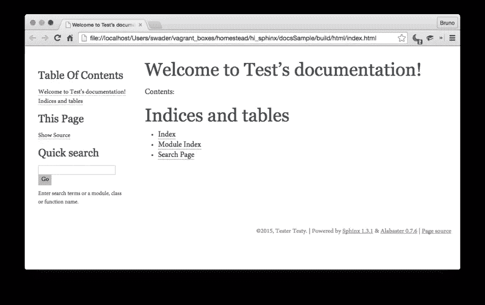
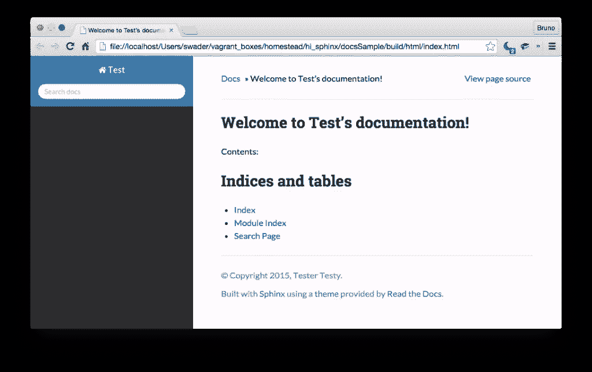
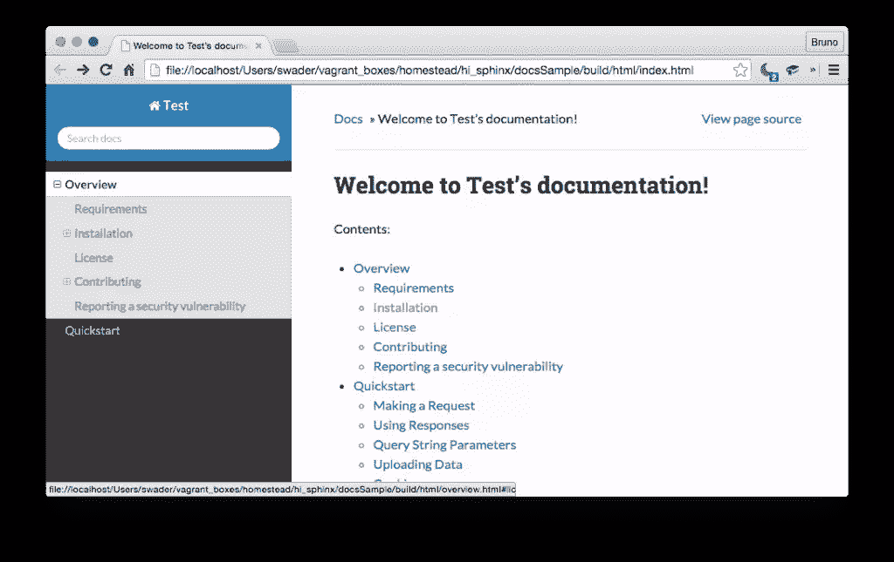
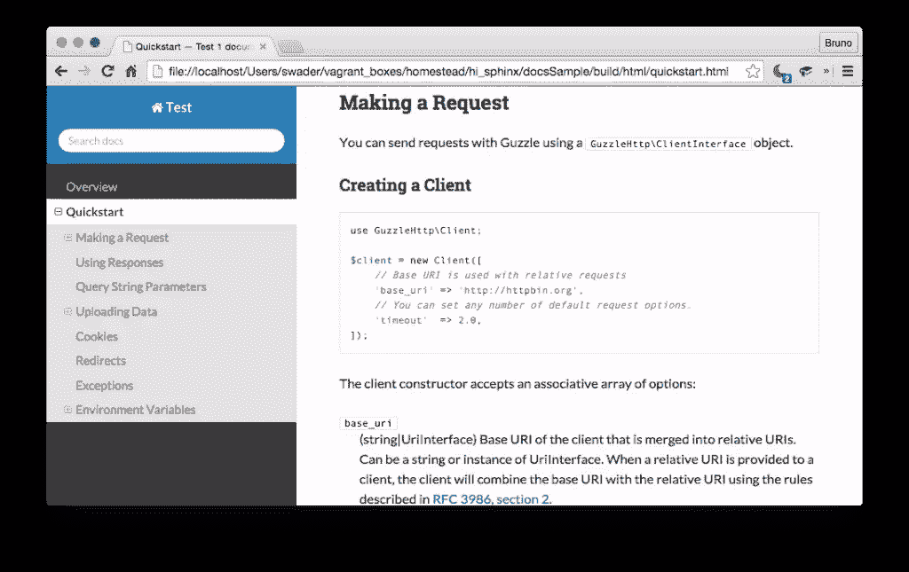
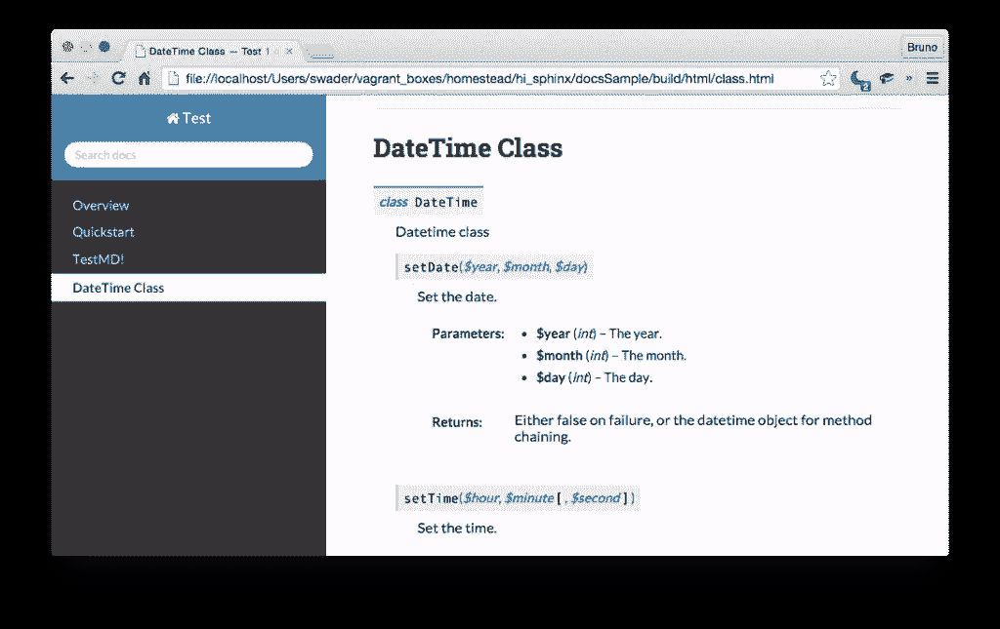
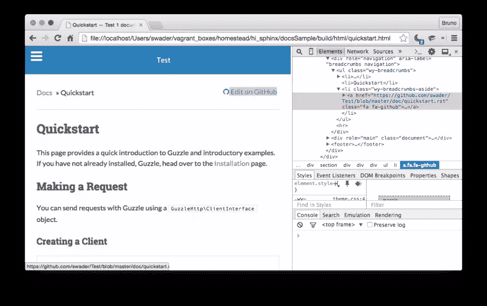
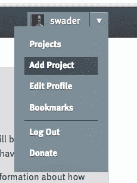
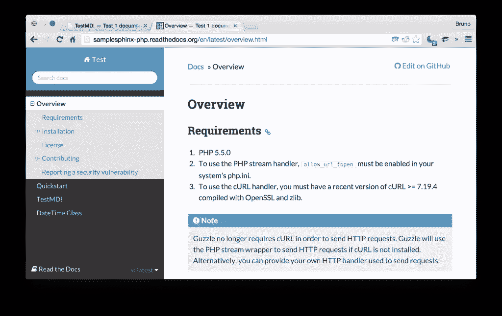

# 将 Sphinx 用于 PHP 项目文档

> 原文：<https://www.sitepoint.com/using-sphinx-for-php-project-documentation/>

我最近需要为 Diffbot PHP 客户端的[编写适当的散文式源代码文档。查看了几个文档生成器，甚至让](https://github.com/Swader/diffbot-php-client)[建议了一个`@prose`标签](https://github.com/ApiGen/ApiGen/issues/633)用于将相关的 MD/reST 文档导入到方法和类描述中，我意识到根本没有[完美的解决方案](https://www.reddit.com/r/PHP/comments/3f7dpb/any_interest_in_source_code_documentation_with/)(到目前为止)我们都同意。所以在我用一个`@prose`令牌和 reST 解析扩展 [Sage](https://github.com/dotink/sage/) 之前，我选择了 [ReadTheDocs](https://readthedocs.org) 和 Sphinx。


RTD 在工业中应用广泛。它拥有强大的文档，如 [Guzzle 的](http://guzzle.readthedocs.org/en/latest/)、 [PhpSpec 的](http://phpspec.readthedocs.org/en/latest/)等等。它同时支持 reST 和 MD(或者更准确地说，是 MD 和 reST)，这是一个巨大的优势，因为 RST 文件更适合高度技术性的文档。它可以在本地运行并生成离线友好的 HTML 文件，但它也可以从在线可用的文档源编译，并自动托管为`readthedocs.org`的子域。

也就是说，为一个 PHP 项目设置它有一些注意事项，所以我们将在本教程中浏览一个基本指南。

## TL；速度三角形定位法(dead reckoning)

如果您只是在寻找快速启动和运行的命令列表:

```
sudo pip install sphinx sphinx-autobuild sphinx_rtd_theme sphinxcontrib-phpdomain
mkdir docs
cd docs
sphinx-quickstart
wget https://gist.githubusercontent.com/Swader/b16b18d50b8224f83d74/raw/b3c1d6912aefc390da905c8b2bb3660f513af713/requirements.txt
```

在快速启动设置之后，要激活主题和 PHP 语法高亮显示，请运行:

```
sed -i '/extensions = \[\]/ c\extensions = \["sphinxcontrib.phpdomain"\]' source/conf.py
echo '

import sphinx_rtd_theme
html_theme = "sphinx_rtd_theme"
html_theme_path = [sphinx_rtd_theme.get_html_theme_path()]

# Set up PHP syntax highlights
from sphinx.highlighting import lexers
from pygments.lexers.web import PhpLexer
lexers["php"] = PhpLexer(startinline=True, linenos=1)
lexers["php-annotations"] = PhpLexer(startinline=True, linenos=1)
primary_domain = "php"

' >> source/conf.py
```

要构建 HTML:

```
make html
```

或者

```
sphinx-build -b html source build
```

后一个命令支持[几个选项](http://sphinx-doc.org/invocation.html#invocation-of-sphinx-build)您可以添加到组合中。

## 斯芬克斯装置

ReadTheDocs 在幕后使用了 [Sphinx](http://sphinx-doc.org/) ，因此是一个彻头彻尾的 Python 实现。要使用它，我们需要安装几个先决条件。我们将用我们信赖的[家园改良](https://www.sitepoint.com/quick-tip-get-homestead-vagrant-vm-running/)为我们建立一个全新的游戏环境。

在 VM 设置好之后，用`vagrant ssh`SSH 进入并执行:

```
sudo pip install sphinx sphinx-autobuild
```

如果你没有命令`pip`，按照[官方指令](https://pip.pypa.io/en/latest/installing.html)安装它，或者如果在 Ubuntu 上只执行以下命令:

```
sudo apt-get install python-sphinx python-setuptools
sudo easy_install pip
```

这些工具现在使命令`sphinx-quickstart`可用。

## 推荐的文件夹布局

一般来说，你要么有:

1.  文档与您正在记录的项目在同一个文件夹中，或者…
2.  它自己的存储库中的文档。

除非文档跨越多个项目或上下文，否则建议将其与项目放在同一个文件夹中。如果你担心在 Composer 下载使用时会增加项目的大小，那么可以通过将文档放入`.gitattributes`文件中(参见[这里的](https://www.reddit.com/r/PHP/comments/2jzp6k/i_dont_need_your_tests_in_my_production/))来很容易地将文档排除在发行版之外。

当我们运行命令`sphinx-quickstart`时，它会要求我们提供文档的根文件夹。这是文档的所有其他子文件夹将放入的文件夹。注意，这是**而不是**项目的根文件夹。如果你的项目在`my-php-project`，文档的根可能在类似`my-php-project/docs`的地方。

接下来，Sphinx 提供为文档的编译版本(例如 HTML)创建一个单独的`_build`文件夹，而源代码将在根目录下(在上一步中定义)，或者在根目录下创建两个文件夹:`source`和`build`，保持根目录干净。你可以随意选择你喜欢的选项(出于清洁和结构的考虑，我们选择了后者)。

按照剩余的说明设置一些元数据，选择`.rst`作为文件扩展名，最后对所有关于附加插件的问题回答“否”——那些涉及 Python 项目，不在我们的管辖范围内。同样，当要求创建`make`文件时，接受。

## 自定义主题

用命令`make html`构建文档会在`build`文件夹中生成 HTML 文档。在浏览器中打开文档会显示如下屏幕:



那不是很吸引人。这个主题更加时尚和现代。让我们安装它。

```
pip install sphinx_rtd_theme
```

然后，在 docs 根目录的`source`文件夹*中，找到文件`conf.py`,在其他`import`语句中，在顶部添加下面一行:*

```
import sphinx_rtd_theme
```

在同一个文件中，更改 HTML 主题的名称:

```
html_theme = "sphinx_rtd_theme"
```

最后，通过询问导入的模块告诉 Sphinx 主题在哪里:

```
html_theme_path = [sphinx_rtd_theme.get_html_theme_path()]
```

用`make html`构建文档现在应该会产生一些非常漂亮的 HTML:



大多数主题遵循相同的安装过程。[这里](http://docs.writethedocs.org/tools/sphinx-themes/)是一个短名单。希望它在未来会扩大。

## 目录

在`quickstart`期间，用户被要求输入主文件的名称(通常是`index`)。主文件通常包含很少甚至没有内容——相反，它只包含指令。

reST 指令就像一个函数——reST 语法的强大构造，它接受参数、选项和主体。`toctree`指令就是其中之一。它需要一个选项`maxdepth`，表示单个菜单项的最大级别数(如深度 2 是`Mainmenu -> Submenu1`而不是`-> Submenu2`)。

在选项后面是一个空行，然后是一个每行一个的包含文件列表，没有扩展名。支持文件夹(`subfolder/filetoinclude`)。

```
.. Test documentation master file, created by
   sphinx-quickstart on Sat Aug  8 20:15:44 2015.
   You can adapt this file completely to your liking, but it should at least
   contain the root `toctree` directive.

Welcome to Test's documentation!
================================

Contents:

.. toctree::
   :maxdepth: 2

   overview
   quickstart
```

在上面的例子中，Sphinx 输出了`Contents:`，后面跟着一个扩展版本的目录，即包含文档中所有标题的列表。此外，许多作者在主文件的顶部包含了额外的信息，以提供当时和那里的库的鸟瞰图。参见[狂饮的](http://guzzle.readthedocs.org/en/latest/index.html)。

主文件中的`toctree`定义将自动反映在左侧 ToC 导航栏中。

让我们从 [Guzzle](https://github.com/guzzle/guzzle/tree/master/docs) 那里获取`overview`和`quickstart`文件，这样我们就不用自己写了。把它们放到 docs 的根目录下，用`make html`重新编译。

文档现在应该出现了，左边的 ToC 应该可以用小加号图标展开:



更多关于`toctree`指令的信息，以及它能为你提供真正定制输出的一切，请看[这里](http://sphinx-doc.org/markup/toctree.html)。

## PHP 语法

如果我们看一下`quickstart`文档，我们会注意到 PHP 示例没有突出显示语法。不奇怪，考虑到 Sphinx 默认为 Python。让我们解决这个问题。

在`source/conf.py`文件中，添加以下内容:

```
from sphinx.highlighting import lexers
from pygments.lexers.web import PhpLexer
lexers['php'] = PhpLexer(startinline=True, linenos=1)
lexers['php-annotations'] = PhpLexer(startinline=True, linenos=1)
primary_domain = 'php'
```

这将导入 PHP lexer，并将某些代码块语言提示定义为可由模块解析的。它还将文档的默认模式设置为 PHP，因此如果您省略了代码块上的语言声明，Sphinx 将会认为它是 PHP。例如，代替:

```
.. code-block:: php

    use myNamespace/MyClass;
    ...
```

人们可以输入:

```
.. code-block::

    use myNamespace/MyClass;
    ...
```

将上述内容添加到配置文件中后，需要重新构建。

```
make html
```

这将产生语法突出显示的 PHP 部分:



### PHP 域

另外，我们可以安装 [PHP 域](http://pythonhosted.org/sphinxcontrib-phpdomain/)。

域是一组特定于编程语言的 reST 角色和指令，这使得 Sphinx 更善于识别常见的概念，并正确地突出显示和链接它们。最初由 Mark Story 开发的 PHP 域[可以通过以下方式安装:](http://mark-story.com/posts/view/sphinx-phpdomain-released)

```
sudo pip install sphinxcontrib-phpdomain
```

需要通过将`extensions`行更改为以下来激活扩展:

```
extensions = ["sphinxcontrib.phpdomain"]
```

现在让我们试着用一个描述过的 PHP 类创建另一个 reST 文件，这样我们就可以看到 PHP 域的魔力有多强。我们将创建`source/class.rst`，并将`class`添加到所有其他文件下的`index.rst`文件中。然后，我们将以下内容放入`class.rst`:

```
DateTime Class
==============

.. php:class:: DateTime

  Datetime class

  .. php:method:: setDate($year, $month, $day)

      Set the date.

      :param int $year: The year.
      :param int $month: The month.
      :param int $day: The day.
      :returns: Either false on failure, or the datetime object for method chaining.

  .. php:method:: setTime($hour, $minute[, $second])

      Set the time.

      :param int $hour: The hour
      :param int $minute: The minute
      :param int $second: The second
      :returns: Either false on failure, or the datetime object for method chaining.

  .. php:const:: ATOM

      Y-m-d\TH:i:sP
```

如果我们重建，我们会得到这样的结果:



注意，如果没有安装 PHP 域，这个屏幕将是空的。

这看起来不算太糟，但还可以更好。不过，我们改天再做造型。

## 查看源代码

文档通常会在顶部包含一个指向源文件的链接，这样用户就可以提出修改建议，提出问题，并在发现不合适的地方时请求改进。

在[配置选项](http://sphinx-doc.org/config.html#confval-html_show_sourcelink)中，有一个标志显示/隐藏这些源链接。默认情况下，它们会指向`_sources/file`，其中`file`是当前查看的文件，`_sources`是`build`目录中的一个目录——也就是说，在构建过程中，所有源文件都会被复制到`build/_sources`。

不过，我们不想这样。我们将在 Github 上托管这些文档，我们希望资源可以被引导到那里，不管它们被托管在哪里。我们可以通过在`conf.py`文件中添加 HTML 上下文变量来做到这一点:

```
html_context = {
  "display_github": True,
  "github_user": "user",
  "github_repo": project,
  "github_version": "master",
  "conf_py_path": "/doc/",
  "source_suffix": source_suffix,
}
```

小心将这个块*添加到`project`定义的*之后，否则你会得到一个关于`project`变量没有被定义的错误。把这个放在`conf.py`的底部通常是一个安全的赌注。



## 休息 vs MD

对于 reST 的快速和粗略介绍，请参见 [this](http://sphinx-doc.org/rest.html#rst-primer) ，但是也请查看由 Sphinx 团队添加的定制标记—[这些附加特性](http://sphinx-doc.org/markup/index.html#sphinxmarkup)帮助您充分利用您的文档。

ReST 比 MD 拥有更多的特性，所以为了对等和更容易的转换，这里有一个很好的转换指南和一个以表格形式整齐排列的特性的一对一比较 T2。

## 添加 MD

有时，您可能不愿意或者不能够将现有的 MD 文档转换成 reST。没关系，斯芬克斯可以双持 MD/reST 支持。

首先，我们需要安装 MD 处理模块:

```
sudo pip install recommonmark
```

我们还需要将解析器导入到`source/conf.py`中:

```
from recommonmark.parser import CommonMarkParser
```

最后，我们需要告诉 Sphinx 将`.md`文件发送到解析器，方法是用以下代码替换之前定义的`source_suffix`行:

```
source_suffix = ['.rst', '.md']
source_parsers = {
    '.md': CommonMarkParser,
}
```

如果我们通过在`source`中添加一个文件`testmd.md`来进行试验，其内容如下:

```
# TestMD!

We are testing md!

## Second heading!

Testing MD files.

---

    echo "Here is some PHP code!"
```

重建现在应该显示完全呈现的 MD 内容——但有一点需要注意。语法不会被突出显示(即使我们将代码放入 PHP 代码栏也不会)。如果有人知道为什么会发生这种情况以及如何避免，请在评论中告诉我们。

## 在 ReadTheDocs 上托管

现在我们的文档已经准备好了，我们可以把它放到网上了。出于本演示的目的，我们在[http://github.com/sitepoint-editors/samplesphinx-php](http://github.com/sitepoint-editors/samplesphinx-php)创建了一个样本内容的报告。

为了在线托管文档，我们首先添加一个新项目…



下一个屏幕要求连接 Github。在导入存储库之后，我们在想要创建 RTD 项目的存储库上单击 Create，并确认一些额外的值，这些值都可以保留为默认值。

在构建成功完成后，我们的文档应该是活动的:



*注意:[这个检查](https://github.com/snide/sphinx_rtd_theme#id10)曾经是必需的，但是 RTD 似乎已经解决了这个问题，你现在可以在本地版本和现场版本中使用相同的主题声明。*

## RTD 的扩展

在本教程的前面，我们安装了 PHP 域，用于更简单的指令驱动的 PHP 类描述。不过，这个扩展在 ReadTheDocs 上不可用。

幸运的是，ReadTheDocs 利用了 [virtualenv](https://www.sitepoint.com/virtual-environments-python-made-easy/) ，可以安装几乎任何你想要的模块。要安装定制模块，我们需要以下内容:

*   某处回购中的一个`requirements.txt`文件
*   ReadTheDocs 项目的`Advanced Settings`部分中该文件的路径

为了获得一个需求文件，我们可以将命令`pip freeze`的输出保存到一个文件中:

```
pip freeze > requirements.txt
```

`freeze`命令将生成一个很长的模块列表，其中一些可能无法安装在 ReadTheDocs 上(例如，特定于 Ubuntu 的模块)。您必须跟踪构建阶段的错误，并从文件中一个接一个地删除它们，直到到达一个工作的`requirements`文件，或者直到 RTD 改进他们的构建报告以更准确地标记错误。

对于所有意图和目的，像这样的文件应该是非常好的:

```
Babel==2.0
CommonMark==0.5.4
Jinja2==2.8
MarkupSafe==0.23
PyYAML==3.11
Pygments==2.0.2
Sphinx==1.3.1
sphinxcontrib-phpdomain==0.1.4
alabaster==0.7.6
argh==0.26.1
argparse==1.2.1
docutils==0.12
html5lib==0.999
meld3==0.6.10
pathtools==0.1.2
pytz==2015.4
recommonmark==0.2.0
six==1.5.2
snowballstemmer==1.2.0
sphinx-autobuild==0.5.2
sphinx-rtd-theme==0.1.8
wheel==0.24.0
```

在重新运行在线构建(自动发生)之后，文档化的 PHP 类应该是可用的，就像我们在本地测试时一样。

## 解决纷争

### 值错误:未知区域设置:UTF-8

运行`sphinx-quickstart`或`make html`后，你可能会在 OS X 上得到错误`ValueError: unknown locale: UTF-8`。如果发生这种情况，打开文件`~/.bashrc`(如果不存在就创建)，输入内容:

```
export LC_ALL=en_US.UTF-8
export LANG=en_US.UTF-8
```

…保存并关闭它，然后用命令`source ~/.bashrc`加载它。错误现在应该不会再出现。

### 目录不显示/过期

有时当添加新文件到`index.rst`时，左边栏的目录会过期。例如，点击在添加新文件之前构建的文件，将显示一个缺少最新文件标题的目录。原因不明，但通过强制完全重建很容易修复:

```
rm -rf build/
make html
```

第一个命令完全删除构建文件夹的内容，迫使 Sphinx 在`make html`上重新生成所有内容。

### 构建失败

如果你的构建失败了，并且你不知道原因，在`Admin`中的`Advanced settings`下明确定义`conf.py`的位置有时会有所帮助。

## 结论

在本教程中，我们学习了如何在一个隔离的 VM 中为 PHP 项目快速建立一个 Sphinx 文档工作流，这样安装就不会干扰我们的主机操作系统。我们安装了 PHP highlighter，配置了目录，安装了一个自定义主题，浏览了一些基本的 ReST 语法，并在 ReadTheDocs 上托管了我们的文档。在后续的文章中，我们将关注样式、文档版本和本地化。

你是否使用另一种文档编写工作流程？如果有，是哪个，为什么？还有其他狮身人面像/RTD 的提示吗？让我们知道！

## 分享这篇文章