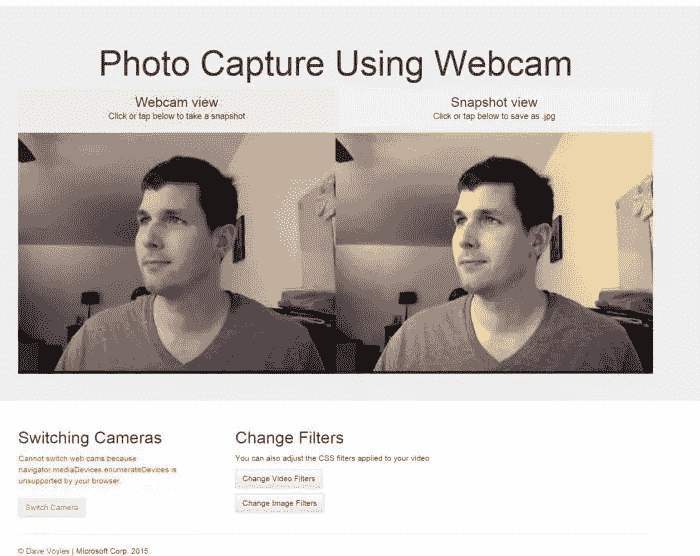
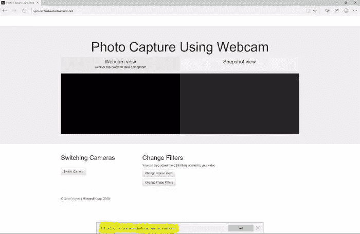

# 使用媒体捕获 API

> 原文：<https://www.sitepoint.com/using-the-media-capture-api/>

本文是微软网站开发系列的一部分。感谢您对使 SitePoint 成为可能的合作伙伴的支持。



今天我想尝试一下由 W3C 的 [Web 实时通信工作组](https://www.w3.org/2011/04/webrtc/?WT.mc_id=13411-DEV-sitepoint-article35)和[设备 API 工作组](https://www.w3.org/2009/dap?WT.mc_id=13411-DEV-sitepoint-article35)联合开发的[媒体捕获和流 API](http://w3c.github.io/mediacapture-main/getusermedia.html?WT.mc_id=13411-DEV-sitepoint-article35) 。一些开发人员可能简单地将其称为`getUserMedia`，它是允许网页访问网络摄像头和麦克风等媒体捕获设备的主界面。

你可以在我的 GitHub 上找到这个项目[的源代码。](https://github.com/DaveVoyles/GetUserMedia-sample?WT.mc_id=13411-DEV-sitepoint-article35)另外，[这里有一个工作演示](http://getusermedia.azurewebsites.net/?WT.mc_id=13411-DEV-sitepoint-article35)供你试验。在最新的 Windows 10 预览版中，微软首次在的[微软 Edge 浏览器中增加了对媒体捕捉 API 的支持。大部分代码取自 Edge 开发团队在](http://dev.modern.ie/?utm_source=SitePoint&utm_medium=article35&utm_campaign=SitePoint)[试驾现场制作的照片捕获样本。](http://dev.modern.ie/testdrive/?utm_source=SitePoint&utm_medium=article35&utm_campaign=SitePoint)

对于那些想要深入了解的人，Eric Bidelman 在 HTML5 rocks 上有一篇很棒的文章，讲述了这个 API 的传奇历史。

## 跟上速度

getUserMedia()方法是理解媒体捕获 API 的一个很好的起点。getUserMedia()调用将 [MediaStreamConstraints](http://w3c.github.io/mediacapture-main/getusermedia.html#mediastreamconstraints?WT.mc_id=13411-DEV-sitepoint-article35) 作为输入参数，它定义了捕获设备和捕获的媒体流的首选项和/或要求，例如摄像头朝向模式、麦克风音量和视频分辨率。

通过 MediaStreamConstraints，您还可以使用 deviceId 选择特定的捕获设备，device id 可以从 enumerateDevices()方法中获得。一旦用户授予权限，如果可以满足特定的媒体流约束，getUserMedia()调用将返回一个带有[media stream](http://w3c.github.io/mediacapture-main/getusermedia.html#mediastream?WT.mc_id=13411-DEV-sitepoint-article35)对象的承诺。

所有这些都不需要下载插件！在这个示例中，我们将深入到 API 中，并在我们要捕捉的视频和图像上创建一些简洁的过滤器。你的浏览器支持吗？getUserMedia()在 Chrome 21、Opera 18 和 Firefox 17 中就已经存在，现在正在 Edge 中工作。

## 特征检测

特征检测是对 navigator.getUserMedia 存在的简单检查。在每个浏览器中检查它是一个大工程，所以我建议简单地使用 Modernizr 来检查它。它是这样工作的:

```
if (Modernizr.getusermedia) {
  var getUM = Modernizr.prefixed('getUserMedia', navigator);
  getUM({video: true}, function( //...
  //...
}
```

如本示例所示，如果没有 Modernizr，您必须使用:

```
navigator.getUserMedia = navigator.getUserMedia || navigator.webkitGetUserMedia || navigator.mozGetUserMedia;

if (!navigator.getuserMedia) {
  Console.log('You are using a browser that does not support the Media Capture API');
}
```

## 视频播放器

在我们的 HTML 中，你可以在页面顶部找到视频标签。你会注意到它也被设置为自动播放。否则，视频将永久冻结在第一帧。

```
<div class="view--video">
    <video id="videoTag" src="" autoplay muted class="view--video__video"></video>
</div>
```

目前还没有媒体集的来源，但是我们很快会通过 JavaScript 注入这个来源。

## 访问输入设备

这项新功能可以为开发人员带来许多新的机会，但也可能给最终用户带来安全风险，因此，当您启动此 web 应用程序时，您首先会注意到它会请求使用您的网络摄像头的权限。getUserMedia 接受几个参数。第一个是一个对象，指定您要访问的每种类型的媒体的详细信息和要求。要访问网络摄像头，第一个参数应该是{video: true}。此外，若要同时使用麦克风和摄像头，请传递{video: true，audio: true}。



## 支持多个网络摄像头

这就是事情变得有趣的地方。在这个示例中，我们还使用了 [`MediaDevices.enumeratedDevices`](https://developer.mozilla.org/en-US/docs/Web/API/MediaDevices/enumerateDevices?WT.mc_id=13411-DEV-sitepoint-article35) 方法。这将收集系统上可用的媒体输入/输出设备的信息，如麦克风、摄像头和扬声器。这是一个将返回几个属性的承诺，包括设备的种类(类型)，如`videoinput`、`audioinput`或`audiooutput.`此外，它可以生成一个具有唯一 ID 的字符串形式的唯一 ID*(video input:ID = CSO 9 c 0 ypaf 274 ouc pua 53 cn e 0 yhlir 2 yxci+sqfbzz 8 =)*，最后是一个描述设备的标签，如`“FaceTime HD Camera (Built-in)”`。尽管这仍然是一项实验性技术，而且[甚至还没有在 CanIUse.com](http://caniuse.com/?WT.mc_id=13411-DEV-sitepoint-article35#search=enumerateDevices)上市。

## 在视频播放器上设置信号源

在`initalizeVideoStream`函数中，您可以看到我们正在从页面中获取视频标签，并将其来源设置为我们传入的流。流本身是一个 blob。如果浏览器不支持 srcObject 属性，它会从媒体流中创建一个 URL 并设置它。

```
// initializeVideoStream() - Callback function when getUserMedia() returns successfully with a mediaStream object
    // 1\. Set the mediaStream on the video tag
    // 2\. Use 'srcObject' attribute to determine whether to use the standard-based API or the legacy version

    var initializeVideoStream = function(stream) {
        mediaStream = stream;

        var video = document.getElementById('videoTag');
        if (typeof (video.srcObject) !== 'undefined') {
            video.srcObject = mediaStream;
        }
        else {
            video.src = URL.createObjectURL(mediaStream);
        }
        if (webcamList.length > 1) {
            document.getElementById('switch').disabled = false;
        }
    };
```

## 应用 CSS 过滤器

我不太会拍照，所以经常依赖 Instagram 给我提供的滤镜。但是，如果您可以将您自己的滤镜应用到您的视频或静态图像，会怎么样呢？你可以的！我为视频提要创建了一个简单的函数，它允许我实时应用 CSS 过滤器。图像的那个几乎是相同的。

```
// changeCssFiltersOnVid() - Cycle through CSS filters applied to the video stream
    // 1\. Grab a reference to the video tag
    // 2\. Keep the original CSS classes while still adding the filters
    // 3\. Loop through all of the filters

    var changeCssFilterOnVid = function () {
        var el       = document.getElementById('videoTag');
        el.className = 'view--video__video';

        var effect = filters[index++ % filters.length]
        if (effect) {
            el.classList.add(effect);
            console.log(el.classList);
        }
    }
```

在类的顶部，我有一个过滤器数组来循环遍历。它们存储为一个字符串，对应于 CSS 中同名的类。

```
// CSS filters var index = 0; var filters = ['grayscale', 'sepia', 'blur', 'invert', 'brightness', 'contrast', ''];
```

在 CSS 中:

```
/* image * video filters */
.grayscale {
    -webkit-filter: grayscale(1);
    -moz-filter: grayscale(1);
    -ms-filter: grayscale(1);
    filter: grayscale(1);
}

.sepia {
    -webkit-filter: sepia(1);
    -moz-filter: sepia(1);
    -ms-filter: sepia(1);
    filter: sepia(1);
}

.blur {
    -webkit-filter: blur(3px);
    -moz-filter: blur(3px);
    -ms-filter: blur(3px);
    filter: blur(3px);
}
```

您可以在 Edge 试驾页面查看更多这方面的示例，并实时更改数值。

## 保存图像

深入研究代码，您可能会发现一些您不太熟悉的其他特性。首先映入我眼帘的是`navigator.msSaveBlob`。 [**Blob**](https://msdn.microsoft.com/en-us/library/hh772298(v=vs.85).aspx?WT.mc_id=13411-DEV-sitepoint-article35) 构造函数允许您直接在客户端轻松创建和操作 Blob(基本上是一个文件)。IE 10+中支持。

[**mssavelob**](https://msdn.microsoft.com/en-us/library/hh441122.aspx?WT.mc_id=13411-DEV-sitepoint-article35)允许您将这个 Blob 对象(在本例中，是我们的快照映像)保存到磁盘。它还有一个兄弟方法， [**msSaveOrOpenBlob**](https://msdn.microsoft.com/en-us/library/hh772332(v=vs.85).aspx?WT.mc_id=13411-DEV-sitepoint-article35) ，也允许您从浏览器中打开图像。

```
<p style="color:grey">// savePhoto() - Function invoked when user clicks on the canvas element
// 1\. If msSaveBlob is supported, get the photo blob from the canvas and save the image file
// 2\. Otherwise, set up the download attribute of the anchor element and download the image file</p>

    var savePhoto = function() {
        if (photoReady) {
            var canvas = document.getElementById('canvasTag');
            if (navigator.msSaveBlob) {
                var imgData = canvas.msToBlob('image/jpeg');
                navigator.msSaveBlob(imgData, 'myPhoto.jpg');
            }
            else {
                var imgData = canvas.toDataURL('image/jpeg');
                var link    = document.getElementById('saveImg');
                link.href   = imgData;
                link.download = 'myPhoto.jpg';
                link.click();
            }
            canvas.removeEventListener('click', savePhoto);
            document.getElementById('photoViewText').innerHTML = '';
            photoReady = false;
        }
    };
```

如果浏览器支持这种方法，它将减少我们保存图像所需的代码量。

## 我们还能去哪里？

这仅仅是开始。我们还可以利用 WebGL 来实现这一点，它甚至允许应用 morHeye 过滤器，并在高度交互的环境中内置实时视频/音频馈送。也许这将是我的下一个项目…
此外，你可以连接到网络音频 API 来应用频率调制到你的音频输出。这个来自[网络音频调谐器](http://dev.modern.ie/testdrive/demos/webaudiotuner/?utm_source=SitePoint&utm_medium=article35&utm_campaign=SitePoint)的例子很好地说明了这一点。有些人更喜欢视觉学习，[所以也来看看这个微软的例子吧。](http://dev.modern.ie/testdrive/demos/microphone/?utm_source=SitePoint&utm_medium=article35&utm_campaign=SitePoint)

最后，随着移动浏览器越来越多地采用这种技术，您将能够使用这些 JavaScript APIs 绑定到底层硬件，并在移动设备上运行，而不管平台如何。这是成为一名网页开发者的大好时机，希望在你使用过这个之后，你会明白为什么我如此兴奋成为其中的一员。

这里有[源代码](https://github.com/DaveVoyles/GetUserMedia-sample?WT.mc_id=13411-DEV-sitepoint-article35)和一个[工作样本](http://getusermedia.azurewebsites.net/?WT.mc_id=13411-DEV-sitepoint-article35)

## JavaScript 的更多实践

微软有许多关于开源 JavaScript 主题的免费学习，我们的任务是用 [Microsoft Edge](http://blogs.windows.com/msedgedev/2015/04/29/introducing-microsoft-edge-the-browser-built-for-windows-10/?WT.mc_id=13411-DEV-sitepoint-article35) 创造更多。以下是一些要检查的:

*   【2015 年微软 Edge 网络峰会(关于新浏览器、新网络平台功能和社区演讲嘉宾的完整系列)
*   //BUILD/和 Windows 10 的构建(包括网站和应用的新 JavaScript 引擎)
*   [在不破坏网络的情况下推进 JavaScript](http://channel9.msdn.com/Events/WebPlatformSummit/2015/Advancing-JavaScript-without-breaking-the-web?WT.mc_id=13411-DEV-sitepoint-article35)(Christian heil Mann 最近的主题演讲)
*   [托管网络应用和网络平台创新](http://channel9.msdn.com/Events/Build/2015/2-665?WT.mc_id=13411-DEV-sitepoint-article35)(深入探讨流形等主题。JS)
*   [让你的 HTML/JavaScript 更快的实用性能技巧](http://channel9.msdn.com/Series/Practical-Performance-Tips-to-Make-Your-HTMLJavaScript-Faster/06?WT.mc_id=13411-DEV-sitepoint-article35)(从响应式设计到休闲游戏再到性能优化的 7 部分系列)
*   现代网络平台快速启动(HTML、CSS 和 JS 的基础)

以及一些免费的入门工具: [Visual Studio Code](https://code.visualstudio.com/?WT.mc_id=13411-DEV-sitepoint-article35) 、 [Azure 试用版](http://azure.microsoft.com/en-us/pricing/free-trial/?WT.mc_id=13411-DEV-sitepoint-article35)和[跨浏览器测试工具](http://dev.modern.ie/?utm_source=SitePoint&utm_medium=article35&utm_campaign=SitePoint)——都适用于 Mac、Linux 或 Windows。

本文是微软网站开发技术系列的一部分。我们很高兴与您分享[微软 Edge](http://blogs.windows.com/msedgedev/2015/04/29/introducing-microsoft-edge-the-browser-built-for-windows-10/?WT.mc_id=13411-DEV-sitepoint-article35) 和新的 [EdgeHTML 渲染引擎](http://blogs.windows.com/msedgedev/2015/02/26/a-break-from-the-past-the-birth-of-microsofts-new-web-rendering-engine/?WT.mc_id=13411-DEV-sitepoint-article35)。获得免费虚拟机或在您的 Mac、iOS、Android 或 Windows 设备上进行远程测试@ [modern。即](http://dev.modern.ie/?utm_source=SitePoint&utm_medium=article35&utm_campaign=SitePoint)。

## 分享这篇文章