# 在 Photoshop 中使用图像创建调色板

> 原文：<https://www.sitepoint.com/using-your-images-to-create-color-palettes-in-photoshop/>

颜色是设计的一个方面，它可以彻底改变整个项目的基调。你的颜色选择可以决定一个完美的、专业的、完美的设计和一个完全失之交臂的设计。为你的设计创建一个调色板不一定是猜测；如果你采取一些简单的步骤，使用一些你可以使用的工具，这是很容易做到的。

创建自己的调色板有多种方法，但一种流行的方法是从项目的主图像中采样颜色，并从其中的颜色值构建自己的调色板。如果你使用多个图像，你可以考虑选择调色板相似的图像，这样整个作品就有一种统一感。

### 步骤 1:设置你的画布

对于我们的例子，我将创建一个航海风格的广告。我将画布的高度分成三份，并将船移动到文档顶部的三分之二处。

[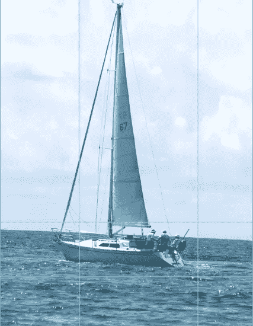](https://www.sitepoint.com/wp-content/uploads/2012/03/Screen-shot-2012-03-31-at-11.53.10-AM.png)

### 第二步:打基础

对于底部的三分之一，我创建了一个新的层，用选框工具在图像底部的三分之一画了一个白色的矩形。这是我们的大部分文本和其他内容将去的地方。

[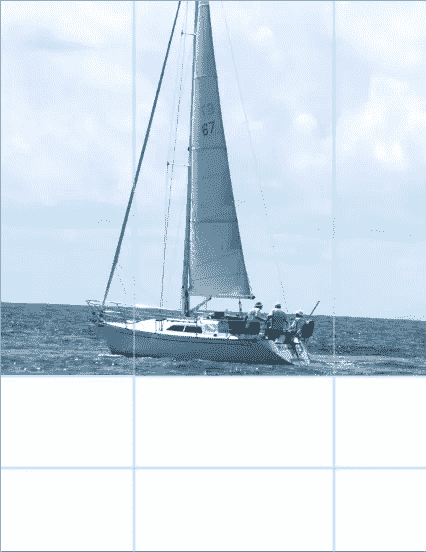](https://www.sitepoint.com/wp-content/uploads/2012/03/Screen-shot-2012-03-31-at-11.54.44-AM.png)

### 第三步:选择你的调色板的基本颜色

选择吸管工具，为你的调色板选择一个好的开始颜色。在我的例子中使用的颜色的 RGB 值是 R:80，G:119 和 B:139。

[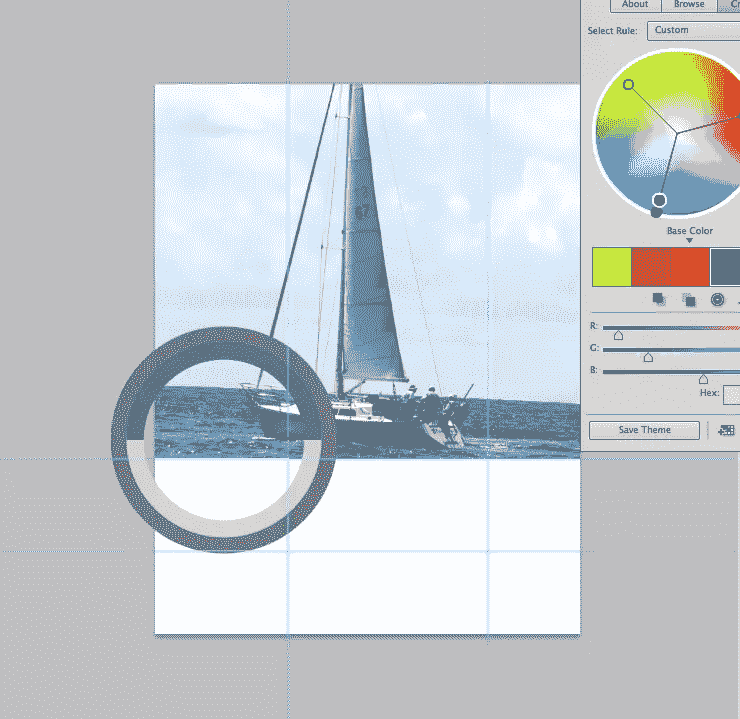](https://www.sitepoint.com/wp-content/uploads/2012/03/Screen-shot-2012-03-31-at-12.17.09-PM1.png)

### 第四步:Kuler，一个基本的颜色插件

为了帮助制作调色板，我使用了 [Kuler](https://www.sitepoint.com/have-you-tried-kuler/) 。要打开库勒的面板，你需要进入“窗口”>“扩展”>“库勒”该面板应该类似于下面的示例:

[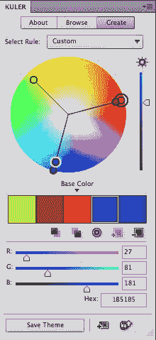](https://www.sitepoint.com/wp-content/uploads/2012/03/Screen-shot-2012-03-31-at-11.43.27-AM.png)

### 第五步:把你的基色带进 Kuler

我们的前景色是我们用吸管工具选择的颜色。要将其引入 Kuler 来构建我们的调色板，请单击色块下的第一个方块。这使得我们用吸管工具选择的颜色成为我们的基本颜色。

[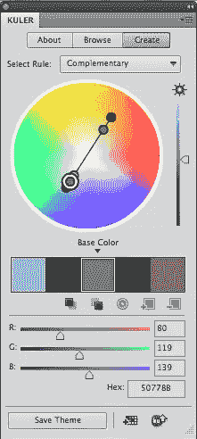](https://www.sitepoint.com/wp-content/uploads/2012/03/Screen-shot-2012-03-31-at-12.18.56-PM.png)

### 第六步:为你的作品选择正确的色彩理论

在色轮上方，你会看到一个下拉菜单，里面有不同的颜色规则，比如补色、复合色、类似色、阴影色、三元色等等。选择最适合您的项目的一个。对于我们的例子，我选择了免费的。

[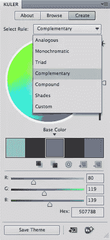](https://www.sitepoint.com/wp-content/uploads/2012/03/Screen-shot-2012-03-31-at-12.19.14-PM.png)

### 步骤 7:保存方便的样本

当您有了喜欢的配色方案后，可以将该配色方案添加到色板中以备后用。当您关闭文档并稍后返回时，这很方便，因为您精心选择的颜色组合将保存在“色板”面板中。只需点击底部中间的按钮，“添加这个主题到样本，”你会发现这 5 种颜色保存在你的样本面板。

### 第八步:组织你的内容区域

我还通过水平三等分图像，并将我们的徽标放在广告的左下角。我创建了一个新的层，并在左下角画了一个矩形的标志。我选择了浅棕色作为标志的背景区域。这将使它在所有蓝色的衬托下更加突出。

### 步骤 9:填充颜色区域

做出矩形选区后，按住 option/alt 并按 delete 键，用前景色填充选区。在我的例子中，浅棕色的 RGB 值是 R:139 G:113 B:80。

[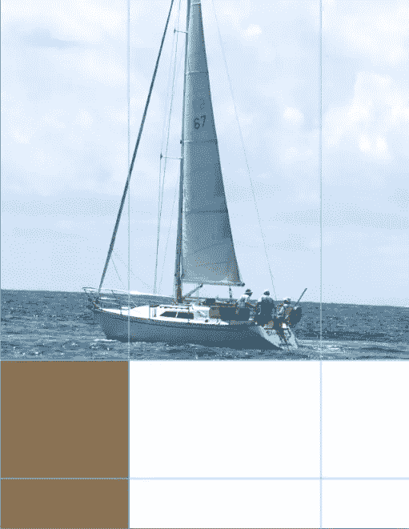](https://www.sitepoint.com/wp-content/uploads/2012/03/Screen-shot-2012-03-31-at-8.46.19-PM.png)

### 第十步:使用对比强烈的颜色来产生视觉冲击

我用 Adobe Jenson 输入了 SailMate，这是我们虚构公司的名字。我将文本设为白色，是为了让它在所选的棕色背景下更加突出。

[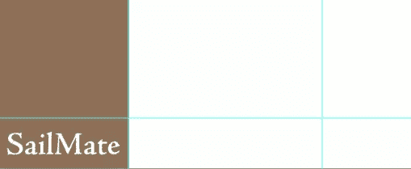](https://www.sitepoint.com/wp-content/uploads/2012/03/Screen-shot-2012-03-31-at-8.47.57-PM.png)

### 第 11 步:引入标志，使其突出

下一步，我带来了指南针标志，并设置混合模式为“屏幕”，这样它将是所有的白色。我设置指南针图层的不透明度为 0。

[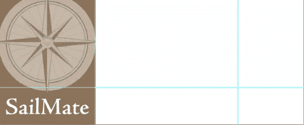](https://www.sitepoint.com/wp-content/uploads/2012/03/Screen-shot-2012-03-31-at-8.48.25-PM.png)

### 步骤 12:划分剩余的区域

内容区域的最后三分之二将被再次划分。我再一次把这个区域分成三份。文本将放在上面的部分占三分之二，下面的部分占三分之一。

### 第 13 步:添加一个黑色的对比

创建一个新层，并选择底部三分之一的内容区域，不包括标志部分，使用选框工具。

[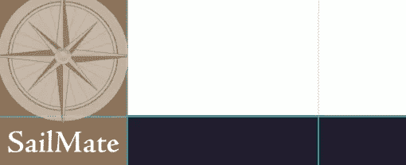](https://www.sitepoint.com/wp-content/uploads/2012/03/Screen-shot-2012-03-31-at-8.50.54-PM.png)

### 步骤 14:将颜色从 Kuler 拉到你的前景色中

在 Kuler 面板中，双击深蓝色/藏青色，将其设置为前景色。按住 alt/option 键并按 delete 键，用深蓝色填充该区域。

### 第十五步:用大标题吸引注意力

选择文本工具，设置大小为 30，因为我们要创建我们的标题。键入文本，然后在“色板”面板中单击深棕色。

[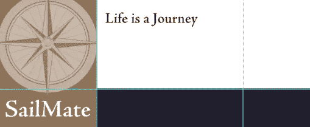](https://www.sitepoint.com/wp-content/uploads/2012/03/Screen-shot-2012-03-31-at-8.52.10-PM.png)

### 步骤 16:Photoshop 中的正文

要创建文本主体，请选择文字工具，并在剩余的白色区域内绘制一个矩形。在你的正文和标题之间留一些空间。呼吸空间会让你的文字更容易阅读。

### 步骤 17:选择你的文本并改变它的颜色

键入您的正文文本，或从源文档中粘贴它。要设置颜色，请双击“图层”面板中的“T”图标，然后从“色板”面板中单击所需的色板。我选择了原始的蓝色，这是我们的基色。

[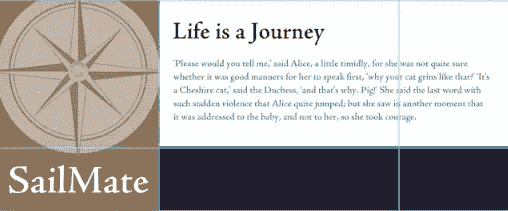](https://www.sitepoint.com/wp-content/uploads/2012/03/Screen-shot-2012-03-31-at-8.53.28-PM.png)

### 步骤 18:创建行动号召

在页面底部的海军矩形中，我们将创建行动号召和联系信息。在这里，您可以使用白色来获得最大的对比度，或者使用我们之前创建的样本中的天蓝色。

[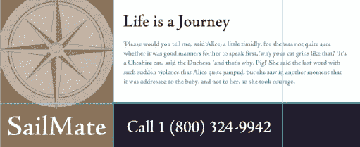](https://www.sitepoint.com/wp-content/uploads/2012/03/Screen-shot-2012-03-31-at-8.54.46-PM.png)

### 第 19 步:创造一个风景

最后，我们将创建一个突出的消息，它来自左边，从左边的空白溢出。我们将使用我们在页面底部使用的海军蓝，因为它将从天空的浅蓝色背景和船上的白色中突出出来。

[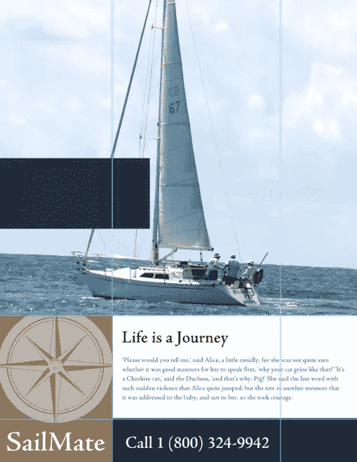](https://www.sitepoint.com/wp-content/uploads/2012/03/Screen-shot-2012-03-31-at-8.55.59-PM.png)

### 第 20 步:添加细节

为了突出重点和细节，我在刚刚创建的蓝色矩形内添加了一条白色线条。要做到这一点，当你选择了蓝色矩形层，按下 command/ctrl + "J "复制层。

### 步骤 21:添加图层样式的笔画

点击 command/ctrl + "T "来变换复制的矩形。使它比原来的小，设置填充为 0，双击层，调出图层样式。

### 步骤 22:设置笔画的大小，并根据个人喜好进行调整

在透明图层周围添加 1-2px 的白色描边，它会在蓝色矩形内给你一个白色的嵌入描边。如果矩形不是您想要的形状，请再次变换它。

[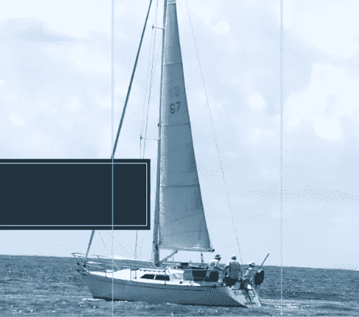](https://www.sitepoint.com/wp-content/uploads/2012/03/Screen-shot-2012-03-31-at-8.58.46-PM.png)

### 步骤 23:给文本添加强调

选择您的文本工具并键入您的标语或广告词。我将文本颜色设置为白色。在这个例子中，我突出显示了“you”和类型控件，并将字体设置为斜体以强调这个单词。

这就是你的成品，颜色完全从原始图像中选择。

你会使用像 [Kuler](https://www.sitepoint.com/have-you-tried-kuler/) 这样的工具来决定这些颜色的选择吗，或者你认为它们更像是一种约束而不是指导？应该务实地选择颜色，还是选择颜色是设计师艺术职责的一部分？

## 分享这篇文章